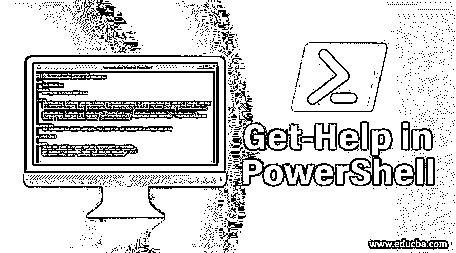

# 在 PowerShell 中获取帮助

> 原文：<https://www.educba.com/get-help-in-powershell/>

## 在 PowerShell 中获取帮助的介绍

Windows PowerShell 是一种脚本语言，构建于。net 平台，旨在自动执行与 windows 应用程序和管理相关的任务。术语 PowerShell 是运行命令/脚本的语言和界面的组合。PowerShell 的第一个版本于 2006 年推出。有两种类型的界面可以运行 PowerShell 命令；windows PowerShell 就像一个可以运行 PowerShell cmdlet 的命令提示符，而 [Windows PowerShell ISE](https://www.educba.com/windows-powershell-ise/) 就是可以运行和调试 PowerShell 脚本(PowerShell cmdlet 的汇编)的地方。它是一种面向对象的语言，因此允许它与。网络接口。它现在是开源的，也可以安装在其他操作系统上。在这篇文章中，我们将会看到在 Powershell 中获得帮助的各种例子。

要启动 PowerShell 会话，请在命令提示符下键入“PowerShell”。

<small>Hadoop、数据科学、统计学&其他</small>

**PowerShell cmdlet 和变量:**PowerShell 中的命令称为“cmdlet”。可以通过运行下面的 cmdlet 获得可用列表。

*   **获取命令:** Cmdlet

**在 PowerShell 中获得帮助:**对于任何人来说，记住任何编程语言的语法或 cmdlets 都是困难且乏味的任务。为了克服这一挑战，PowerShell 提供了大量帮助文章。要获得有关任何 PowerShell cmdlet 的帮助，可以使用 Get-Help cmdlet。它为 cmdlet 提供了语法和使用方法。对于 Ex: Get-Help Get-Process，这将显示 Get-Process Cmdlet 的语法和别名。

### 在 PowerShell 中获取帮助的示例

PowerShell 中获取帮助的示例解释如下:

#### 1.创建新文件夹

**Cmdlet** : Get-Help 新项目

**语法:**

`New-Item [-Path] <string[]> [-ItemType <string>] [-Value <Object>] [-Force] [-Credential <pscredential>] [-WhatIf] [-Confirm] [-UseTransaction]  [<CommonParameters>] New-Item [[-Path] <string[]>] -Name <string> [-ItemType <string>] [-Value <Object>] [-Force] [-Credential
<pscredential>] [-WhatIf] [-Confirm] [-UseTransaction]  [<CommonParameters>]`

**别名:**倪

**EG**:New-Item-Path ' C:\ Vignesh \ NewPowerShellFolder '-Item type 目录。

**输出**:这将在指定路径下创建一个新文件夹“NewPowerShellFolder”。

#### 2.要复制项目

**Cmdlet:** 获取帮助副本-项目

**语法:**

`Copy-Item [-Path] <string[]> [[-Destination] <string>] [-Container] [-Force] [-Filter <string>] [-Include
<string[]>] [-Exclude <string[]>] [-Recurse] [-PassThru] [-Credential <pscredential>] [-WhatIf] [-Confirm] [-UseTransaction] [-FromSession <PSSession>] [-ToSession <PSSession>]  [<CommonParameters>] Copy-Item [[-Destination] <string>] -LiteralPath <string[]> [-Container] [-Force] [-Filter <string>] [-Include
<string[]>] [-Exclude <string[]>] [-Recurse] [-PassThru] [-Credential <pscredential>] [-WhatIf] [-Confirm] [-UseTransaction] [-FromSession <PSSession>] [-ToSession <PSSession>]  [<CommonParameters>]`

**别名:**

*   居民消费价格指数
*   丙酸纤维素
*   复制

**例如**:New-Item-Path ' C:\ Vignesh \ newPowerShellFolder '-Item type 目录。

**输出**:这将在指定路径下创建一个新文件夹“NewPowerShellFolder”。

#### 3.要删除项目

Cmdlet : Get-Help Remove-Item

**语法:**

`Remove-Item [-Path] <string[]> [-Filter <string>] [-Include <string[]>] [-Exclude <string[]>] [-Recurse] [-Force] [-Credential <pscredential>] [-WhatIf] [-Confirm] [-UseTransaction] [-Stream <string[]>]  [<CommonParameters>] Remove-Item -LiteralPath <string[]> [-Filter <string>] [-Include <string[]>] [-Exclude <string[]>] [-Recurse] [-Force] [-Credential <pscredential>] [-WhatIf] [-Confirm] [-UseTransaction] [-Stream <string[]>] [<CommonParameters>]`

**别名:**

*   (美国)罗得岛州(Rhode Island)ˌ剩余收入(residual income)
*   空间
*   是吗
*   是吗
*   抹去
*   注册营养师

**EG**:Remove-Item ' C:\ Vignesh \ Vignesh . txt '。

**输出**:这将删除 txt 文件。

许多用户可能一开始就无法理解 cmdlet 语法，或者一些用户可能需要一些关于如何将参数传递给 cmdlet 的示例。在这种情况下，他们显然会尝试上网做一些研究。这可以通过在 PowerShell 窗口中添加 Get-Help cmdlet 来完成，如下所示。

Get-Help Get-Child Item -Online，这将在 Internet Explorer 中打开 Get-Child Item 的 Microsoft 帮助文章。

### 在 PowerShell 中获取帮助的技巧和快捷方式

1.若要返回到以前执行的 cmdlets，请按向上箭头。这将带我们按降序浏览在当前 PowerShell 会话中执行的命令。

2.Get-History cmdlet 可用于获取在当前会话中执行的单个伸展中的 cmdlet，这可以通过运行以下 cmdlet 导出为 CSV 文件。

**Cmdlet:**Get-History | Export-csv "要导出的路径. CSV "

**输出:**

| **ID** | **命令行** | **执行状态** | **StartExecutionTime** | **EndExecutionTime** |
| **1** | 获取帮助获取流程在线 | 完成 | 11/18/2019 4:33 | 11/18/2019 4:36 |
| **2** | 获取帮助获取流程在线 | 完成 | 11/18/2019 4:33 | 11/18/2019 4:36 |
| **3** | 获取帮助获取子项目在线 | 完成 | 11/18/2019 4:33 | 11/18/2019 4:36 |
| **4** | 获取帮助获取子项目在线 | 完成 | 11/18/2019 4:33 | 11/18/2019 4:36 |
| **5** | 获取帮助获取子项目在线 | 完成 | 11/18/2019 4:33 | 11/18/2019 4:36 |

### 结论

本文只是简要介绍了 PowerShell 是什么，以及如何使用 Get Help 来了解 cmdlet。使用 PowerShell 可以做许多更强大的事情，例如在 Active Directory 中更改属性、连接到 IIS、SQL Server 和 Microsoft exchange。通过学习 PowerShell，人们可以通过编写一个脚本来完成这些任务，从而轻松节省他们花费在日常任务上的工时。

### 推荐文章

这是在 PowerShell 中获取帮助的指南。在这里，我们将讨论 Powershell 中不同的获取帮助示例及其技巧和快捷方式。您也可以阅读以下文章，了解更多信息——

1.  [安装 PowerShell 的前 7 个版本](https://www.educba.com/install-powershell/)
2.  [使用 PowerShell 命令的提示和技巧](https://www.educba.com/powershell-commands/)
3.  [Powershell 的不同用途](https://www.educba.com/uses-of-powershell/)
4.  [使用 PowerShell 字符串函数](https://www.educba.com/powershell-string-functions/)
5.  [PowerShell 移除指南-项目](https://www.educba.com/powershell-remove-item/)
6.  [PowerShell Move-Item 的参数](https://www.educba.com/powershell-move-item/)
7.  [PowerShell 副本指南-项目](https://www.educba.com/powershell-copy-item/)
8.  [如何用 PowerShell 举例？](https://www.educba.com/how-to-use-powershell/)
9.  [PowerShell 新项目|示例](https://www.educba.com/powershell-new-item/)

