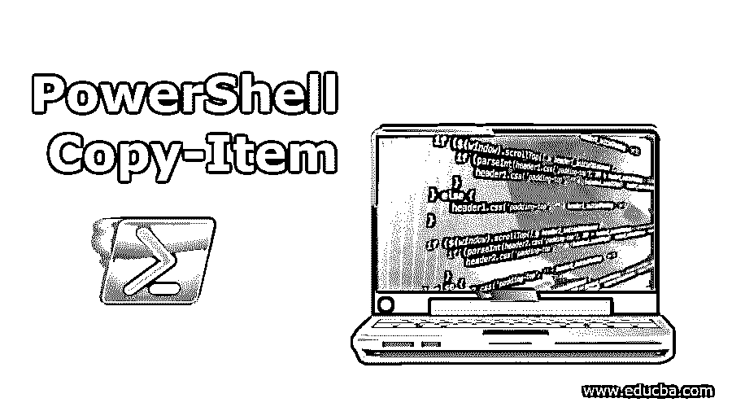
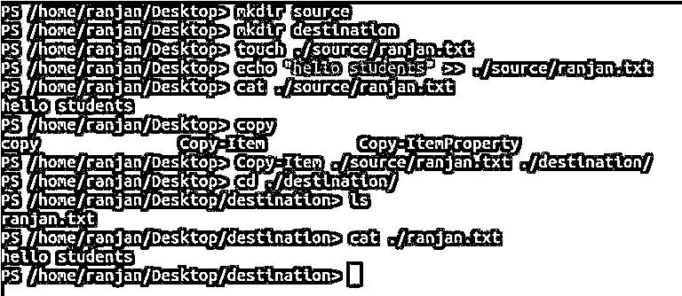
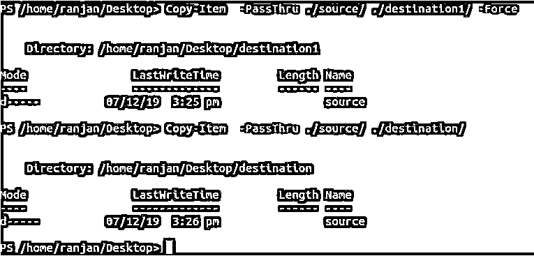
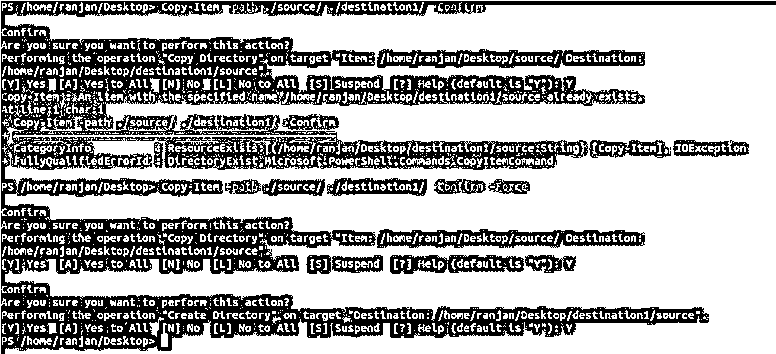

# PowerShell 副本-项目

> 原文：<https://www.educba.com/powershell-copy-item/>

## PowerShell 副本介绍-项目

你从另一个目录复制了一个文件，又从一个目录复制到另一个目录，但是你有没有想象过在复制之前或者在复制的时候，你可以执行多少事情。你有没有意识到内部发生了什么？让我给你详细解释一下，实际上通过改变任何文件的位置，我们都在改变那个文件的内存引用。现在 PowerShell 可以复制任何项目，并且只需将它放在其他位置就可以更改内存的引用。PowerShell Copy-Item 命令复制一个文件(媒体、文本、pdf 等)，它改变了位置，但命名空间将保持不变。请记住，PowerShell Copy-Item 命令不会删除或剪切项目。通过重命名放置在目标位置的文件，可以将文件从一个位置复制到另一个位置。复制命令功能强大，用于传输任何递归(文件系统中的多个文件)文件系统

我们将学习如何使用它，以及我们可以用 PowerShell 的命令 Copy-Item 命令做什么。

<small>Hadoop、数据科学、统计学&其他</small>

### 句法

PowerShell 复制项的一个非常简单的语法是

`Copy-Item {path,-PassThru}-optional “sourcePath/sourceFile” -destination “destinationPath/” {force,include,exclude...}-optional`

下面的语法涵盖了常用的东西，

`Copy-Item
[-Path(source folder location)] <array of string>-optional
[[-Destination(destination location)] <String>] [-Force]-optional
[-Filter <String(filter contents for copy)>]-optional
[-Include <array of string>](specify contents need to be included like *pdf)-optional
[-Exclude <array of string>](specify contents need to be excluded like *txt)-optional
[-Recurse](this commands allow to copy folder containing another folder folder)-optional
[-PassThru](it will return an object of item on which it is working , by default it will return nothing)-optional
[-WhatIf](It shows what can happen if command run)-optional
[-Confirm](before  copying any file ask for confirmation)-optional
[<CommonParameters>]`

#### 因素

**1。Confirm:** 它会在运行命令之前要求您确认。在运行拷贝命令之前，最好花些时间思考。

**2。容器:**这是一个布尔值命令，在复制文件时保存一个容器。默认情况下，该设置为 true。**T3】**

**3。目的地:**它的名字揭示了它的用途，它直接命令文件粘贴的路径。我们还可以通过重命名文件将文件从源位置复制到目标位置。**T3】**

**4。Exclude:** 当我们想将一个文件夹从一个位置复制到另一个位置，并跳过一些文件(如*pdf)时，使用这个命令，这里我们使用了一个通配符，表示复制所有文件并跳过 pdf 文件。**T3】**

**5。Filter:** 这里我们可以指定传递复制命令的过滤参数。

**6。Force:** 这里它将允许复制那些不允许复制的项目，举个例子，如果有一个文件是只读的，我们想复制这个文件，那么我们可以使用这个命令。或者举另一个例子，如果一个文件已经存在，我们想用一个新文件强制替换它。

**7。Include:** Included 执行与-exclude 类似的任务，唯一的区别是这里可以定义通配符，用于在复制文件或媒体系统时包含的文件。**T3】**

**8。LiteralPath:** 这个命令能够把一个文件复制到一个或多个位置上，以数组的格式我们可以定义它们为一个数组的字符串格式。**T3】**

**9。PassThru:** 它将总是返回复制命令正在处理的项目的对象。记住默认情况下它不会返回任何值。

10。Path: 这是从我们选择要复制的项目到另一个位置的路径，

**11。Recurse:** 在这里，它复制包含文件夹的文件夹，就像我们复制一个名为/Ranjan 的文件夹一样，它包含另外三个文件夹/job、/education 和/locations，所有这些文件夹都包含更多的文件夹。因此，复制这些我们使用递归命令。**T3】**

**12。WhatIf:** 这只显示了如果命令运行会发生什么，或者简单地说，它描述了命令的结果。

### 实现 PowerShell copy-item 的示例

下面给出了实现 PowerShell copy-item 的示例:

#### 示例#1

让我们举一个非常简单的第一个例子，我们只是将一个文件从一个位置复制到另一个位置。

`Copy-Item ./source/ranjan.txt  -destination ./destination`

给出了从文件创建到复制的上述示例的屏幕

#### 实施例 2

让我们做一些递归复制，在这种情况下，我们将复制目录文件，这个目录还包含一个子目录的文件。

`Copy-Item ./source/* -Destination ./destination/ -Recurse`

在上面的例子中，我们创建了两个文件夹，一个名为 source，另一个名为 destination。我们在 source 中创建了一个文件 ranjan.txt，还在 source 文件夹中创建了一个名为 jobs 的文件夹。现在，通过执行上面的命令，我们将把源文件夹的所有内容及其子文件夹转移到目标文件夹。这种类型的文件传输称为资源传输，因为我们正在传输包含文件 myjob.txt 的子文件夹以及所有内容。

#### 实施例 3

现在，我们将编写一个命令，将目录内容复制到一个新创建的目录中。

`Copy-Item -Path "./source/" -Destination "./newSource" -Recurse.`

在上面的例子中，我们将所有文件和文件夹从源文件转移到一个新文件中，这个新文件将在执行这些命令时生成。

#### 实施例 4

假设我们想查看 copy 命令正在运行的文件的属性，那么我们可以使用-PassThru 命令和 Copy-Item 命令。

`Copy-Item  -PassThru ./source/ ./destination1/ -Force
Copy-Item  -PassThru ./source/ ./destination/`

#### 实施例 5

如果我们想把整个目录转移到另一个文件夹，包括所有的，我们可以运行 Copy-Item 连同 **include** "* "。

`Copy-Item -path ./source/ ./destination1/ -Include "*"`

#### 实施例 6

在本例中，我们涵盖了两件事，一件是“-Force”，另一件是“-Confirm”。我们正在尝试将源目录的文件复制并粘贴到目标 1 目录。一旦我们运行此命令，它会询问您是否真的要复制它，一旦我们说“是”，它会显示错误文件已经存在，因此我们再次使用“-Force”命令，它会强制用源文件夹中的新文件替换旧文件。请参考下面的屏幕。

`Copy-Item -path ./source/ ./destination1/ -Confirm
Copy-Item -path ./source/ ./destination1/ -Confirm -Force`

### 结论

PowerShell Copy-Item 命令可以解决开发人员的许多问题，因为现在他们可以使用更多选项执行递归复制，这比通过 UI 复制好得多。最好是对窗口环境比较熟悉的开发者。

### 推荐文章

这是 PowerShell 复制项目的指南。这里我们讨论实现 PowerShell copy-item 的简介、参数和示例。您也可以浏览我们推荐的其他文章，了解更多信息——

1.  [在 PowerShell 中获得帮助](https://www.educba.com/get-help-in-powershell/)
2.  [PowerShell 字符串函数](https://www.educba.com/powershell-string-functions/)
3.  [Powershell 的用途](https://www.educba.com/uses-of-powershell/)
4.  [Python 的优势](https://www.educba.com/advantages-of-python/)
5.  [PowerShell 日期快速浏览及示例](https://www.educba.com/powershell-date/)

