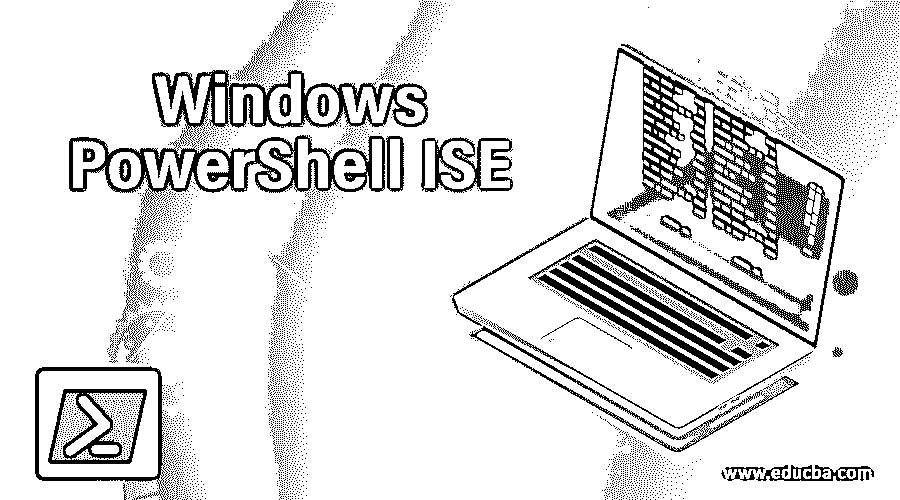
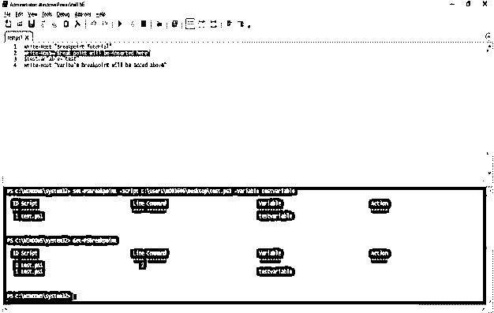
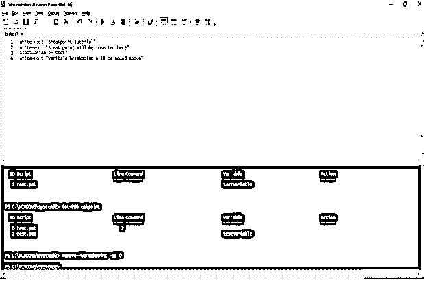

# Windows PowerShell ISE

> 原文：<https://www.educba.com/windows-powershell-ise/>

## Windows PowerShell ISE 简介

Windows PowerShell ISE 是用于开发和运行 PowerShell cmdlets 和脚本的脚本环境。它是可以运行、调试和测试脚本或 cmdlets 的界面。这是非常有用的使用，因为它有不同的颜色的关键字，这使得用户区分关键字和变量。它还具有类似于 visual studio 中的 IntelliSense 特性，可以为与对象关联的相关对象/函数提供建议。第一个版本是在 Windows PowerShell 版本 2 中引入的，并在版本 3 中进行了重新设计。现在 ISE 在所有 Windows PowerShell 版本中都得到了支持。PowerShell ISE 可以通过选择开始和 Windows PowerShell ISE 来启动，也可以通过在运行框或命令提示符中键入 powershell_ise.exe 来打开。

### Windows PowerShell ISE 要求

从 Windows XP 开始，PowerShell 可以在所有版本的 Windows 上运行。它在服务器核心安装中不受支持。它需要。Net framework 3.5 或以上版本，如果。Net framework 未安装，它将在 ISE 安装期间由服务器管理器自动安装。

<small>Hadoop、数据科学、统计学&其他</small>

### 分析 PowerShell ISE 设计

以下是组件:

*   菜单栏
*   制表符
*   工具栏
*   面包控制台
*   状态栏
*   脚本窗格
*   帮助部分

**菜单栏:**菜单栏有创建、打开或编辑文件的选项。它还有工具、调试和帮助菜单。

标签页:标签页就是脚本运行的地方。最多可以同时打开 8 个标签。

**工具栏:**工具栏有以下按钮:

*   **新建:**创建新脚本
*   **打开:**打开一个现有的脚本
*   **保存/剪切/复制/粘贴:**保存脚本和脚本的剪切、复制和粘贴选项
*   **运行:**执行脚本
*   **停止:**停止执行

除了上面提到的，还有撤销和重做按钮，清除输出窗格和为远程会话创建一个新标签

*   **脚本页签:**脚本编辑在这里完成。它有当前的脚本名称，当鼠标悬停在它上面时会显示脚本的位置。
*   **输出窗格:**此处显示结果。
*   **命令窗格:**命令可以在这里运行。要运行多行命令，请在每条命令后按 shift+Enter 键以获得新的一行，并最终按 Enter 键以执行这些命令。命令窗格包含当前工作目录的位置。
*   **状态栏:**显示脚本的状态。每次执行后都会显示错误或成功消息。
*   **帮助:**帮助菜单包含所有可用命令的库或文件。也可以通过按 F1 键打开它。该帮助指导 cmdlet 必须如何构造、所需的必要参数及其类型。
*   **建立远程连接:**使用 PowerShell，很容易在远程计算机上运行脚本。这是 PowerShell 被低估的特性之一，很多人都不知道。要在远程计算机上运行脚本，请单击“文件”菜单下的“新建远程 PowerShell”选项卡，它会提示您输入远程计算机的详细信息。

### 在 PowerShell ISE 中调试脚本

调试是在指定位置暂停脚本的执行，以检查该点的变量值或函数值的行为。这有助于检查错误或检查脚本的正确逻辑流程。执行暂停的地方称为断点。一旦脚本中出现断点，执行就会暂停。

暂停后，我们可以将鼠标悬停在变量值上以了解其当前值，也可以运行命令或在控制台窗格中输入变量名以了解值。也可以修改运行脚本上下文中的任何变量值。一旦检查了所有的细节，就可以继续脚本了。需要记住的重要一点是，断点只能在保存脚本后插入。

PowerShell ISE 中有三种类型的断点:

*   **行断点:**脚本在到达所需行时暂停。
*   **变量断点:**当所需变量的值改变时，脚本暂停。
*   **命令断点:**每当要运行指定的命令时，脚本就会暂停。

**设置断点:**断点有两种设置方式。

*   右键单击必须暂停执行的行，并选择切换断点。
*   按 F9 将在该行插入一个断点。

要设置变量断点，请在控制台窗格中执行以下命令

#### set-PS breakpoint-Script test . PS1-变量测试

上面在变量 test 上设置了一个断点。

若要显示当前会话中的断点列表，可以在控制台窗格上运行 Get-PSBreakPoint cmdlet。

**代码:**

`Write-Host "Breakpoint Tutorial"
Write-Host "Break point will be inserted here"
$testvariable = "test"
Write-Host "Variable breakpoint will be added above"`

**输出:**在下面的例子中，有两个断点。一个是使用 cmdlet 设置的，另一个是使用 F9 设置的。

#### 移除断点

要删除断点，右击该行并选择切换断点。也可以使用下面的 id 从控制台窗格中删除它。

`Remove-PSBreakpoint -Id 0`

请参见下图，其中删除了断点

**代码:**

`Write-Host "Breakpoint Tutorial"
Write-Host "Break point will be inserted here"
$testvariable = "test"
Write-Host "Variable breakpoint will be added above"
Remove-PSBreakpoint -Id 0`

**输出:**

**1。**要删除当前会话中的所有断点，请选择“调试”菜单下的“删除所有断点”,或者按 ctrl+shift+F9，或者在控制台窗格中运行下面的 cmdlet。

`Get-PSBreakpoint | Remove-PSBreakpoint`

**2。**也可以禁用断点，而不是完全删除它，以便以后可以使用下面的 cmdlet 使用其 id 来启用它

`Disable-PSBreakpoint -Id 1`

**3。**要禁用所有断点，请使用下面的 cmdlet

`Get-PSBreakpoint | Disable-PSBreakpoint`

**4。**用于启用断点以使用下面的 cmdlet

`Enable-PSBreakpoint -Id 10`

要启用所有断点，请单击调试菜单并选择启用所有断点。

#### 调试会话的演练

*   若要运行脚本，请按 F5。一旦到达断点，脚本将暂停。
*   若要在断点后继续，请在控制窗格中按 F5 或键入 c，然后输入。
*   若要查看堆栈跟踪，请按 ctrl+shift+D，或者在控制台窗格中键入 k。
*   若要单步执行函数，请按 F11。
*   若要跳过一个函数，请按下 F10。
*   若要停止调试，请按 shfi+F5。

### 结论

因此，文章详细介绍了 Windows PowerShell Ise。它解释了各种可用的特性，脚本的运行和调试。它详细介绍了各种可用的调试选项以及如何执行它们。为了更详细地理解，建议通过运行各种示例脚本来研究 ISE。

### 推荐文章

这是 Windows PowerShell ISE 的使用指南。这里我们详细讨论一个脚本的介绍、需求和调试，以及如何执行它们。您也可以浏览我们的其他相关文章，了解更多信息——

1.  [PowerShell 拆分字符串](https://www.educba.com/powershell-split-string/)
2.  [PowerShell 工具](https://www.educba.com/powershell-tools/)
3.  [PowerShell 新项目](https://www.educba.com/powershell-new-item/)
4.  [PowerShell 别名](https://www.educba.com/powershell-alias/)

