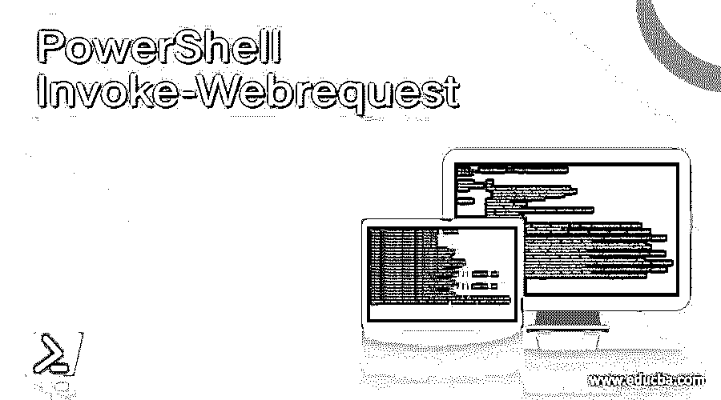
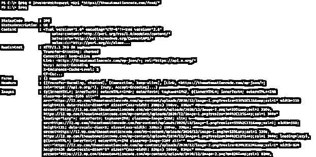
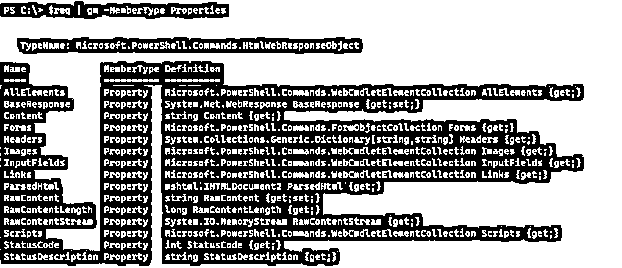
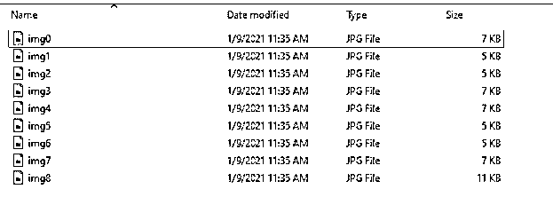
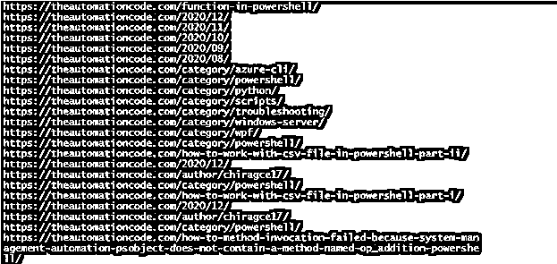

# PowerShell 调用-Webrequest

> 原文：<https://www.educba.com/powershell-invoke-webrequest/>

## PowerShell 调用的定义-Webrequest

在 PowerShell Invoke-WebRequest cmdlet 中，它是 Microsoft 的一部分。PowerShell.Utility 模块是 Web 废弃方法之一(另一种方法是 Invoke-RestMethod，在 cmd 和其他操作系统中称为 CURL ),它向被请求的网页或被称为端点的 URI 发送 HTTP 和 HTTPS 请求，并检索、删除、更新标题、图像、链接和其他 HTML 重要元素形式的内容，为此，它使用多种方法，如 GET、POST、PUT、DELETE 等来发送请求、修改内容或删除网页的内容。众所周知，Invoke-WebRequest 也可以与 REST API 一起工作。

**语法:**

<small>Hadoop、数据科学、统计学&其他</small>

调用-WebRequest

`[-UseBasicParsing] [-Uri] <Uri>
[-WebSession <WebRequestSession>] [-SessionVariable <String>] [-AllowUnencryptedAuthentication] [-Authentication <WebAuthenticationType>] [-Credential <PSCredential>] [-UseDefaultCredentials] [-CertificateThumbprint <String>] [-Certificate <X509Certificate>] [-SkipCertificateCheck] [-SslProtocol <WebSslProtocol>] [-Token <SecureString>] [-UserAgent <String>] [-DisableKeepAlive] [-TimeoutSec <Int32>] [-Headers <IDictionary>] [-MaximumRedirection <Int32>] [-MaximumRetryCount <Int32>] [-RetryIntervalSec <Int32>] [-Method <WebRequestMethod>] [-Proxy <Uri>] [-NoProxy] [-CustomMethod <String>] [-ProxyCredential <PSCredential>] [-ProxyUseDefaultCredentials] [-Body <Object>] [-Form <IDictionary>] [-ContentType <String>] [-TransferEncoding <String>] [-InFile <String>] [-OutFile <String>] [-PassThru] [-Resume] [-SkipHttpErrorCheck] [-PreserveAuthorizationOnRedirect] [-SkipHeaderValidation] [<CommonParameters>]`

### PowerShell 中的 Invoke-WebRequest 方法是如何工作的？

从 PowerShell v3.0 开始，PowerShell 增加了微软附带的 cmdlet Invoke-WebRequest。PowerShell。用于处理网页的实用模块。我们可以使用 PowerShell 检索、删除或更新网页的内容，显然这与使用 GUI 进行页面导航的体验不同，但它可以自动处理 web 请求，摆脱繁琐的浏览和手动日常任务。

Invoke-WebRequest 向 URI(统一资源标识符，也称为端点)发送请求，并从网页中检索数据。它直接与 URL 或 REST API 一起工作，因为一些网站只允许使用 API 修改内容。

当我们使用 API 时，输出数据通常是 JSON 或 XML 格式，例如，

[**https://yts.mx/api/v2/list_movies.json**](https://yts.mx/api/v2/list_movies.json)

 **或者

[**https://yts.mx/api/v2/list_movies.xml**](https://yts.mx/api/v2/list_movies.xml)

 **在上面的例子中，一旦检索到内容，我们就可以使用 PowerShell 将内容转换成 JSON 或 XML 方法。

### 例子

让我们讨论 PowerShell Invoke-Webrequest 的例子。

#### 形容词（adjective 的缩写）Invoke-WebRequest 从网页中检索数据。

我们可以提供 URI 来从网页中检索内容。有一个 Content 和 RawContent 属性，您可以使用这些属性来检索数据。这取决于网页，什么样的数据，我们正在检索。数据可以是 HTML 格式，也可以是 JSON 或 XML 格式。

`$req = Invoke-WebRequest -Uri [https://theautomationcode.com/feed/](https://theautomationcode.com/feed/)
$req`

\

运行上面的命令后，您可以看到不同的属性，如 StatusCode、StatusDescription、Content、RawContent、Forms、Headers、Images、InputFields、Links、ParsedHtml、RawContentLength 等。

您还可以使用 Get-Member 命令检查该命令的属性。

`$req | gm -MemberType Properties`

**输出:**

为了检索内容，

`$req = Invoke-WebRequest -Uri "https://theautomationcode.com/feed/"
$req.Content`

#### b.Invoke-WebRequest 检查网站状态代码。

当客户端向端点发送请求时，它发送带有各种状态代码的握手状态，这些状态代码显示网站可用性或网页上的任何错误。

您可以在链接下方找到各种代码及其状态消息。

[https://en.wikipedia.org/wiki/List_of_HTTP_status_codes](https://en.wikipedia.org/wiki/List_of_HTTP_status_codes)

为了使用 Invoke-WebRequest 检索状态消息，我们需要使用 StatusCode 作为引用属性。举个例子，

`try{
$uri = "http://theautomationcode.com"
$response = Invoke-WebRequest -Uri $uri -Method Get -ErrorAction Stop
Write-Output "Status Code : $($response.statuscode)"
}
catch{
Write-Output "Status Code : $($_.Exception.Response.StatusCode.Value__)"
}`

**输出:**

如果我们提到一个不存在的网站，它会给出一个不同的状态码。对于下面的 URI，

`$uri = "http://theautomationcode.com/failed"`

**输出:**

#### 碳（carbon 的缩写）Invoke-WebRequest 从网页中检索图像和链接。

我们可以使用 Invoke-WebRequest 命令从网页中检索图像和链接。要从网页中检索图像并将它们存储到特定位置，请使用以下命令，

`try{
$wc = New-Object System.Net.WebClient
$uri = "http://theautomationcode.com"
$imgs = (Invoke-WebRequest -Uri $uri -ErrorAction Stop).Images
$count = 0
foreach($imgurl in $imgs.src){
$wc.DownloadFile($imgurl,"C:\temp\WebImages\img$Count.jpg")
$count++
}
}
catch{
Write-Output "Status Code : $($_.Exception.Response.StatusCode.Value__)"
}`

**输出:**

**Invoke-WebRequest** 从网页中获取链接。

`$uri = "http://theautomationcode.com"
$response = Invoke-WebRequest -Uri $uri
$response.Links.href`

**输出:**

#### d.在 Invoke-Webrequest 中使用表单。

表单是存储输入项信息(如用户名和密码)的页面。我们可以使用 POST 方法使用表单提交用户名和密码。

例如，我们将使用 Reddit 登录页面并在那里提交凭证。为了检索登录页面，我们在下面提供了 Reddit 的 URL。

`$Response = Invoke-WebRequest https://www.reddit.com/login/ -SessionVariable sv
$Response.Forms`

这里我们使用了 Forms 属性来检索我们需要的信息。

一旦运行了上面的命令，就可以看到 POST 方法，我们将使用它。

`$Response = Invoke-WebRequest https://www.reddit.com/login/ -SessionVariable sv
$form = $Response.Forms[2] $form.Fields['loginUsername'] = 'reddit'
$form.Fields['loginPassword'] = 'redditpass'
Invoke-WebRequest $Response -Body $form -WebSession $sv -Method Post`

上面的脚本是 Web Forms 和 POST 方法的一个例子。

#### e.Invoke-WebRequest 从网页获取提要。

有时候我们只需要检索网页的内容。例如，来自网页的提要可能是 JSON 或 XML 格式的。在下面的例子中，我们将从 URL[**【https://www.reddit.com/.rss】**](https://www.reddit.com/.rss)检索 Reddit RSS 提要，然后将它们转换成 XML 或 JSON 格式，以便在控制台中以适当的格式检索提要。举个例子，

`$response = Invoke-WebRequest "https://www.reddit.com/.rss" -Method Get
$response.Content`

一旦我们运行上面的命令，它将检索 XML 输出，如下所示。

`$response = Invoke-WebRequest "https://www.reddit.com/.rss" -Method Get
$feeds = [XML]$response.Content | Select -ExpandProperty Feed
$feeds.Entry | Select Title, Updated`

**输出:**

### 结论

Invoke-Webrequest 是一个非常有用的命令，用于自动化 web 请求和处理 API。有许多免费的 API，如天气 API、电影数据库、金融 API，允许与 web 请求集成，在这种情况下，我们可以从请求的 API 中检索、更新、发布或删除数据。

### 推荐文章

这是 PowerShell 调用-Webrequest 的指南。这里我们讨论定义，Invoke-WebRequest 方法如何在 PowerShell 中工作？以及代码实现的例子。您也可以看看以下文章，了解更多信息–

1.  [PowerShell 执行策略](https://www.educba.com/powershell-execution-policy/)
2.  [PowerShell 睡眠](https://www.educba.com/powershell-sleep/)
3.  [PowerShell 子串](https://www.educba.com/powershell-substring/)
4.  [PowerShell 转义符](https://www.educba.com/powershell-escape-character/)

****