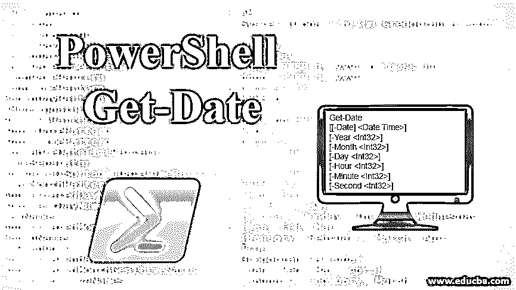
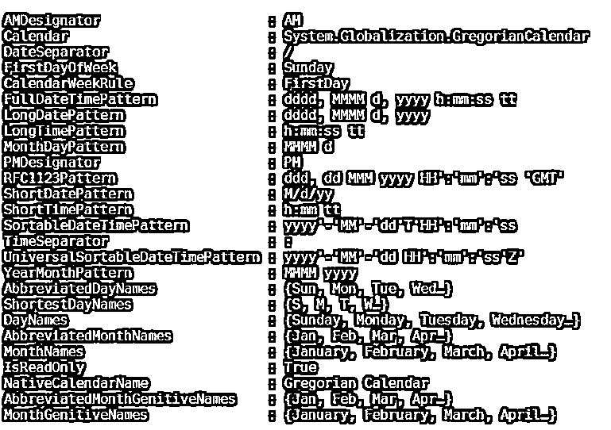
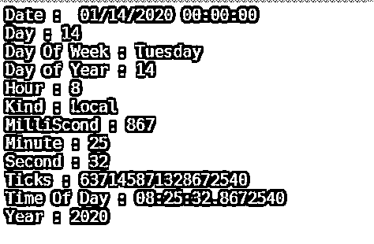
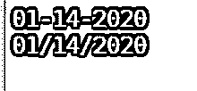
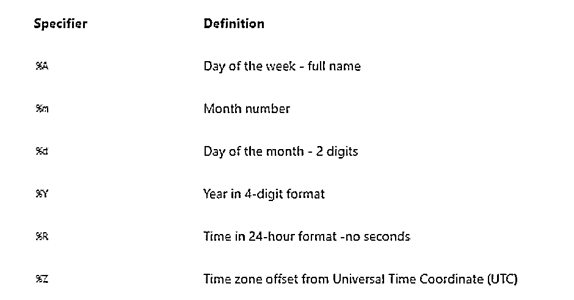
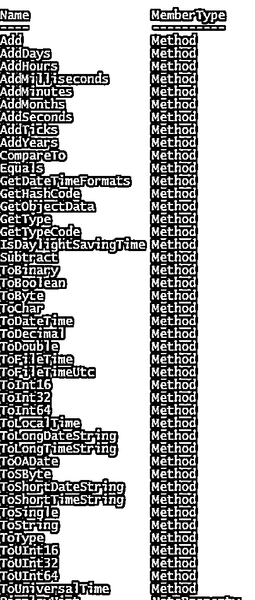

# PowerShell 获取日期

> 原文：<https://www.educba.com/powershell-get-date/>

## PowerShell 简介获取日期

PowerShell 中的 Get-Date cmdlet 用于获取系统的日期和时间。它使用本地计算机系统的日期和时间。它的数据类型是 DateTime。日期和时间的输出格式取决于计算机的文化设置，可通过以下语法和命令来确定。

**语法:**

<small>Hadoop、数据科学、统计学&其他</small>

以下是 PowerShell Get-Date 的语法:

`Get-Date
[[-Date] <DateTime>] [-Year <Int32>] [-Month <Int32>] [-Day <Int32>] [-Hour <Int32>] [-Minute <Int32>] [-Second <Int32>] [-Millisecond <Int32>] [-DisplayHint <DisplayHintType>] [-Format <String>] [-UFormat <String>] [<CommonParameters>]`

**代码:**

`(Get-Culture).DateTimeFormat`

**输出:**

### PowerShell 获取日期的参数

Get-Date 命令的默认输出以下面的格式显示。

**代码:**

`get-date`

**输出:**

Get-Date cmdlet 使用以下参数来格式化命令输出。

#### 1.日期

当你使用日期作为属性时，比如(Get-Date)。日期，它指定日期和时间。它默认显示时间 00:00:00 以及系统的当前日期。属性将为您提供当前的系统时间。输出将仅为日期时间数据类型。当您指定–Date 参数及其后的日期时，它会显示特定的日期。例如，获取日期–日期“2010 年 1 月 1 日 22:00:00”。此操作不会更改系统的日期/时间。

#### 2.年

当您将 Year 指定为类似(Get-Date)的属性时。年份将提供当前系统年份。该命令的输出是 Int32 数据类型。您可以使用–Year 参数来显示不同的年份。

#### 3.月

当月份作为类似(Get-Date)的属性被提及时。它将显示当前系统的月份作为输出。输出将采用 Int32 数据类型格式。您可以使用–Month 参数来显示不同的月份。该值应该在 1 到 12 之间。

#### 4.一天

当 Day 被指定为类似(Get-Date)的属性时。日，它将显示当前系统的日期作为输出。输出将采用 Int32 格式。您可以使用–Day 参数来显示不同的日期。该值应该在 1 到 31 之间。

#### 5.小时

当小时被指定为类似(Get-Date)的属性时。小时，它将显示当前系统的小时作为输出。输出将采用 Int32 格式。您可以使用–Hour 参数来显示不同的小时。该值应该介于 1 到 24 之间。

#### 6.分钟

当分钟被指定为类似(Get-Date)的属性时。分钟，它将显示当前系统的分钟作为输出。输出将采用 Int32 格式。您可以使用–Minute 参数来显示不同的分钟。值应该在 1 到 60 之间。

#### 7.第二

该参数用于设置和显示当前系统的秒，输出为 Int32 格式。当你设置秒时，它只是暂时显示秒，而不是永久设置。该值应该在 1 到 60 之间。

#### 8.毫秒

该参数用于设置和显示当前系统的毫秒，输出为 Int32 格式。当你设置毫秒时，它只是暂时显示秒，而不是永久设置。该值应该在 1 到 999 之间。

#### 9.显示提示

此参数仅显示日期或仅显示时间或日期时间，具体取决于指定的参数。

可接受的值是:

*   **日期:**只显示系统当前日期。
*   **时间:**显示唯一的系统当前时间。
*   **日期时间:**仅显示系统日期时间

### 实现 PowerShell Get-Date 的示例

以下是实现 PowerShell Get-Date 的示例:

#### 示例#1

get-date 命令将给出系统的当前日期和时间。可以通过下面的命令获取类似的输出。

**代码:**

`(Get-Date).DateTime
Get-Date -DisplayHint DateTime`

**输出:**

#### 实施例 2

要显示日期，可以使用两个命令。

**1。(获取日期)。日期**:该命令将以 00:00:00 或 12:00:00 时间格式显示日期。

**代码:**

`(Get-Date).Date`

**输出:**

**2。get-Date-display 提示日期:**该命令将只显示系统的日期。

**代码:**

`Get-Date -DisplayHint Date`

**输出:**

**3。要显示时间，可以使用下面的命令**

**代码:**

`Get-Date -DisplayHint Time`

**输出:**

#### 实施例 3

Get-Date 命令支持以下属性。

以上每个属性都有以下命令:

**代码:**

`$d = Get-Date
"Date :  " + $d.Date
"Day : " + $d.Day
"Day Of Week : "+ $d.DayOfWeek
"Day of Year : "+ $d.DayOfYear
"Hour : " + $d.Hour
"Kind : " + $d.Kind
"MilliScond : " + $d.Millisecond
"Minute : " +$d.Minute
"Second : " +$d.Second
"Ticks : " + $d.Ticks
"Time Of Day : " + $d.TimeOfDay
"Year : " + $d.Year`

**输出:**

#### 实施例 4

为了使用-Format 参数格式化输出，这里，我们将以“MMddyyyy”显示日期

**代码:**

`Get-Date -Format "MMddyyyy"`

**输出:**

你也可以把分隔符放在它们之间，例如，

**代码:**

`Get-Date -Format "MM-dd-yyyy"
Get-Date -Format "MM/dd/yyyy"`

**输出:**

以上所有输出都是字符串格式。

#### 实施例 5

为了获得包括小时、分钟和秒的输出，

**代码:**

`Get-Date -Format "ddMMyyyy HH:mm:ss"`

**输出:**

#### 实施例 6

您可以使用 Get-Date 命令临时更改时间或日期。例如，下面的命令将在输出中显示 2030 年，其余的日期和时间将保持不变。

**代码:**

`Get-Date -Year 2030`

**输出:**

同样，您可以更改日、小时、日期、分钟、秒等。

#### 实施例 7

要更改 UFormat 中的输出，下面提到的表格将描述 UFormat。

**代码:**

`Get-Date -UFormat "%m%d%Y"`

**输出:**

同样，您可以使用以下不同的组合。

#### 实施例 8

还有下面的方法可以用来获取日期。

如果您想获得 3 天后的日期和时间，

**代码:**

`(Get-Date).AddDays(+3)`

**输出:**

要获取 2 天前的日期/时间，

**代码:**

`(Get-Date).AddDays(-2)`

**输出:**

类似地，您可以使用其他方法用上面快照中描述的方法来加减小时、月、秒等。您还可以使用 IsDaylightSavingTime()检查当前日期是否启用了夏令时，并且输出将采用布尔格式(True 或 False)。

**代码:**

`(Get-Date).IsDaylightSavingTime()`

**输出:**

### 结论

Get-Date 在格式化包含日期和时间的输出时非常有用。您也可以通过修改日期来提取数据，这被分配给一个临时变量。要设置系统的日期，请使用 Set-Date 命令。

### 推荐文章

这是 PowerShell 获取日期的指南。这里我们讨论语法、Get-Date cmdlet 使用的参数以及实现 PowerShell Get-Date 的示例。您也可以浏览我们的其他相关文章，了解更多信息——

1.  [PowerShell 格式-表格](https://www.educba.com/powershell-format-table/)
2.  [PowerShell 中的 If 语句](https://www.educba.com/if-statement-in-powershell/)
3.  [PowerShell 测试路径|示例|参数](https://www.educba.com/powershell-test-path/)
4.  [实施 PowerShell 新项目的示例](https://www.educba.com/powershell-new-item/)
5.  [PowerShell Rename-Item |如何实现？](https://www.educba.com/powershell-rename-item/)
6.  [HTML 中的日期与示例](https://www.educba.com/date-in-html/)
7.  [PowerShell 的参数转换为字符串](https://www.educba.com/powershell-convert-to-string/)

