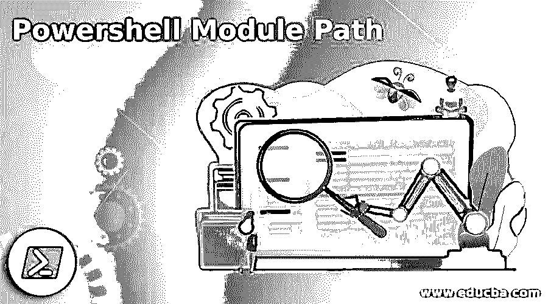

# Powershell 模块路径

> 原文：<https://www.educba.com/powershell-module-path/>

## Powershell 模块路径介绍

当前安装在系统上的模块的位置存储在 PSModulePath 环境变量中。有两种扩展 PowerShell cmdlets 的重要方法；它们是模块和管理单元。两者都是 cmdlets 和函数的包。管理单元是最先开发的，它们是在 PowerShell 版本 1 中引入的，而模块是在 PowerShell 版本 2 中引入的。管理单元已被否决。管理单元在程序集中定义，而模块在程序集或 PowerShell 脚本中定义。管理单元和模块都只是 cmdlets、函数、变量和工作流的包。已注册的管理单元可以通过使用“Get-PSSnapin-registered”cmdlet 找到答案。安装的可用模块列表可以通过使用“Get-Module–list available”cmdlet 找到。本文将详细介绍 Powershell 模块路径。

**目录下可用模块列表:C:\ Program Files \ windows powershell \ Modules**

<small>Hadoop、数据科学、统计学&其他</small>

| **模块类型** | **版本** | **名称** |
| 脚本 | 1.0.1 | 微软。PowerShell .操作.验证 |
| 二进制的 | 1.0.0.1 | 包管理 |
| 脚本 | 3.4.0 | 纠缠 |
| 脚本 | 1.0.0.1 | PowerShellGet |
| 脚本 | One point two | PSReadline |

目录下可用的模块列表目录:C:\ WINDOWS \ system32 \ WINDOWS powershell \ v 1.0 \ Modules

| **模块类型** | **版本** | **名称** |
| 显示 | 1.0.0.0 | AppBackgroundTask |
| 显示 | 2.0.0.0 | AppLocker |
| 显示 | 1.0.0.0 | appclient |
| 显示 | 2.0.0.0 | Appx |
| 脚本 | 1.0.0.0 | 指定访问 |
| 显示 | 1.0.0.0 | BitLocker |
| 显示 | 2.0.0.0 | 比特转移 |
| 显示 | 1.0.0.0 | BranchCache |
| 显示 | 1.0.0.0 | CimCmdlets |
| 显示 | One | configni |
| 显示 | One | 拥护者 |
| 显示 | 1.0.0.0 | 交付优化 |
| 显示 | 1.0.0.0 | DirectAccessClientComponents |
| 脚本 | Three | Dism |
| 显示 | 1.0.0.0 | dns 客户端 |
| 显示 | 1.0.0.0 | 事件跟踪管理 |
| 显示 | 2.0.0.0 | 国际的 |
| 显示 | 1.0.0.0 | iSCSI |
| 脚本 | 1.0.0.0 | 伊势(日本本州岛南部城市) |

为了只获取当前会话中可用的模块，使用 cmdlet“Get-Module-All”。借助 Import-Module cmdlet，可以将任何模块导入到会话中。

**当前会话中的模块:**

| **模块类型** | **版本** | **名称** |
| 脚本 | 1.0.0.0 | 伊势(日本本州岛南部城市) |
| 二进制的 | 3.0.0.0 | Microsoft.PowerShell.Commands.Management.dll |
| 二进制的 | 3.0.0.0 | Microsoft.PowerShell.Commands.Utility.dll |
| 显示 | 3.1.0.0 | 微软。PowerShell .管理 |
| 脚本 | Zero | 微软。PowerShell .实用程序 |
| 显示 | 3.1.0.0 | 微软。PowerShell .实用程序 |

**举例:**

导入模块名 PSDiagnostics

在导入模块时，verbose 参数可用于了解模块中可用的 cmdlets 和函数。

要从会话中删除该模块，可以使用下面的 cmdlet

移除模块名 PSDiagnostics。这里也可以使用 verbose 参数。

**PSModulePath:**

PSModulePath 是一个环境变量，存储系统上安装的模块的地址。当用户不知道模块的路径或者没有指定时，PowerShell 使用这个变量来定位它们。若要查看存储的模块，请执行以下 cmdlet。

**语法:**

`$env:PSModulePath`

**输出:**

$env:PSModulePath 的默认值是下列值之一

*   $ HOME \ Documents \ PowerShell \ Modules；
*   $PSHOME\Modules 或$ HOME \ Documents \ windows powershell \ Modules；
*   $PSHOME\Modules

### 使用 PSModulePath

可以将临时的新路径或位置添加到 PSModulePath，如下所示。

`$env:PSModulePath = $env:PSModulePath + ";c:\windows\test"`

可以使用环境变量编辑器向注册表中添加一个新变量。

要使用脚本添加新变量，必须使用 Environment 类的 SetEnvironmentVariable 方法。

`$CurrentValue = [Environment]::GetEnvironmentVariable("PSModulePath", "Machine")
[Environment]::SetEnvironmentVariable("PSModulePath", $CurrentValue + ";C:\vignesh\test", "Machine")`

要从 PSModulePath 中删除路径或位置，可以使用 replace 参数。

`$env:PSModulePath -replace ";c:\windows\test".`

上述 cmdlet 将从 modulepath 中移除 c:\windows\test。

**启用模块自动导入:**

默认情况下，PSModulePath 中可用的模块仅在会话中导入。若要从其他位置导入模块，必须使用 Import-Module cmdlet。$PSModuleAutoloadingPreference 是决定是否自动导入模块的参数。其可接受的值为 All、ModuleQualified 和 None。

**All** :默认值。模块是为首次使用而导入的。

**module equalized**:只有当用户指定一个模块时，才导入该模块。

**无**:模块不会自动导入。例如$ PSModuleAutoloadingPreference = ' none '

**例子:**

向 PSModulePath 添加模块的新位置。

**输入:**

`Function Add-ToPSModulePathEg {
[CmdletBinding()] Param(
[Parameter(Mandatory=$true)][String]$ModulePath
)
Write-Host "Add a path tutorial"
if (!($env:PSModulePath.split(";") -contains $ModulePath)){
$Current = $env:PSModulePath
[Environment]::SetEnvironmentVariable("PSModulePath",$Current + ";" + $ModulePath, "Machine")
$env:PSModulePath = [System.Environment]::GetEnvironmentVariable("PSModulePath","Machine")
Write-Host "Path Added"
}else{
Write-Host "$ModulePath is already available in psMOdulePath $env:psModulePath"
}
}`

**如何运行脚本的步骤:**

上面的脚本是一个函数。所以需要向它传递参数。

首先，运行脚本。

在“输出”窗格中，键入 Add-ToPSModulePathEg–ModulePath“要在此处添加的路径”

请参见下面的输出屏幕以供参考

**输出:**

在上面的输出中，如果您看到脚本第一次运行时。如果模块路径中没有该路径，则将添加该路径，添加路径教程将与添加的路径一起打印。如果脚本再次在相同的路径上运行，那么第二个输出“Test4 已经可用”将被打印出来。

**从 PSModulePath 中删除路径:**

**输入:**

`function Remove-FromPSModulePathEg{
[CmdletBinding()] Param(
[Parameter(Mandatory=$true)][String]$ModulePath
)
Write-Host "Removing a path from PSModulePath Variable"
if ($env:PSModulePath.split(";") -contains $ModulePath){
$NewValue = (($env:PSModulePath).Split(";") | ? { $_ -ne $ModulePath }) -join ";"
[Environment]::SetEnvironmentVariable("PSModulePath", $NewValue, "Machine")
$env:PSModulePath = [System.Environment]::GetEnvironmentVariable("PSModulePath","Machine")
write-Host "$ModulePath removed. Restart the prompt for the changes to take effect."
}else{
write-Host "$ModulePath is not present in $env:psModulePath"
}
}`

**如何运行脚本的步骤:**

上面的脚本是一个函数。所以需要向它传递参数。

首先，运行脚本。

在“输出”窗格中，键入 FromPSModulePathEg–ModulePath“要在此删除的路径”

请参见下面的输出屏幕以供参考

**输出:**

在上面的输出中，首先，删除了上面添加的路径。接下来，从输出中删除一条路径。最后，第二次为删除的路径运行脚本时，会产生不存在的路径。

**同时向 PSModulePath 添加多个位置**

**输入:**

`Write-Host "Welcome to adding multiple paths to the PSModulePath Environment Variable"
#storing the paths to be added in an array
$address=@("C:\Vignesh\test","C:\Vignesh\Tickets","C:\Vignesh\Patching","C:\Vignesh\Training Screenshots" )
foreach($add in $address)
{
Write-Host "Adding the path" $add "to the PSModulePath Variable"
$env:PSModulePath = $env:PSModulePath +";$add"
Write-Host "Path added"
Write-Host "Current value of PSModulePath is "$env:PSModulePath
}`

**输出:**

**从 PSModulePath 中同时删除多条路径:**

**输入:**

`Write-Host "Welcome to deleting multiple paths from the PSModulePath Environment Variable"
Write-Host "Current Value in PSModulePath is" $env:PSModulePath
#storing the paths to be removed from the location
$address=@("C:\Vignesh\test","C:\Vignesh\Tickets","C:\Vignesh\Patching","C:\Vignesh\Training Screenshots" )
foreach($add in $address)
{
if ($env:PSModulePath.split(";") -contains $add){
Write-Host "Removing the path" $add
$NewValue = (($env:PSModulePath).Split(";") | ? { $_ -ne $add }) -join ";"
[Environment]::SetEnvironmentVariable("PSModulePath", $NewValue, "Machine")
$env:PSModulePath = [System.Environment]::GetEnvironmentVariable("PSModulePath","Machine")
write-Host "$add removed"
}
}`

**输出:**

### 结论–Powershell 模块路径

因此，本文详细介绍了 PSModulePath 环境变量。它还解释了模块和管理单元之间的区别。需要注意的一些关键点是何时启用模块的自动加载；应注意第一个位置具有所需的模块。在同一模块有多个版本的情况下，默认情况下，PowerShell 使用该模块的最新版本。它还演示了如何添加和删除 PSModulePath 变量的示例。要深入了解 cmdlet，创建示例程序并享受围绕它们工作的乐趣是明智的。

### 推荐文章

这是 Powershell 模块路径指南。这里我们讨论 PSModulePath 环境变量，并详细介绍 PSModulePath 环境变量。它也解释了。您也可以阅读以下文章，了解更多信息——

1.  [PowerShell 空值](https://www.educba.com/powershell-null/)
2.  [PowerShell 新产品线](https://www.educba.com/powershell-new-line/)
3.  [PowerShell ZIP](https://www.educba.com/powershell-zip/)
4.  [PowerShell 位置](https://www.educba.com/powershell-location/)

