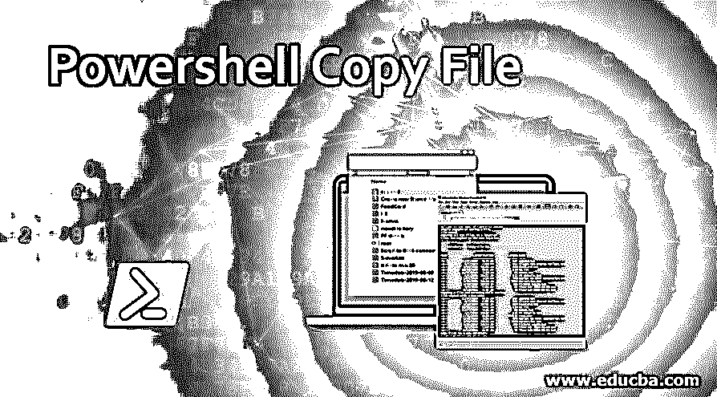
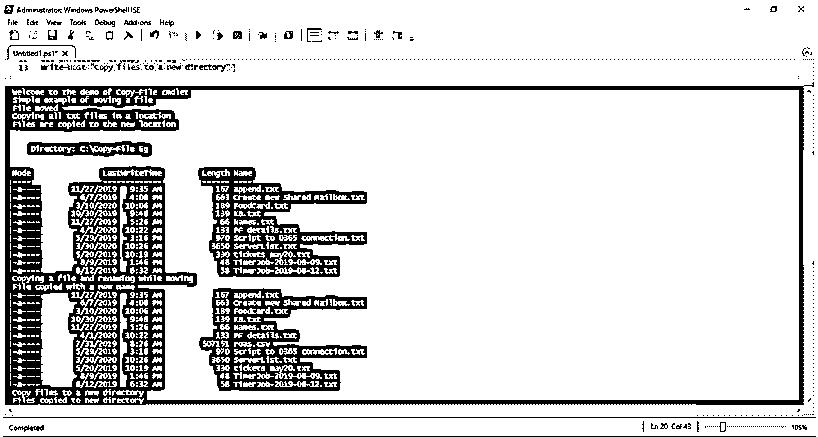
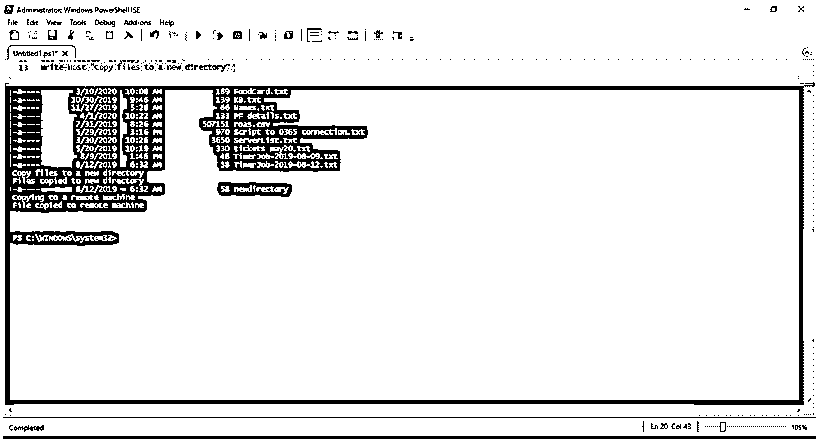
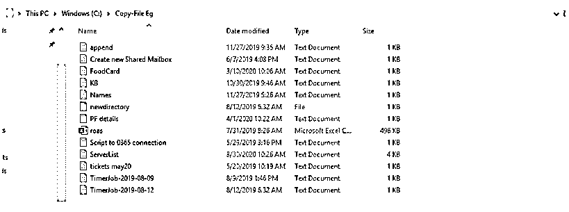

# Powershell 复制文件

> 原文：<https://www.educba.com/powershell-copy-file/>

## Powershell 复制文件简介

对于任何用户来说，复制文件都是最简单的操作之一。在所有 shell 语言中都有相应的命令，类似地，在 PowerShell 中，这是在 Copy-Item cmdlet 的帮助下实现的。这个 cmdlet 不仅可以复制单个文件，还可以用来复制一个文件夹，递归地复制一个文件夹内的多个文件。它还允许用户只选择和复制基于通配符的文件。本文将详细介绍使用该 cmdlet 在 PowerShell 中复制项目的各种方法，以及适当的示例和样本脚本。在本主题中，我们将了解 Powershell 复制文件。

### Powershell 复制文件的语法

下面是语法:

<small>Hadoop、数据科学、统计学&其他</small>

`NAME
Copy-Item
SYNTAX
Copy-Item [-Path] <string[]> [[-Destination] <string>] [-Container] [-Force] [-Filter <string>] [-Include <string[]>] [-Exclude <string[]>] [-Recurse] [-PassThru] [-Credential <pscredential>] [-WhatIf] [-Confirm] [-UseTransaction] [-FromSession <PSSession>] [-ToSession <PSSession>]  [<CommonParameters>] Copy-Item [[-Destination] <string>] -LiteralPath <string[]> [-Container] [-Force] [-Filter <string>] [-Include <string[]>] [-Exclude <string[]>] [-Recurse] [-PassThru] [-Credential <pscredential>] [-WhatIf] [-Confirm] [-UseTransaction] [-FromSession <PSSession>] [-ToSession <PSSession>]  [<CommonParameters>] ALIASES
cpi
cp
copy`

#### 因素

下面是下面提到的参数

**-Confirm:** 用于在运行 cmdlet 之前获得用户的确认。它的类型是开关参数。它的别名是 cf，默认值是 false。它不接受管道输入，也不允许使用通配符。这是一个可选参数。

**-Container:** 此参数表示 cmdlet 在执行复制文件操作时保留容器对象。其类型为 switch，默认值为 true。它不接受管道输入，也不允许使用通配符。这是一个可选参数。

**-Credential:** 用于在执行命令时提升凭证或模拟另一个用户。任何内置的提供程序都不支持这一点。它的类型是 PSCredential。它接受管道输入，而不接受通配符。这是可选的。

**-目的地:**表示复制文件必须移动到的目的地。它的类型是字符串。它的默认值是当前目录。它接受管道输入，而不接受通配符。如果必须重命名文件名，应提及一个新名称。

**-排除:**指定需要排除复制的项目。可以是路径，也可以是模式。允许使用通配符。它的类型是 String[]。默认值为无。不接受管道输入，但允许使用通配符。这是可选的。

**-Filter:** 这表示要与 cmdlet 一起使用的过滤器。唯一支持它的提供者是内置文件系统提供者。过滤器比通配符更有效。它的类型是字符串。其默认值为无。不接受管道输入，但允许使用通配符。这是可选的。

**-Force:** 这应该在处理只读文件或别名时使用。它的类型是开关。其默认值为 false。它不接受管道输入，也不允许使用通配符。这是一个可选参数。

**-Include:** 表示需要包含的项目列表。可以是路径，也可以是模式。允许使用通配符。它的类型是 String[]。默认值为无。不接受管道输入，但允许使用通配符。这是可选的。

**-LiteralPath:** 表示到一个或多个位置的路径。应该准确地按照它的打字方式来使用。不接受通配符路径。转义字符必须用单引号括起来。它的类型是 String[]。它的别名是 PsPath 和 LP。其默认值为无。它接受管道输入。

**-PassThru:** 这不产生任何输出。它的类型是开关。它不接受管道输入，也不允许使用通配符。这是一个可选参数。

**-路径:**这是一个强制参数。它表示要复制的项目可用的路径。它的类型是 String[]。其默认值为无。它接受管道输入，并且允许使用通配符。

**-Recurse:** 这表示要发生递归动作。它的类型是开关。默认值为 false。它不接受管道输入，也不允许使用通配符。这是一个可选参数。

**-ToSession:** 将文件复制到远程机器时使用。目的地在远程机器上。它的类型是 PSSession。其默认值为无。不接受管道输入和通配符。这是可选的。

**-Whatif:** 这用于查看 cmdlet 运行时的输出。它的类型是开关。它不接受管道输入，也不允许使用通配符。这是一个可选参数。

### Powershell 复制文件示例

以下是下面提到的例子:

**输入:**

`Write-Host "Welcome to the demo of Copy-File cmdlet"
Write-Host "Simple example of moving a file"
Copy-Item "C:\Vignesh\append.txt" -Destination "C:\Copy-File Eg"
Write-Host "File moved"
Write-Host "Copying all txt files in a location"
Copy-Item "C:\Vignesh\*txt" -Destination "C:\Copy-File Eg" -Recurse
Write-Host "Files are copied to the new location"
Get-ChildItem "C:\Copy-File Eg"
Write-Host "Copying a file and renaming while moving"
Copy-Item "C:\Vignesh\Messaging_August 2019_Roster.xlsx" -Destination "C:\Copy-File Eg\roas.csv"
Write-Host "File copied with a new name"
Get-ChildItem "C:\Copy-File Eg"
Write-Host "Copy files to a new directory"
Copy-Item "C:\Vignesh\*txt" -Destination "C:\Copy-File Eg\newdirectory" -Recurse
Write-Host "Files copied to new directory"
Get-ChildItem "C:\Copy-File Eg\newdirectory"
Write-Host "Copying to a remote machine"
$Session = New-PSSession -ComputerName "testserver" -Credential "test\vignesh"
Copy-Item "D:\test.log" -Destination "C:\" -ToSession $Session
Write-Host "File copied to remote machine"`

**输出:**

### 结论

因此，本文详细介绍了如何使用 Copy-File cmdlet 在 PowerShell 中复制文件。它解释了与 cmdlet 相关的各种参数、它们的类型和用法。本文还演示了如何复制单个文件、多个文件、移动时重命名文件、如何将文件复制到远程计算机等。使用示例脚本。要了解有关 cmdlet 的更多信息，建议编写示例脚本并使用它们进行练习。

### 推荐文章

这是 Powershell 复制文件的指南。这里我们讨论 Powershell 复制文件的例子以及参数和语法。您也可以看看以下文章，了解更多信息–

1.  [PowerShell 获取项目](https://www.educba.com/powershell-get-item/)
2.  [PowerShell 拆分字符串](https://www.educba.com/powershell-split-string/)
3.  [PowerShell 获取进程](https://www.educba.com/powershell-get-process/)
4.  PowerShell 中的[字符串](https://www.educba.com/string-in-powershell/)

