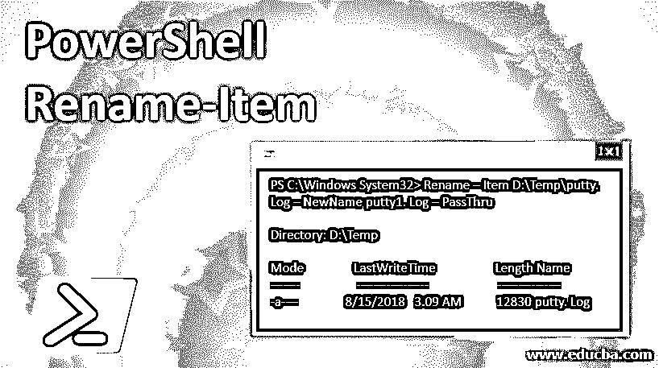

# PowerShell 重命名-项目

> 原文：<https://www.educba.com/powershell-rename-item/>

## PowerShell 重命名简介-项目

PowerShell 中的 Rename-Item cmdlet 用于重命名文件、文件夹、注册表、证书等项目。此 cmdlet 仅重命名项目，而不重命名其实际内容，或者无法将项目移动到其他位置。

**语法:**

<small>Hadoop、数据科学、统计学&其他</small>

`Rename-Item
[-Path] <String>
[-LiteralPath] <String>
[-NewName] <String>
[-Force] [-PassThru] [-Credential <PSCredential>] [-WhatIf] [-Confirm] [-UseTranscation] [<CommonParameters>]`

### PowerShell 重命名项目中的参数

以下是 PowerShell 重命名项目的参数:

*   **路径:**项目的来源路径。该路径应为字符串格式，并且必须相同。您可以指定通配符(*)，但 path 应该只解析一项，而不是多项。
*   **新名称:**目标文件名。默认情况下，它将采用相同的源路径，当您显式指定不同的路径时，它将生成错误。新名称中不能使用通配符(*)。可以重命名多个文件和扩展名。
*   **强制:**重命名不能更改的项目名称。只读或隐藏的文件或文件夹，此参数允许它们强制重命名。此参数不能改变常量别名或变量。
*   **PassThru:** 默认情况下，Rename-Object 不生成任何输出。此参数允许在控制台中显示输出。
*   **Credential:** 如果您的目标项目在不同的域或工作组中，您可以使用此参数连接具有不同凭据的目标路径。
*   **Whatif:** 该参数用于通知该命令运行时将要执行的操作，而不是实际运行该命令。
*   **LiteralPath:** 该参数还指定要重命名的项目的路径。没有字符被解释为通配符。如果路径包含特殊字符，则需要用单引号括起来，这样 PowerShell 就不会将任何字符解释为转义序列。
*   **确认:**该参数在对项目进行重命名操作之前提示用户。
*   **use transaction:**该参数包含活动事务中的命令。该参数仅在事务正在进行时有效。
*   **<常用参数> :** 以下参数由常用参数支持。ErrorAction、ErrorVariable、WarningAction、warningvariablebuffer、PipelineVariable 和 OutVariable。

### 实现 PowerShell 重命名项目的示例

下面是在 PowerShell Rename-Item 中实现的示例:

#### 示例 1–重命名项目

**代码:**

`Rename-Item D:\Temp\Putty.log -NewName Putty1.log`

在上面的例子中，当您没有为要重命名的文件提供目标路径时，它将默认采用相同的源路径。您也可以在不指定–Newname 参数的情况下重命名项目。为此，只需在旧名称和新名称之间提供空格。举个例子，

`Rename-Item D:\Temp\Putty.log Putty1.log`

您也可以重命名文件夹，如下所示。

`Rename-Item D:\Temp -NewName Temp1`

#### 示例 2–使用 Passthru 参数重命名项目

要在控制台中检查命令的输出，请使用-Passthru 参数。

**代码:**

`Rename-Item D:\Temp\Putty.log -NewName Putty1.log -PassThru`

**输出:**

如果您提供不同的目标路径，则会生成错误，因为此 cmdlet 无法执行移动操作。

`Rename-Item D:\Temp\putty.log -NewName D:\putty1.log -PassThru`

**输出:**

#### 示例# 3–使用 Whatif 参数重命名子项目

当您使用 whatif 参数时，它将显示命令将要执行的操作，而不是实际运行命令。

`Rename-Item D:\Temp\cars.xml -NewName cars1.xml -PassThru -WhatIf`

**输出:**

#### 示例# 4–使用确认参数重命名子项目

此参数将在重命名项目之前要求用户确认。

**代码:**

`Rename-Item D:\Temp\cars.xml -NewName cars1.xml –Confirm`

**输出:**

您还可以提供值 true 或 false 来确认参数。当提供$true 值时，它将提示用户确认。当您提供$false 值时，它不会提示用户确认，而是直接重命名项目，这是–confirm 参数中的默认选项。

`Rename-Item D:\Temp\cars.xml -NewName cars1.xml -Confirm:$true`

`Rename-Item D:\Temp\cars.xml -NewName cars1.xml -Confirm:$false`

#### 示例 5–重命名注册表值

像文件重命名一样，您也可以重命名注册表值。

**代码:**

`Rename-Item HKLM:\SYSTEM\CurrentControlSet\Control\test -NewName Test2`

`Rename-Item HKLM:\SECURITY\Policy\Data -NewName Data1`

#### 示例# 6–使用 Rename-Item 重命名多个文件扩展名

要重命名多个文件的扩展名，可以使用下面的命令来替换它们。

**代码:**

`PS C:\WINDOWS\system32> Get-ChildItem D:\Temp\* -Include *.html | Rename-Item -NewName {$_.Name -replace '.html','.htm'} -PassThru`

要重命名多个文件或文件夹，您需要使用循环。

**输出:**

### 结论

重命名项目是一个很好的工具来重命名单个或多个文件，扩展名，文件夹，注册表等。但是它不能移动或复制文件。对于他们，有不同的 cmdlets 可用。

### 推荐文章

这是 PowerShell 重命名项目的指南。在这里，我们讨论基本介绍，参数，例子，以实现适当的代码和输出。您也可以浏览我们的其他相关文章，了解更多信息——

1.  [在 PowerShell 中设置变量](https://www.educba.com/set-variable-in-powershell/)
2.  PowerShell 中的[变量](https://www.educba.com/variable-in-powershell/)
3.  [PowerShell 中的哈希表](https://www.educba.com/hashtable-in-powershell/)
4.  [实施 PowerShell 新项目的示例](https://www.educba.com/powershell-new-item/)

