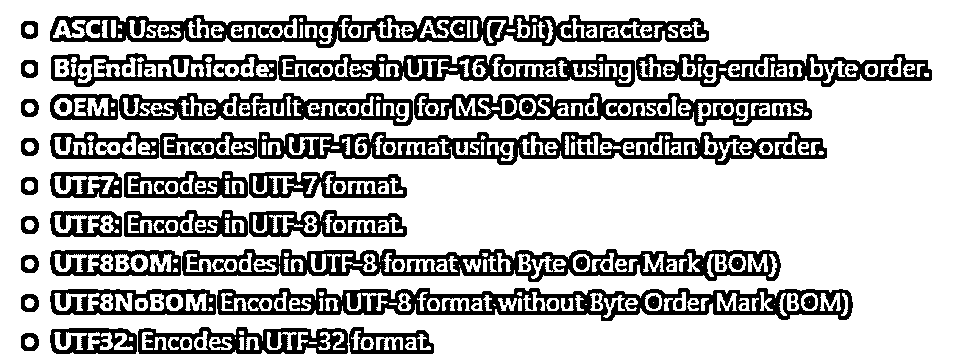
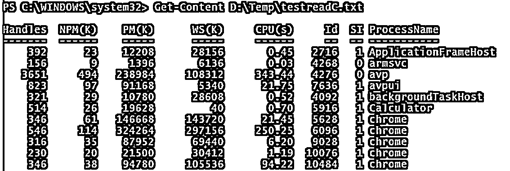

# PowerShell 获取内容

> 原文：<https://www.educba.com/powershell-get-content/>

## PowerShell Get-Content 简介

Get-Content 在 PowerShell 中用于从文件(文本文件)或程序的指定位置读取内容。此 cmdlet 一次读取一个文件的内容，并作为对象的集合返回。从 PowerShell 3.0 开始，您可以从项目的开头或结尾获得指定的行数。

**语法:**

<small>Hadoop、数据科学、统计学&其他</small>

`Get-Content
[-ReadCount <Int64>] [-TotalCount <Int64>] [-Tail <Int32>] [-Path] <String[]>
[-LiteralPath] <String[]>
[-Filter <String>] [-Include <String[]>] [-Exclude <String[]>] [-Force] [-Credential <PSCredential>] [-Delimiter <String>] [-Wait] [-Raw] [-Encoding <Encoding>] [-AsByteStream] [-Stream <String>] [<CommonParameters>]`

**参数:**

*   **路径:**要读取的文件的路径。您可以提供一个或多个文件路径，但不能提供目录。允许使用通配符。
*   **读取计数:**指定一次通过管道发送的内容行数。默认值为 1，表示它一次发送一行。如果您将该值设置为 0，则它会一次发送全部内容。此参数不会改变它显示的内容，但会影响显示内容的时间。读取计数值越大，到达第一行所需的时间就越长，但总操作时间会减少。
*   **TotalCount:** 指定从开始显示的总行数。如果将值设置为 10，它将只显示 10 行。默认值为-1，表示将显示所有行。它的别名是 Head 和 First。
*   **Tail:** 指定从文件末尾开始显示的总行数。它的别名是 Last。
*   **Include:** Include 参数是路径限定符，表示它包括该路径的所有项目。允许使用通配符(*)。当您使用–Include 参数时，您需要提供该项目的内容。例如，D:\temp\*其中(*)指定目录的内容。
*   **Exclude:** Exclude 参数是路径限定符，意味着它排除了该路径中指定的所有项目。允许使用通配符(*)。当您使用–Exclude 参数时，您需要提供该项目的内容。例如，D:\Temp\*其中(*)指定目录的内容。
*   **Filter:**Filter 参数比 include 或 exclude 更有效。它也是一个路径限定符，可以使用通配符(*)作为该参数。
*   **Force:** 从文件中检索受除安全权限之外的任何设置限制的内容。Force 参数重写文件的只读属性或创建一个目录来完成文件路径。
*   **凭证:**当文件位于不同的域或工作组中时，您可以使用该位置文件的凭证来检索其内容。
*   **Delimiter:** 在从文件中检索内容时，它使用一个分隔符将文件分割成字符串对象。默认分隔符是(\n)，即行字符的结尾。
*   **Wait:** 当指定 Wait 参数时，Powershell 控制台会保持文件打开，并一直等待，直到通过输入 CTRL + C 或删除文件来手动中断。在第二种情况下，将会有一个非终止错误。等待不能与原始参数组合。
*   **Raw:** 将多行作为单个字符串返回，但在输出中保留新行。
*   **编码:**指定目标文件的编码类型。接受的编码值。

*   **AsByteStream:** 这个参数是在 PowerShell 6.0 中引入的，它指定内容是否应该作为流的一个字节来读取。
*   **流:**该参数用于创建流。一旦创建了不同的流，就可以根据该流检索文件中的更改。
*   **LiteralPath:** 该参数指定一个或多个位置的路径。与-path 参数不同，您不能在这里指定通配符，因为该参数不能将字符解释为通配符。如果您的路径包含任何转义字符，请在单引号下标记它们，PowerShell 会将其视为单个路径。
*   **通用参数:**使用以下通用参数，也称为高级功能参数。
    Verbose、Debug、ErrorAction、ErrorVariable、WarningAction、WarningAction、WarningVariable、OutBuffer、PipelineVariable 和 OutVariable。

### PowerShell 获取内容的示例

下面给出了 PowerShell Get-Content 的示例:

#### 示例#1

通过 Get-Content 读取文件。

在 testreadC.txt 文件中，我们存储了进程。

`Get-Content -Path D:\Temp\testreadC.txt`

**输出:**

#### 实施例 2

带有 TotalCount 的 GC

`Get-Content -Path D:\Temp\testreadC.txt -TotalCount 10`

从开始总共将显示 10 行。

**输出:**

#### 实施例 3

带尾的 GC

`Get-Content -Path D:\Temp\testreadC.txt -Tail 10`

从底部开始总共会显示 10 行。

**输出:**

#### 实施例 4

带 ReadCount 的 GC

`Get-Content -Path D:\Temp\testreadC.txt -ReadCount 10 | Set-Content D:\Temp\ReadC.txt`

上面的例子将一次发送 10 行到新文件 ReadC.txt。

#### 实施例 5

带分隔符的 GC

`Get-Content D:\Temp\delim.txt -Delimiter '@'`

上面的命令将用' @ '字符分割文件内容，并在其后开始新的一行。

举个例子，

#### 实施例 6

带 Raw 的 GC

`Get-Content D:\Temp\testreadC.txt -Raw`

上述命令将把整个文件内容存储到一个字符串中，而不是一个数组中。我们可以按如下方式检查行数。

**输出:**

#### 实施例 7

带编码的 GC

`Get-Content D:\Temp\testreadC.txt -Encoding Byte -TotalCount 10`

这里，选择了编码字节，因此数据将采用字节格式。您可以选择参数说明中提到的另一种格式。

**输出:**

#### 实施例 8

带流的 GC

`Get-Content D:\Temp\stream1.txt -Stream $stream1`

上述命令将保留 stream1 中的现有内容。当新的内容与新的流一起添加到同一个文件中时，它可以很容易地被识别。

`Set-Content D:\Temp\stream1.txt -Value "This is the new line" -
Stream $stream2
Get-Content D:\Temp\stream1.txt -Stream $stream2`

**输出:**

#### 实施例 9

带有过滤/包含/排除参数的 GC。

`Get-Content D:\Temp\* -Filter Testread*`

上述命令将读取文件名中以“TestRead”开头的所有文件。

`Get-Content D:\Temp\* -Include *read*`

上述命令将读取文件名中包含“read”的所有文件。

`Get-Content D:\Temp\* -Exclude Test*`

上述命令将排除文件名中以“Test”开头的所有文件，并将从同一路径上的其他文件中读取内容。

### 推荐文章

这是 PowerShell 获取内容的指南。这里我们讨论简介、给定语法的参数以及 PowerShell Get-Content 的示例。您也可以浏览我们的其他相关文章，了解更多信息——

1.  [PowerShell Set-Location](https://www.educba.com/powershell-set-location/)
2.  [Unix 中的 VI 编辑器](https://www.educba.com/vi-editor-in-unix/)
3.  [PowerShell 中的 cmdlets】](https://www.educba.com/cmdlets-in-powershell/)
4.  [PowerShell 设置-内容](https://www.educba.com/powershell-set-content/)
5.  [PowerShell Break |前 8 个例子](https://www.educba.com/powershell-break/)
6.  [PowerShell 转换为字符串|参数](https://www.educba.com/powershell-convert-to-string/)

