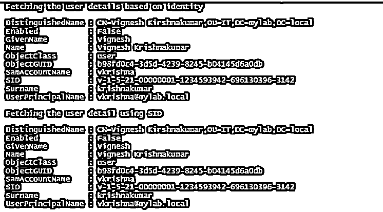
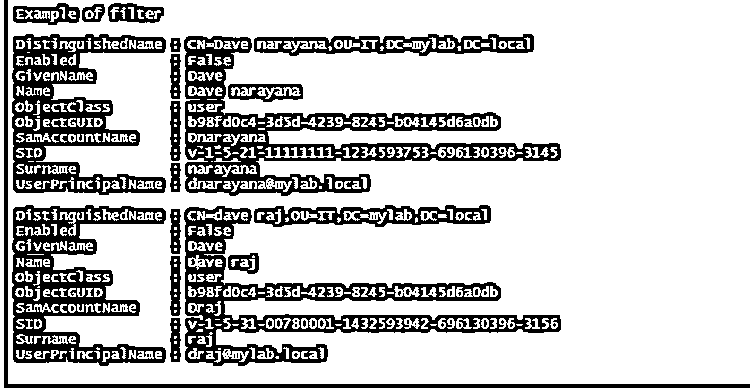

# PowerShell Get-ADUser

> 原文：<https://www.educba.com/powershell-get-aduser/>

## PowerShell Get-ADUser 简介

Get-ADUser cmdlet 用于获取有关一个或多个 active directory 用户的信息。可以使用几个参数来识别用户，如用户的可分辨名称、active directory 中相应的 GUID、安全标识符或 SAM(安全帐户管理器)名称。要获取多个用户的信息，可以使用过滤器或 LDAPFilter。筛选器参数使用 PowerShell 表达式语言从 Active Directory 中获取信息。本文将详细介绍这个 cmdlet 以及适当的解释和示例。

### 语法和参数

Powershell get-ADUser 的语法和参数如下所示:

<small>Hadoop、数据科学、统计学&其他</small>

**语法:**

`Get-ADUser   [-AuthType <ADAuthType>]   [-Credential <PSCredential>]   -Filter <String>   [-Properties <String[]>]   [-ResultPageSize <Int32>]   [-ResultSetSize <Int32>]   [-SearchBase <String>]   [-SearchScope <ADSearchScope>]   [-Server <String>]  [<CommonParameters>] Get-ADUser   [-AuthType <ADAuthType>]   [-Credential <PSCredential>]   [-Identity] <ADUser>   [-Partition <String>]   [-Properties <String[]>]   [-Server <String>] [<CommonParameters>] Get-ADUser   [-AuthType <ADAuthType>]   [-Credential <PSCredential>]   -LDAPFilter <String>   [-Properties <String[]>]   [-ResultPageSize <Int32>]   [-ResultSetSize <Int32>]   [-SearchBase <String>]   [-SearchScope <ADSearchScope>]   [-Server <String>]  [<CommonParameters>]`

**参数:**

Powershell get-aduser 的参数是

*   **-AuthType:** 这表示用于连接到活动目录的身份验证方法。它可以是两个值中的任何一个，negotiate 也可以称为 0 或 Basic，否则可以称为 1。协商是默认使用的身份验证模式。要使基本身份验证正常工作，需要 SSL 连接。参数的类型是 ADAuthType。它不接受管道输入；也不允许使用通配符。
*   **-Credential:** 这是指将用于运行 cmdlet 的用户帐户。默认情况下，除非 cmdlet 是从 Active Directory 的驱动器上运行的，否则会考虑当前用户的凭据。在这种情况下，会考虑与驱动器相关联的帐户。username 或 PSCredential 对象作为值提供给参数。如果指定了用户名，则会提示输入密码。指定的帐户应该具有目录级权限，否则 cmdlet 将失败并引发错误。它的类型是 PSCredential。该参数不接受管道输入，也不允许使用通配符。
*   **-过滤器:**这表示用于从活动目录中获取对象的查询。它使用 PowerShell express 语言的语法。PowerShell express 语言具有良好的类型转换支持。它的类型是字符串，默认值是 none。此参数不接受管道输入，也不支持通配符。
*   **-Identity:** 这是一个强制参数。这表示应提取其详细信息的 Active directory 用户。下列值可以作为 identity 参数传递。唯一的名称、Active directory 中用户的 GUID、SID 或 SAM 帐户名。此参数的类型是 ADUser。其默认值为无。此参数接受管道输入，但不允许使用通配符。
*   **-LDAPFilter:** 这表示用于过滤目的的 LDAP 查询。过滤器参数类似于 LDAP 语法。它的类型是字符串。此参数不支持输入管道和通配符。
*   **-分区:**这是指一个活动目录分区。它必须是当前目录服务器之一的名称。搜索该分区以识别由 identity 参数引用的对象。如果没有指定值，则使用默认值。如果传递给 identity 参数的值是一个可分辨名称，则默认值将由此自动生成，并被视为分区名称。如果 cmdlets 是从 active directory 提供程序运行的，则驱动器中的当前路径将被视为分区的默认值。此参数的数据类型是字符串，默认值是 none。此参数不接受管道输入和通配符。
*   **-属性:**表示要返回的活动目录对象的属性列表。若要检索多个属性，请用逗号分隔它们。要检索所有属性，请使用*。此参数的数据类型是字符串[]。默认值为无。此参数不接受管道输入和通配符。
*   **-ResultPageSize:** 这表示在查询结果的单个页面中出现的对象的数量。它的类型是 int32。默认值为 256。此参数不接受管道输入和通配符。
*   **-ResultSetSize:** 这表示查询应该返回的对象的最大数量。如果需要返回所有属性，则必须将 null 值传递给该参数。它的数据类型是 int32。此参数不接受管道输入和通配符。
*   **-SearchBase:** 这表示搜索指定对象时必须使用的 AD 路径。如果 cmdlet 从 active directory 驱动器运行，则驱动器的当前路径被视为默认值。如果 cmdlet 是从外部运行的，则目标驱动器将作为默认值。数据类型是字符串，默认值是 none。此参数不接受管道输入和通配符。
*   **-SearchScope:** 表示广告对象的搜索范围。它有三个价值。基数或 0、一级或 1 和子树或 2。基本范围只搜索提到的用户。一级搜索一个对象的子对象，子树搜索提到的对象的所有子对象。
*   **-服务器:**这表示要连接的活动目录。域值可以是 FQDN 或 netbios 名称。默认值可以是运行 cmdlet 的域或 active directory 驱动器服务器，也可以是传递给参数的值。

### PowerShell Get-ADUser 示例

Powershell get-aduser 示例如下:

**输入:**

`Write-Host "Welcome to the Get user from ad example"
write-host "Fetching the user details based on identity"
Get-ADUser -Identity vkrishna
Write-Host "Fetching the user detail using SID"
Get-ADUser -Identity 'v-1-5-21-00000001-1234593942-696130396-3142'
write-host "Example of filter"
Get-AdUser -Filter "givenName -eq 'Dave'"`

**输出:**

### 推荐文章

这是 PowerShell Get-ADUser 的指南。在这里，我们还将讨论 Powershell get-aduser 的语法和参数，以及一个示例及其代码实现。您也可以看看以下文章，了解更多信息–

1.  [否则如果在 PowerShell 中](https://www.educba.com/else-if-in-powershell/)
2.  [Windows PowerShell ISE](https://www.educba.com/windows-powershell-ise/)
3.  [PowerShell 获取服务](https://www.educba.com/powershell-get-service/)
4.  [PowerShell 功能](https://www.educba.com/powershell-functions/)

