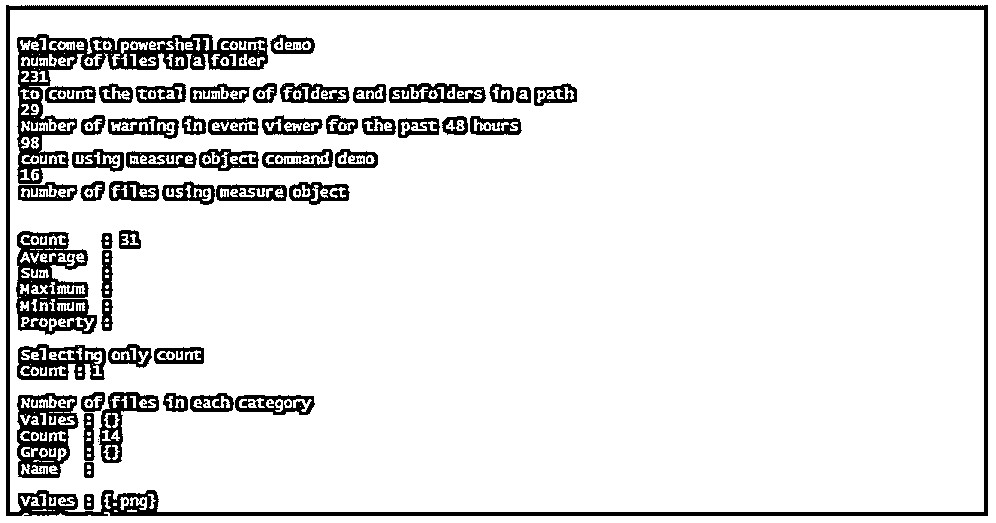
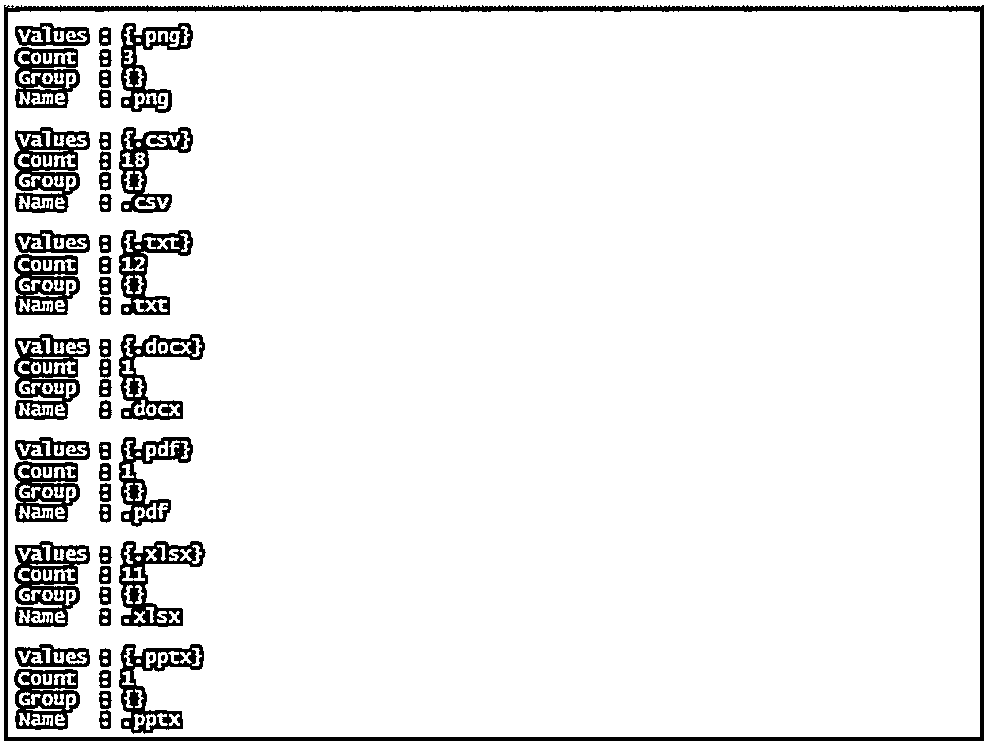
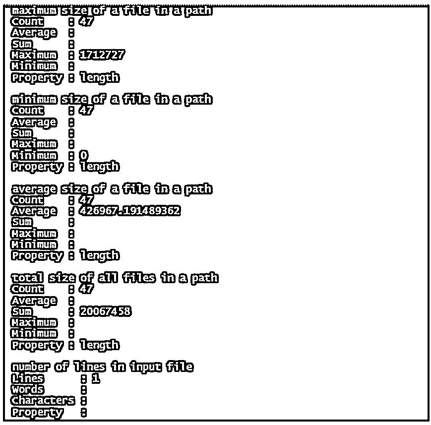

# PowerShell 计数

> 原文：<https://www.educba.com/powershell-count/>

## PowerShell 计数简介

以下文章提供了 PowerShell 计数的概述。在我们的日常活动中，有多种场景需要我们找出计数。它的范围可以是存储在一个位置的文件数量、活动用户数量、非活动用户数量、一天中记录的错误消息数量或超过一个日期的文件数量等。在所有这些情况下，都可以使用 Measure-Object 或 count 方法来确定计数。

### 度量对象的语法

measure-object cmdlet 用于计算文件中的行数、字符数和字数，以及对象的数字属性。它可以根据作为 cmdlet 一部分的参数执行三种类型的计算。它可以统计某个类别的对象或对象的数量。它可以执行算术运算，如数字的最小值、最大值和平均值。如果对象是字符串值，则可以计算字符或单词的数量。

<small>Hadoop、数据科学、统计学&其他</small>

**举例:**

**代码:**

`Get-ChildItem -Path C:\vignesh\Test | Measure-Object -Property LastAccessTime`

**输出:**

**参数:**

*   **-Allstats:** 这表示所有提到的属性的数据。该参数的数据类型为开关参数，默认值为无。它不接受管道输入，也不指定通配符。
*   **-平均值:**该参数计算上述属性的平均值。它的类型是开关参数。默认值为无。它不接受管道输入，也不指定通配符。
*   **-Character:** 该参数返回指定输入对象中可用的字符数。它的类型是开关参数。默认值为无。它不接受管道输入，也不指定通配符。
*   **-IgnoreWhiteSpace:** 默认情况下，计算字符数时会考虑空格，以避免使用该参数。它的类型是开关。默认值为无。它不接受管道输入，也不指定通配符。
*   **-InputObject:** 表示被测对象。使用此参数时，输入对象被视为单个实体，而不是将其传递给管道。它的类型是 PSObject。默认值为无。接受管道输入，但不允许使用通配符。
*   **-Line:** 这将返回指定输入的行数。它的类型是开关参数。默认值为无。它不接受管道输入，也不允许使用通配符。
*   **-Maximum:** 这将返回所提到的属性或对象的最大值。它的类型是开关参数。默认值为无。它不接受管道输入，也不允许使用通配符。
*   **-最小值:**这将返回所提到的属性或对象的最小值。它的类型是开关参数。默认值为无。它不接受管道输入，也不允许使用通配符。
*   **-属性:**表示要测量的指定属性。如果没有指定属性，则返回所有属性。数据类型为 PSPropertyExpression[]。默认值为无。不允许管道输入，但允许使用通配符。
*   **-标准偏差:**这将返回所提到的属性或对象的标准偏差值。它的类型是开关参数。默认值为无。它不接受管道输入，也不允许使用通配符。
*   **-Sum:** 这将返回所提到的属性或对象的总值。它的类型是开关参数。默认值为无。它不接受管道输入，也不允许使用通配符。
*   **-Word:** 这将返回输入中出现的单词总数。它的类型是开关参数。默认值为无。它不接受管道输入，也不允许使用通配符。

### PowerShell 计数示例

下面是提到的例子:

**代码:**

`Write-Host "Welcome to powershell count demo"
Write-Host "number of files in a folder"
(Get-ChildItem -Path C:\vignesh -Recurse | Where-Object{ $_}).count
Write-Host "to count the total number of folders and subfolders in a path"
(Get-ChildItem -Path C:\vignesh -Recurse | Where-Object{ $_.PSIsContainer }).count
Write-Host "Number of warning in event viewer for the past 48 hours"
(Get-EventLog -LogName System -After ((Get-Date).AddDays(-2)) | Where-Object {$_.EntryType -eq "Warning"}).count
Write-Host "count using measure object command demo"
(Get-ChildItem -Path "C:\vignesh\test" | Measure-Object | Select-Object Count).count
Write-Host "number of files using measure object"
Get-ChildItem -Path C:\vignesh\Test -Recurse | Where-Object{ !($_.PSIsContainer) } | Measure-Object
Write-Host "Selecting only count"
Get-ChildItem -Path C:\Vignesh\Test\Actual1239 | Measure-Object | Select-Object Count
Write-Host "Number of files in each category"
Get-ChildItem -Path C:\vignesh | Group-Object Extension -NoElement
Write-Host "maximum size of a file in a path"
Get-ChildItem -Path c:\vignesh | Measure-Object -Property length -Maximum
Write-Host "minimum size of a file in a path"
Get-ChildItem -Path c:\vignesh | Measure-Object -Property length -Minimum
Write-Host "average size of a file in a path"
Get-ChildItem -Path c:\vignesh | Measure-Object -Property length -Average
Write-Host "total size of all files in a path"
Get-ChildItem -Path c:\vignesh | Measure-Object -Property length -Sum
Write-Host "number of lines in input file"
Get-ChildItem -Path C:\Vignesh\KB.txt |Measure-Object -Line
Write-Host "number of characters in input file"
Get-ChildItem -Path C:\Vignesh\KB.txt |Measure-Object -Character
Write-Host "number of words in input file"
Get-ChildItem -Path C:\Vignesh\KB.txt |Measure-Object -Word
Write-Host "number of characters in a text file excluding white space"
Get-ChildItem -Path C:\Vignesh\KB.txt |Measure-Object -IgnoreWhiteSpace -Character
Write-Host "counting a csv file"
Import-Csv C:\vignesh\July3.csv | Measure-Object -Property MailboxResolvedOwnerName -Maximum
Import-Csv C:\vignesh\July3.csv | Measure-Object -Property MailboxResolvedOwnerName -Minimum`

**输出:**

### 结论

因此，在本文中，我们看到了如何在 PowerShell 中对各种对象、文件对象和其他类型的命令执行计数操作。它展示了使用 count 对象或 Measure 对象 cmdlet 的各种方法。这篇文章演示了大量关于 count 的例子，可以用在各种场景中。

### 推荐文章

这是 PowerShell 计数指南。这里我们分别讨论 PowerShell Count 的介绍和例子。您也可以看看以下文章，了解更多信息–

1.  [否则如果在 PowerShell 中](https://www.educba.com/else-if-in-powershell/)
2.  [Windows PowerShell ISE](https://www.educba.com/windows-powershell-ise/)
3.  [PowerShell 发送邮件](https://www.educba.com/powershell-send-mail/)
4.  [PowerShell 功能](https://www.educba.com/powershell-functions/)

