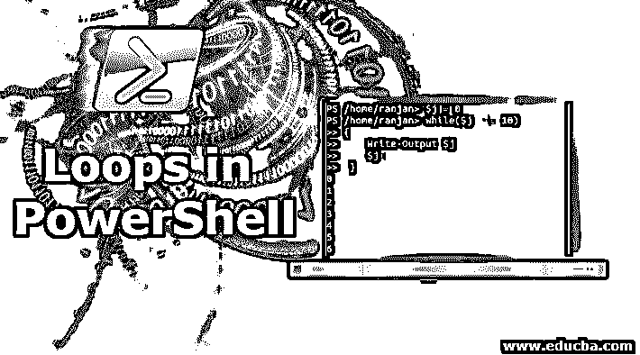
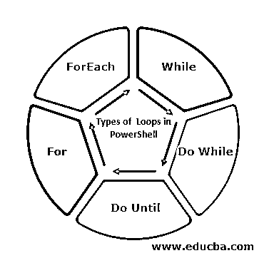
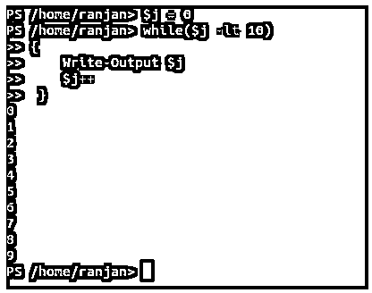
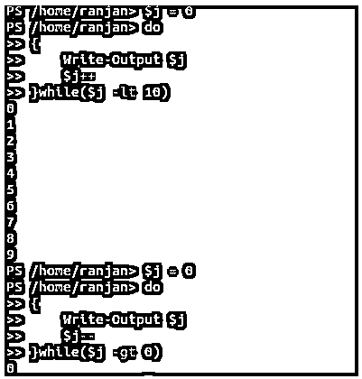
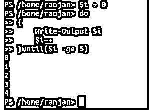
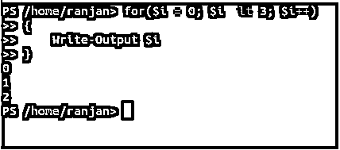
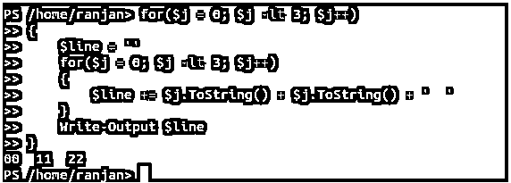

# PowerShell 中的循环

> 原文：<https://www.educba.com/loops-in-powershell/>

## PowerShell 中的循环介绍

如果我们有重复性的工作，我们总是需要循环，在循环中，我们重复运行一段代码或任何语句。一个真实的例子，假设一所学校有 20000 名学生，由于某种原因，大学决定给每个学生额外的 5 分。所以大学决定给每一个学生这 5 分，除了那些出勤少于 100 天的学生。现在你只需假设工作人员将如何做，他们将不得不检查每个学生的分数和今年的出勤率。但是同样的事情，在任何循环的帮助下，都可以很容易地完成，通过创建一个包含学生分数和出勤日期的数组。因此，使用循环，我们能够节省额外的努力。让我们详细了解一下 PowerShell 中的循环。

### PowerShell 中的循环类型

在 PowerShell 中运行 loop 的方法有很多，但这总是取决于你的需求和程序的可行性，例如，如果你想对任何数组至少执行一次，我们应该使用 do-while loop，否则有 for loop 和 for each 这两种好的**。**

<small>Hadoop、数据科学、统计学&其他</small>

类型及其示例如下:

#### 1.在…期间

While 语句将条件作为参数，while 循环中语句的执行取决于该条件，这意味着如果条件成功，则它将执行语句，否则不执行。

**语法:**

`while(condition)
{
Statement 1
Statement 2
….
}`

**举例:**

`$j = 0
while($j -lt 10)
{
Write-Output $j
$j++ }`

下面是执行上述代码的屏幕

#### 2.做什么

Do while 类似于 while 循环，唯一的区别是它将至少执行一次，这意味着它将第一次执行 Do 块，如果条件为真，则执行 while 块。在下面的语法中 do 块第一次执行时肯定。

*   **Do** :该块第一次执行，执行开始时执行一次。
*   **而**:语句 1 和语句 2 的执行完全取决于条件的成功。

**语法:**

`Do
{
Statement 1
Statement 2
….}while(condition){
Statement 3
Statement 4
…..
}`

**例#1:**

`$j = 0
do
{
Write-Output $j  // this block will execute first time
$j++
}while($j -lt 10)`

**例 2:**

在本例中，即使条件不为真，do 块也将首次执行。

`$j = 0
do
{
Write-Output $j
$j--
}while($j -gt 0)`

两个程序的屏幕如下所示

#### 3.一直到

Do until 与 do while 略有不同，在 do until 中，执行将继续，直到通过“until block”返回负结果。这里有两件事很重要。

*   **Do** :该块将一直执行，直到块条件失败，也就是说直到块返回负值。
*   **Until** : Do 阻塞语句 1 和语句 2 执行，直到条件返回否定结果。

**语法:**

`do
{
Statement 1
Statement 2
….
}until(condition)`

**举例:**

`$i = 0
do
{
Write-Output $i
$i++
}until($i -ge 5) //keep checking condition`

在“do until”块中，我们可以看到 do 块将继续执行，直到“until block”条件返回一个正值。

下面是执行上述代码的屏幕

#### 4.为

For 语句根据初始设置将语句列表运行零次或多次。在下面的 for 循环语法中，有三个重要的部分

*   **初始化段**:该段为任意变量赋初值，该段第一次运行一次。
*   **条件**:在条件部分，我们写下循环运行的条件，这意味着语句块的执行总是依赖于条件部分的成功，如果条件为真，则语句块执行，否则不执行。
*   **操作**:在这个块中，我们可以根据自己的需要增加、减少或改变初始化变量或任何东西的值。

**语法:**

`for($initialisation; condition; operation)
{
Statement 1
Statement 2
….
}`

**例#1:**

`for($i = 0; $i -lt 3; $i++)
{
Write-Output $i
}`

上述代码的输出屏幕

很多时候一个 for 循环不足以完成我们的需求，所以我们可以使用嵌套的 for 循环。我们应该尽量避免循环嵌套，因为如果处理不当，它们的时间复杂度可能会非常高。下面是一个嵌套 for 循环的例子。

**例 2:**

`for($j = 0; $j -lt 3; $j++)
{
$line = ''for($j = 0; $j -lt 3; $j++)
{
$line += $j.ToString() + $j.ToString() + '  '
}
Write-Output $line
}`

**输出:** 00 11 22

#### 5.为每一个

“Foreach”连续运行语句块，直到数组的最后一项。forEach 语句的好处是，我们不必编写任何单独的代码来提取数组项。一般来说,“foreach”是“for”循环的优化版本，它给出数组的内部项，而无需编写任何程序。在这里，它只是检查数组内的项，我们在数组上运行“foreach”循环，如果有任何项，它将执行语句 1 和语句 2 块。

**语法:**

`foreach($arrayItems)
{
Statement 1
Statement 2
…..
}`

**举例:**

`$numbers = 23,21,22,78
foreach($number in $numbers)
{
“$number is now =“ +$number
}`

下方屏幕显示以上执行

### PowerShell 中循环的好处

使用循环的最大好处是，它减少了太多的手动工作，而且它非常适合控制类似活动的大数据量。比方说，我想让你打印 1 到 1000000，我告诉你，你可以在每个能被 2 整除的数字上加 1，这是一个偶数。然后，如果你开始一个接一个地打印，并试图给每个偶数加 1，这将花费太多的时间。所以，你建议的一个更好更简单的方法就是重复这个过程，把数字加 1，直到我们达到 1000000。我们从 loop 中得到的最大好处是我们重用了相同的代码，我们不需要为 10 万个数据写相同的代码，它会自动执行代码直到结束。

**以下是几点好处**

*   提高代码的可重用性，这使得代码更小
*   大数据的计算速度更快，节省了大量人工
*   代码冗余较少。

**一个例子及其好处**

问题:最多打印 1000 张。

`Without loop,
Write-Output 1;
Write-Output 2;
Write-Output 3;
Write-Output 4;
…so on
Till 100`

`With loop,
$x=1..100
foreach($y in $x){
Write-Output $y;
}`

### 推荐文章

这是 PowerShell 中循环的指南。这里我们讨论 PowerShell 中的循环类型及其优点。我们发现循环是一个非常强大的工具，使用相同的代码花费更少的精力。您也可以看看以下文章，了解更多信息–

1.  [什么是 Shell 脚本？](https://www.educba.com/what-is-shell-scripting/)
2.  [PowerShell 字符串函数](https://www.educba.com/powershell-string-functions/)
3.  [PowerShell 操作员](https://www.educba.com/powershell-operators/)
4.  [PowerShell 命令](https://www.educba.com/powershell-commands/)
5.  [PowerShell 中的数组示例](https://www.educba.com/array-in-powershell/)
6.  [Shell 脚本中的函数|示例|类型](https://www.educba.com/function-in-shell-scripting/)
7.  [Shell 脚本中的回显示例](https://www.educba.com/echo-in-shell-scripting/)
8.  [Shell 脚本中循环的完整指南](https://www.educba.com/loops-in-shell-scripting/)

