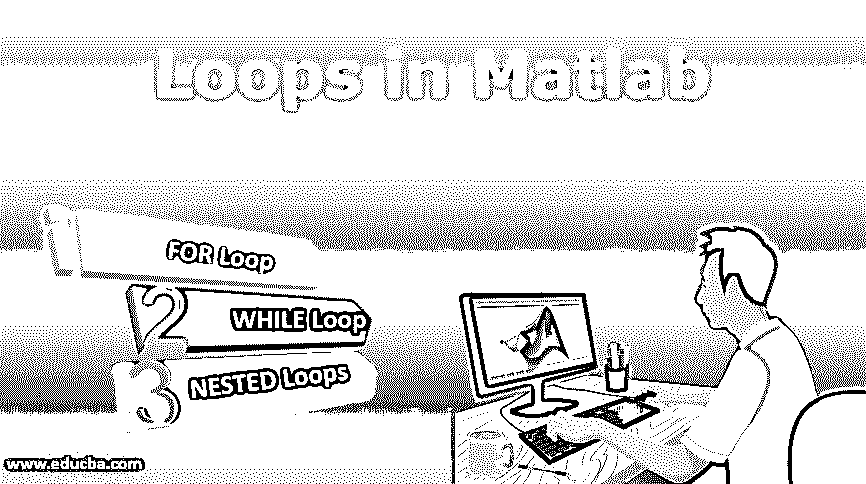
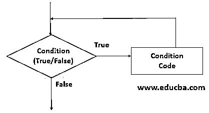
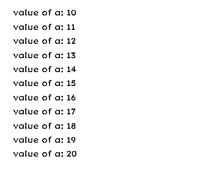
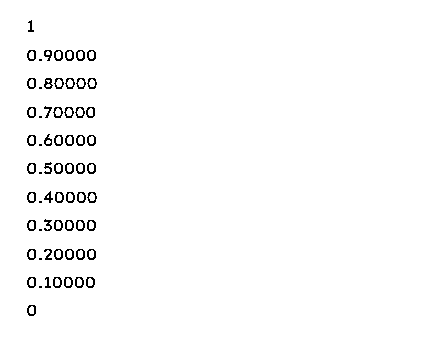
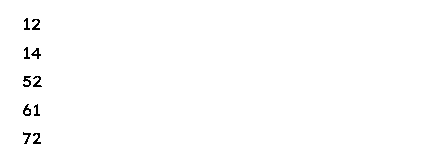
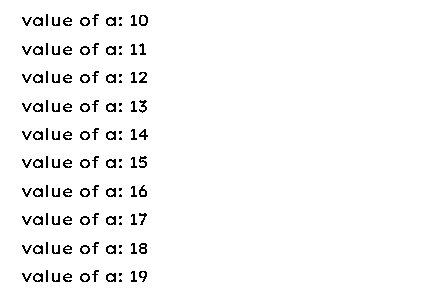
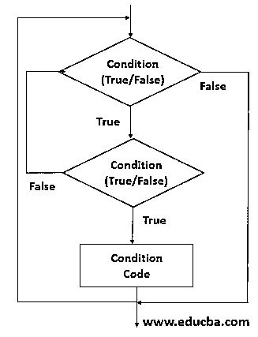
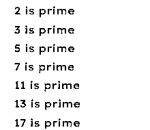

# Matlab 中的循环

> 原文：<https://www.educba.com/loops-in-matlab/>

## Matlab 中的循环介绍

在本文中，我们将学习 Matlab 中的循环。最初开发的重点是数学模拟，MATLAB 非常适合处理向量和矩阵中的静态数字数据。但它现在可以从平面文件、数据库、云存储、数据采集硬件甚至实时金融数据源中读取数据。MATLAB 在数据科学领域非常有能力，目前正被广泛应用于许多不同的行业。

在所有的计算机编程语言中，都存在一些用于重复执行指令的“循环”语句。更具体地说，循环允许编码器编写较短的代码，绕过某些重复代码集进入条件循环。本质上，循环是一组重复执行的指令，直到达到某个条件或只要满足某个条件。

<small>Hadoop、数据科学、统计学&其他</small>

### MATLAB 中的循环

MATLAB 使用 for 循环和 while 循环。还有嵌套循环，允许在一个循环中使用 for 或 while 循环。

#### FOR 循环

当一组指令要执行的迭代次数已知时，使用 FOR 循环。因此，只要满足某个条件，它就被用来重复执行代码。这个条件是在 FOR 循环开始时定义的，也称为 FOR 循环的初始化。MATLAB 中 for 循环的语法如下:

**语法:**

`for index = value
…
program statements
… ;
end`

值可以是下列形式之一:

##### 1.初始值:结束值

将索引变量从初始值到终值增加 1，并重复执行程序语句，直到索引大于终值。

`for a = 10:20
fprintf(‘value of a: %d\n’, a);
end`

**输出:**

##### 2.初始值:步骤:结束值:

在每次迭代中按步长值增加索引，或者当步长为负值时减少索引。

**代码:**

`for a = 1.0: -0.1: 0.0
disp(a);
end`

**输出:**

##### 3 .瓦尔基里

在每次迭代中，从数组 valArray 的连续列生成列向量索引。循环执行 n 次，n 是 valArray 的列数，由 numel(valArray，1，:)设置。输入 valArray 可以是任何 MATLAB 数据类型，包括单元数组、字符串或结构。

**代码:**

`for a = [12, 14, 52, 61, 72] disp(a);
end`

**输出:**

#### WHILE 循环

只要指定的条件为真，while 循环就会重复执行这些语句。while 循环的语法如下。

**语法:**

`while <condition>
…
program statement
… ;
end`

当结果不为空且包含所有非零元素(逻辑或实数值)时，条件为真。否则，条件为假。条件的比较值在开始 while 循环之前定义，比较条件在 while 循环初始化时设置。

例如，让我们采用与第一个 For 循环示例相同的条件。注意使用 while 循环时结构是如何变化的。

**代码:**

`a = 10;
while ( a < 20 )
fprintf(‘value of a: %d\n’, a);
a = a+1;
end`

这里，在开始循环之前设置“a”的初始值，并且在循环中设置的条件是“a”应该小于 20。然后‘a’增加 1，只要 a < 20，循环就重复。这是结果的显示方式，不同于 for 循环的结果。

**输出:**

因为在 a = 20 时，条件为假，所以不执行循环内的代码。因此，输出只显示从 10 到 19 的 a 值。

#### 嵌套循环

这意味着在另一个循环中使用一个循环。它可以在另一个 for 循环中使用一个 for 循环，或者在另一个 while 循环中使用一个 while 循环来创建复合语句。产生的循环必须满足两个条件。即首先检查外循环中的条件，如果为真，则检查第二个[嵌套循环中的条件](https://www.educba.com/nested-loop-in-matlab/)。这允许程序员完成比简单的数字或布尔测试更复杂的条件编程。

例如，显示 1 到 100 之间所有质数的程序如下。

**代码:**

`for i = 2:100
for j = 2:100
if (~mod(i,j))
break;
end
end
if (j > (i/j))
fprintf(‘%d is prime\n’, i);
end
end`

**输出:**

..依此类推，直到质数 97。

### Matlab 中的循环控制语句

控制语句是控制循环体执行的条件组合，直到指定的条件变为假。控制语句也指导循环的语法。例如，在 while 循环中，比较值是在循环初始化之前定义的，而在 For 循环中，值条件是在初始化循环时在 for 语句的中定义的。

最重要的是，循环控制语句用于控制循环的执行或改变正常命令序列的执行。MATLAB 支持两种特定的循环控制语句，即“break”语句和“continue”语句。这些命令在其他编程语言中也有类似的用法。

#### break 语句

break 命令终止 for 或 while 循环的执行。循环中在 break 语句之后编写的语句被跳过/不执行。在嵌套循环的情况下，break 只从遇到它的循环中退出。然后，控制在循环结束后传递给语句。

#### 连续语句

continue 命令用于将控制权交给循环的下一次迭代。continue 语句的工作方式类似于 break 语句。“continue”不是强制终止，而是跳过中间的任何代码，强制执行循环的下一次迭代。

### 结论

MATLAB 允许在代码中使用各种类型的循环来处理循环需求，包括:for 循环、while 循环和嵌套循环。还有特定的循环控制语句来控制这些循环的执行。为重复的语句创建循环是缩短最终代码的一个好方法。

### 推荐文章

这是一个 Matlab 循环指南。这里我们讨论各种类型的循环，包括:for 循环、while 循环和带有循环控制语句的嵌套循环。您也可以浏览我们的其他相关文章，了解更多信息——

1.  [PowerShell 中的循环](https://www.educba.com/loops-in-powershell/)
2.  [MATLAB 中的饼图](https://www.educba.com/pie-chart-in-matlab/)
3.  [Shell 脚本中最常见的三种循环类型](https://www.educba.com/loops-in-shell-scripting/)
4.  [c++中的嵌套循环指南](https://www.educba.com/nested-loop-in-c-plus-plus/)

