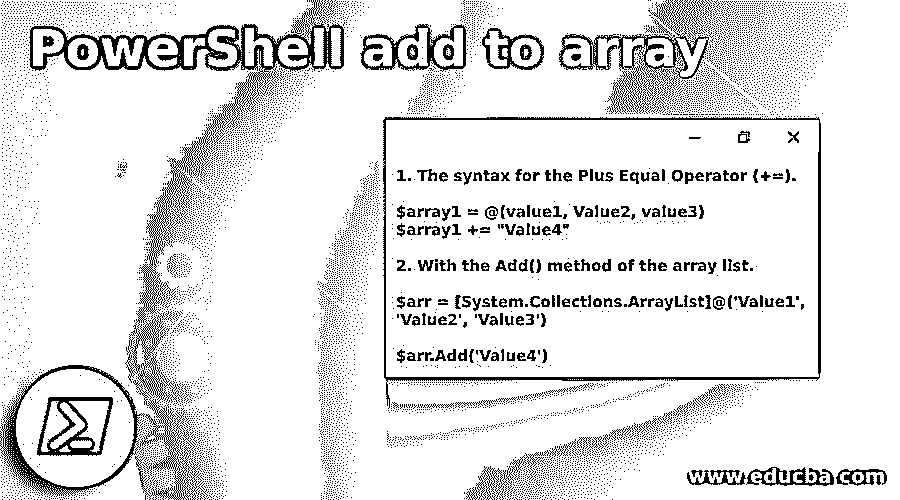
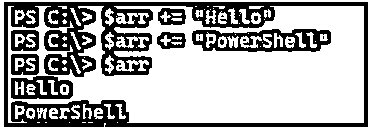
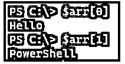
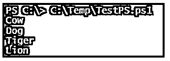
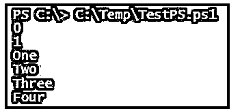
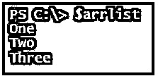
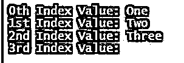
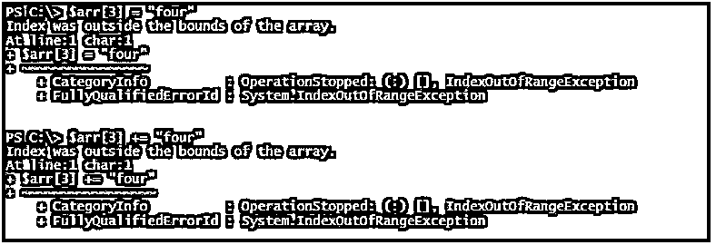

# PowerShell 添加到阵列

> 原文：<https://www.educba.com/powershell-add-to-array/>

## PowerShell 简介添加到阵列

PowerShell 数组是单一或不同数据类型的项的集合，方法 add to the array 是指在数组或数组列表的特定索引处添加新的项，使用不同的方法，如加号等号运算符(+=)或 add()方法，也可以将多个单一或不同数据类型的数组合并成一个数组，形成一个数组。

**语法:**

<small>Hadoop、数据科学、统计学&其他</small>

1.加号等于运算符(+=)的语法。

`$array1 = @(value1, Value2, value3)
$array1 += "Value4"`

2.用数组列表的 Add()方法。

`$arr = [System.Collections.ArrayList]@('Value1', 'Value2', 'Value3')
$arr.Add('Value4')`

### PowerShell 如何加入 array Works？

数组不仅在 PowerShell 中，而且在所有的编程语言中都有类似的结构，它工作在索引结构上。

下面是示例数组声明。

**代码:**

`$arr = @()`

让我们检查它的类型。

**代码:**

`$arr.GetType()`

**输出:**

它显示了基本类型系统。数组和 Object[]的名称意味着我们可以在数组中添加多个对象。

一旦我们声明了数组，如果我们需要向数组中添加值，我们可以使用下面两种方法。

**代码:**

`$arr += "Hello"
$arr += "PowerShell"
$arr`

**输出:**

如果我们在这里检查，它们都会在特定的索引处加 1。

**代码:**

`$arr[0] $arr[1]`

**输出:**

在索引 2 处不会有任何值，因为我们还没有添加它。

**代码:**

`$arr[2]`

**输出:**

我们可以使用的另一个方法是 Add()方法，但是它不适用于固定大小的数组。

**代码:**

`$arr.Add('Azure')`

**输出:**

PowerShell 数组的大小是固定的，所以在向列表中添加或移除数组时，会破坏现有的数组并创建一个新的数组，而固定大小的数组不允许使用 Add()或 Remove()方法；相反，我们可以使用+=(加等于)运算符进行添加，使用-=(减等于)运算符进行添加和删除操作。

检查数组是否有固定的大小。

**代码:**

`$arr.IsFixedSize`

**输出:**

同样，如果我们获取任何 cmdlet 输出，它将被存储为一个数组；而且永远是固定的大小。

**代码:**

`$ser = Get-Service
$ser.GetType()
$ser.IsFixedSize`

**输出:**

还有另一种方法可以把值添加到数组中，那就是使用 ArrayList。ArrayList 有一个不同的声明方法，如下所示。

**代码:**

`$arrlist = [System.Collections.ArrayList]@("Hello","PowerShell")
$arrlist`

**输出:**

如果我们检查这个数组列表的类型，它是 System.Object。

**代码:**

`$arrlist.GetType()`

**输出:**

ArrayList 允许使用 Add()方法将值添加到数组列表中。

**代码:**

`$arrlist.Add("Azure")`

我们可以在这里添加输出，因为数组列表不是固定大小的。

**代码:**

`$arrlist.IsFixedSize`

**输出:**

### PowerShell 添加到阵列的示例

以下是 PowerShell 添加到阵列的示例:

#### 示例#1

向数组中添加值。

在本例中，我们向数组$Animals 中添加了一只动物“Cow”。

**代码:**

`$Animals = @()
$Animals = "Cat" , "Dog" , "Tiger"
$Animals += "Cow"
$Animals
C:\Temp\TestPS.ps1`

**输出:**

#### 实施例 2

使用加法运算符合并两个数组。

这里，我们将使用'+'(加号)运算符将两个数组合并为一个空数组。

**代码:**

`$PetAnimals = @( "Cow" , "Dog" )
$WildAnimals = @( "Tiger" , "Lion" )
$Animals = @()
$Animals = $PetAnimals + $WildAnimals
$Animals`

**输出:**

#### 实施例 3

使用 Arraylist 添加值。

在下面的例子中，我们创建了一个数组列表并将两个值添加到列表中。

**代码:**

`$arrlist = New-Object -TypeName System.Collections.ArrayList
$arrlist.Add("One")
$arrlist.Add("Two")
$arrlist`

**输出:**

要添加更多的值，我们可以使用加号赋值'+= '方法或 add()方法，如下所示。

**代码:**

`$arrlist += "Three"
$arrlist += "Four"
$arrlist`

**输出:**

#### 实施例 4

使用循环添加数组值。

在本例中，我们将有一个列表来将数据输入到数组中，我们将使用 foreach 循环将值添加到数组中。

**代码:**

`$list = "One", "Two", "Three"
$arr = @()
foreach( $item in $list ){
$arr += $item
}
$arr`

**输出:**

使用 foreach 循环将值添加到 ArrayList 中。

**代码:**

`$list = "One", "Two", "Three"
$arrlist = New-Object -TypeName System.Collections.ArrayList
foreach( $item in $list ){
$arrlist.Add($item)
}
$arrlist`

**输出:**

#### 实施例 5

使用索引方法将值插入数组。

假设我们有下面的数组。

**代码:**

`$arr = @("One", "Two", "Three")`

下面是这个声明的数组的数组索引。

**代码:**

`Write-Output "0th Index Value: $($arr[0])"
Write-Output "1st Index Value: $($arr[1])"
Write-Output "2nd Index Value: $($arr[2])"
Write-Output "3rd Index Value: $($arr[3])"`

**输出:**

第三个索引是空的，因为我们还没有声明任何东西。所以，当我们试图把这个值加进去的时候，我们得到了下面的错误。

**代码:**

`$arr[3] = "four"`

或者

**代码:**

`$arr[3] += "four"`

**输出:**

因为索引对于数组或者类似的数组列表是未知的。此方法的变通方法是最初将空值分配给索引，但这将使固定大小的数组计数。

**代码:**

`$count = 5
$arr = @()
for($i=0; $i -lt $count; $i++){
$arr += ""
}`

我们为数组声明了 5 个索引，并为其分配了空值，因此它使得数组大小为 5，没有任何值，这是它的缺点。所以我们现在可以给它赋值了。

**代码:**

`$arr[0] = "One"
$arr[1] = "Two"
$arr[3] = "Four"
$arr`

**输出:**

请注意，索引 2 和 4 是空的。这种方法不合适。

#### 实施例 6

使用字符串数组添加主机文件条目。

此示例将在将输出检索到字符串数组后，将条目添加到宿主文件中。

**代码:**

`$hostfile = Get-Content C:\Windows\System32\drivers\etc\hosts
$hostfile += "8.8.8.8 Google.com"
$hostfile | Set-Content C:\Windows\System32\drivers\etc\hosts -Force`

### 结论

数组操作是 PowerShell 的重要组成部分，在处理成百上千的元素时，我们需要在数组列表或数组中添加或删除一些项目，在这种情况下，我们可以使用数组操作方法来添加数据。

### 推荐文章

这是 PowerShell 添加到阵列的指南。这里我们讨论引言；PowerShell 如何加入 array works？还有例子。您也可以看看以下文章，了解更多信息–

1.  [PowerShell 睡眠](https://www.educba.com/powershell-sleep/)
2.  [PowerShell 子串](https://www.educba.com/powershell-substring/)
3.  [PowerShell 不像](https://www.educba.com/powershell-not-like/)
4.  [否则如果在 PowerShell 中](https://www.educba.com/else-if-in-powershell/)

