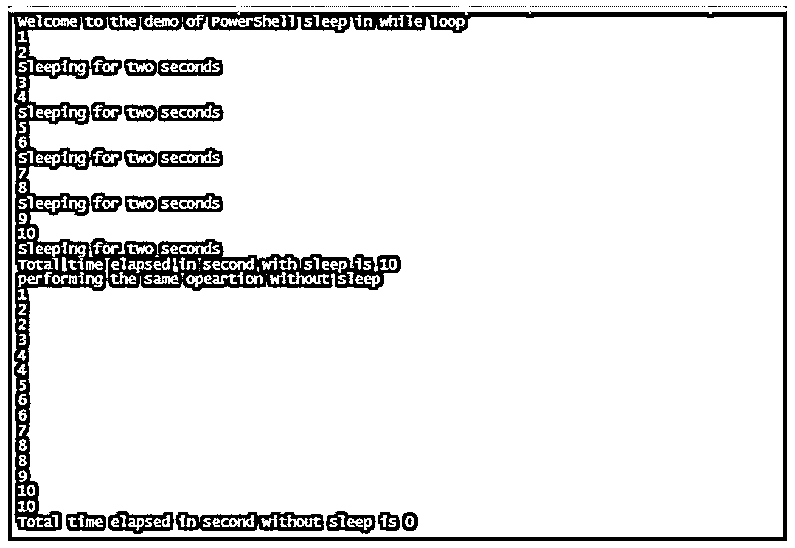
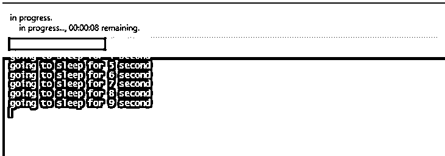

# PowerShell 睡眠

> 原文：<https://www.educba.com/powershell-sleep/>

## PowerShell 睡眠简介

有些场景要求脚本在继续执行之前暂停或停止一段时间。这种类型的需求是借助 PowerShell 中的 Start-Sleep cmdlet 来处理的。它的别名是睡眠。此 cmdlet 用于在指定的秒数内停止执行。这个 cmdlet 是最容易理解和执行的 cmdlet 之一，因为它只有两个参数。有许多可以使用此 cmdlet 的情况。但是，我们应该谨慎使用它，并且应该知道需要在 sleep cmdlet 中指定的准确时间范围，以便我们的操作成功。

**语法:**

<small>Hadoop、数据科学、统计学&其他</small>

以下是 Start-Sleep cmdlet 的语法:

**名称:**

开始睡眠

**语法:**

`Start-Sleep [-Seconds] <int>  [<CommonParameters>]`

`Start-Sleep -Milliseconds <int>  [<CommonParameters>]`

**别名:**

睡眠

**参数:**

*   **-毫秒:**这表示脚本或模块应该暂停的毫秒时间。它的缩写是 m，类型是 int。该参数的默认值是 none。它接受管道输入，但不接受通配符。
*   **-秒:**这表示脚本或模块应该暂停的时间，以秒为单位。它的缩写是 s，类型是 int。它的别名是 none。该参数的默认值为 none。它接受管道输入，但不接受通配符。

**举例:**

**代码:**

`Start-Sleep -Seconds 100 or Start-Sleep -s 100`

**输出:**

上述 cmdlet 将使会话挂起或暂停 100 秒。

**代码:**

`Start-Sleep -MilliSeconds 10000 or Start-Sleep -ms 10000`

**输出:**

上述 cmdlet 将使会话挂起或暂停 1000 秒。

### PowerShell 睡眠示例

下面是提到的例子:

#### 示例#1

**代码:**

`[int]$starttime = (Get-Date).Second
Write-Host "Welcome to the demo of PowerShell sleep"
Write-Host "Stopping the clock for five seconds"
Start-Sleep -Seconds 5
Write-Host "Stopping the clock for 10 seconds using alias"
Start-Sleep -s 10
Write-Host "Example of sleep using milliseconds"
Start-Sleep -MilliSeconds 100
[int]$endtime = (Get-Date).Second
Write-Host "Total time elapsed in second is" $($endtime - $starttime)`

**输出:**

#### 实施例 2

**代码:**

`[int]$starttime = (Get-Date).Second
Write-Host "Welcome to the demo of PowerShell sleep in while loop"
$test=0
while($test -ne 10)
{
$test++
Write-Host $test
if($test %2 -eq 0)
{
Write-Host "Sleeping for two seconds"
Start-Sleep -Seconds 2
}
}
[int]$endtime = (Get-Date).Second
Write-Host "Total time elapsed in second with sleep is" $($endtime - $starttime)
Write-Host "performing the same opeartion without sleep"
[int]$starttime = (Get-Date).Second
$test=0
while($test -ne 10)
{
$test++
Write-Host $test
if($test %2 -eq 0)
{
Write-Host $test
}
}
[int]$endtime = (Get-Date).Second
Write-Host "Total time elapsed in second without sleep is" $($endtime - $starttime)`

**输出:**

#### 实施例 3

**代码:**

`[int]$starttime = (Get-Date).Second
$fatherage = Read-Host "Enter your fathers age"
Start-sleep -Seconds 5
$motherage = Read-Host "Enter your mothers age"
Start-Sleep -Seconds 5
$yourage = Read-Host "Enter your age"
Start-Sleep -Seconds 5
$sistersage = Read-Host "Enter your sisters age"
Start-Sleep -Seconds 5
$avg=([int]$fatherage + [int]$motherage + [int]$sistersage +[int]$yourage)/4
Write-Host "the average age of your family is" $avg
[int]$endtime = (Get-Date).Second
Write-Host "Total time elapsed in second without sleep is" $($endtime - $starttime)`

**输出:**

#### 实施例 4

显示指示进度的状态栏。

**代码:**

`[int]$starttime = (Get-Date).Second
Write-Host "Welcome to the demo of start-sleep"
Function Start-Sleep($seconds)
{
$dt = (Get-Date).AddSeconds($seconds)
while($dt -gt (Get-Date))
{
$secondsLeft = $dt.Subtract((Get-Date)).TotalSeconds
$per = ($seconds - $secondsLeft) / $seconds * 100
Write-Progress -Activity "in progress" -Status "in progress..." -SecondsRemaining $secondsLeft -PercentComplete $per
[System.Threading.Thread]::Sleep(500)
}
Write-Progress -Activity "in progress" -Status "in progress..." -SecondsRemaining 0 -Completed
}
Write-Host "going to sleep for 1 second"
Start-Sleep 1
Write-Host "going to sleep for 2 second"
Start-Sleep 2
Write-Host "going to sleep for 3 second"
Start-Sleep 3
Write-Host "going to sleep for 4 second"
Start-Sleep 4
Write-Host "going to sleep for 5 second"
Start-Sleep 5
Write-Host "going to sleep for 6 second"
Start-Sleep 6
Write-Host "going to sleep for 7 second"
Start-Sleep 7
Write-Host "going to sleep for 8 second"
Start-Sleep 8
Write-Host "going to sleep for 9 second"
Start-Sleep 9
Write-Host "going to sleep for 10 second"
Start-Sleep 10
[int]$endtime = (Get-Date).Second
Write-Host "Total time elapsed in second without sleep is" $($endtime - $starttime)`

**输出:**

#### 实施例 5

等待用户输入参数。

**代码:**

`[int]$starttime = (Get-Date).Second
Write-Host "Welcome to the demo of start-sleep"
Function Start-Sleep($seconds)
{
$dt = (Get-Date).AddSeconds($seconds)
while($dt -gt (Get-Date))
{
$secondsLeft = $dt.Subtract((Get-Date)).TotalSeconds
$per = ($seconds - $secondsLeft) / $seconds * 100
Write-Progress -Activity "in progress" -Status "in progress..." -SecondsRemaining $secondsLeft -PercentComplete $per
[System.Threading.Thread]::Sleep(500)
}
Write-Progress -Activity "in progress" -Status "in progress..." -SecondsRemaining 0 -Completed
}
$sname=Read-Host "Enter student name"
Start-Sleep 2
while($sname -eq $null -or $sname -eq "")
{
$sname=Read-Host "Enter student name"
Start-Sleep 2
}
$sage=Read-Host "Enter student age"
Start-Sleep 2
while($sage -eq $null -or $sage -eq "")
{
$sage=Read-Host "Enter student age"
Start-Sleep 2
}
$smarks1=Read-Host "Enter marks in history"
Start-Sleep 2
while($smarks1 -eq $null -or $smarks1 -eq "")
{
$smarks1=Read-Host "Enter marks in history"
Start-Sleep 2
}
$smarks2=Read-Host "Enter marks in bio"
Start-Sleep 2
while($smarks2 -eq $null -or $smarks2 -eq "")
{
$smarks2=Read-Host "Enter marks in bio"
Start-Sleep 2
}
$smarks3=Read-Host "Enter marks in phy"
Start-Sleep 2
while($smarks3 -eq $null -or $smarks3 -eq "")
{
$smarks3=Read-Host "Enter marks in phy"
Start-Sleep 2
}
Write-Host "Student details are as follows"
$avg=([int]$smarks1+[int]$smarks2+[int]$smarks3)/3
Write-Host "Student name is:" $sname "`t Students age is:" $sage "`t students avg is:"$avg`

**输出:**

### 结论

因此，这里我们看到了关于 start-sleep cmdlet 的详细信息。它解释了从参数，它们的数据类型到它们的默认值。它还通过示例展示了如何使用别名值调用 cmdlet 及其参数。它演示了 Start-sleep cmdlet 在许多场景中的使用，比如在 while 循环中等待值，除非用户提供值，否则要求用户输入，等等。

### 推荐文章

这是 PowerShell 睡眠指南。这里我们分别讨论 PowerShell Sleep 的介绍和示例。您也可以看看以下文章，了解更多信息–

1.  [Windows PowerShell ISE](https://www.educba.com/windows-powershell-ise/)
2.  [PowerShell 发送邮件](https://www.educba.com/powershell-send-mail/)
3.  [PowerShell 字符串替换](https://www.educba.com/powershell-string-replace/)
4.  [PowerShell 获取服务](https://www.educba.com/powershell-get-service/)

