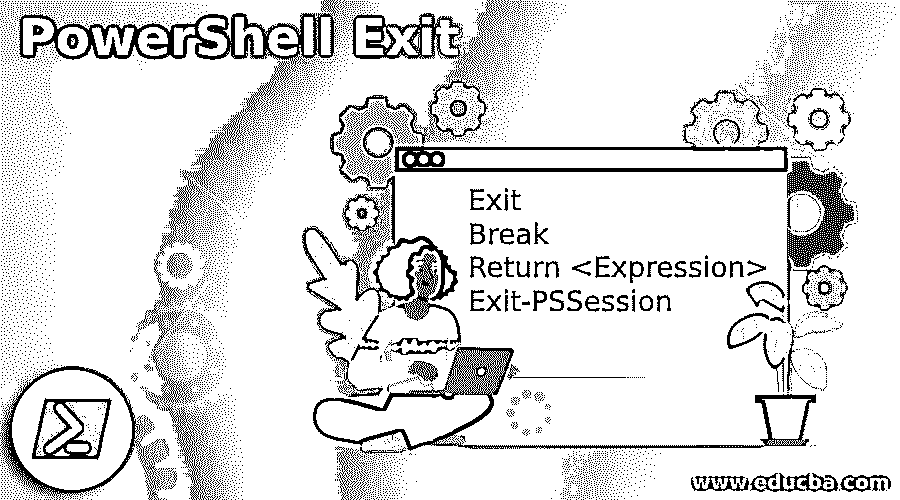
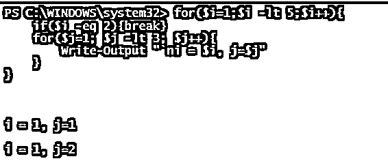
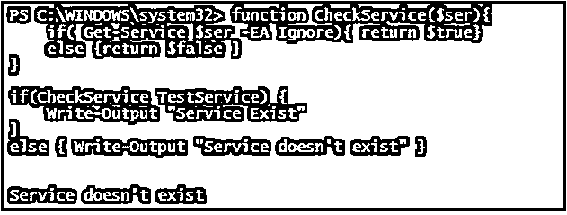

# PowerShell 出口

> 原文：<https://www.educba.com/powershell-exit/>

## PowerShell 出口的定义

PowerShell 出口函数或 cmdlets 是脚本或函数终止符。在 PowerShell 中使用 Exit 函数并不总是终止控制台，这取决于脚本中使用的命令和作用域，因为相同的命令可以终止控制台，相同的命令可以终止函数，或者在不同的作用域中使用脚本，Exit cmdlet 对于退出远程 PowerShell 会话也很有用。

**语法**

<small>Hadoop、数据科学、统计学&其他</small>

少数 cmdlets 用作 PowerShell 的退出函数，如下所示。

*   出口
*   破裂
*   返回
*   出口压力

### PowerShell 中的退出功能是如何工作的？

PowerShell 中出口函数的工作方式如下所示:

#### 1.退出关键字

PowerShell Exit 关键字应该小心使用，因为它可以终止函数、控制台甚至编辑器。如果在函数和主脚本中使用了 Exit 关键字，它将关闭所有内容，如果在使用 Exit 关键字之前没有存储输出，您可能没有机会在控制台中看到输出。

`Function ExitTest{
Write-Output "This is written on console but it terminates abruptly"
}
ExitTest  #Calling function
Exit`

您看不到上面的输出，因为只要您运行该命令，它就会终止脚本。您可以使用 Sleep 命令更多秒(10 秒或更多)或暂停几秒钟来查看输出。

当 Exit 关键字在函数中使用并保存在脚本中时，一旦从控制台执行脚本，它将终止函数和脚本，但不会关闭控制台，如下例所示。

`Function ExitTest{
Write-Output "This will be displayed"
Exit
}
ExitTest  #Calling function`

写输出“这不会显示，但控制台不会关闭”

**输出:**

#### 2.Break 关键字

break 关键字用于循环(For、foreach、while、do-while 等..)退出当前控制循环。这个 Break 语句也与 Switch 语句一起使用。

当 break 语句用于单个循环时，它会在执行 Break 语句时退出整个循环。

`for($i=1; $i -lt 10; $i++){
if($i -eq 5) { break }
$i
}`

在上面的例子中，当变量$i 的值变为 5 时，它执行 Break 语句，并且循环的循环主 For 循环被终止。输出如下所示。

**输出:**

让我们以嵌套循环为例。在下面的示例中，当$i 变量的值变为 2 时，将执行 break 语句。

`for($i=1;$i -lt 5;$i++){
for($j=1; $j -lt 3; $j++){
if($i -eq 2){break}
Write-Output "`ni = $i, j=$j"
}
}`

**输出:**

在上面的例子中，当执行内部循环($j loop)并且它有一个 break 语句时，它只中断输出中所示的当前控制循环，当 **$i** 变量值变为 2 时，它中断 **$j** 循环。

如果我们将 break 语句放在外面，它将中断两个循环，如下所示。

`for($i=1; $i -lt 5 ;$i++) {
if($i -eq 2) { break }
for($j=1; $j -lt 3; $j++){
Write-Output "`ni = $i, j=$j"
}
}`

**输出:**

#### 3.返回关键字

return 语句并不终止循环或脚本，而是重定向并返回到调用它的地方。当从控制台调用 return 语句时，它不会返回到另一个点，而只是打印值。

`return "Hello world"`

**输出:**

当从脚本中调用它时，它从调用它的地方保存原始点的状态，并再次返回到该点。

`function CheckService($ser) {
if( Get-Service $ser -EA Ignore){ return $true}
else {return $false }
}
If( CheckService TestService ) {
Write-Output "Service Exist"
}
else { Write-Output "Service doesn't exist" }`

**输出:**

在上面的例子中，如果服务可用，名为 CheckService 的函数名返回 true，否则返回 false。

### PowerShell 出口示例

下面是一些例子:

#### 示例#1

**使用睡眠命令退出控制台**

在本例中，我们将使用带有 Sleep 函数的 Exit 命令，以便脚本在几秒钟后终止。

**代码:**

`$i = 0
While($true){
$i
if($i -eq 10){
Write-Output "Console is terminating in 3 seconds"
sleep 3
Exit
}
$i++
}`

这里，在无限循环中，如果$i 变量的值达到 10，它会在 3 秒后自动关闭控制台。

#### 实施例 2

**使用 Break 语句退出 While 循环。**

此示例检查服务器 LabMachine2k16 在重新启动后是否在线，并持续测试连接，直到服务器启动，一旦服务器启动，它就使用 break 命令退出循环。

**代码:**

`$Computer = "LabMachine2k16"
while($true){
if( Test-Connection -ComputerName $Computer -Count 2 -Quiet -EA Ignore  ){
Write-Output "Server is online"
Break
}
else{
Write-Output "Server is not online yet"
}
}`

**输出:**

#### 实施例 3

**使用 Break 语句退出开关块**

我们也可以对开关块使用 Break 命令。举个例子，

**代码:**

`$color = Read-Host "Enter Color name "
switch($color){
"Red"{
Write-Output "Red color selected"
Break
}
"Yellow"{
Write-Output "Yellow color selected"
Break
}
Default{
Write-Output "No matching color selected"
Break
}
}`

**输出:**

一旦输入了颜色名称，就会执行 switch 块并用 Break 语句终止。

#### 实施例 4

**使用 Return 语句返回值进行调用。**

在这个例子中，两个值在函数中相乘，输出返回给主调用。

**代码:**

`Function Multiplication($a,$b){
return $a*$b
}
$out = Multiplication 5 10
Write-Output "Multiplication: $out"`

**输出:**

#### 实施例 5

**使用 Exit-Ps Session 命令退出远程会话**

Exit-PSSession 用于终止远程连接的会话。但是，这不能在 PowerShell 脚本内部使用，它是一个交互方法。以下命令在 PS 控制台上逐一执行。

**代码:**

`Enter-PSSession LabMachine2k16  #Enters into PS Remote Session
Write-Output "My HostName is $($env:COMPUTERNAME)"
Exit-PSSession`

**输出:**

### 结论

有各种退出命令可用于退出控制台、终止循环或返回控制台的原点，使用哪条语句取决于您希望脚本生成输出或脚本终止的方式。

### 推荐文章

这是 PowerShell 退出指南。在这里，我们还将讨论 PowerShell 中出口函数的定义和工作方式。以及不同的示例及其代码实现。您也可以看看以下文章，了解更多信息–

1.  [从 cmd 启动 PowerShell】](https://www.educba.com/start-powershell-from-cmd/)
2.  [PowerShell 匹配](https://www.educba.com/powershell-match/)
3.  [PowerShell JSON 格式](https://www.educba.com/powershell-json-format/)
4.  [Powershell 复制文件](https://www.educba.com/powershell-copy-file/)

