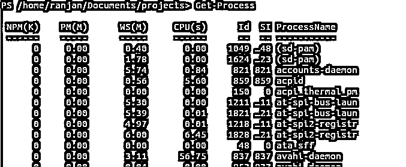
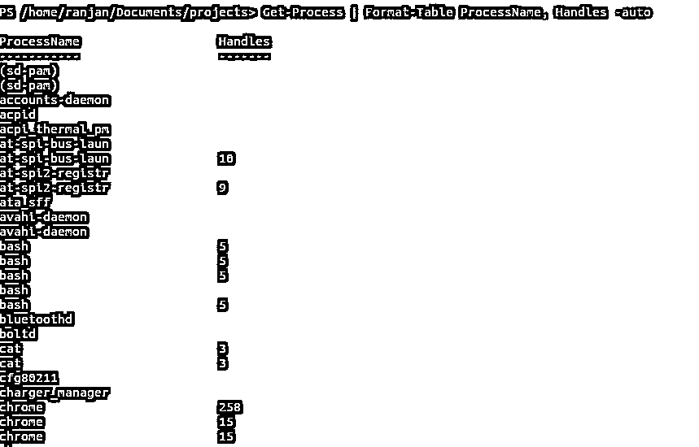
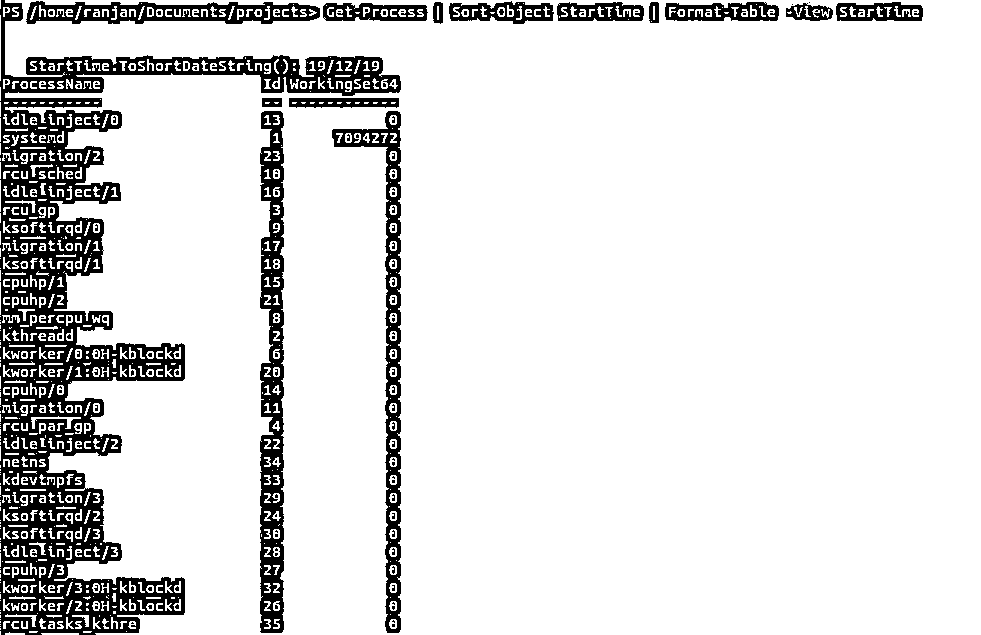
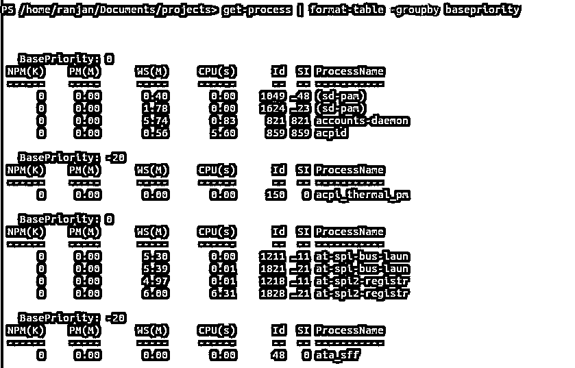
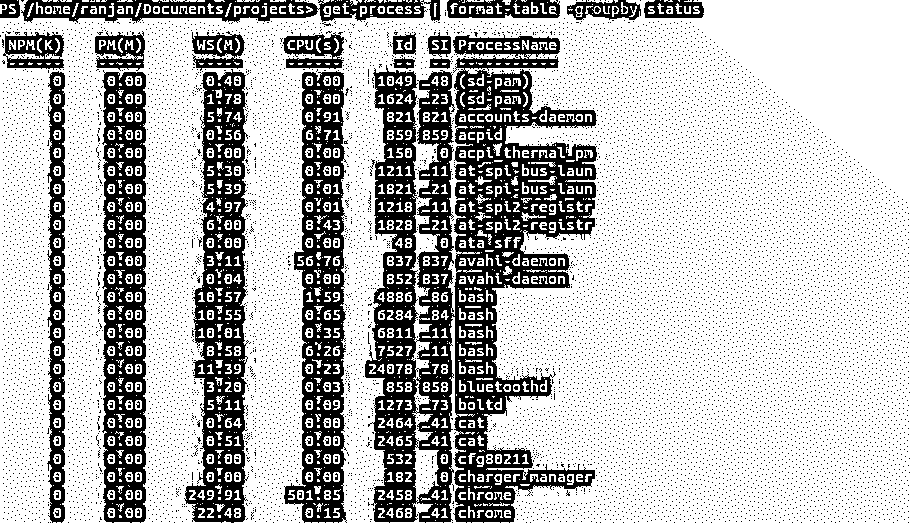
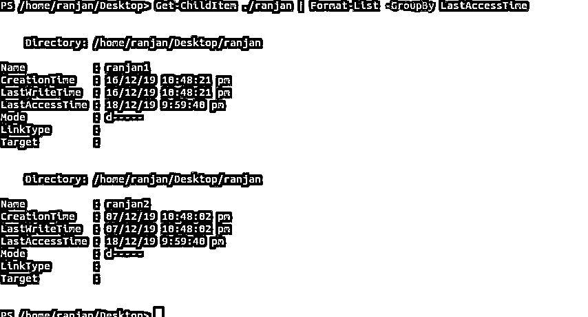
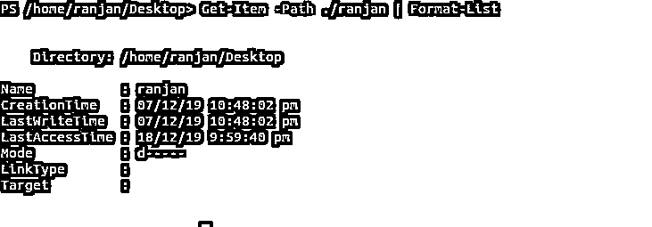
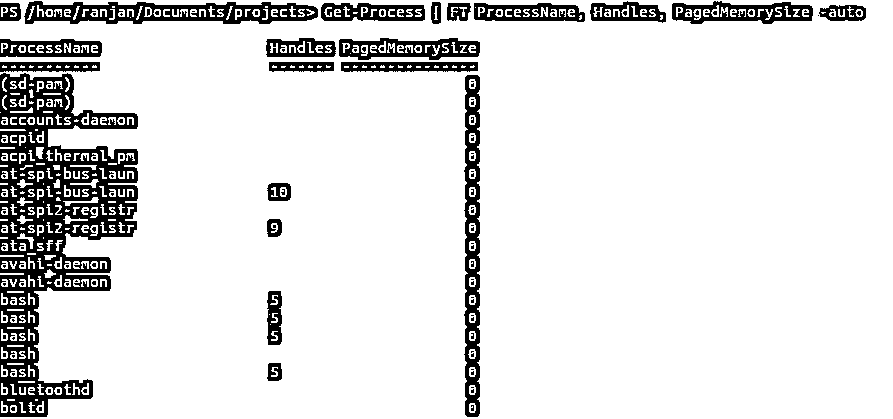

# PowerShell 格式表

> 原文：<https://www.educba.com/powershell-format-table/>

## PowerShell 格式表简介

我们有许多命令来查看不同类型的输出，但是如果我们需要某种更易读、更易理解的输出格式，该怎么办呢？因此，我们可以使用 Powershell Format-Table，这个命令以我们需要的格式显示输出。让我们举一个例子，假设我们要显示特定的列名，如名称、日期和 CPU 等，那么我们将使用命令 Format-Table。像 Get-process 这样的普通命令会显示您可能不需要的所有列**、**，但是 Get-process 和命令 Format-Table 命令只会给出我们需要的特定列。因此，借助格式-表格命令，我们可以只排列和显示那些必须看到的列。当我们希望只显示有限的细节以使输出更加清晰时，这个命令非常有用。在示例中，我们将看到各种类型的使用和情况，我们可以使用格式表命令来自定义输出格式。

### 如何在 PowerShell 中格式化表格？

请参阅下面我们用来格式化输出的语法。

<small>Hadoop、数据科学、统计学&其他</small>

**语法:**

`Format-Table
[-AutoSize(auto adjust output)] [-RepeatHeader(After each new screen show header for clarity)] [-HideTableHeaders(Delete the column overlapping from output structure)] [-Wrap(Show the details in the next line if it exceed column width)] [[-Property] <Show the object properties>] [-GroupBy <here we can group output in another table based on the properties .>] [-View <allow us for custom table>] [-ShowError(just to send error in Pipeline)] [-DisplayError(show error on command line)] [<CommonParameters>]`

当我们在那时编写非常大的脚本时，我们希望看到最少的列以便更好地理解，而不是显示所有的内容。在下面的示例中，我们首先执行 Get-Process 命令，以查看整个流程及其所有其他属性和输出，我们将 PM(K)、PM(M)、WS(M)、CPU(s)、ID、SI、Processname 作为列。这里我们可以看到 Get-Process 正在显示流程的每个属性，你可能无法理解每个属性。

`Get-Process`

**输出:**

但是这个输出有点混乱，因为它显示了所有的列。让我们假设我们只对 ProcessName 字段感兴趣，而不是什么？这里我们将使用 Format-Table 命令来获取我们正在寻找的特定列。让我们为它写一个例子。参见下面的例子。

`Get-Process | Format-Table ProcessName, Handles -auto`

**输出:**

在上面的例子中，我们只显示了 ProcessName。您可以编写自己的命令来仅获取进程 Id 或 CPU 详细信息。

### PowerShell 格式表示例

以下是 PowerShell 格式表的示例:

#### 示例#1

我们已经讨论了使用格式-表格命令的各种方法，现在让我们探索更多的关于它的实用工具。假设我们想得到一个格式化的表，按开始日期排序。您可以查看屏幕输出以供参考。在这里，我们得到了系统中所有可用的进程，并按照它们的开始时间进行了排序。

`Get-Process | Sort-Object StartTime | Format-Table -View StartTime`

**输出:**

#### 例#2

如果我们想在显示错误的同时看到今天的日期。很多时候，为了更好地理解错误，我们可以使用这个命令。

`Get-Date | Format-Table DayOfWeek,{ $_ / $null } -DisplayError`

**输出:**

输出显示在星期四以及#ERR 列。你也可以试试。根据运行该命令的日期，您将得到不同的输出。如果预期会给出一些错误的输出，那么这些实践是很好的。

#### 实施例 3

很多时候我们想在 group by 中看到我们的输出，例如，假设你想看到 all group by 一个非活动的进程杀死它们或者所有的进程在同一个 group by 日期开始，或者你可能需要看到所有的进程在 group by basepriority 的基础上。让我们看看下面的例子。在这个例子中，我们通过 basepriority 格式化我们的输出组。

`get-process | format-table -groupby basepriority`

**输出:**

让我们看另一个 group by 的例子，其中我们按状态显示所有的输出组。请随屏幕一起看下面的例子。您可以根据服务的属性尝试更多分组方式。总是提出一个问题，为什么你需要这个命令。假设您的应用程序运行非常缓慢，因为有许多不活动的进程。因此，您可以编写一个命令 group buy status 并终止所有不活动的进程，以提高您的系统性能。

`get-process | format-table -groupby status`

**输出:**

Group by 也可以用于文件和文件夹系统，例如，假设您想以上次使用的格式化方式查看所有文件，group by last modified。在这里，我们将 LastAccessTime 作为参数传递给 Group by。让我告诉你一个例子，假设你有一个文件夹，其中有 1000 个文件，这些文件是每天创建的，现在如果你想看到新创建或修改的文件按特定日期分组，那么使用 group by 命令将非常容易。请参考以下屏幕示例。

`Get-ChildItem ./ranjan | Format-List -GroupBy LastAccessTime`

**输出:**

#### 实施例 4

让我们编写一个命令，在新的一行中显示文件夹的所有属性。请看下面的例子，我们正在格式化 ranjan 文件夹的输出，所有的输出都在新行中。在这里，我们还可以定义或限制新行中显示的列数。

`Get-Item -Path ./ranjan | Format-List`

**输出:**

#### 实施例 5

您也可以在 PowerShell 中使用 alias，例如在 PowerShell 中编写格式表。在简短形式中，我们可以编写 FT。让我告诉你一个例子，我们将使用别名 FT。在下面的例子中，我们使用 FT 来获取只有三列的所有进程，即 processName、Handle 和 PagedMemorySize。如果你正在写一个大的脚本，它会很有用，你可以用一个较小的名字使你的脚本变小。

`Get-Process | FT ProcessName, Handles, PagedMemorySize -auto`

**输出:**

#### 实施例 6

我们还可以在多列中显示输出。这里我们有一个命令叫做全格式(fw)。如果您要用一个很长的列表显示输出，但是这个长列表只包含一个字段，那么这个命令会很有用。

`Get-Process | Get-Member -Membertype method | Format-Wide name -column 3`

**输出:**

### 结论

当我们有一个非常大和复杂的输出格式时，格式表非常有用，在这种情况下，我们可以定义自己的格式来缩小或修改输出格式，以便更好地理解。

### 推荐文章

这是 PowerShell 格式表的指南。在这里，我们将讨论简介以及如何在 PowerShell 中格式化表格，并给出示例。您也可以阅读以下文章，了解更多信息——

1.  [在 PowerShell 中实现 Remove-Item 的示例](https://www.educba.com/powershell-remove-item/)
2.  [PowerShell 字符串函数的工作方式](https://www.educba.com/powershell-string-functions/)
3.  [不同 PowerShell 工具指南](https://www.educba.com/powershell-tools/)
4.  [学习 PowerShell Get-Location 的参数](https://www.educba.com/powershell-get-location/)
5.  [实现 PowerShell Get-Date 的示例](https://www.educba.com/powershell-get-date/)
6.  [PowerShell 崩溃的 8 大例子](https://www.educba.com/powershell-break/)
7.  [PowerShell Get-Item |示例](https://www.educba.com/powershell-get-item/)

