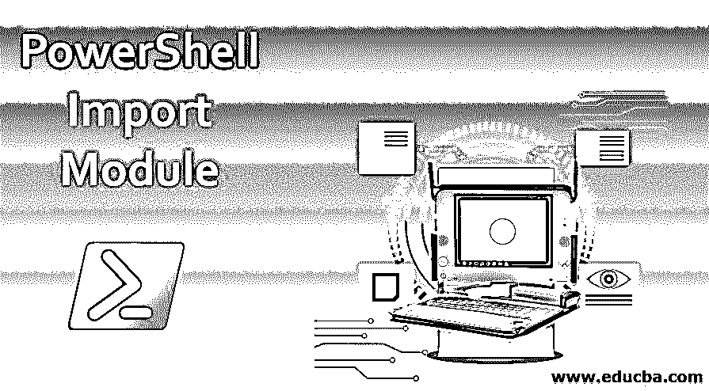
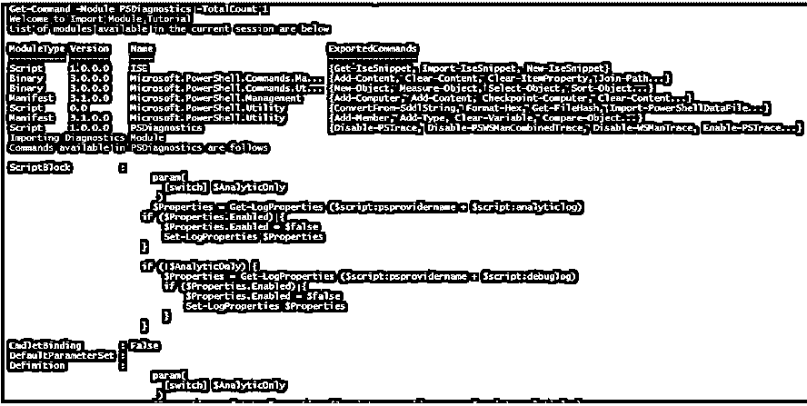
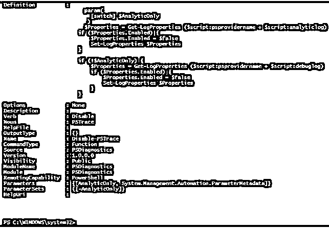
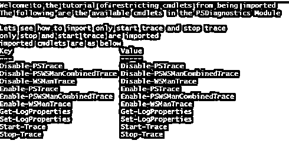
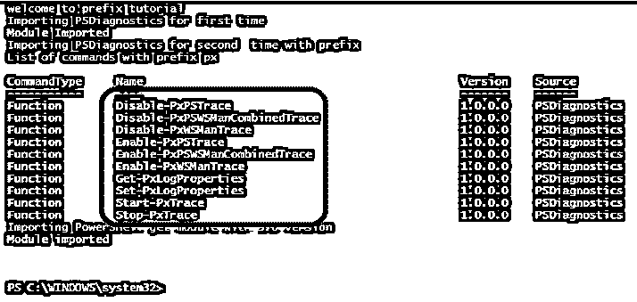

# PowerShell 导入模块

> 原文：<https://www.educba.com/powershell-import-module/>

## PowerShell 导入模块简介

模块是放在一起作为一个包的 cmdlets、变量、函数和工作流的集合。PowerShell 版本 2 首次引入了模块。模块通常存储在以下两个主要位置。在本主题中，我们将了解 PowerShell 导入模块。

*   % windir % \ system32 \ windows powershell \ v 1.0 \ Modules 这是可供系统中任何用户使用的系统级模块的位置。
*   % user profile % \ Documents \ windows powershell \ Modules

每个模块都有一个专门的文件夹来保存。它还包含一个名为模块清单的 psd1 文件。清单文件包含模块的设置，如 PowerShell 的版本、作者和其他设置。通过运行 Get-Module -ListAvailable cmdlet 可以获得可用模块的列表。

<small>Hadoop、数据科学、统计学&其他</small>

### 导入模块

可以使用 Import-Module cmdlet 在会话中导入模块。对于要导入的模块，它必须存在于系统或远程服务器上。从 PowerShell 3.0 开始，首次运行已安装模块中的任何 cmdlet 时，会自动导入模块。$PSModuleAutoloadingPreference 首选项变量用于启用或禁用模块的自动导入。默认情况下，import-Module cmdlet 导入所有成员，这可以通过使用别名或变量参数来限制。

**导入模块的语法**

以下是导入模块 Cmdlet 的语法

### 因素

有许多参数与导入模块 Cmdlet 相关联，下面将讨论一些常用的参数。

#### 1.别名

这表示将从模块导入当前会话的别名列表。有些模块默认自动导出选中的别名。它的类型是字符串，默认值是 none。它不接受管道输入和通配符。这是一个可选参数。

#### 2.名字

这是一个强制参数。这表示要导入的模块的名称。该名称可以表示模块或模块内的文件，如 dll 或. ps1 文件。总是使用模块名是明智的。它的类型是字符串。默认值为无。它接受管道输入和通配符。

#### 3.前缀

这指定了将添加到导入的模块成员名称的前缀。这会影响当前会话中的模块成员。它的类型是字符串，默认值是 none。它不接受管道输入和通配符。

#### 4.所需版本

它表示需要导入的模块的版本，如果指定的版本不可用，则会引发错误。其类型为 version，默认值为 none。它不接受管道输入和通配符。

#### 5.范围

它表示必须导入模块的范围。它可以是全局的，也可以是本地的。在全局中，它可用于会话中的所有命令，而在局部中，它仅用于当前范围。它的类型是字符串，默认值是 none。它不接受管道输入和通配符。

#### 6.可变的

它表示需要从模块导入当前会话的变量列表。它的类型是字符串，默认值是 none。它不接受管道输入，但接受通配符。

### 例子

下面是下面提到的 PowerShell 导入模块的例子

#### 示例#1

导入模块并获取模块中的命令

**输入:**

`Write-Host "Welcome to Import Module Tutorial" -ForegroundColor Green
Write-Host "List of modules available in the current session are below" -ForegroundColor Green
Get-Module -All
Write-Host "Importing Diagnostics Module" -ForegroundColor Green
Import-Module -Name PSDiagnostics
Write-Host "Commands available in PSDiagnostics are follows" -ForegroundColor Green
Get-Command -Module PSDiagnostics -TotalCount 1`

**输出:**

#### 实施例 2

导入模块和删除模块以及使用 verbose:

verbose 参数用于列出正在导入的模块中可用的各种脚本、函数、变量和工作流。

**输入:**

`Write-Host "Welcome to verbose and removal of module tutorial" -ForegroundColor Green
Write-Host "Importing Diagnostics Module with verbose parameter" -ForegroundColor Green
Import-Module -Name PSDiagnostics -Verbose
Write-Host "Removing the module from the current session" -ForegroundColor Green
Remove-Module -Name PSDiagnostics
Write-Host "Successfully remove the Module"`

**输出:**

#### 实施例 3

限制正在导入的成员:

如上所述，可以限制模块成员的导入。一个模块可以有 100 个命令和功能。当只有少数几个将被使用时，不建议将它们全部导入。最好只导入需要的成员，而不是全部导入。下面的示例显示了如何限制成员。

**输入:**

`Write-Host "Welcome to the tutorial of restricting cmdlets from being imported" -ForegroundColor Green
Write-Host "The following are the available cmdlets in the PSDiagnostics Module" -ForegroundColor Green
(Get-Module PSDiagnostics).ExportedCommands
#mention only start and stop to be imported
Write-Host "Lets see how to import only start the trace and stop trace" -ForegroundColor Green
Import-Module PSDiagnostics -Function Start-Trace , Stop-Trace
Write-Host "only stop and start trace are imported" -ForegroundColor Green
Write-Host "imported cmdlets are as below" -ForegroundColor Green
Get-Command -Module PSDiagnostics`

**输出:**

#### 实施例 4

重新导入模块，添加前缀并仅检索模块的指定版本:

**输入:**

`Write-Host "welcome to prefix tutorial" -ForegroundColor Green
Write-Host "Importing PSDiagnostics for first time" -ForegroundColor Green
Import-Module PSDiagnostics
Write-Host "Module Imported"
Write-Host "Importing PSDiagnostics for second  time with prefix" -ForegroundColor Green
Import-Module PSDiagnostics -Force -Prefix Px
Write-Host "List of commands with prefix px" -ForegroundColor Green
Get-Command -Module PSDiagnostics
Write-Host "Importing PowerShell get module with 3.0 version" -ForegroundColor Green
Import-Module -Name PowerShellGet -MinimumVersion 3.0.0
Write-Host "Module imported"`

**输出:**

在下面突出显示的区域显示了前缀。

### 结论–PowerShell 导入模块

因此，本文详细介绍了关于导入模块 Cmdlet 的详细内容。它还解释了如何导入模块、导入模块的各种方法、过滤需要导入的命令和函数以及适当的示例。要深入了解 cmdlet，建议创建示例程序，并享受围绕它们工作的乐趣。

### 推荐文章

这是 PowerShell 导入模块指南。这里我们讨论 PowerShell 导入模块的例子以及语法和参数。你也可以看看下面这篇文章。

1.  [PowerShell 设置-内容](https://www.educba.com/powershell-set-content/)
2.  [PowerShell 排序对象](https://www.educba.com/powershell-sort-object/)
3.  [PowerShell 中的哈希表](https://www.educba.com/hashtable-in-powershell/)
4.  [PowerShell 新项目完整指南](https://www.educba.com/powershell-new-item/)
5.  [如何实现 PowerShell Rename-Item？](https://www.educba.com/powershell-rename-item/)
6.  [Python 导入模块|示例](https://www.educba.com/python-import-module/)
7.  [PowerShell 转换为字符串|参数和示例](https://www.educba.com/powershell-convert-to-string/)

