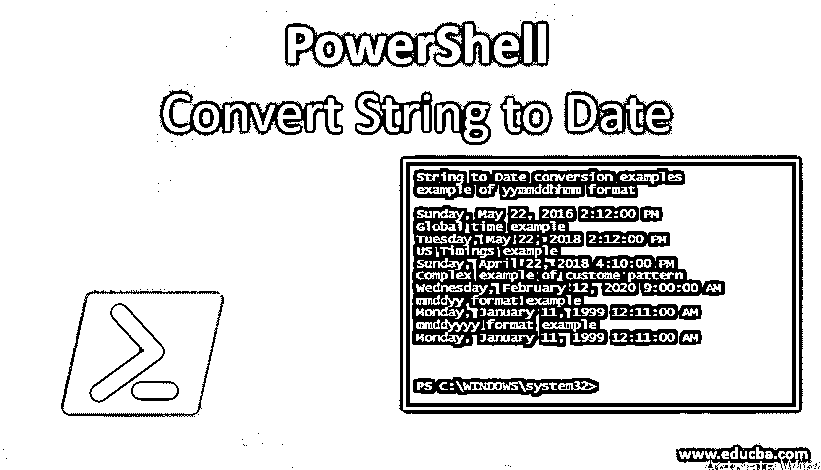
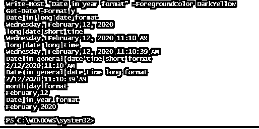
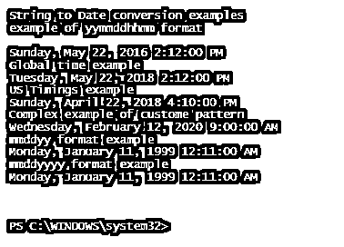

# PowerShell 将字符串转换为日期

> 原文：<https://www.educba.com/powershell-convert-string-to-date/>

## PowerShell 将字符串转换为日期简介

在许多情况下，可能需要将字符串转换为日期变量或日期时间对象。在 PowerShell 中，这可以通过多种方式实现。实现这一点的一些方法包括使用类型转换、获取美国格式的日期、使用日期时间解析。许多用途都需要这种转换，比如将字符串对象发送到 DB 表，因此当用户输入的内容是以字符串格式接收的，然后需要进行格式化以便进一步处理时，就需要进行转换。本文将详细介绍将字符串对象转换为日期时间对象的各种方法。

**语法:**

<small>Hadoop、数据科学、统计学&其他</small>

下面是日期时间解析的语法:

`[Datetime]::ParseExact('07/15/2019', 'MM/dd/yyyy', $null)`

其中，第一个参数是需要转换的字符串，第二个参数是要生成的日期的格式，第三个参数是空字符。

**代码:**

`Write-Host "Welcome to string to date conversion example"
$string='11/11/2019'
Write-Host "The variable type now is" $string.GetType()
$string=[Datetime]::ParseExact($string, 'MM/dd/yyyy', $null)
Write-Host "After conversion the type is" $string.GetType() "and the value is" $string`

**输出:**

### PowerShell 中可用的日期格式类型

在了解将字符串转换为数据对象的各种方法之前，了解 PowerShell 中可用的各种日期类型是很重要的。这将有助于转换。

以下是 PowerShell 中可用的各种日期格式。

**d:** 表示短日期

**D:** 表示长日期

**f:** 表示长日期，短时间

**F:** 表示长日期，长时间

**t:** 表示短时间格式

**T:** 表示长时间格式

**m，M:** 月日格式

**g:** 表示通用数据时间短格式

**G:** 表示通用数据时间长格式

**Y 或 y:** 表示年月模式

### PowerShell 将字符串转换为日期的示例

以下是 PowerShell 的示例:

#### 示例#1

**代码:**

`Write-Host "Date in long date format" -ForegroundColor DarkYellow
Get-Date -Format D
Write-Host "long date short time" -ForegroundColor DarkYellow
Get-Date -Format f
Write-Host "long date long time" -ForegroundColor DarkYellow
Get-Date -Format F
Write-Host "Date in general date time short format" -ForegroundColor DarkYellow
Get-Date -Format g
Write-Host "Date in general date time long format" -ForegroundColor DarkYellow
Get-Date -Format G
Write-Host "month day format" -ForegroundColor DarkYellow
Get-Date -Format m
Write-Host "Date in year format" -ForegroundColor DarkYellow
Get-Date -Format y`

**输出:**

#### 实施例 2

**代码:**

`Write-Host "String to Date conversion examples"
Write-Host "example of yymmddhhmm format"
[System.DateTime]::ParseExact('1605221412','yyMMddHHmm',$null)
Write-Host "Global time example"
[System.DateTime]::ParseExact('1805221412','yyMMddHHmm',[System.Globalization.DateTimeFormatInfo]::CurrentInfo)
Write-Host "US Timings example"
[System.DateTime]::ParseExact('1804221610','yyMMddHHmm',[System.Globalization.CultureInfo]::GetCultureInfo('en-US'))
Write-Host "Complex example of custome pattern"
[string]$test = 'year 2020 and date 12 and month feb and time 9 00'
[string]$testpattern = '\year yyyy an\d \da\te dd an\d \mon\t\h MMM an\d \ti\me H mm'
[DateTime]::ParseExact($test, $testpattern, $null)
Write-Host "mmddyy format example"
[System.DateTime]::ParseExact('111199','mmddyy',$null)
Write-Host "mmddyyyy format example"
[System.DateTime]::ParseExact('11111999','mmddyyyy',$null)`

**输出:**

#### 实施例 3

**代码:**

`Write-Host "Demo about coverting strings into dates and finding difference" -ForegroundColor DarkYellow
$stringa="01/01/2020"
$stringb="01/01/1990"
Write-Host "The current data type of the objects is" $stringa.GetType() "and" $stringb.GetType() -ForegroundColor DarkYellow
Write-Host "Converting the first string to date" -ForegroundColor DarkYellow
$date1=[System.DateTime]::ParseExact($stringa,'mm/dd/yyyy',$null)
Write-Host "the value of a the first date after conversion is "$date1 "and the type is" $date1.GetType() -ForegroundColor DarkYellow
Write-Host "Converting the second string to date" -ForegroundColor DarkYellow
$date2=[System.DateTime]::ParseExact($stringb,'mm/dd/yyyy',$null)
Write-Host "the value of a the first date after conversion is "$date2"and the type is" $date2.GetType() -ForegroundColor DarkYellow
$difference= $date2- $dateB
Write-Host "number of days difference between the two dates is " $difference.Days -ForegroundColor DarkYellow
Write-Host "number of hours difference between the two dates is " $difference.Hours -ForegroundColor DarkYellow
Write-Host "number of minutes difference between the two dates is " $difference.Minutes -ForegroundColor DarkYellow
Write-Host "number of seconds difference between the two dates is " $difference.Seconds -ForegroundColor DarkYellow
Write-Host "number of milliseconds difference between the two dates is " $difference.Milliseconds -ForegroundColor DarkYellow
Write-Host "number of total days difference between the two dates is " $difference.TotalDays -ForegroundColor DarkYellow
Write-Host "number of total hours difference between the two dates is " $difference.TotalHours -ForegroundColor DarkYellow
Write-Host "number of total minutes difference between the two dates is " $difference.TotalMinutes -ForegroundColor DarkYellow
Write-Host "number of total seconds difference between the two dates is " $difference.TotalSeconds -ForegroundColor DarkYellow
Write-Host "number of total milliseconds difference between the two dates is " $difference.TotalMilliseconds -ForegroundColor DarkYellow`

**输出:**

**使用日期**时需要考虑的重要事项

在将字符串类型化为日期之前，了解系统的本地设置非常重要。如果系统遵循英国日期格式，而我们指定美国时间格式，则可能会产生错误，或者显示错误的日期。例如，7/16/2020 在美国格式中表示 7 月 16 日，而在英国，它会生成一个错误，因为秒被视为月份，并且月份不能大于 12。为了克服这一点，可以利用当地的文化背景。

#### 实施例 4

**代码:**

`Write-Host "Local settings demo"
$string="13/2/2020"
$date= [DateTime] $string`

**输出:**

在上面的输出中，系统会抛出一个错误，因为美国时区和月份最先出现，所以它不能大于 12。如果我们将 13 改为 12，则会产生以下输出。

**代码:**

`Write-Host "Local settings demo"
$string="12/2/2020"
$date= [DateTime] $string
Write-Host $date -ForegroundColor DarkYellow`

**输出:**

#### 实施例 5

**代码:**

`$tdate="06/16/2016 3:14:03 PM"
$CTDC = (Get-Culture).DateTimeFormat
Write-Host "Systems culture data time format is" $CTDC -ForegroundColor DarkYellow
$ctdcDateFormat = $CTDC.ShortDatePattern
Write-Host "systems short date pattern is" $ctdcDateFormat -ForegroundColor DarkYellow
$ctdcTimeFormat = $CTDC.LongTimePattern
Write-Host "systems long time pattern is" $ctdcTimeFormat -ForegroundColor DarkYellow
$DateTimeFormat = "$ctdcDateFormat $ctdcTimeFormat"
$DateTime = [DateTime]::ParseExact($tdate,$DateTimeFormat,[System.Globalization.DateTimeFormatInfo]::InvariantInfo,[System.Globalization.DateTimeStyles]::None)`

**输出:**

### 结论

因此，本文详细介绍了从字符串对象到日期时间对象的转换。它详细解释了将字符串转换为日期时间对象的各种方法，以及如何将字符串对象转换为特定的日期时间格式。还详细说明了转换过程中可能遇到的误差以及如何克服这些误差。在转换之前了解当前系统的格式也是明智的。要了解更多细节，建议编写示例程序并实践它们。

### 推荐文章

这是 PowerShell 将字符串转换为日期的指南。在这里，我们讨论一个关于 PowerShell 将字符串转换为日期及其不同类型的简要概述，并附有示例。您也可以浏览我们推荐的其他文章，了解更多信息——

1.  【PowerShell While Loop 是如何工作的？
2.  [PowerShell Break 语句是什么？](https://www.educba.com/powershell-break/)
3.  [PowerShell 简介获取日期](https://www.educba.com/powershell-get-date/)
4.  [PowerShell Get-Location(示例)](https://www.educba.com/powershell-get-location/)
5.  [PowerShell 转换为字符串|参数](https://www.educba.com/powershell-convert-to-string/)

