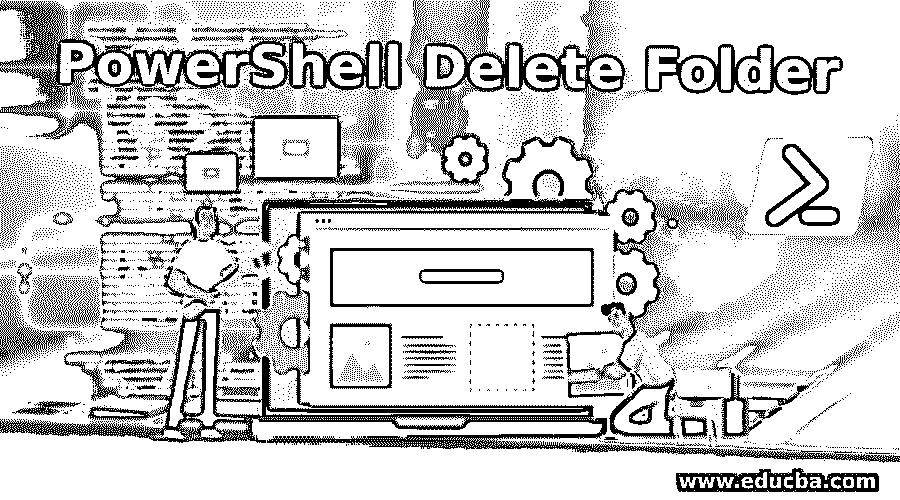
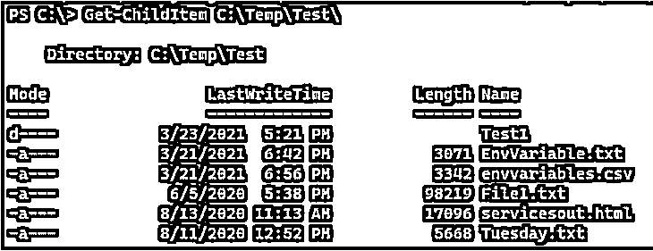
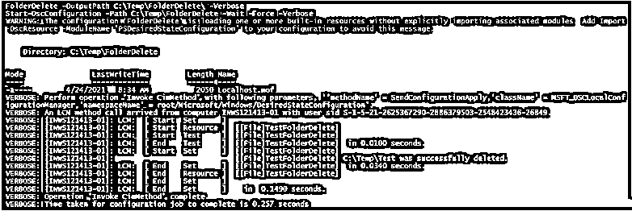

# PowerShell 删除文件夹

> 原文：<https://www.educba.com/powershell-delete-folder/>

## PowerShell 删除文件夹简介

PowerShell 文件夹删除操作是从指定位置删除文件夹，无论是其本地路径还是共享路径，都使用 cmdlet Remove-Item 或其他。Net 方法，它执行删除文件夹或子文件夹及其内容，并使用特定的开关来处理不同类型的文件夹属性，如只读、隐藏等，以删除它们。

### PowerShell 删除文件夹的语法

PowerShell 使用各种方法从 Windows 操作系统中删除文件夹。

<small>Hadoop、数据科学、统计学&其他</small>

#### 1.PowerShell 移除项目方法

**语法:**

移除-项目

`[-Path] <String[]>
[-Filter <String>] [-Include <String[]>] [-Exclude <String[]>] [-Recurse] [-Force] [-Credential <PSCredential>] [-WhatIf] [-Confirm] [-Stream <String[]>] [<CommonParameters>]`

移除-项目

`-LiteralPath <String[]>
[-Filter <String>] [-Include <String[]>] [-Exclude <String[]>] [-Recurse] [-Force] [-Credential <PSCredential>] [-WhatIf] [-Confirm] [-Stream <String[]>] [<CommonParameters>]`

从以上几组中，你只能使用其中一组的组合。不能在同一个命令中同时使用-Path 和-LiteralPath。

#### 2.命令提示符

*   使用 rmdir 命令

`rmdir [<drive>:]<path> [/s [/q]]`

*   使用 del

`del [/p] [/f] [/s] [/q] [/a[:]<attributes>] <names>
erase [/p] [/f] [/s] [/q] [/a[:]<attributes>] <names>`

#### 3.文件系统对象方法

使用文件系统对象方法。我们可以创建一个文件系统对象并使用 DeleteFolder 方法。

`object.DeleteFolder folderspec, [ force ]`

#### 4.使用。Net Class 方法

[System.IO.Directory] .Net class uses the method Delete() folder.

`[System.IO.Directory]::Delete(String)
[System.IO.Directory]::Delete(String,Boolean)`

### 如何删除 PowerShell 中的文件夹？

如语法所示，PowerShell 使用各种方法，如本机命令 Remove-Item、cmd 命令 rmdir 和 del、文件系统对象方法和。Net 方法从文件夹中删除文件。

窗口系统文件夹有各种相关属性，如只读、隐藏、存档等，要删除它们，我们可能需要在 cmdlet 中传递各种参数。

### PowerShell 删除文件夹的实现示例

下面我们讨论 PowerShell 删除文件夹的例子:

#### 示例#1

Remove-Item 删除包含子文件夹和文件的文件夹

假设我们在 C:\temp\Test\位置存储了一个文件夹，我们需要使用 Remove-Item 命令删除该文件夹。该文件夹包含以下项目。

**命令:**

`Get-ChildItem C:\Temp\Test\`

**输出:**

要移除这些项目，

`Remove-Item C:\Temp\Test\ -Verbose`

一旦您运行这个命令，它将要求确认。

您可以每次按“是”或“全是”来确认所有文件和文件夹。

生成此提示是因为测试文件夹包含子文件夹和文件，使用-Recurse 参数删除所有内部文件和文件夹，使用-Force 参数强制删除它们。

`Remove-Item C:\Temp\Test\ -Recurse -Force -Verbose`

**输出:**

#### 实施例 2

请将-WhatIF 参数与 Remove-Item 一起使用，以避免错误的文件夹删除。我们可以使用-WhatIf 参数来显示哪些文件和文件夹将被删除，以避免任何错误的文件夹删除。请参见下面的示例。

`Remove-Item C:\Temp\Test\ -Recurse -Force -WhatIf -Verbose`

**输出:**

如果您有权限删除远程文件夹，那么您可以在那里提供文件夹的共享路径。举个例子，

`Remove-Item '\\Computer1\C$\Temp\Test\' -Recurse -Force -WhatIf -Verbose`

上述命令将删除远程计算机 Computer1 上的 C:\temp\Test 文件夹。

#### 实施例 3

使用 Remove-Item 作为管道。我们可以使用 Get-ChildItem 和 Remove-Item 来检索文件和文件夹内容，以管道传输第一个命令的输出来删除文件夹。

`Get-ChildItem C:\Temp\Test\ | Remove-Item -Recurse -Force -Verbose`

这种方法的问题是它删除了文件夹的内容，而不是文件夹本身。您需要添加更多的删除逻辑，但是如果您想要删除父文件夹中的特定子文件夹，那么这个方法很有用，我们将在示例 8 中看到。

#### 实施例 4

使用 cmd 命令删除文件夹。

*   使用 del

当我们使用 Del 命令时，它只删除内部的文件和文件夹，但保留原始文件夹为空。

`del c:\Temp\Test\`

当您运行此命令删除测试文件夹内容时，它将提示删除。

要删除包括只读文件在内的子文件夹，请强制使用下面的命令。

`c:\>del c:\Temp\Test /s /q /f`

**输出:**

*   使用 rmdir 删除文件夹，而不是 del

`rmdir C:\Temp\Test`

当您运行上面的命令时，您将得到如下消息，因为该目录包含子文件夹和文件。

使用下面的命令在安静模式下删除指定的文件夹、子文件夹和文件。

`c:\>rmdir C:\Temp\Test /s /q`

#### 实施例 5

使用文件系统对象方法。我们还可以使用 ComObject FileSystemObject 删除文件夹，如下所示。

`$obj = New-Object -ComObject Scripting.FileSystemObject
$obj.DeleteFolder("C:\Temp\Test")`

#### 实施例 6

使用。Net 类方法。我们可以使用。Net 类系统。IO.Directory 用 Delete()方法删除文件夹。

例如:

`PS C:\> [System.IO.Directory]::Delete("C:\Temp\Test")`

当您运行上面的命令时，它会抛出一个目录不为空的异常，因为上面的命令旨在删除空目录。

因此，要删除文件夹，需要添加第二个参数$true 来删除非空的文件夹。

`[System.IO.Directory]::Delete("C:\Temp\Test", $true)`

#### 实施例 7

使用 PowerShell DSC 删除文件夹。使用声明性方法 DSC 删除文件夹。

`Configuration FolderDelete{
Node Localhost{
File TestFolderDelete{
DestinationPath = 'C:\Temp\Test'
Type = 'Directory'
Ensure = 'Absent'
Force = $true
}
}
}
FolderDelete -OutputPath C:\Temp\FolderDelete\ -Verbose
Start-DscConfiguration -Path C:\Temp\FolderDelete -Wait -Force -Verbose`

**输出:**

上面的命令将把配置存储在 C:\temp\FolderDelete 中，并在运行脚本之前确保该路径存在，它将生成 MOF 文件。

您还可以在节点部分提供远程节点，如下所示

`Node @("Computer1","Computer2")`

#### 实施例 8

使用 PowerShell 删除隐藏文件夹。要移除隐藏文件夹，我们首先需要使用 Get-ChildItem 检索隐藏文件夹。

`Get-ChildItem C:\Temp\Test\ -Hidden`

**输出:**

我们将添加 Remove-Item 作为删除隐藏文件夹管道。

`Get-ChildItem C:\Temp\Test\ -Hidden | Remove-Item -Force -Recurse -Verbose`

**输出:**

### 结论

Windows 文件资源管理器用于与文件系统文件和文件夹进行交互，但是由于各种原因，我们需要在编写脚本时删除文件夹，或者为了系统的定期维护，我们需要删除文件夹以释放额外的空间，我们可以使用本文中描述的方法。

### 推荐文章

这是 PowerShell 删除文件夹的指南。在这里，我们讨论 PowerShell 删除文件夹、其语法、方法和示例以及代码实现的简要概述。您也可以看看以下文章，了解更多信息–

1.  [PowerShell 循环通过数组](https://www.educba.com/powershell-loop-through-array/)
2.  [PowerShell 字典](https://www.educba.com/powershell-dictionary/)
3.  [Powershell 复制文件](https://www.educba.com/powershell-copy-file/)
4.  [PowerShell 连接字符串](https://www.educba.com/powershell-join-string/)

