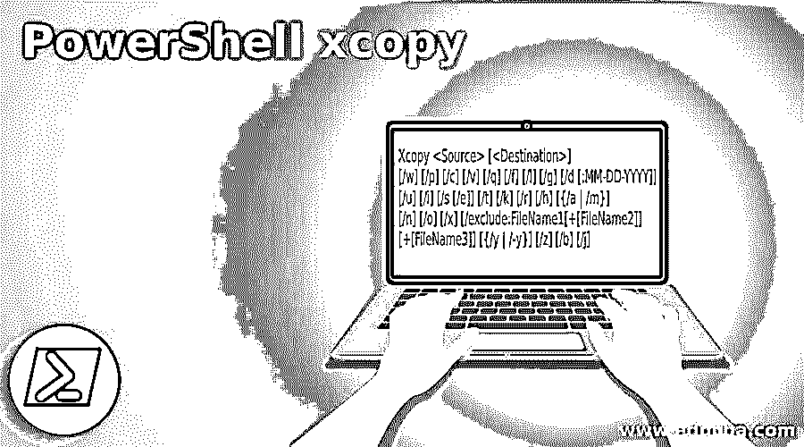

# PowerShell xcopy

> 原文：<https://www.educba.com/powershell-xcopy/>

## PowerShell xcopy 简介

以下文章提供了 PowerShell xcopy 的概述。xcopy 命令(顾名思义)将文件从源位置复制到目标位置，包括文件、文件夹和递归，它与简单的复制命令有很大不同，因为它支持多种切换，包括将目录结构复制到不同的属性，如只读、隐藏、系统文件，并且还提供了服务器离线恢复能力，以再次恢复其工作。

**语法:**

<small>Hadoop、数据科学、统计学&其他</small>

xcopy 是一个简单的命令，用于复制不同属性的文件和文件夹。

该命令可用于单个或多个属性，其语法如下所示:

`Xcopy <Source> [<Destination>] [/w] [/p] [/c] [/v] [/q] [/f] [/l] [/g] [/d [:MM-DD-YYYY]] [/u] [/i] [/s [/e]] [/t] [/k] [/r] [/h] [{/a | /m}] [/n] [/o] [/x] [/exclude:FileName1[+[FileName2]][+[FileName3]] [{/y | /-y}] [/z] [/b] [/j]`

### xcopy 命令在 PowerShell 中是如何工作的？

xcopy 是 windows 命令。它可以与 PowerShell 和 cmd 一起使用，因为它是一个 system32 实用程序命令。在复制文件和文件夹时，您可以根据需要提供各种开关，将数据从源位置复制到目标位置，该命令的工作方式类似于带有高级开关的 copy-Item、Copy、Robocopy 等。

当我们在批处理文件中使用 xcopy 命令并处理复制错误时，xcopy 命令使用 ErrorLevel 参数。

以下是错误级别的退出代码:

| **退出代码** | **描述** |
| Zero | 文件复制成功，没有任何错误。 |
| One | 找不到要复制的文件。 |
| Two | 用户通过按 Ctrl + C 终止操作。 |
| Three | 由于无效语法、错误的源或目标路径、磁盘或内存错误而出现错误。 |
| Four | 出现磁盘写入错误。 |

### PowerShell xcopy 的示例

以下是 PowerShell xcopy 的示例:

#### 示例#1

使用 xcopy 命令复制文件。

以下命令会将文件复制到目标位置。在此示例中，文件从 C:\DSC 文件夹复制到 E:\Temp。这是一个简单的命令，它只复制父文件，而不复制子目录及其文件。

**代码:**

`xcopy C:\DSC\* E:\temp`

如果目标文件夹不存在，此命令会询问是否可以创建目标文件夹，如果您按下 D，它会创建一个目标文件夹并复制文件。

**输出:**

#### 实施例 2

用于复制子文件夹的 xcopy。

不带开关的 xcopy 命令不会复制子文件夹和子文件夹文件。若要包括除空目录之外的子文件夹及其内容，请使用/s 开关。

**代码:**

`xcopy C:\DSC\* E:\temp /s`

**输出:**

上面的命令不包括空目录。若要包含空目录，请使用/e 开关。

**代码:**

`xcopy C:\DSC\* E:\temp /s /e`

#### 实施例 3

复制隐藏的文件和文件夹。

以下命令将复制隐藏的文件和文件夹，包括子文件夹内容和空文件夹。

**代码:**

`xcopy C:\DSC\* E:\temp /s /h /e`

#### 实施例 4

其他 xcopy 开关。

形容词（adjective 的缩写） **/w:** 此开关在开始复制文件之前提示用户同意继续，如下所示。

**代码:**

`xcopy C:\DSC\* E:/temp /s /w`

**输出:**

b. **/f:** 要在复制时查看源文件和目标文件的位置，请使用/f 开关。

**代码:**

`xcopy C:\DSC\* E:\temp /s /f`

**输出:**

上述命令将文件从源位置复制到目标位置，包括子文件夹，并显示单个项目的源位置和目标位置。

碳（carbon 的缩写） **/l:** 当您指定此开关时，它显示要复制到目标文件夹的项目列表，而不复制它们。

**代码:**

`xcopy C:\DSC\* E:\temp /s /l`

**输出:**

d./ **d [:MM-DD-YYYY]:** 复制在指定日期或之后更新的较新文件。如果不提供日期，它会复制所有更新的文件。

**代码:**

`xcopy C:\DSC\* E:\Temp\ /s /d /f`

上述命令将所有被更改或更新的文件从源文件复制到目标文件，并显示源文件和目标文件的位置。

**输出:**

如果您已经注意到了，它会要求用户确认才能继续。要抑制该警报，您可以使用/y 开关。

**代码:**

`xcopy C:\DSC\* E:\Temp\ /s /d /y /f`

相反，/-y 开关用于用户提示。

/d 开关不仅复制更新的文件，还将较新的文件与其一起复制到目标。下面的命令副本是 2020 年 12 月 31 日之后更新的文件。

**代码:**

`xcopy C:\DSC\* E:\Temp\ /s /d:12-31-2020 /y`

e. **/h:** 复制 xcopy 命令默认不包含的隐藏文件和系统文件。

**代码:**

`xcopy C:\DSC E:\Temp\ /s /h /y /f`

上述命令将文件从源位置复制到目标位置，同时复制子文件夹、系统文件和隐藏文件，无需用户确认。

同样，/r 开关复制只读文件。下面的命令将复制隐藏文件和只读文件。

**代码:**

`xcopy C:\DSC E:\Temp\ /s /h /r /y /f`

氟（fluorine 的缩写） **/z:** 以可重启模式通过网络复制文件。这意味着，如果远程服务器脱机，该交换机将跟踪复制的文件，并在服务器联机时恢复运行。它还显示了较大文件复制量的百分比。

**代码:**

`xcopy C:\DSC \\ad\shared\temp /s /z`

g. **/Exclude:** 为了排除特定的项目，我们需要在一个文本文件中创建一个包含要排除的项目名称的列表。

在下面的示例中，文件 excludeditems.txt 包含要排除的项目列表。

我们可以使用下面的命令将项目复制到带有子文件夹的目标位置。

**代码:**

`xcopy C:\DSC E:\Temp\ /s /exclude:C:\excludeditems.txt`

### 结论

各种命令，如 Copy、xcopy、RoboCopy、Copy-Item，可用于将文件和文件夹从源位置复制到目标位置，但 xcopy 和 Robocopy 提供了更多功能，可以从批处理文件以及 PowerShell 脚本中运行，并具有上述开关的强大支持，使其更易于使用并易于从致命恢复中恢复。

### 推荐文章

这是 PowerShell xcopy 的使用指南。这里我们讨论一下入门，xcopy 命令在 PowerShell 中是如何工作的？和示例。您也可以看看以下文章，了解更多信息–

1.  [PowerShell 睡眠](https://www.educba.com/powershell-sleep/)
2.  [PowerShell 子串](https://www.educba.com/powershell-substring/)
3.  [PowerShell 不像](https://www.educba.com/powershell-not-like/)
4.  [否则如果在 PowerShell 中](https://www.educba.com/else-if-in-powershell/)

