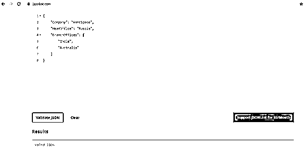
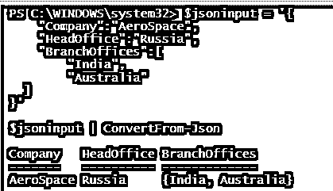
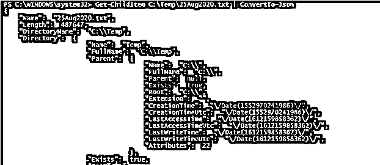
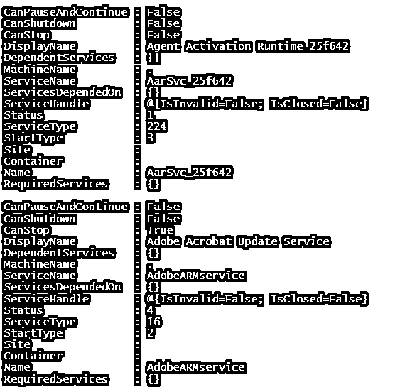

# PowerShell JSON 格式

> 原文：<https://www.educba.com/powershell-json-format/>

## PowerShell JSON 格式的定义

JSON 格式也代表 JavaScript 对象符号格式，它是一种开放的标准格式，是人类可读的格式，主要用于浏览器和客户端之间的快速通信，因为它易于处理，并且可以使用 Web 命令(如 Invoke-WebRequest 和 Invoke-RestMethod)作为 PowerShell 数据进行检索。尽管有它的名字，这种语言与 JavaScript 格式有很大的不同。

**语法:**

<small>Hadoop、数据科学、统计学&其他</small>

JSON 语言使用下面的语法。

`{
"String":"Value"
}`

以上是 JSON 对象格式的简单语法。它有属性头和值，两者由冒号( **:** )分隔，这意味着特定的头有特定的值。

`JSON array Syntax,
{
"String": [
Value1,
Value2
] }`

上面的语法显示字符串属性头有两个数组值，Value1 和 Value2。

`Complex JSON structure,
{
"String":[
{
"String1":"Value1",
"String2":"Value2"
},
{
"String3":"Value3",
"String4":[
"Value4",
"Value5"
] }
] }`

上面的语法显示了 JSON 格式的复杂结构，其中包含字符串及其值、数组、子字符串及其值的组合。

### JSON 类型在 PowerShell 中是如何工作的？

JavaScript 对象符号或 JSON 文件具有。json 语法。正如我们在上面的语法部分看到的，JSON 是一个字符串和值对，有几个这样的字符串和值相互关联，它还包括字符串和值的数组和子组，可以创建一个复杂的结构。

您可以在任何编辑器中编写 JSON 文件，因为它是一种简单的文本格式，但是要创建一个没有错误的 JSON 文件，您可以使用 VS 代码，因为它会在缺少任何语法时显示错误。其次，一旦创建完 JSON 文件，您也可以在线验证 JSON 文件。有几个网站验证 JSON 文件，但是 https://jsonlint.com/是最受欢迎的验证 JSON 文件的网站。

一旦创建并验证了 JSON 文件，我们的任务就是在 PowerShell 中读取 JSON 文件。PowerShell 使用两个 cmdlet**convert to-JSON**和 **ConvertFrom-JSON** 来处理 JSON 文件。

**ConvertTo-JSON** cmdlet 将任何可能的输出转换为 JSON 格式，而 **ConvertFrom-JSON** cmdlet 将 JSON 输入转换为自定义对象或哈希表格式。首先，我们将检查上面创建的样本输入 JSON 文件，以及我们如何使用 **ConvertFrom-JSON** 命令。

`{
"Company":"AeroSpace",
"HeadOffice":"Russia",
"BranchOffices":[
"India",
"Australia"
] }`

如果您直接使用 JSON 文件，那么您可以使用下面的命令将输出转换成 hashtable 格式。

`Get-Content .\Test1.json | ConvertFrom-Json`

**输出:**

或者您可以直接使用下面的命令，而不用将文件保存为 JSON。

`$jsoninput = '{
"Company":"AeroSpace",
"HeadOffice":"Russia",
"BranchOffices":[
"India",
"Australia"
] }'
$jsoninput | ConvertFrom-Json`

**输出:**

要将任何输出转换成 JSON 格式，您需要使用如下所示的 **ConvertTo-JSON** 命令。

`Get-Process notepad++ | Select Name, id, WorkingSet, CPU | ConvertTo-Json`

**输出:**

在 JSON 结构中，布尔值 **$true** 和 **$false** 分别被定义为 **true** 或 **false** ，而 **$null** 被定义为 **null** 。请参见下面的示例。

`Get-ChildItem -Path C:\Temp\25Aug2020.txt | ConvertTo-Json`

**输出:**

您可以在上面的输出中看到，null 和 true 被定义，日期格式用 **/Date** 表示，路径用双反斜杠( **"\\"** )而不是单反斜杠定义。

### 例子

#### 1.将命令输出转换为 JSON 文件。

我们可以使用 **ConvertTo-JSON** pipeline 命令将几乎任何命令输出转换成 JSON 格式。举个例子，

`Get-Process chrome | Select Name, ID, WorkingSet, CPU, PagedMemorySize64  | Select -First 3  |  ConvertTo-Json`

**输出:**

您也可以使用 **-Compress** 参数压缩输出，这样输出将显示在一行中，如下所示。

`Get-Process chrome | Select Name, ID, WorkingSet, CPU, PagedMemorySize64  | Select -First 3  |  ConvertTo-Json -Compress`

**输出:**

#### 2.将 JSON 输出转换为数组。

要将 JSON 输出转换成数组，我们需要使用-AsArray 参数。

请注意:该参数仅在。Net Core 版本(PowerShell 6.0 及以上)但低于 6.0 版本(。Net Framework 版本)不支持它。

如果不转换成数组，

`Get-Date  | ConvertTo-Json`

**输出:**

转换成数组后，

`Get-Date  | ConvertTo-Json -AsArray`

**输出:**

当你把 JSON 输出转换成一个数组时，会有方括号被加上。

#### 3.使用 **Invoke-Webrequest**

您可以利用 JSON 命令来处理网站输出数据。例如，我们有一个 URL[https://www.reddit.com/r/todayilearned/top.json?limit=100](https://www.reddit.com/r/todayilearned/top.json?limit=100)，它以 JSON 格式显示了来自特定页面的 Reddit 前 100 篇帖子。

`Invoke-WebRequest -Uri "https://www.reddit.com/r/todayilearned/top.json?limit=100" | ConvertFrom-Json`

**输出:**

为了阅读那些张贴内容的标题，

`$Out = Invoke-WebRequest -Uri "https://www.reddit.com/r/todayilearned/top.json?limit=100" | ConvertFrom-Json
$out.data.children.data | Select Title`

**输出:**

上面的命令类似于 RestAPI 命令，它自动格式化 web JSON 输出数据，而不使用外部的 **ConvertFrom-JSON** 命令。

`Invoke-RestMethod -Uri "https://www.reddit.com/r/todayilearned/top.json?limit=100"`

#### 4.将输出转换成哈希表的 JSON 命令

使用 JSON 命令，我们可以将 cmdlets 的输出直接转换为哈希表，如下所示。

`Get-Service | ConvertTo-Json | ConvertFrom-Json`

**输出:**

您也可以选择几个字段，

`Get-Service | Select Name, Starttype, Status | ConvertTo-Json | ConvertFrom-Json`

### 结论

JSON 格式已经超越了 XML 格式的使用，因为它更容易处理，对于使用大量内容的网站来说，它的浏览器加载速度更快，而且这种格式比 XML 格式轻得多。JSON 文件在基础设施开发自动化中也很有用，它利用基础设施即代码(IaaS)格式，被云技术以及主要是 Azure 用来与 Azure DevOps 和 ARM 模板一起快速批量部署基础设施资源。

### 推荐文章

这是 PowerShell JSON 格式的指南。这里我们讨论 JSON 类型的定义、语法、参数以及它在 PowerShell 中是如何工作的？和代码实现示例。您也可以看看以下文章，了解更多信息–

1.  [PowerShell Invoke-Webrequest](https://www.educba.com/powershell-invoke-webrequest/)
2.  [PowerShell 等待](https://www.educba.com/powershell-wait/)
3.  [PowerShell 执行策略](https://www.educba.com/powershell-execution-policy/)
4.  [PowerShell 睡眠](https://www.educba.com/powershell-sleep/)

