# PowerShell XML

> 原文：<https://www.educba.com/powershell-xml/>

## PowerShell XML 简介

可扩展标记语言(XML)是一种类似 HTML 的轻量级软标记语言，它定义了一组规则，用于以人类可读和机器可读的格式对文档进行编码，并用于存储和传输数据。这种语言是自描述性的，因此 PowerShell 通常使用 XML 从网页中检索数据，修改内容并将其发布回网站，甚至许多应用程序配置都是 XML 格式的，这便于应用程序为机器处理数据，并且易于被人类理解和修改。

**语法**

<small>Hadoop、数据科学、统计学&其他</small>

XML 格式:

`<?xml version="1.0" encoding="UTF-8"?>
<root>
<child>
<subchild>.....</subchild>
</child>
</root>`

**Select-XML cmdlet 语法:**

`Select-Xml
[-Xml] <XmlNode[]>
[-Path] <String[]>
-LiteralPath <String[]>
-Content <String[]>
[-XPath] <String>
[-Namespace <Hashtable>] [<CommonParameters>]`

**ConvertTo-XML 语法:**

`ConvertTo-Xml
[-Depth <Int32>] [-InputObject] <PSObject>
[-NoTypeInformation] [-As <String>] [<CommonParameters>]`

**XPath 语法:**

这不仅适用于 PowerShell，而且是一种全局 XPath 语法，XPath 是 XSLT 标准中的一个主要元素。XPath 对于从 XML 文件中检索数据非常有帮助。

| **表情** | **描述** |
| NodeName | 选择所有名为“节点名”的节点 |
| / | 从根节点选择 |
| // | 从整个文档中选择带有该标签的节点 |
| . | 选择当前节点 |
| .. | 选择当前节点的父节点 |
| @ | 选择属性 |

### PowerShell 中的 XML 是如何工作的？

PowerShell 非常有效地处理 XML 文件。PowerShell 有两种方法从 XML 文件中检索数据。

*   **XPath**
*   **点法**。

为了将文件转换成 XML，

*   **转换 XML**

在开始进一步解释之前，我们将使用微软的一个示例文件(Books.xml)来阅读本文中的 xml 数据。

https://docs.microsoft.com/en-us/previous-versions/windows/desktop/ms762271(v=vs.85)?redirectedfrom=MSDN

#### 1.从 XML 文件中检索数据

*   **加载 XML 文件**

要将 XML 文件加载到 PowerShell 中，我们可以使用第一个 Get-Content 命令，然后将其类型转换为 XML，如下所示。

`$file = [XML](Get-Content C:\Temp\SampleXML.xml)`

或者

`[XML]$file = Get-Content C:\Temp\SampleXML.xml`

您也可以通过创建 XML 对象类型，然后加载 XML 文件来加载 XML。举个例子，

`$xml = New-Object -TypeName XML
$xml.Load('C:\Temp\SampleXML.xml')
$xml.Load('C:\Temp\SampleXML.xml')`

在上面的例子中，您将得到如下输出:

**输出:**

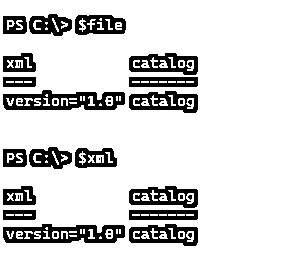

要检查 XML 操作中支持哪些方法，可以使用 Get-Member 命令检查方法，如下所示。

`$xml | Get-Member`

**a. XPath 方法**

为了使用 XPath 方法，我们可以使用语法部分中显示的表格。首先，要从整个文档中检索单个节点的数据，我们可以使用下面的命令语法。

`$xml.SelectNodes("//NodeName")`

在这个例子中，我们有像书、作者、标题、流派等节点。我们可以选择其中任何一个。

`$file.SelectNodes('//genre')`

**输出:**

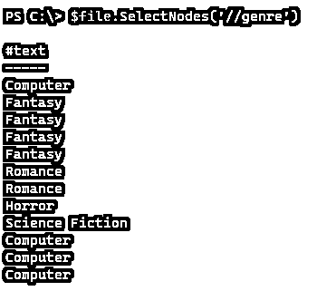

请注意，XML 操作区分大小写。

要选择单个节点，我们可以使用 select single node()方法。

`$xml.SelectSingleNode('//title')`

这将从第一个节点选择数据。要选择不同的节点，我们需要提供数组编号。在 PowerShell 中，数组以[0]开头，但是在 XML 中，数组以数字 1、2、3 等等开头。

`$xml.SelectSingleNode('//catalog/book[2]')`

上面的命令将从主目录中选择第 2 本书。

**输出:**

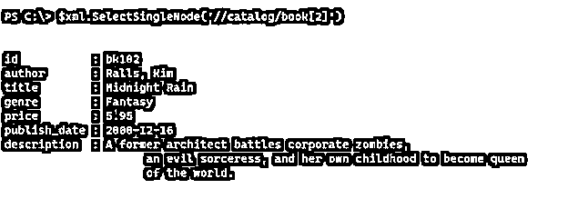

选择下面的节点。

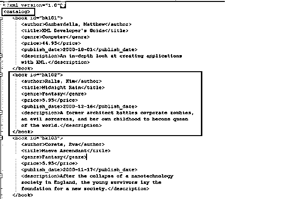

您也可以直接使用该命令，而不指定父节点。

`$xml.SelectSingleNode('//book[2]')`

要使用 get 上面的输出，我们还可以使用 Select-XML 命令，其工作方式与上面的命令相同。举个例子，

`Select-Xml -Xml $xml -XPath "//catalog/book[2]" | Select -ExpandProperty Node`

**输出:**

还可以如下图进一步展开。

`$xml.SelectSingleNode('//catalog/book[2]/author')`

**输出:**

**b .点法**

我们在 PowerShell 中日常使用的这种方法是众所周知的。我们已经在本节开始时加载了 XML 文档。我们现在将使用点的方法。

下面的命令将从 XML 文档中检索图书编号 2。

这是我们的样本 XML 文档。

`PS C:\> $xml
xml           catalog
---           -------
version="1.0" catalog
Command to retrieve book number:2
$xml.catalog.book[2]`

**输出:**

#### 2.转换为 XML 文件

要将任何可能的输出转换成 XML，可以使用 convertTo-XML 命令。

`$services = Get-Service | ConvertTo-Xml
$services = Get-Service | ConvertTo-Xml
$services`

**输出:**

为了进一步扩展，我们可以使用任何方法(Xpath 或 Dot 方法)。举个例子，

`$services.Objects.Object[1] | Select -ExpandProperty Property`

**输出:**

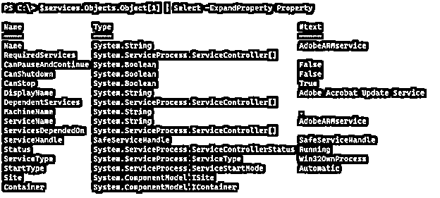

### 例子

下面举几个例子

#### 1.加载 XML 的全部内容

使用加载整个 XML

`$xml = [xml](Get-Content C:\Temp\SampleXML.xml)
$xml.SelectNodes('/catalog') | Select -ExpandProperty Book`

**输出:**

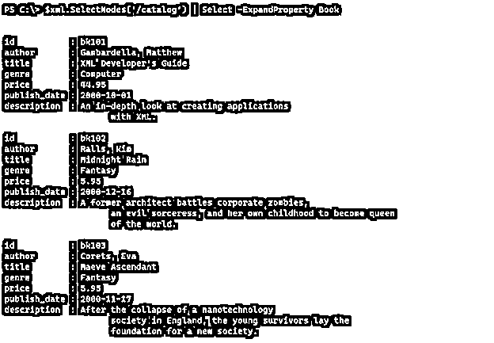

#### 2.要搜索特定的属性

要搜索特定的属性，我们可以使用下面的命令。它将搜索图书 id“bk 112”。

`$xml.SelectNodes('//catalog/book') | where{$_.id -eq 'bk112'}`

**输出:**

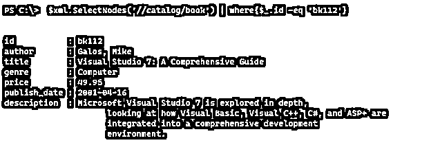

#### 3.使用点方法查找属性

上面显示的例子也可以通过如下所示的点方法编写。

`$xml.catalog.book |where{$_.id -eq "bk112"}`

**输出:**

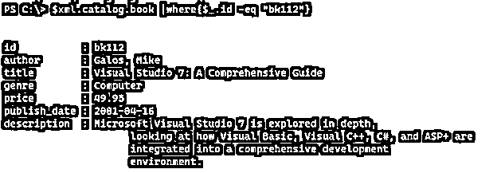

#### 4.在文件中添加新元素

我们将把新元素添加到现有文件中。

`$file = 'C:\Temp\SampleXML.xml'
$xml = [xml](Get-Content $file)`

下面的命令将在 XML 文件中创建一个名为 new element 的“Book1”。

`$newelement = $xml.CreateElement("Book1")
$newelement`

**输出:**

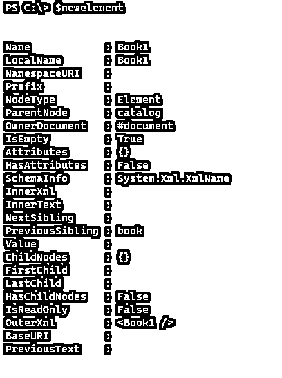

一旦创建了它，第二个任务就是将它附加到现有的文档中。

`$xml.catalog.AppendChild($newelement)`

**输出:**

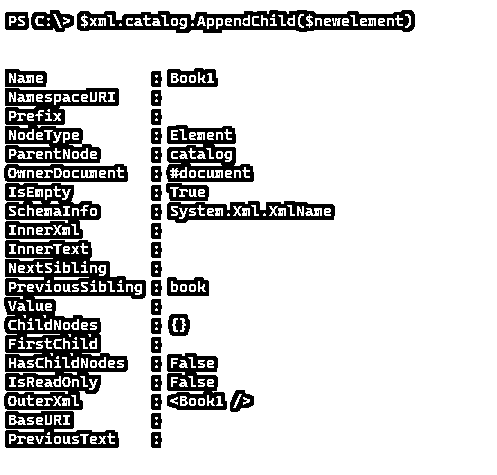

追加元素后，下一步是使用下面的命令保存文件。

`$xml.Save($file)`

现在让我们测试新元素是否出现在 XML 文档中。

`$xml.catalog`

**输出:**

#### 5.创建一个新节点并设置其属性

在本例中，我们将添加一本名为“XML Introduction”的新书，代码如下所示。

`$file = "C:\temp\SampleXML.xml"
$xml = [xml](Get-Content $file)
$newbookelement = $xml.catalog.AppendChild($xml.CreateElement("book"))
$newbookelement.SetAttribute("id","bk113")
$newAuthorelement = $newbookelement.AppendChild($xml.CreateElement("author"))
$newAuthorelement.AppendChild($xml.CreateTextNode("Dan Harley")) | Out-Null
$newtitleelement = $newbookelement.AppendChild($xml.CreateElement("title"))
$newtitleelement.AppendChild($xml.CreateTextNode("XML Introduction")) | Out-Null
$xml.Save(($file))`

**输出:**

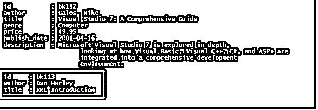

您也可以在 XML 文件中检查相同的内容。

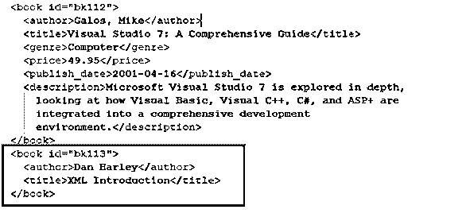

### 结论

XML 文件是提供配置数据的最佳方式。大多数应用程序使用 XML 文件进行配置，甚至与 RestAPI 方法进行交互，许多网站将 XML 作为 API 输出。

### 推荐文章

这是 PowerShell XML 的指南。这里我们讨论 XML 文件是提供配置数据的最佳方式。您也可以看看以下文章，了解更多信息–

1.  [PowerShell 睡眠](https://www.educba.com/powershell-sleep/)
2.  [PowerShell 脚本块](https://www.educba.com/powershell-scriptblock/)
3.  [PowerShell 过滤器](https://www.educba.com/powershell-filter/)
4.  [PowerShell 注册表](https://www.educba.com/powershell-registry/)

