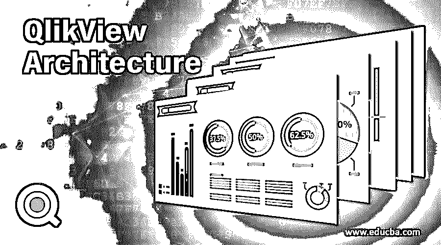

# QlikView 架构

> 原文：<https://www.educba.com/qlikview-architecture/>

## QlikView 架构简介

QlikView 是最早的数据分析工具之一，它包含一个在内存中处理数据的关联架构。数据之间的关系是在内部机制的层次上管理的，而不是在应用程序的层次上。简而言之，所选的表及其关联存储在内存中，每个字段都连接到数据库中所有其他可用的值。当用户选择任何字段的值时，其余的字段会动态调整，不像传统的 BI 工具需要一些时间来加载。在本文中，我们将进一步探讨 QlikView 架构。

### 什么是 QlikView？

QlikView 是一款基于 windows 的自助式商业智能工具。它是一个交互式 BI 工具，动态工作，有助于数据发现。它用于将原始数据转换为可视化数据，以便向业务用户传达见解。它被称为自助工具，因为它非常用户友好。QlikView 应用程序一经开发，便可轻松部署，用户只需点击按钮即可访问它并从中获得深刻见解。

<small>Hadoop、数据科学、统计学&其他</small>

QlikView 的主要组件如下所示，包括 QlikView Desktop、QlikView Server 和 QlikView Publisher、QlikView Management Console、QlikView User Access。我们将在本文后面详细讨论它们。

### QlikView 的组件

以下是 QlikView 的基本组件:

#### 1.QlikView 桌面

QlikView Desktop 是一个基于 Windows 的平台，用于开发 QlikView 应用程序以及前端应用程序的图形用户界面布局。数据首先在桌面环境中准备，在那里应用各种转换、过滤和分析。用户可以在可用于表示数据的各种图表和表格之间进行选择。款式，配色方案也可以根据用户喜好定制。

#### 2\. QlikView Server

QlikView server 用于托管 QlikView 文档，用户可以在其中查看和访问这些文档。QlikView Server 的作用是维护最终用户和服务器之间的通信。这是一个服务器端应用程序，其主要功能包括但不限于数据管理和分发，提供安全性和数据访问。

#### 3.QlikView Publisher

QlikView Publisher 用于从各种数据源获取数据，如标准文件、SAP Net Weaver、Informatica 等。并将数据直接加载到 QlikView 文件中。QlikView Publisher 用于创建“任务”,以安排 QlikView 应用程序的重新加载。可以基于调度、基于其他任务的成功或任何其他外部事件等来触发重新加载。

#### 4.QlikView 管理控制台

QlikView 管理控制台是一个基于 web 的界面管理平台，管理 QlikView 的所有组件。它是一个主要由 It 团队控制的服务器端应用程序。管理控制台的主要功能包括服务器部署和文件分发。

#### 5.QlikView 用户访问

QlikView 用户访问位于前端。接入点通常采用可在台式机、笔记本电脑、平板电脑或移动电话上打开的 web 浏览器的形式。当用户请求查看数据时，会从后端从 QlikView server 获取数据文件，并通过内部网或互联网 URL 在浏览器中查看。

### QlikView 架构

在上一节中，我们看到了 QlikView 的主要组件以及使用 QlikView 的一些主要优势。在本节中，我们将看到 QlikView 的框架。让我们将它的工作分成如下三个部分:

#### 1.数据源端

这一层可以与 ETL(提取、转换、加载)过程中的提取层相比较。QlikView server 和 publisher 可以从各种数据源获取数据输入，如 Oracle、Excel 表、CSV 文件、社交媒体、SAP 等。数据源端是所有数据提取发生的那一层。因此，这是 QlikView 基础设施的基础层之一，充当数据访问点。

#### 2.后端

后端由 QlikView Publisher 和 QlikView desktop 组成。QlikView 后端是所有 QlikView 文档所在的位置。**。** QVW 格式文档是那些有 GUI 支持的文档，它们在前端是可见的，而**。** QVD(纯数据文件)格式的文档不支持 GUI。QlikView server 用于通过 QlikView server 使用 QVP 将所有这些文档传递到前端。QlikView Publisher (QVP)的作用是分发。从各种来源加载数据后的 QVW 文件。它还通过调度和管理任务来促进数据的分发。QVP 还有助于减少不必要的数据加载，从而减少流量并提高 QlikView 服务器的分发效率。

#### 3.前端

QlikView 前端用于查看已经创建的 QlikView 文档。它是一个基于浏览器的访问点，为用户提供了一个查看数据并与之交互的界面(以仪表板的形式)。前端层由 QlikView Server 组成，有助于通过内部网或互联网 URL 访问 BI 报告。QlikView 文档以. qvw 格式存储。它们也可以作为独立文档存储在 Windows 中。

### QlikView 架构的优势

1.  QlikView 是一种使用关联架构处理内存中数据的工具。与其他 BI 工具不同，QlikView 动态工作。当用户选择任何字段的值时，其余的字段会自动调整。
2.  QlikView 允许用户通过脚本执行提取转换和加载。
3.  它具有即时高精度处理大量数据集的能力。
4.  QlikView 具有非常友好的用户界面，帮助用户通过少量培训即可开始使用。
5.  它灵活、可扩展且易于实现。

### 结论

在本文结束时，您必须对什么是 QlikView 以及它与传统 BI 工具有何不同有所了解。我们还了解了 QlikView 架构的工作原理，并研究了 QlikView 中各种组件的作用。

### 推荐文章

这是 QlikView 架构指南。在这里，我们讨论了 QlikView 架构的工作原理，并了解了 QlikView 中各种组件的作用。您也可以浏览我们推荐的文章，了解更多信息——

1.  [QlikView 功能介绍](https://www.educba.com/qlikview-functions/)
2.  [Tableau 与 QlikView–主要差异](https://www.educba.com/tableau-vs-qlikview/)
3.  [使用 QlikView 图表的优势](https://www.educba.com/qlikview-charts/)
4.  [QlikView 十大面试问题](https://www.educba.com/qlikview-interview-questions/)

