# QlikView SubField

> 原文：<https://www.educba.com/qlikview-subfield/>


## QlikView 子字段简介

QlikView 的子字段功能被认为是最受欢迎的功能之一，因为该功能有助于从具有 Distinct 和 Load 查询语句的功能产生的数据库表中自动消除重复的数据记录。由于位于函数的文本和字符串类别之间，QlikView 中的这个子字段()函数是在 UI 和脚本中实现的。QlikView 函数根据变量或字符串提供子字符串。默认情况下，我们需要使用正数来提取字符串，但是在这个 QlikView 子字段函数中，我们需要应用负数来提取位于右侧和侧面的字符串。

### 使用 QlikView 子字段功能

我们有如下的函数语法:

<small>Hadoop、数据科学、统计学&其他</small>

```
Subfield(text(or, expression), delimiter [,field_no.(or, index))
```

上述语法中包含的参数简要给出如下:

第一个参数是“文本或 say 表达式”，这是一个用于搜索操作的字符串。它可以是变量、硬编码文本、美元符号扩展，甚至任何其他表达式的形式。subfield 函数是一个脚本函数，当从一个更大的字符串执行时，它返回一个指定的子字符串。

下一个参数是“delimiter ”,它在输入文本中将字符串分隔成模块部分。

最后一个是“field_no. or say index”，它是一个可选参数，保存一个整数值，标识要返回的父字符串文本的子字符串。

它定义为:

*   如果 field_no .为正值，则执行中的子字符串从左向右移除。
*   如果 field_no .为负值，则执行中的子字符串从右向左移除。

**Note:** The function can be applied in place of implementing complex functions combinations using Right(), Len(), Mid(), Left() or several other string functions.

让我们看看如何使用 QlikView 中的基本方法来使用此子字段功能:

#### 1.打开 QlikView 应用程序

首先，需要打开 QlikView 应用程序。

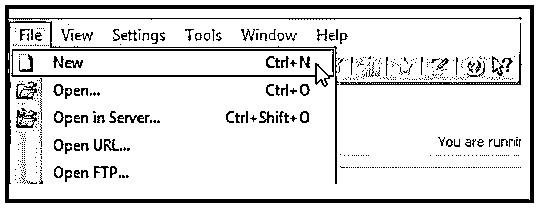


之后，您可以进入选项文件，然后新建，一个窗口将被打开。


#### 2.打开编辑脚本

其次，从同一个文件选项中，您需要通过单击编辑脚本选项来打开脚本窗口。

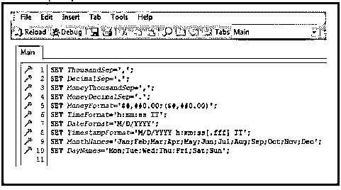


#### 3.点击表格文件

在这里，用户将导入 Excel 文件，并且需要单击打开按钮。

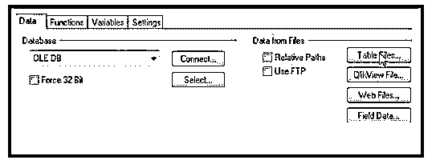


#### 4.访问文件向导类型

导入后，将打开此窗口，您可以在其中查看 Excel 文件表。只需点击完成按钮。

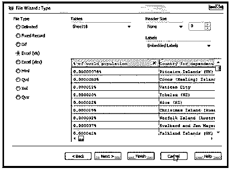


#### 5.正在加载编辑脚本的代码

最后，在编辑脚本中成功完成了 Excel 文件的上传。将其重新加载为。

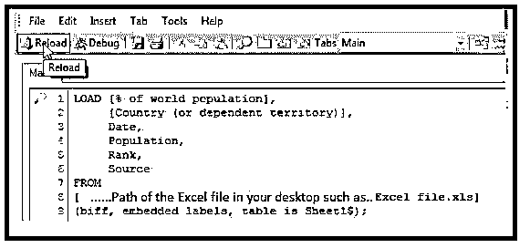


#### 6.保存文件

这是将创建的 QlikView 文件保存为的重要步骤。

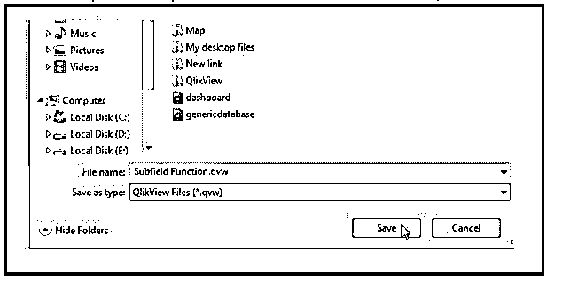


#### 7.访问表属性窗口

*   现在，工作表属性窗口打开，可以添加需要使用表格显示的字段。然后应该单击“确定”按钮。


#### 8.在编辑脚本中，应用子字段功能

再次，需要打开编辑脚本窗口实现子字段功能；之后再重装一遍。

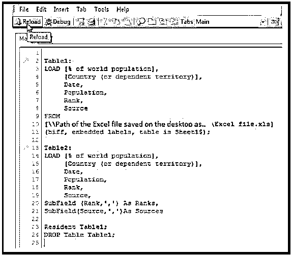


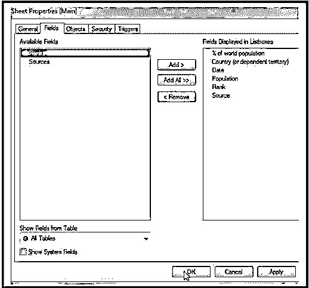


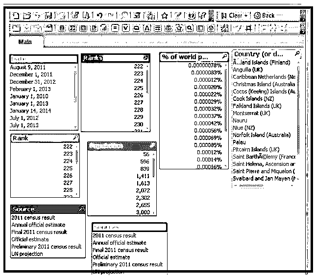


9.当 QlikView 的子字段函数中提供负数时，用户可以看到该函数删除了位于右侧的字符串。

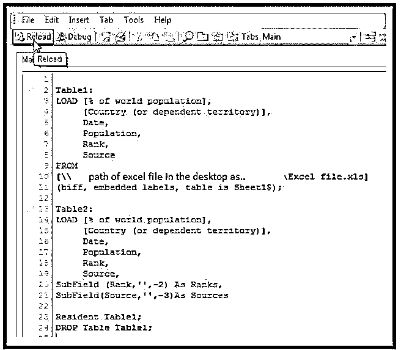


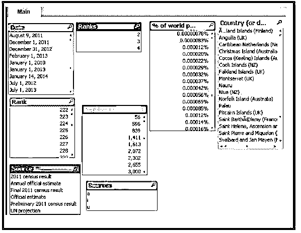


### QlikView 子字段加载

*   QlikView 由几个字符串函数组成，支持将指定的数据转换和加载到 QlikView 中，这有助于清理数据。
*   子字段函数可应用于前端或后端，其执行与串联函数相反。但是 concat()连接所提供的记录，而 subfield()函数根据分隔符和索引考虑参数来拆分记录。
*   该函数用于从父字符串中移除子字符串部分，假设 firstname 和 lastname，父字符串可以是具有全名、路径名的模块部分的记录列表，否则可以是由逗号或分隔符分隔的表中的字段数据。
*   如果在 LOAD 语句中使用该函数，其中省略了可选参数 field_no(即，如果省略了 index 或 field_no)，则为该字段中找到的每个子串生成一个完整的记录。但是当使用 subfield()函数加载多个字段时，它会创建所有排列的笛卡尔积。

为了说明，让我们考虑如下几个例子:

**代码:**

```
Subfield(‘xyz;ghj;uio’, ‘;’,2) – it returns ‘ghj’
Subfield(‘’, ‘;’,1) – it returns NULL
Subfield(‘;’, ‘;’,1) – it outputs an empty string
```

现在，您可以将示例脚本添加到您的文档中并执行它。之后，您可以将列出的字段添加到文档的结果列中提供的工作表中，以查看输出。

**代码:**

```
Full_Name:
LOAD * inline [
Name
‘John Collin’
‘Mary Owen’
];
Sep_Names:
Load Name,
Subfield(Name, ‘ ‘, 1) as First_Name,
Subfield(Name, ‘ ‘, 1) as Last_Name
Resident Full_Name;
Drop table Last_Name;
```

**输出:**

| **名称** | **名字** | **姓氏** |
| *约翰·科林* | 约翰 | 科林 |
| 玛丽·欧文 | 玛丽 | *欧文* |

假设我们有一个路径名为 vDemoPath 的变量。

**代码:**

```
Set vDemoPath= \Users\ext_jrb\Documents\Qlik\Sense\Apps;.
```

用户可以在文本和图像图表中添加如下测量:

子字段(vDemoPath，' \ '，-3)，这将导致' Qlik '。发生这种情况是因为它将是从 vDemoPath 变量右侧开始的第三个子字符串。

因此，以上示例显示了如何仅使用 QlikView 子字段()的一个实例来创建多个表格行。

假设接下来我们有另一个脚本要添加到文档中并执行它:

**代码:**

```
LOAD DISTINCT
Performer,
SubField(Task, ‘ ‘) as Task;
LOAD *inline[
Performer|Task
Ram|OST,Music
Krishna|Video
Shiva|OST,Video,Music
] (delimiter is ‘|’);
```

**输出:**

| **表演者** | **任务** |
| *Ram* | *OST* |
| *Ram* | *音乐* |
| 奎师那 | *视频* |
| *湿婆* | *OST* |
| *湿婆* | *视频* |
| *湿婆* | *音乐* |

因此，上图显示了使用函数的几个实例在同一 LOAD 语句中创建的所有排列的笛卡尔积，在这些实例中，没有为可选字段 field_no 或 index 提供任何值。这里，DISTINCT 关键字有助于删除记录数据的副本。

### 结论

函数通常用于避免函数的复杂用法，如 Right()、Len()、Left()等。用户可以在一条 load 语句中实现各种子字段功能。当我们处理带有扩展“$”类型的字符串时，这个子字段函数非常有用。

### 推荐文章

这是 QlikView 子场指南。这里我们分别使用 QlikView 子字段函数和 load 来讨论简介。您也可以浏览我们的其他相关文章，了解更多信息——

1.  [QlikView 架构](https://www.educba.com/qlikview-architecture/)
2.  [QlikView 备选方案](https://www.educba.com/qlikview-alternatives/)
3.  [QlikView 图表](https://www.educba.com/qlikview-charts/)
4.  [QlikView 连接](https://www.educba.com/qlikview-concatenate/)


