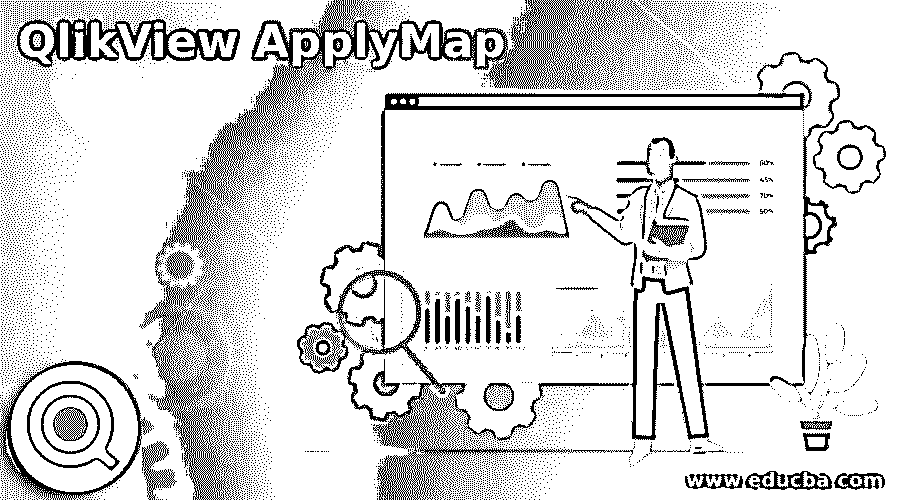

# QlikView 应用地图

> 原文：<https://www.educba.com/qlikview-applymap/>




## QlikView ApplyMap 简介

我们都知道执行映射表任务的 MS Excel 函数 Vlookup。同样，为了简化复合数据模型，我们需要映射表，所以这里我们通过使用 Applymap()函数来实现。此 QlikView Applymap()函数有助于提供一种替代方法来执行两个表列之间的连接，这与基于两个表共有的键列的表不同。因此，这减少了数据模型中包含的表的数量。在数据库中，数据映射可以定义为从两个不同的数据模型形成数据组件的过程，这是为了数据集成工作中数据转换的持久性。

### 关键要点

*   在 QlikView mapping 中，映射表总是在应用映射功能之前通过映射选择或映射加载来创建。
*   在脚本程序执行完毕之前，映射表将暂时保存在 QlikView 的内存中。在脚本执行之后，它将被释放。
*   核心数据表不会受到临时映射表的影响，临时映射表存储在 QlikView 的内存中。
*   根据用户的需要，任何映射表都可以在脚本中重用和调用。
*   映射表中的主字段总是表示为关键字，后面的一个字段或一列表示为映射值。
*   在一个脚本中，可以应用所有的映射需求。

### QlikView 应用地图功能

QlikView apply map()函数可以定义为一个查找函数，用于通过表的映射列将表列映射到特定的表。我们可以按如下方式查看该函数的语法:

<small>Hadoop、数据科学、统计学&其他</small>

```
Applymap function(‘Name of Mapping Table’, Mutual Key Column, ‘The Default Value’);
```

让我们看看上面所示的 Applymap 函数中使用的参数:

*   **映射表名称:** 该函数的初始参数表示提供给映射表的名称。它传送 QlikView，用户必须使用查找功能找到该映射表。这里，表名必须写在单引号下面。
*   **共同键列:** 第二个参数是共同键列。它表示映射表的主列只是一个键列或查找列。
*   **默认值:** 语法中最后一个第三参数，描述默认值，可选。当两个表的相互/公共键列不匹配时，它用于控制空值。

假设用户需要在一个协会的每个地方绘制国家和他们在外部销售中表现最好的人。使用 QlikView 映射功能可以立即执行。

### QlikView ApplyMap 映射加载

执行 QlikView 中的映射加载语句，将表字段和值加载到新形成的映射表中。

**语法:**

```
Mapping(loadstatement|selectstatement)
```

这里，术语映射作为前缀应用于 SELECT 或 LOAD 语句，该语句强制系统保存执行映射表的加载字段。通常，这个映射表由两列组成；初始列包括用于比较的值，该值可以是参考点，下一列包括基于比较的期望值或结果值。

假设我们已经声明数据模型中存在的许多表可能是坏的，因此用户可能不希望出现这样的情况，即用户可能将多个查找连接到统计表。因此，我们可以通过制作映射表并通过 ApplyMap 将相关 ID 与值转换出来来决定这一点。在其简单的形式中，我们甚至可以构建一个提供特定名称的映射表，该表在 Applymap 语句中进一步实现，它切换为值指定的 ID。

例如，用户可以将国家代码作为参考列，将下列国家名称作为第二个结果列。当我们执行脚本时，国家代码被相应的国家名称所替代。

让我们看看 QlikView 中映射负载的实例，如下所示:

**代码:**

```
//Loading country codes mapping table
MapCountry:
Mapping LOAD*
Inline[
CountryCode, Country
Ind, India
Ity, Italy
Dk, Denmark
Sw, Sweden
];
```

在执行时，上述代码将加载由两个表组成的 MapCountry 映射表:CountryCode 和 Country。像 Applymap 这样的语句和函数可以进一步使用这些映射表的内容。

### QlikView ApplyMap 声明

*   映射加载或映射表替代了数据库中执行的连接语句。在这里，映射到 load 语句表明 QlikView 的一个表与另一个表是映射的。这个映射表由两个表列组成:第一个是查找值，第二个是映射值。映射表是临时的，因为在完成脚本的过程中，它们会自动从数据模型中分离出来。
*   Mapping Load 语句被操作为将字段加值堆栈到 QlikView 中新创建的映射表中。
*   我们可以从类似的表格中创建不同的地图。
*   该映射功能节省了处理器内存和时间。
*   通过消除信息差异，它还有助于清理信息数据。
*   映射表仅在加载期间有效。
*   通常，QlikView Applymap 语句有助于开发在数据模型中设置复杂性的简单任务，这可能会导致严重的性能问题。

### 常见问题解答

下面是提到的常见问题:

#### Q1。什么是应用映射和映射负载？

**答案:**

apply map()函数用于将数据库中的映射表映射到下一个表，而 Mapping Load 语句用于加载映射表。

#### Q2。如何区分 QLikView 中的 join 和 applymap 功能？

**答案:**

连接用于选择源表的一组结果，并对多个字段及其值进行操作，这些字段及其值有四个类别:内、外、右、左。但是，当需要时，Applymap 是一种引用查找类型，它只需要两个表字段来进行映射。

#### Q3。QlikView 中的 Applymap 功能在与时间戳等日期一起使用时不起作用？

**答案:**

日期是一个格式类型函数，它存储具有时间的数字数据，而 QlikView 查找没有匹配的数值，因为其他条目在映射表中其后是小数点。您可以使用函数 Date(DayStart(…))作为替代 Date()的解决方案，该函数删除了时间部分。

### 结论

此 QlikView ApplyMap()函数与 Excel 表中的 lookup 函数相关，其中表的字段值被实现为映射表中另一个字段的引用，后者输出相应的结果。此外，它还通过根据需要转换字段值来帮助用户清理或修复源数据中的差异。

### 推荐文章

这是 QlikView ApplyMap 的指南。这里我们讨论简介、QlikView ApplyMap 功能和映射负载、陈述和常见问题。您也可以浏览我们的其他相关文章，了解更多信息——

1.  [QlikView 架构](https://www.educba.com/qlikview-architecture/)
2.  [QlikView 备选方案](https://www.educba.com/qlikview-alternatives/)
3.  [QlikView 图表](https://www.educba.com/qlikview-charts/)
4.  [QlikView 连接](https://www.educba.com/qlikview-concatenate/)


