# r 编程语言

> 原文：<https://www.educba.com/r-programming-language/>

## R 编程语言介绍

在当今世界，了解大量数据对企业来说非常重要。如今，使用电子表格不是商业的最佳选择。这里我们将讨论更多关于 R 编程语言的内容。

r 是一种开源编程语言，也是一种用于统计分析、图形表示和报告的软件环境。罗斯伊哈卡和罗伯特绅士创造了它。它被认为是 S 语的一种方言。它被全世界的科学家广泛使用。它使得更有效和高效地分析数据变得容易。

<small>Hadoop、数据科学、统计学&其他</small>

r 编程语言在 GNU 通用公共许可证下自由发布。它可以在 Unix、Linux、Windows 和 Mac 等多种操作系统上运行。从预编译的二进制版本安装 R 所需的文件从综合 R 存档网络(CRAN)分发。

r 编程语言有许多统计分析和图形表示的功能。

### 利益

下面是给出的一些好处。

*   r 免费，是第一大优势。
*   您可以在任意数量的计算机上安装 R
*   r 易于协作和学习
*   任何人都可以为 R 编写一个附加包
*   提供最先进的分析
*   r 有能力进行可重复的研究。因此，当任何新数据可用时，该项目可以很容易地重复。

### 如何安装 R 编程语言？

按照这些简单的步骤在你的电脑上安装 R。

1.  从网上下载 R 并在下载文件夹中打开 R 文件。

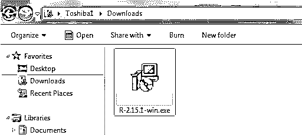

2.  双击文件将其打开。这将带你到一个安全警告窗口。

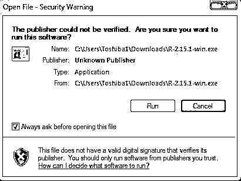

3.  单击运行。这将再次把您带到一个窗口，询问您是否允许来自未知发行者的以下程序对该计算机窗口进行更改。单击是。
4.  下一个窗口将允许您选择语言。选择语言，然后单击确定。
5.  这将打开安装向导窗口。

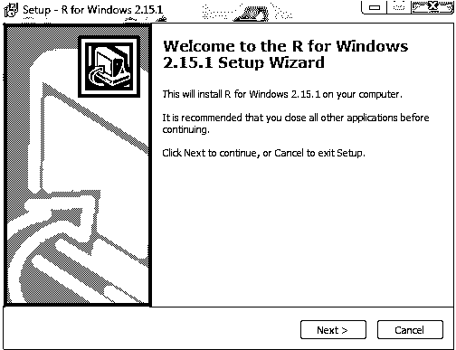

6.  单击下一步。在此之后，你将获得 GNU 通用公共许可证。阅读并点击下一步。

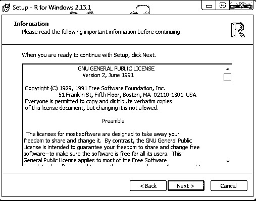

7.  在下一个窗口中，选择目标位置。默认位置是程序文件。选择并单击下一步。

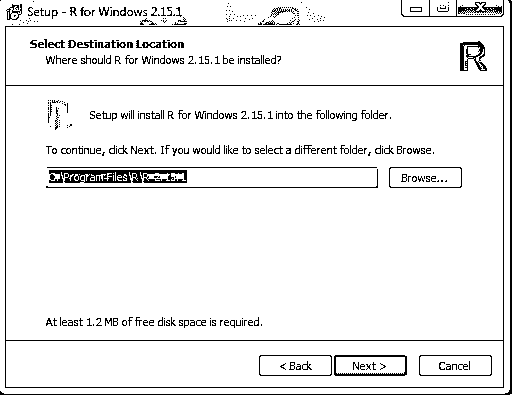

8.  下一个窗口将允许您选择要安装的组件。始终勾选核心文件复选框，并根据您的系统选择 32 位文件或 64 位文件。单击下一步

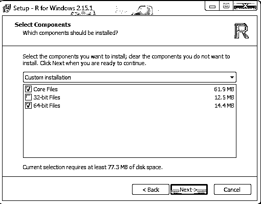

9.  下一个窗口将询问您是否想要自定义启动选项。选择否，然后单击下一步。

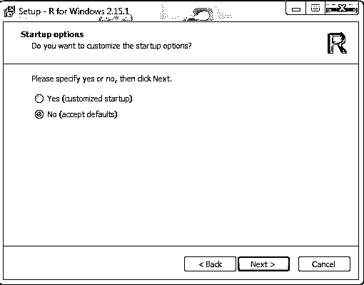

10.  下一个窗口将帮助您选择开始菜单文件夹。

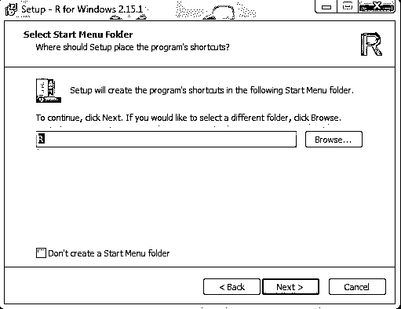

11.  单击下一步。下一个窗口允许您选择其他任务，并允许您创建桌面图标或快速启动图标。选中注册条目的两个复选框。选择下一步。

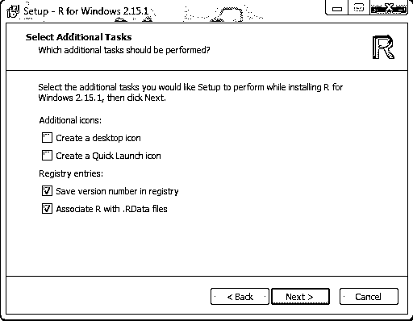

12.  r 将被安装。选择“完成”按钮以完成安装。

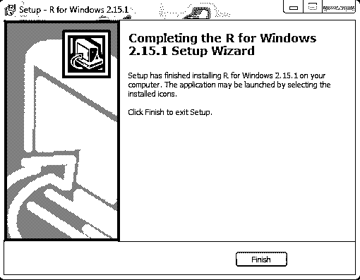

### 从 R 开始

成功安装 R 之后，您可以使用

开始菜单到所有程序 R

或者

你也可以双击桌面上的 R 快捷图标

会弹出 R 控制台，如下图所示。RGui 是 R 图形用户界面的简称。这是与 R 语言交互的最简单的方式。您可以配置 RGui 的某些方面。RGui 配置编辑器对话框如下图所示

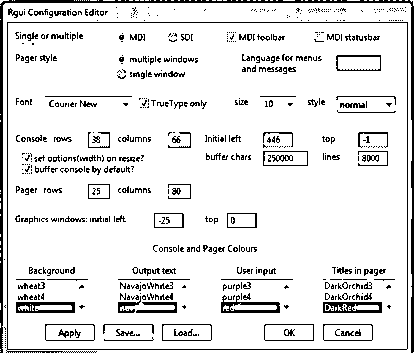

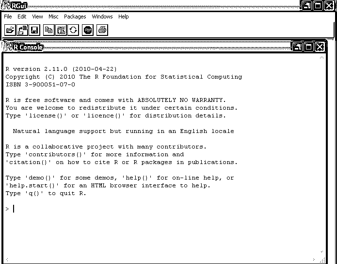

R 控制台是你可以输入命令的地方。有时，您需要在脚本中编写命令，然后运行这些命令。脚本是一个单独的窗口，您可以在其中键入命令。下图显示了如何打开一个脚本

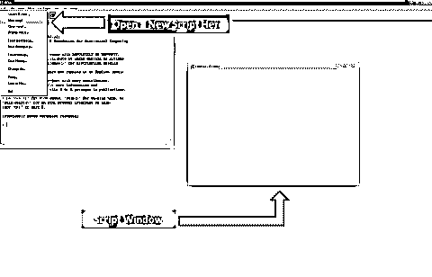

要运行脚本中的命令，可以将命令复制粘贴到命令窗口中，或者选择要运行的命令，然后单击运行行或选择按钮。

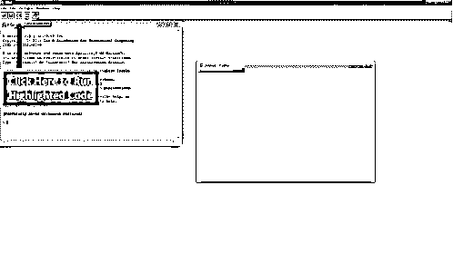

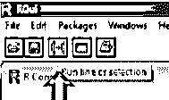

在控制台中键入命令时，您也可以使用向上箭头或向下箭头来使用以前使用过的命令。

### R 是如何工作的？

下图将向你解释 R 的工作流程

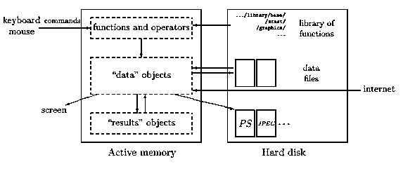

每当 R 运行时，变量、函数等都以带有名称的对象的形式存储在计算机的内存中。用户可以使用运算符和函数对这些对象执行各种操作。R 函数可以表示为下图所示

参数可以是默认定义的或由用户指定的对象。这些功能通过用户输入的命令来执行。结果显示在屏幕上，并作为一个对象存储在计算机内存中。

### R 编程语言基础

以下是使用 R 时需要了解的 R 编程语言的基础知识。

#### 命令、对象和函数

每当您想与 R 交互时，可以在控制台对话框中键入命令，然后按 enter 键。如果您输入了任何错误的命令，那么您将得到一条错误消息。您可以使用 r 轻松地进行简单的计算。您可以像在其他计算机应用程序中一样使用所有算术运算符，而无需键入等号。只需按 enter 键，您将获得输出。

**例子**

7+3

[1] 10

3^3

[1] 27

10* (10+2)

[1] 120

(2* (17.2+5))/56

[1] 0.7929

在上面的例子中，你可以在所有答案的前面找到【1】。这表示答案中只有一个数字。当答案中有多个数字时，它将帮助您在组内找到答案。如果添加了一个括号，那么这些计算将首先完成。如果添加了多个括号，您可以使用 Ad Infinitum 对括号进行分组。

#### 目标

如果您想要使用计算的输出来执行任何进一步的计算，那么您必须给它一个名称并命令 R 将它存储为一个对象。下面给出了一个例子

回答

在这个例子中，

#### 功能

r 有一大段代码，可以帮你做数学计算，画图表，做统计分析。这些代码被称为函数。每个函数名以一对括号结束，您也可以直接键入函数名和对象名来执行您需要的操作。

例子

sqrt (100)

[1] 10

您也可以添加对象名称来执行计算

罪(15+答案)

这里取对象“答案”的值用于计算。

### 向量、矩阵和数据框

r 是处理数字组或字符组对象的最佳解决方案。被组织成序列的一组数称为向量。组织成二维表格的组称为矩阵。在某些列中包含数字而在其他列中包含其他数据的表称为数据框。

#### 向量

让我们看一个例子来理解 vector 是什么以及它在 R 中是如何使用的

**例子**

一个

在本例中，您创建了一个名为 A 的新对象，它包含从 10 到 20 的数字序列。您可以通过简单地输入 A 并获得输出来检查这一点。下面解释一下。

英语字母表中第一个字母

[1] 10 11 12 13 14 15 16 17 18 19 20

向量中最重要的函数之一是 c()。它的意思是“连接”。下面给出一个例子。

B

b(按回车键)

[1] 2 4 6 8 10 12 14 16 18 20 22

您也可以在向量中执行算术运算。

A + B

[1] 12 15 18 21 24 27 30 33 36 39 42

#### 矩阵

当你有可以二维排列的数据时，那就叫做矩阵。矩阵由 Matrix()函数表示。

**例子**

mat2

下面详细解释上面的例子

mat2

matrix (data = seq(1，12)这里的对象是矩阵，矩阵中的数据是从 1 到 12 的数字序列

nrows =3，ncols = 4 表示行数为 3，列数为 4

dimnames = list (c("Row 1 "、" Row 2 "、" Row 3 ")，c("Col 1 "、" Col 2 "、" Col 3 "、" Col 4 ")提供行和列的名称。

输出如下所示

| mat1 | Col1 | 第二栏 | Col3 | Col4 |
| 第一行 | One | Four | Seven | Ten |
| 第 2 行 | Two | Five | Eight | Eleven |
| 第三排 | Three | Six | Nine | Twelve |

### 数据类型和数据框

数据总是被记录为数字或定量数据。数字对象可以进一步分为实数、复数或整数等等。如果你想知道你使用的向量是否是数字形式的，你可以使用函数 mode()并知道数字的类型，你可以使用函数 class()。

R 中有一种特殊类型的数据，叫做因子。这种类型的数据是事物被分成类的地方。

#### 下标

您可以使用下标找到数据结构中的单个数字或组。这将非常有用。

**例子**

X

在本例中，创建了一个名为 X 的向量，它由 10 个随机数组成，这些随机数来自平均值为 2、标准偏差为 0.1 的正态分布。

下标不一定必须是单个数字。它可以是一个对象，甚至是一个函数。逻辑表达式也可以包含在下标中。

#### 子集

子集是用于导出矩阵或数据帧的一部分的函数。它有三个主要部分——第一，子集的名称，第二，逻辑表达式，第三，通知 R 选择哪些列。

**例子**

Counts

从下表中，您可以创建一个子集

| 性 | 临时雇员 | 重量 | 重量 |
| 英语字母表中第十三个字母 | 热的 | Seventy-five | Two hundred and ninety-two |
| 英语字母表中第六个字母 | 热的 | Sixty-five | One hundred and eighty |
| 英语字母表中第十三个字母 | 寒冷 | Sixty-nine point zero three | One hundred and sixty-one |
| 英语字母表中第六个字母 | 寒冷 | Seventy-three point two five | Three hundred and twenty-three |

计数 2 =70)

这会给你一个重量小于 70 的输出。

### r 编程语言软件包

r 安装附带了所有基本的软件包。还有很多其他的包可以帮助你加载新的函数和对象。您也可以在 R 中创建新的包。下面列出了 R 安装过程中包含的一些基本包

*   格子木架
*   块
*   nlme
*   串
*   幸存

您可以使用安装的。packages()函数来了解关于已安装软件包的更多信息。

### 统计方法

r 自带各种内置的统计方法。他们是

*   平均
*   中位数
*   方式
*   分布
*   协方差
*   回归
*   非线性混合效果
*   GLM
*   GAM 和很多方法

r 还有各种统计程序，如下所示

*   经典参数测试
*   非参数检验
*   线性建模
*   非线性回归建模
*   群聚；聚集
*   缓和

### 结论

底线是 R 编程语言帮助研究人员和商业人士进行有效的数据分析。r 包使企业进行分析变得容易。它们不需要计算机程序员，也不需要大量的编程，使用 R. R 编程语言有助于以更吸引人的方式创建图形。

### 推荐文章

这是一本 R 编程语言指南。在这里，我们讨论了基础知识，它是如何工作的，软件包，以及详细的好处。您也可以阅读以下文章，了解更多信息——

1.  [Python 是脚本语言吗？](https://www.educba.com/python-scripting-language/)
2.  [如何安装 Angular 2？](https://www.educba.com/install-angular-2/)
3.  [如何安装 Swift？](https://www.educba.com/install-swift/)
4.  [MySQL 是编程语言吗？](https://www.educba.com/is-mysql-programming-language/)

