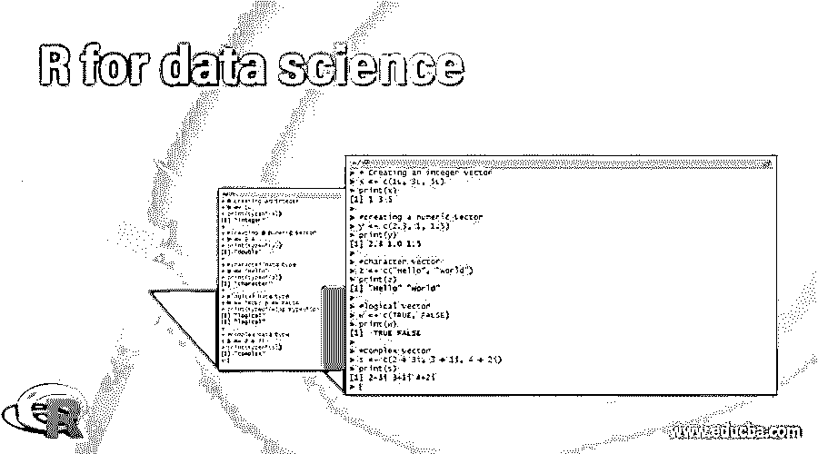
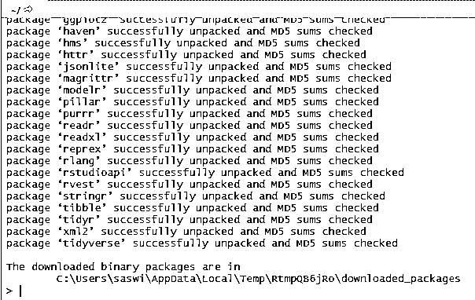
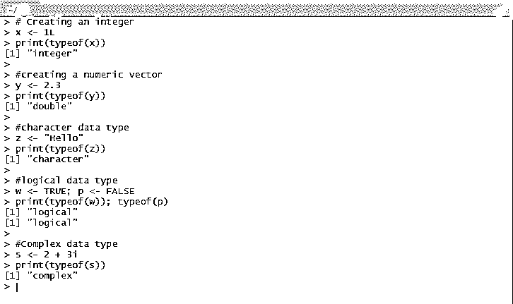
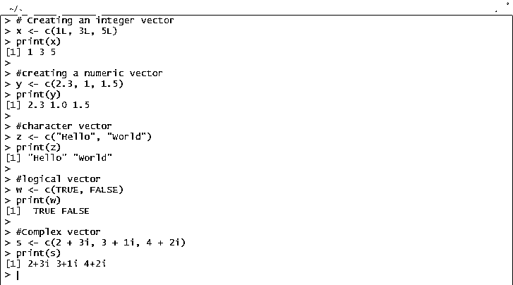
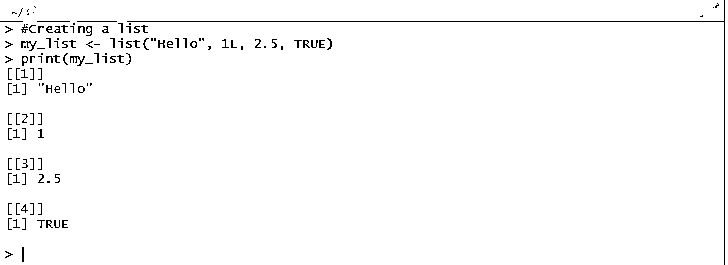

# r 代表数据科学

> 原文：<https://www.educba.com/r-for-data-science/>

## 数据科学的 R 编程介绍

r 编程是为统计计算和分析而开发的最通用的编程语言之一。然而，它已经慢慢地逐渐向数据科学发展，因为它拥有对数据科学有用的大多数特性。无论是语言的功能范围，还是您谈论的丰富的库和软件包集，这些库和软件包可以让任务在瞬间完成，或者您要求漂亮的图形既赏心悦目又能提供丰富的信息。通过这篇文章，我们将介绍数据科学的 R 编程。如何使用，有什么好处，等等？那么，我们开始吧。

### 什么是数据科学的 R 编程？

使用 R 编程及其高级工具，例如像 Diplyr、tidyverse、Ggplot2 等库。以及诸如线性逻辑回归、时间序列分析之类的技术，以及用于生成导致数据科学领域中业务增长的决定性信息的结果的技术，可以被认为是数据科学的 R 编程。嗯，这个定义可能因人而异。

<small>Hadoop、数据科学、统计学&其他</small>

### 如何使用数据科学的 R 编程？

我们可以深入到数据科学的 R 编程领域。然而，首先，我们应该始终保持我们的基本权利。因此，首先，我们可以学习如何安装软件包，然后学习 R 中的基本数据类型和数据结构。就本文而言，这些内容足以开始您的数据科学 R 编程之旅。当然，不用说，我们会在一段时间内学到很多东西。

### 如何在 R 中安装包？

最好的开始是通过学习如何在 R 中安装一个包。你知道，一旦你深入到 R 编程的世界中，有许多你将要安装的包；让我们看看如何安装一个。

`install.packages("tidyverse")`

上面的代码将帮助您安装名为“tidyverse”的包，其中有许多子包。安装完成后，您会在 R 控制台上看到一条消息，如下图所示。

嗯，这张图片只是我们在 r 上得到的软件包卸载消息的一小部分。当这个软件包被安装时，你会看到很多行。

### R 中的基本数据类型

R 编程中的基本数据类型如下:

*   整数
*   双精度(数字)
*   字符
*   逻辑学的
*   情结

`# Creating an integer
x <- 1L
print(typeof(x))
#creating a numeric vector
y <- 2.3
print(typeof(y))`

这里你可以看到，我们正在创建不同的变量，并分别给它们赋值。箭头状的符号在 R 编程中作为赋值操作符。此外，typeof()命令允许我们获取特定变量的数据类型。

让我们看看上面每一行代码的输出是什么。

如图所示，在我们运行 print(typeof())命令后，每个变量的数据类型都被打印出来。print()这个函数打印出作为参数提供给它的任何内容。

### R 中的基本数据结构

对于数据存储来说，R 中很少有更有用的数据结构。我们将在下面讨论这些数据结构:

*   矢量
*   [数]矩阵
*   数据帧
*   列表
*   工厂

#### 1.矢量

向量是 R 中的基本一维数据结构，由相同数据类型的元素组成，例如数字、整数、逻辑等。

为了创建一个包含多个元素的向量，我们在 r 中使用组合操作符。组合操作符在一个向量下保存多个相同数据类型的元素。例如，在 r 中，组合运算符可以表示为“c()”。让我们看一些如何在 r 中创建向量的例子。

`# Creating an integer vector
x <- c(1L, 3L, 5L)
print(x)
#creating a numeric vector
y <- c(2.3, 1, 1.5)
print(y)`

在这里，我们试图通过这段代码使用一个组合操作符来定义具有多个元素的不同向量。例如，请参见上面代码的输出，如下所示:

#### 2.[数]矩阵

矩阵是一种二维数据结构，包含许多行和列格式的元素。矩阵中的行数和列数可以相同，也可以不同。但是，矩阵中的所有元素必须是相同的数据类型。可以使用 r 中的 matrix()函数创建一个矩阵。

参见下面的代码来创建一个矩阵。

`#Creating a matrix
a <- c(1, 2, 3, 4, 5, 6, 7, 8, 9)
mat1 <- matrix(data = a, nrow = 3, ncol = 3)
print(mat1)`

这里你可以看到，在 matrix()函数下有三个重要的参数。" data= "参数要求输入数据值。“nrow=”和“ncol=”参数指定了我们希望在矩阵中出现的行数和列数。

查看上面代码的输出。

#### 3.数据帧

与矩阵一样，数据框可以由二维结构组成。然而，不同之处在于，我们只能在矩阵的行和列中拥有相同类型的数据。而数据帧可以包含跨行和列的不同类型的数据。

您可以使用 data.frame()函数创建数据框。

`#creating a data frame
my_df <- data.frame(col_1 = c(1, 2, 3, 4, 5), col_2 = c("s", "t", "u", "v", "w"))
print(my_df)`

在这段代码中，我们创建了一个包含两列的数据框，每一列都有不同的数据类型。请参见该示例的输出。

#### 4.列表

列表是唯一的一维数据类型，允许我们存储不同类型的数据。例如，我们可以使用 list()函数创建一个列表。请参见下面的示例:

`#Creating a list
my_list <- list("Hello", 1L, 2.5, TRUE)
print(my_list)`

让我们看看这个列表示例的输出:

#### 5.因素

该因素是分类数据，其中有不同层次。《出埃及记》是、否、真、假等。，我们可以使用 factor()函数创建一个因子数据结构。

`#creating a factor
my_fact <- factor(c("Yes", "No", "No", "Yes", "No"))
print(my_fact)`

在本例中，我们有两个因素的数据，“是”和“否”。请参见下面的输出:

### R 对于数据科学的重要性

r 编程在处理数据科学项目时非常重要，因为-

*   它是开源的，可以免费使用。无需支付额外/隐藏的费用。
*   它有丰富的库资源，可以处理我们在数据科学中需要做的几乎所有任务。
*   它有简单的编码风格和语言语法。
*   丰富的图形

### 结论

r 是数据科学中令人着迷的编程语言之一。它是开源的(意味着免费),拥有丰富的库资源，可以处理我们需要做的几乎每一项任务，并具有高级水平的视觉吸引力的图形。

### 推荐文章

这是一个数据科学的 R 指南。在这里，我们讨论如何将 R 用于数据科学及其重要性。您也可以看看以下文章，了解更多信息–

1.  [网络编程语言](https://www.educba.com/web-programming-languages/)
2.  [什么是编程语言？](https://www.educba.com/what-is-a-programming-language/)
3.  [后端编程语言](https://www.educba.com/back-end-programming-languages/)
4.  [R 编程语言](https://www.educba.com/r-programming-language/)

