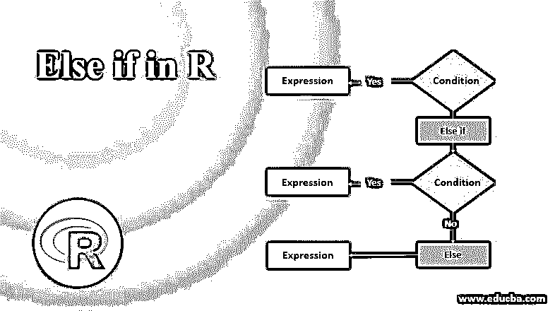
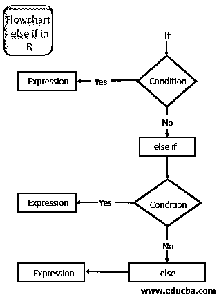
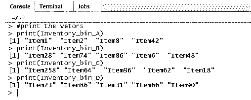
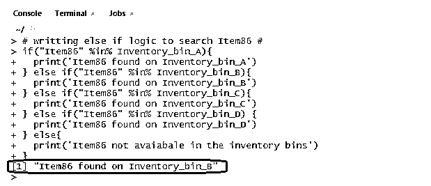
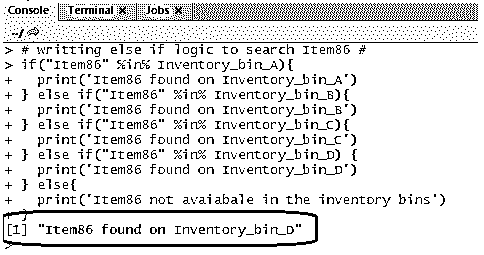

# 否则如果在 R

> 原文：<https://www.educba.com/else-if-in-r/>

## 对 Else if in R 的介绍

一种条件语句，用于在条件在 IF 语句中被证明为假之后验证某个条件，并随后在条件语句序列中传递给该条件，条件语句返回“假”时将控制权传递给条件块中的下一个 else if，或者如果其后没有 else if，则传递给 else if，如果条件被证明为真，则成功执行该条件下的所有语句，这种语句类似于其他几种编程语言的 else if 语句结构，在 R 编程中称为 else if。 **T2】**

**语法:**

<small>Hadoop、数据科学、统计学&其他</small>

*   Else if 在 R 语言中是保留关键字，它驻留在 if-else 块中，并根据条件处理相关的表达式。
*   以下是 R 语言中的 else if 语法:

`if (condition){
# expression
} else if (condition){
# expression
} else if (condition){
# expression
} else {
# statement
}`

*   条件写在()内，表达式写在{ }内，左括号和右括号的数量和位置决定了 else if 和 if 语句的范围。
*   else if 块的数量取决于编程逻辑或子程序实现。
*   此外，else if 块中表达式或逻辑的数量可能会因业务逻辑需求而异。
*   else if 块支持嵌套的或多组 if 语句，根据编程逻辑在其作用域内后跟 else if 语句。
*   在某些情况下，else 块是可选部分。
*   将默认表达式放在 else 块中是一种编程最佳实践，这样可以提高程序效率和代码完整性。

### 流程图

*   下图所示的流程图包含一个与 if 语句块和 else 语句块相关联的 else if 块。
*   “else if”和 else 关键字在流程图中用绿色表示。
*   该条件以蓝色表示，评估为真或假，并路由到是或否方向。
*   表达式被移植为灰色，表示处理器包含单个或一组语句。

### if 语句在 R 中如何工作？

1.if-else 和 else if 关键字允许与评估条件相关联。

2.条件根据条件语句返回 TRUE 或 FALSE 值。

3.当 R 程序开始在运行时逐行检查代码时:

*   它首先检查并评估 If 语句中出现的条件的返回值。
*   如果条件返回一个真布尔值，R 将在 If 块中路由，并处理在该块中编写的表达式或编程逻辑。
*   如果它发现假布尔值，它将不会进入 If 块，而是检查下一个可用的 else if 块。
*   并且如果在 if-else if 语法序列中找到该语句，则程序控制移至 else if 语句。
*   在下一步中，它将检查和评估与 else if 块关联的条件语句。
*   如果与 else if 块相关联的条件语句评估为返回真布尔值，则 R 处理 else if 块内可用的代码。
*   但是，如果 else 的条件返回一个错误的布尔值，R 将忽略该代码并检查下一个 else if 语句。
*   如果它随后找到另一个 else if 块，它会以同样的方式处理该 else if 块。
*   这种迭代一直持续到为 if 块范围找到所有可用的 else if 块。
*   如果 R runtime 没有找到任何 else if 块，它将搜索 else 语句并处理与 else 块相关的代码。并完成 IF 否则检查逻辑。
*   在这种情况下，如果 R 运行时没有找到任何 else if 或 else 块，它将在 if 块范围之后立即完成 if-else 检查逻辑。

### 在 R 中的 Else if 示例

下面给出了在 R 终端上使用 R studio IDE 的例子。

#### 业务场景

在一家制造公司中存在四个库存箱，根据项目编号标识，项目被存储在多个箱中，R 程序将把箱项目分配给向量，并执行 else if 逻辑以找到特定的项目箱并显示相应的箱信息。此 R 代码将代表对某个项目的库存箱跟踪。

我们将在 R 代码中声明赋值 4 个向量如下:

**R 代码:**

`# Assign vector values
Inventory_bin_A <- c("Item1","Item2","Item8","Item42")
Inventory_bin_B <- c("Item28","Item74","Item86","Item6","Item48")
Inventory_bin_C <- c("Item258","Item64","Item96","Item62","Item18")
Inventory_bin_D <- c("Item23","Item86","Item31","Item66","Item90")`

*   我们将在 R studio 中打印向量，以检查控制台上的赋值是否正确。

**R 代码:**

`#print the vectors
print(Inventory_bin_A)
print(Inventory_bin_B)
print(Inventory_bin_C)
print(Inventory_bin_D)`

**输出:**

*   下一步，我们将实现 R 中的 else if 语句来检查‘item 86’属于哪个库存 bin。

**R 代码:**

`# writing else if logic to search Item86 #
if("Item86" %in% Inventory_bin_A){
print('Item86 found on Inventory_bin_A')
} else if("Item86" %in% Inventory_bin_B){
print('Item86 found on Inventory_bin_B')
} else if("Item86" %in% Inventory_bin_C){
print('Item86 found on Inventory_bin_C')
} else if("Item86" %in% Inventory_bin_D) {
print('Item86 found on Inventory_bin_D')
} else{
print('Item86 not available in the inventory bins')
}`

**输出:**

*   R 控制台输出显示在 Inventory_bin_B 上找到的 Item86。
*   正如您在作业输出库存中观察到的，项目 86 预设在两个箱子中:

1.  库存 _ 仓位 _B
2.  库存 _ 仓位 _D

*   基于示例 R，检查条件的真布尔返回值，一旦得到第一次出现的真条件，就不再检查其他 if 条件。
*   接下来，我们将从 bin Inventory_bin_B 中删除 Item86，并再次运行代码。

**R 代码:**

`# Removing Item86 from Bin B
Inventory_bin_B<-Inventory_bin_B[!Inventory_bin_B %in% c("Item86")] print(Inventory_bin_B)`

**输出:**

*   现在，物料 86 在 Inventory_bin_B 中不可用
*   我们将再次运行 else if 代码并检查输出

**输出:**

此 R 控制台输出通过 else if 代码显示更新的库存' Inventory_bin_D' bin 信息。

### 结论

Else if 在 R 语言中是一个方便的编程特性，可以在几个地方实现，比如循环内部或循环外部。它帮助 R 程序员编写简化的逻辑，并提供更好的代码块开发。else if 块增加了代码可读性。

### 推荐文章

这是 R 中 Else if 的指南，这里我们讨论语法，Else if 语句如何在 R 中工作？还有例子。您也可以看看以下文章，了解更多信息–

1.  [Matlab 中的 IF-Else 语句](https://www.educba.com/if-else-statement-in-matlab/)
2.  [Python 中的 If Else 语句](https://www.educba.com/if-else-statement-in-python/)
3.  [人工智能中的爬山](https://www.educba.com/hill-climbing-in-artificial-intelligence/)
4.  [C 语言中的 If-else 语句](https://www.educba.com/if-else-statement-in-c/)
5.  [PHP |中的 if else 语句如何工作？](https://www.educba.com/if-else-statement-in-php/)
6.  [JavaScript 中的矢量示例指南](https://www.educba.com/vectors-in-javascript/)

