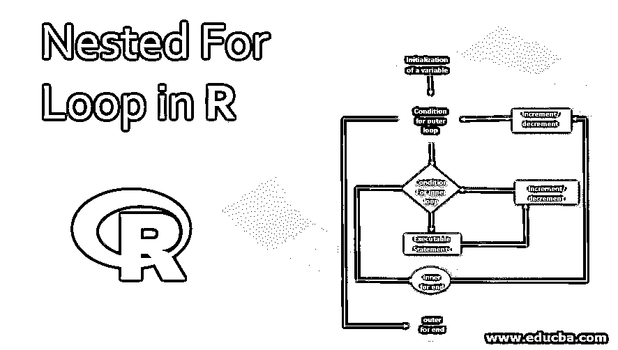
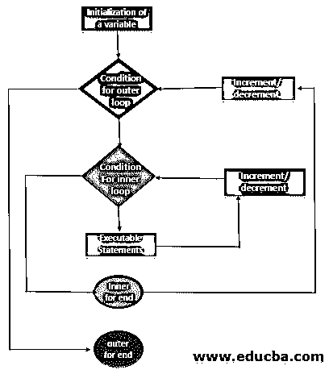
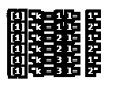
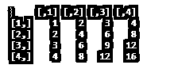

# R 中嵌套的 For 循环

> 原文：<https://www.educba.com/nested-for-loop-in-r/>

## R 中嵌套 For 循环介绍

在 R 中的嵌套 for 循环中，R 利用控制结构来管理表达式的执行，一个这样的控制结构是嵌套 For 循环 a，类似于基本的“For”循环执行。它可以被定义为在第一个“for”循环中放置一个“for”循环，在某些情况下被称为嵌套或循环的循环，它承担两个循环的责任，这样外部循环控制整个内部详细信息的重复次数，直到它为假，换句话说，内部循环执行外部 for 循环的每次执行的 n 次，并且它也是使用 R 编程语言的一个很好的工具。

**语法:**

<small>Hadoop、数据科学、统计学&其他</small>

基本语法如下所示:

`for (variable in sequence) {
for (variable in sequence)
{
expression      // expression statements can be a single statement of R or group of statements.
} }
Here variable implies iteration value used in a sequence and sequence is a set of values or objects that could be numbers or characters.
Sample:
for(i in 1:n)
{
for(j in 1:n)
{
// block of statement
}
}`
在上面的通用语法中，我们可以看到两个循环语句。嵌套循环主要用于多维数组存储目的，这被数据科学家广泛使用。我们可以使用数字和字符索引。

### 流程图结构

下面的流程图显示了循环结构的 R:在下面的图中，对于序列中的每个值，循环都被执行。当没有值时，它返回到 end。表示嵌套“For”循环步骤的流程图:

### R 中嵌套的 For 循环是如何工作的？

嵌套 for 循环用于通过对特定值进行特定设置来操作矩阵，被认为是 R 编程中的基础技能。如果我们希望从相应的行和列索引中提取一个特定的值，这将更加有益。例如，让我们看下面的代码:

**步骤:**

*   最初，外部循环指定 k=1L，并执行它对内部循环的语句，同时内部 for 循环指定 l=1L，因此打印 k=1，l=1。现在内循环执行自己，因为语句为真，现在‘l’增加到 1，将设置为 l=2L，K 值保持不变，我们得到的结果是 k=1 l=2。同理，对下一个内循环 k=1 l=3 也这样做。
*   现在，内部循环被设为假并结束，我们继续第一个外部循环，它取 k=2L，并执行下面的语句，这是一个内部循环，并分配与上述过程相同的 l=1L。重复以下迭代，直到循环退出。

`for (k in 1:3) {
for (l in 1:2) {
print(paste("k =", k, "l= ",l))
}
}`

现在让我们看看它是如何在一个二维数组中使用数学概念矩阵的。首先，为一个嵌套循环创建一个代码，该循环将多个行和列表示为整数位置。

`res = matrix(nrow=4, ncol=4) # create a 4 x 4 matrix (of 4 rows and 4 columns)
for(i in 1:nrow(res))  // Assigned a variable  ‘i’for each row
{
for(j in 1:ncol(res)) // Assigned a variable  ‘j for each column
{
res[i,j] = i*j           // calculating product of two indices
}
}
print(res)`

**NOTE*****:** To work efficiently using for loop in R it is better to ignore vectorized elements and allow object allocation.*

### R 中嵌套 For 循环的示例

下面是 R 中嵌套 For 循环的例子:

#### 示例#1

使用简单的 For 结构。

**代码:**

`for(i in 1:4)
{
for(j in 1:1)
{
print(i*j);
}
}`

**输出:**

#### 实施例 2

执行嵌套 for 循环和 if 语句来完成一些复杂的任务。在下面的例子中，我们将使用 matrix()函数声明一个矩阵，并使用 if 语句检查变量 i=j。

**代码:**

`mt= 5
nt=5
cter=0
mym = matrix(0,mt,nt)
for (i in 0:mt) {
for (j in 0:nt) {
if(i==j) {
break;
} else
{
mym[i,j] = i*j
cter=cter+1
}
}
print(i*j)
}
print(cter)`

 `**输出:**

#### 实施例 3

用矩阵实现按行和列打印字母。这里我创建了一个 3x 4 的矩阵。

**代码:**

`res <- matrix(1:12, ncol = 4,
dimnames = list(LETTERS[1:3], letters[4:7]))
print(res)
for (rname in c("A", "C")) {
for (cname in c("f", "g")) {
print(paste("Value of row", rname, "and column",
cname, "is", res[rname, cname]))
}
}`

**输出:**

#### 实施例 4

使用数学函数 abs()显示正绝对值。

**代码:**

`z <- matrix(NA_integer_, nrow = 4, ncol = 4)
for (m in 1:4) {
for (n in 1:4) {
z[m, n] <- abs(m - n)
}
}
print(z)`

**输出:**

#### 实施例 5

用嵌套 For 循环矩阵实现 R 语言数据帧。

**代码:**

`x=5; y=5;
mat<-replicate(x, rnorm(y))
mydfr=data.frame(mat)
system.time(
for (m in 1:x) {
for (n in 1:y) {
mydfr[m,n]<-mydfr[m,n] + 5*sin(0.62*pi)
}
}
)`

使用 system.time()函数创建了具有 5 个观察值和 5 个变量的数据框的正态随机数，以检查执行时间。

**输出:**

### 结论

现在总结一下，R 编程中的 for 循环是最著名也是最重要的概念，它的结构表明迭代的次数是预先知道和固定的。如果迭代的次数事先不知道或者不可预测会发生什么，为了克服这个问题而使用循环。因此，在这篇 R 文章中，我们详细研究了它们的语法，以及如何通过一个例子以不同的顺序操作它们。

### 推荐文章

这是一个关于 R 中嵌套 For 循环的指南，这里我们讨论一个关于 R 中嵌套 For 循环的简要概述，它的例子以及它的代码实现。您也可以浏览我们推荐的其他文章，了解更多信息——

1.  [R 中生存分析介绍](https://www.educba.com/survival-analysis-in-r/)
2.  [用类型](https://www.educba.com/predict-function-in-r/)预测 R 中的函数
3.  [R 中绘图功能概述](https://www.educba.com/plot-function-in-r/)
4.  [R 中的 Switch 语句(示例)](https://www.educba.com/switch-statement-in-r/)
5.  [Python 绝对值|如何工作？](https://www.educba.com/python-absolute-value/)
6.  [c++中嵌套循环的例子](https://www.educba.com/nested-loop-in-c-plus-plus/)

`