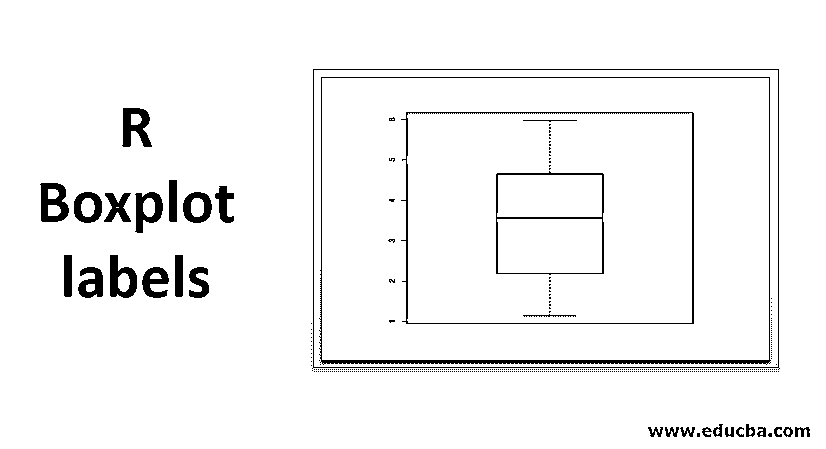
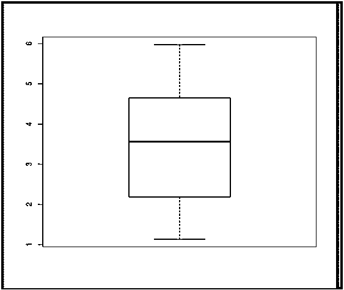
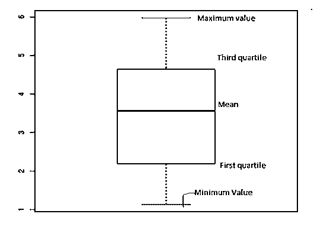
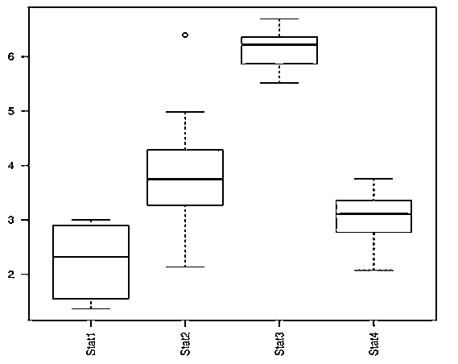
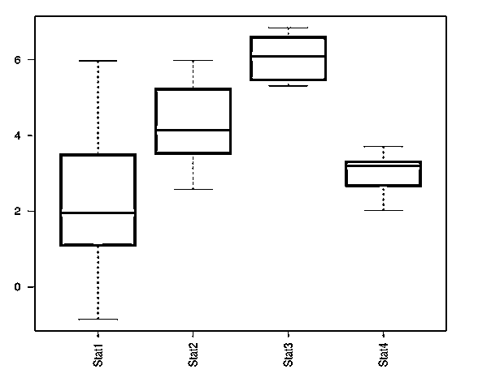
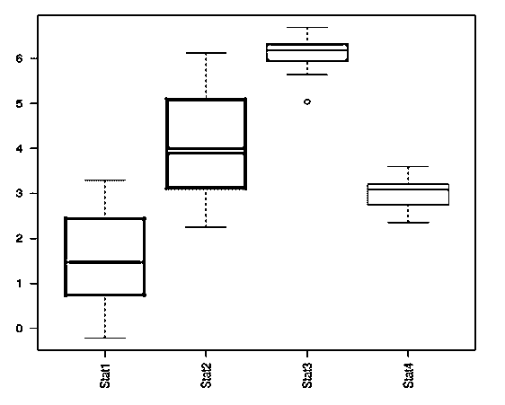
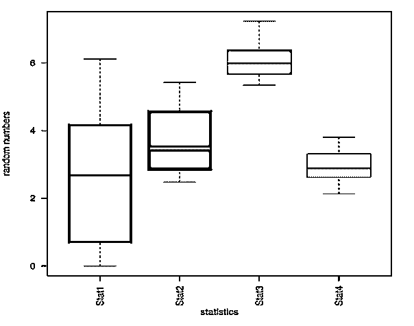
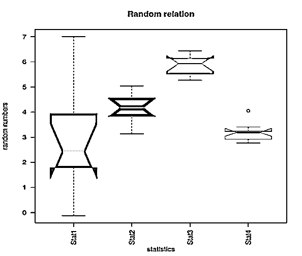

# R Boxplot labels

> 原文：<https://www.educba.com/r-boxplot-labels/>

## R 中的箱线图标签介绍

在箱线图中使用标签，有助于根据数据集的平均值、中值和方差来表示数据分布。r 箱线图标签通常分配给箱线图的 x 轴和 y 轴，以增加箱线图的含义。箱线图在箱线图的起点和终点显示最小值和最大值。箱线图的中心显示了平均值标签，它还显示了与平均值位置相关的第一个和第三个四分位数标签。

**绘制箱线图**

<small>Hadoop、数据科学、统计学&其他</small>

*   我们需要五个输入值，如均值、方差、中值、第一和第三个四分位数。
*   识别数据中是否有异常值。
*   设计模型来绘制数据。

【boxplot()函数下的参数

1.  **公式:**该参数允许将数值分成几组。
2.  **数据**:包含数据框或列表的输入数据。
3.  **子集:**可选矢量参数，指定绘图的子集。
4.  **xlab:** x 轴标注
5.  **ylab:** y 轴标注。
6.  **范围:**范围指定绘图扩展。
7.  **动作:**指定有空值时会发生什么。要么忽略响应，要么忽略值。

### 创建随机数据

我们可以通过 rnorm()函数创建随机样本数据。

现在让我们使用 rnorm()创建 10 个值的随机样本数据。

`data<-data.frame(Stat1=rnorm(10,mean=3,sd=2))`

上述命令生成 10 个平均值为 3、标准偏差为 2 的随机值，并将其存储在数据帧中。

当我们打印数据时，我们得到下面的输出。

**Stat1**

1  2.662022

2  2.184315

3  5.974787

4  4.536203

5  4.808296

6  3.817232

7  1.135339

8  1.583991

9  3.308994

10 4.649170

我们可以将相同的输入(数据)转换为生成绘图的 boxplot 函数。

我们将更多的值添加到数据中，并观察曲线如何变化。

`data<-data.frame(Stat1=rnorm(10,mean=3,sd=2),
Stat2=rnorm(10,mean=4,sd=1),
Stat3=rnorm(10,mean=6,sd=0.5),
Stat4=rnorm(10,mean=3,sd=0.5))
boxplot(data)`

添加更多的随机值并用它来表示一个图形。

以下是存储在数据变量中的值。

| 统计 1 | 统计 2 | stat3 | 统计 4 |
| 3.795465 | 4.21864 | 5.827585 | 2.157315 |
| 0.911726 | 4.09119 | 6.260811 | 2.26594 |
| 3.707828 | 3.35987 | 5.88945 | 3.714557 |
| 0.115772 | 4.5123 | 5.934858 | 2.40645 |
| 0.697556 | 2.15945 | 6.81147 | 2.571304 |
| 5.129231 | 3.2698 | 6.250068 | 3.025175 |
| 5.404101 | 4.38939 | 5.670061 | 2.9901 |
| 1.455066 | 3.13059 | 5.692323 | 2.69693 |
| 0.868636 | 5.42311 | 5.415435 | 2.674768 |
| 2.14113 | 3.90728 | 6.206059 | 2.806656 |

下面是包含 40 个值的箱线图。y 轴上是 1-7 个数字，x 轴上是 stat1 至 stat4。

我们可以通过使用另一个名为 las=2 的参数来更改 x 轴上的文本对齐方式。

### 分析 R 箱线图标签的图形

我们已经在数据框中给出了输入，我们看到了上面的图。

为了理解这些数据，让我们看看 stat1 的值。

该图代表所有 5 个值。从底部的最小值开始，然后是第三个四分位数、平均值、第一个四分位数和最小值。

上面的图在 x 轴上水平对齐文本。

### 改变颜色

在上面所有的例子中，我们已经看到了黑白的情节。让我们看看如何改变图中的颜色。

我们可以在 boxplot()函数中添加参数 col = color。

`data<-data.frame(Stat1=rnorm(10,mean=3,sd=2),
Stat2=rnorm(10,mean=4,sd=1),
Stat3=rnorm(10,mean=6,sd=0.5),
Stat4=rnorm(10,mean=3,sd=0.5))
boxplot(data,las=2,col="red")
data`

下面我们可以看到红色的输出图。

使用上面同样的代码，我们可以给情节添加多种颜色。

`data<-data.frame(Stat1=rnorm(10,mean=3,sd=2),
Stat2=rnorm(10,mean=4,sd=1),
Stat3=rnorm(10,mean=6,sd=0.5),
Stat4=rnorm(10,mean=3,sd=0.5))
boxplot(data,las=2,col=c("red","blue","green","yellow")
data`

#### 添加标签

我们可以使用 boxplot()函数中的 xlab、ylab 参数添加标签。

`data<-data.frame(Stat1=rnorm(10,mean=3,sd=2),
Stat2=rnorm(10,mean=4,sd=1),
Stat3=rnorm(10,mean=6,sd=0.5),
Stat4=rnorm(10,mean=3,sd=0.5))
boxplot(data,las=2,xlab="statistics",ylab="random numbers",col=c("red","blue","green","yellow"))
data`

通过使用主参数，我们可以向绘图添加标题。

`data<-data.frame(Stat1=rnorm(10,mean=3,sd=2),
Stat2=rnorm(10,mean=4,sd=1),
Stat3=rnorm(10,mean=6,sd=0.5),
Stat4=rnorm(10,mean=3,sd=0.5))
boxplot(data,las=2,xlab="statistics",ylab="random numbers",main="Random relation",notch=TRUE,col=c("red","blue","green","yellow"))
data`

凹口参数用于使情节更容易理解。因为在上面的图中，stat1 到 stat4 的中间值不匹配。

### 箱线图的优缺点

以下是箱形图的不同优点和缺点:

#### 优势

*   使用箱线图标签可以轻松汇总大量数据。
*   在坐标轴上显示范围和数据分布。
*   它表示对称和偏斜
*   帮助识别数据中的异常值。

#### 不足之处

*   只能用于数值数据。
*   如果数据中有差异，那么箱线图就不准确。

**备注:**

1.  图表必须正确标注。
2.  尺度很重要；改变比例可以为数据提供不同的视图。
3.  用正确的天平比较数据应该是一致的

### 结论–R 箱线图标签

在箱线图的帮助下，数据分组变得很容易。箱线图支持多个变量以及各种优化。我们也可以根据数据改变尺度。

箱线图可用于比较各种数据变量或数据组。

箱线图的可用性简单方便。我们需要一致的数据和正确的标签。箱线图通常用于数据科学，甚至被销售团队用来分组和比较数据。Boxplot 提供了关于数据潜力的见解，以及可以提高销售额的优化措施。

箱线图是测试数据的一种有趣的方式，可以洞察数据的影响和潜力。

### 推荐文章

这是 R 箱线图标签的指南。这里我们讨论 boxplot()函数下的参数，如何创建随机数据，改变颜色和图形分析以及优缺点。您也可以阅读以下文章，了解更多信息——

1.  [数据可视化的类型](https://www.educba.com/types-of-data-visualization/)
2.  [数据仓库实现](https://www.educba.com/data-warehouse-implementation/)
3.  [数据科学技术](https://www.educba.com/data-science-techniques/)
4.  [什么是数据立方体？](https://www.educba.com/what-is-data-cube/)
5.  [R 中绘图函数的类型](https://www.educba.com/plot-function-in-r/)
6.  [MATLAB 绘图功能完整指南](https://www.educba.com/matlab-plot-function/)

