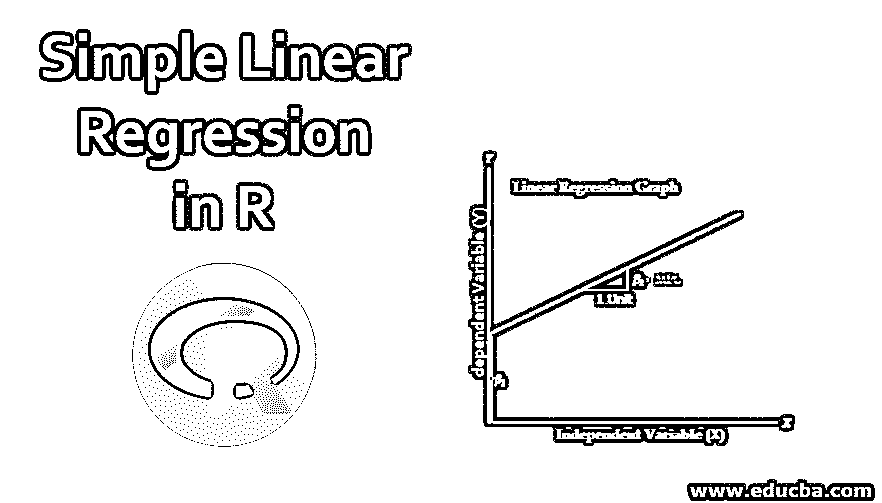
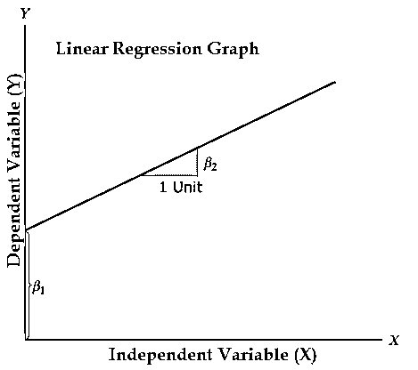
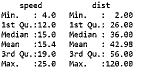
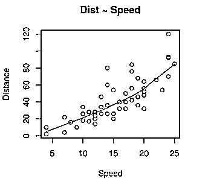
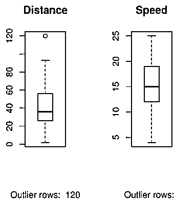
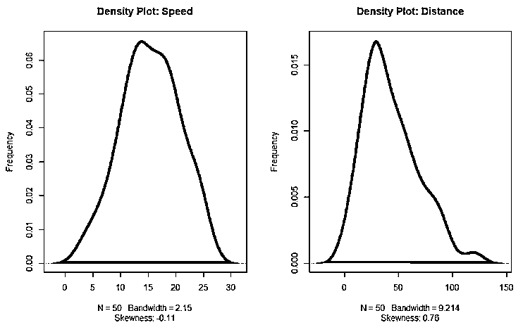
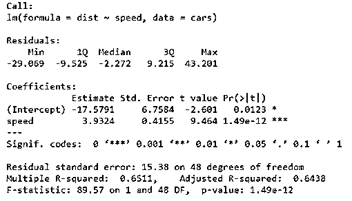

# R 中的简单线性回归

> 原文：<https://www.educba.com/simple-linear-regression-in-r/>

## R 中简单线性回归概述

在 R.中，涉及以一个变量用于确定另一个变量的值的方式建立两个变量之间的关系的统计概念被称为简单线性回归。这种关系是以通过复杂计算通过两个变量的不同值获得的数学方程的形式建立的。仅仅建立关系是不够的，数据还必须满足一定的假设。r 编程提供了一个有效且健壮的机制来实现这个概念。

### R 中简单线性回归的优势

使用线性回归模型的优点:

<small>Hadoop、数据科学、统计学&其他</small>

*   稳健的统计模型。
*   帮助我们进行预测和预报。
*   它帮助我们做出更好的商业决策。
*   这有助于我们在逻辑方面做出理性的判断。
*   我们可以对这个模型中遗漏的错误采取纠正措施。

### 线性回归模型方程

线性回归模型的方程如下:

`Y = β1 + β2X + ϵ`

*   自变量是 X
*   因变量是 Y
*   β1 是回归模型的截距
*   β2 是回归模型的斜率
*   ϵ是错误的术语

我们将使用 Rstudio 内置的“汽车”数据集。

让我们看一下汽车数据集的结构。

为此，我们将使用 Str()代码。

`str(cars)`

这里我们可以看到我们的数据集包含两个变量速度和距离。

速度是自变量，距离是因变量。

让我们看一下汽车数据集的统计视图。

为此，我们将使用 Summary()代码。

`summary(cars)`

在速度变量中，我们的最大观测值是 25，而在距离变量中，最大观测值是 120。类似地，最小速度观察值为 4，最小距离观察值为 2。

### 情节视觉化

为了更好地了解数据，我们将使用一些可视化工具:

*   **散点图:**有助于确定两个变量之间是否存在任何类型的相关性。
*   **箱线图:**帮助我们显示数据的分布。基于最小值、第一个四分位数、中值、第三个四分位数和最大值的数据分布。
*   **密度图:**帮助我们以图形方式显示概率密度函数。

#### 1.散点图

这将有助于可视化 X 变量和 Y 变量之间的任何关系。

`#Scatterplotscatter.smooth(x=cars$speed, y=cars$dist, main="Dist ~ Speed", xlab = "Speed", ylab = "Distance" )`

这里的散点图表示因变量(距离)和自变量(速度)之间存在线性增长关系。

#### 2.箱形图

箱线图有助于我们识别 X 和 Y 变量中的异常值(如果有的话)。

箱形图的代码如下所示:

`#Scatterplot
scatter.smooth(x=cars$speed, y=cars$dist, main="Dist ~ Speed", xlab = "Speed", ylab = "Distance" )
#Divide graph area in 2 columns
par(mfrow=c(1, 2))
#Boxplot of Distance
boxplot(cars$dist, main="Distance", sub=paste("Outlier rows: ", boxplot.stats(cars$dist)$out))
#Boxplot for Speed
boxplot(cars$speed, main="Speed", sub=paste("Outlier rows: ",
boxplot.stats(cars$speed)$out))`

#### 3.密度图

这个图有助于了解分布的正态性

`#Divide graph area in 2 columns
par(mfrow=c(1, 2))
#Density plot for Speed variable
plot(density(cars$speed), main="Density Plot: Speed", ylab="Frequency", sub=paste("Skewness:",
+     +round(e1071::skewness(cars$speed), 2)))
polygon(density(cars$speed), col="red")
#Density plot for Distance
plot(density(cars$dist), main="Density Plot: Distance", ylab="Frequency", sub=paste("Skewness:",
+     +round(e1071::skewness(cars$dist), 2)))
polygon(density(cars$dist), col="red")`

### 相关性分析的类型

这种分析有助于我们找到变量之间的关系。

相关性分析的类型:

1.  弱相关性(接近 0 的值)
2.  强相关性(接近 0.99 的值)
3.  完全相关
4.  不相关
5.  负相关(-0.99 到-0.01)
6.  正相关(0.01 到 0.99)

`#Correlation between speed and distance
cor(cars$speed, cars$dist)`

0.8068949 表示两个变量(速度和距离)之间有很强的正相关性。

### 线性回归模型

现在我们将开始模型中最重要的部分。

线性回归用的公式是 lm(因变量~自变量)

`#linear regression model
linear_regression <- lm(dist ~ speed, data=cars)
print(linear_regression)`

我们将在我们的[回归分析](https://www.educba.com/what-is-regression-analysis/)方程中拟合这些输出

Y = β1 + β2X + ϵ

距离= 17.579+3.932 速度

为了获得线性回归模型的摘要，我们将使用代码 summary()

`linear_regression <- lm(dist ~ speed, data=cars)
summary(linear_regression)`

现在我们将理解这些结果意味着什么。

*   R 的平方(R 2 )也称为决定系数。它会告诉我们因变量中有多大比例的变化是由自变量引起的。它总是介于 0 和 1 之间。R 的平方值越高，模型越好。
*   调整后的 R 的平方，这是一个更好的统计考虑，如果我们想看到我们的模型的可信度。调整后的 R 2 也有助于我们检查模型的良好性，如果我们添加一个没有改善现有模型的变量，它也会惩罚模型。
*   根据我们的模型总结，调整后的 R 的平方是 0.6438，或者我们可以说数据中 64%的差异是由模型解释的。
*   此外，有许多统计数据来检查我们的模型的可信度，如 t 统计，F 统计等。

### 推荐文章

这是一个关于 R 中简单线性回归的指南。这里我们讨论了 R 中简单线性回归的介绍、优点、一些绘图可视化以及相应示例的类型。您也可以阅读以下文章，了解更多信息——

1.  [多项式回归](https://www.educba.com/polynomial-regression/)
2.  [线性回归建模](https://www.educba.com/linear-regression-modeling/)
3.  [R |中的散点图如何创建？](https://www.educba.com/scatterplots-in-r/)
4.  [什么是线性回归？](https://www.educba.com/what-is-linear-regression/)

