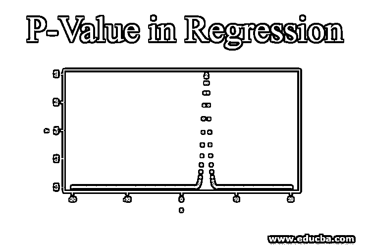
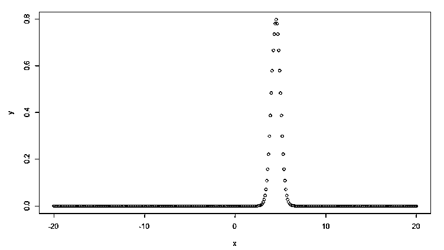

# 回归中的 p 值

> 原文：<https://www.educba.com/p-value-in-regression/>

## 回归中的 P 值简介

p 值被定义为接受或拒绝零假设的最重要步骤。因为它测试其系数结果为零的零假设，即对于 p 值的较低值(< 0.05)，零假设可以被拒绝，否则零假设将成立。换句话说，由于预测值的变化与响应变量的变化相关，因此具有较低 p 值的预测值可能是对模型更有意义的补充。拒绝或接受零假设是重要的步骤之一。

在我们从 P 值开始之前，我们必须解码什么是假设检验。假设检验是一种表明基于样本的解释对整个群体是否正确的检验。在进行假设检验时，我们必须事先指定无效假设和替代假设。

<small>Hadoop、数据科学、统计学&其他</small>

**零假设:**表示在我们正在进行的研究中，两个变量之间没有统计学意义。

**备择假设:**表明两个变量之间有统计学意义。

让我们用一些例子来理解这些概念。

想象一下，在我们生活的世界里，医生给病人看病的平均咨询时间是 15 分钟或更少。这是我们最初的信念，即在 15 分钟内，医生能够明智地处理病人的问题，因此我们可以说，咨询的平均时间是 15 分钟或更少。

无效假设和替代假设是:

**零假设:**医生的平均咨询时间为 15 分钟或更少。我们假设零假设是一个普遍信念的陈述。喜欢每一个普通的同时又感觉很自然。

**替代假设:**医生平均问诊时间超过 15 分钟。我们假设替代假设是抛弃最初信念的陈述。

### 正态分布

现在我们将讨论正态分布(也称为高斯分布)。此分布用于查看数据分布。有时研究者也把它称为概率密度函数。

#### 正态分布的特征

*   它是中心极限定理的一部分
*   它产生一个钟形的弯曲
*   在这个分布中，均值=中位数=众数
*   一半的数据值小于 50%，一半的数据值大于 50%
*   它有两个参数，一个是平均值，另一个是标准差

**语法**

R 中用于正态分布图的语法如下所示:

`# Create a sequence of numbers between -20 and 20 incrementing by 0.1.
x <- seq(-20, 20, by = .1)
# Choose the mean as 4.5 and standard deviation as 0.5.
y <- dnorm(x, mean = 4.5, sd = 0.5)
plot(x,y)`

其中 x 是一个数字向量。平均值是我们从总体中得到的样本的平均值。

标准差是一组值和平均值之间的变化量

### 显著水平

显著水平告诉我们，x%是当零假设实际上为真时拒绝零假设的概率。这里我们的意思是说，我们将拒绝零假设，即平均咨询时间为 15 分钟或更少，实际上咨询时间少于或等于 15 分钟，但我们仍然拒绝这一假设。显著水平也称为“α”，表示为“α”。

### 回归中的 p 值

我们没有讨论在什么基础上我们可以接受或拒绝零假设，让我们现在讨论一下。

为了接受或拒绝零假设，我们必须考虑模型的 P 值。这里的模型可以是回归分析。现在，我们将讨论如何计算回归模型的 P 值以及如何解释它。

#### 1.资料组

这里我们将使用“USArrest”数据集，它在 Rstudio 中可用。

|  | **谋杀被捕人数(每 10 万人)** | **袭击逮捕(每 10 万人)** | **城市人口百分比** | **强奸被捕人数(每 10 万人)** |
| 阿拉巴马州 | Thirteen point two | Two hundred and thirty-six | Fifty-eight | Twenty-one point two |
| **阿拉斯加** | Ten | Two hundred and sixty-three | Forty-eight | Forty-four point five |
| **亚利桑那州** | Eight point one | Two hundred and ninety-four | Eighty | Thirty-one |
| 阿肯色州 | Eight point eight | One hundred and ninety | Fifty | Nineteen point five |
| **加州** | Nine | Two hundred and seventy-six | Ninety-one | Forty point six |
| 科罗拉多州 | Seven point nine | Two hundred and four | Seventy-eight | Thirty-eight point seven |
| 康涅狄格州 | Three point three | One hundred and ten | Seventy-seven | Eleven point one |
| 特拉华州 | Five point nine | Two hundred and thirty-eight | Seventy-two | Fifteen point eight |
| **佛罗里达** | Fifteen point four | Three hundred and thirty-five | Eighty | Thirty-one point nine |
| **格鲁吉亚** | Seventeen point four | Two hundred and eleven | Sixty | Twenty-five point eight |
| **夏威夷** | Five point three | Forty-six | Eighty-three | Twenty point two |
| 爱达荷州 | Two point six | One hundred and twenty | Fifty-four | Fourteen point two |
| 伊利诺伊州 | Ten point four | Two hundred and forty-nine | Eighty-three | Twenty-four |
| **印地安那州** | Seven point two | One hundred and thirteen | Sixty-five | Twenty-one |
| **衣阿华州** | Two point two | Fifty-six | Fifty-seven | Eleven point three |
| **堪萨斯州** | Six | One hundred and fifteen | Sixty-six | Eighteen |
| **肯塔基** | Nine point seven | One hundred and nine | Fifty-two | Sixteen point three |
| 路易斯安那州 | Fifteen point four | Two hundred and forty-nine | Sixty-six | Twenty-two point two |
| **缅因州** | Two point one | Eighty-three | Fifty-one | Seven point eight |
| **马里兰州** | Eleven point three | Three hundred | Sixty-seven | Twenty-seven point eight |
| 马萨诸塞州 | Four point four | One hundred and forty-nine | Eighty-five | Sixteen point three |
| 密歇根州 | Twelve point one | Two hundred and fifty-five | Seventy-four | Thirty-five point one |
| **明尼苏达** | Two point seven | Seventy-two | Sixty-six | Fourteen point nine |
| **密西西比** | Sixteen point one | Two hundred and fifty-nine | Forty-four | Seventeen point one |
| 密苏里 | Nine | One hundred and seventy-eight | Seventy | Twenty-eight point two |
| **蒙大拿州** | Six | One hundred and nine | Fifty-three | Sixteen point four |
| 内布拉斯加州 | Four point three | One hundred and two | Sixty-two | Sixteen point five |
| **内华达州** | Twelve point two | Two hundred and fifty-two | Eighty-one | Forty-six |
| **新罕布什尔** | Two point one | Fifty-seven | Fifty-six | Nine point five |
| **新泽西** | Seven point four | One hundred and fifty-nine | Eighty-nine | Eighteen point eight |
| 新墨西哥州 | Eleven point four | Two hundred and eighty-five | Seventy | Thirty-two point one |
| **纽约** | Eleven point one | Two hundred and fifty-four | Eighty-six | Twenty-six point one |
| 北卡罗来纳州 | Thirteen | Three hundred and thirty-seven | Forty-five | Sixteen point one |
| **北达科他州** | Zero point eight | Forty-five | Forty-four | Seven point three |
| **俄亥俄州** | Seven point three | One hundred and twenty | Seventy-five | Twenty-one point four |
| **俄克拉荷马** | Six point six | One hundred and fifty-one | Sixty-eight | Twenty |
| **俄勒冈州** | Four point nine | One hundred and fifty-nine | Sixty-seven | Twenty-nine point three |
| **宾夕法尼亚州** | Six point three | One hundred and six | Seventy-two | Fourteen point nine |
| **罗德岛** | Three point four | One hundred and seventy-four | Eighty-seven | Eight point three |
| **南卡罗来纳州** | Fourteen point four | Two hundred and seventy-nine | Forty-eight | Twenty-two point five |
| **南达科他州** | Three point eight | Eighty-six | Forty-five | Twelve point eight |
| **田纳西州** | Thirteen point two | One hundred and eighty-eight | Fifty-nine | Twenty-six point nine |
| **德克萨斯** | Twelve point seven | Two hundred and one | Eighty | Twenty-five point five |
| 犹他州 | Three point two | One hundred and twenty | Eighty | Twenty-two point nine |
| **佛蒙特州** | Two point two | Forty-eight | Thirty-two | Eleven point two |
| 弗吉尼亚 | Eight point five | One hundred and fifty-six | Sixty-three | Twenty point seven |
| **华盛顿** | Four | One hundred and forty-five | Seventy-three | Twenty-six point two |
| **西弗吉尼亚州** | Five point seven | Eighty-one | Thirty-nine | Nine point three |
| **威斯康辛州** | Two point six | Fifty-three | Sixty-six | Ten point eight |
| 怀俄明州 | Six point eight | One hundred and sixty-one | Sixty | Fifteen point six |

#### 2.问题

我们必须找到在[线性回归模型](https://www.educba.com/linear-regression-modeling/)中速度和距离之间是否有显著的关系，我们的显著水平是. 05

#### 3.解决办法

现在我们将编写线性回归的语法。

`linear_regression<-lm(Assault ~ UrbanPop, data = USArrests)
print(linear_regression)`

根据上述结果，我们的线性回归方程如下所示

`Dist = 73.08 + (1.49)Speed`

对于模型的总结，我们将传递 summary()语法

`linear_regression<-lm(Assault ~ UrbanPop, data = USArrests)
summary(linear_regression)`

模型中的 p 值为 0.06948，超过了 0.05 的显著水平。因此，我们可以得出结论，在“攻击”和“城市人口”变量之间没有关系，我们可以接受零假设。

### 结论

p 值是皮尔逊在 1900 年引入的。这是研究人员用来总结他们正在处理的问题的结果的首选方法之一。但是仅仅根据 P 值做出决定是不对的，建议考虑其他背景因素以得出科学的推论。不仅仅是 P 值，从研究设计、逻辑假设到测量质量的一切都很重要。

### 推荐文章

这是回归中 P 值的指南。在这里，我们将讨论 P 值回归的介绍，以及正态分布、显著性水平以及如何计算和解释回归模型的 P 值。您也可以阅读以下文章，了解更多信息——

1.  [R 中的线性回归](https://www.educba.com/linear-regression-in-r/)
2.  [多元回归](https://www.educba.com/multivariate-regression/)
3.  [多项式回归](https://www.educba.com/polynomial-regression/)
4.  [线性回归分析](https://www.educba.com/linear-regression-analysis/)

