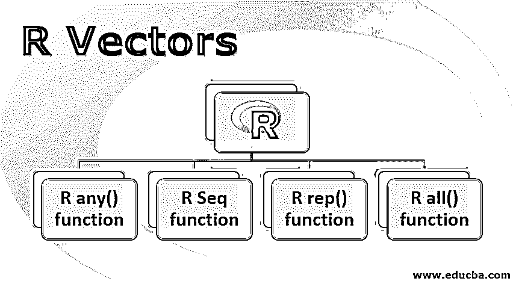

# r 向量

> 原文：<https://www.educba.com/r-vectors/>

## R 向量简介

r 向量是保存原始数据类型元素的最简单的数据结构形式。r 语言支持内置函数 c()来创建向量类型的变量并给它们赋值。此外，还有' : '运算符用于创建和定义向量变量。为了访问向量变量中的元素，R 语言使用索引位置，从向量变量的第一个元素的索引 1 开始。R 程序员经常使用它们来存储和处理数据。r 语言支持修改和删除向量变量中的元素。

### 单元素向量

用一个值创建的数据是长度为 1 的向量。

<small>Hadoop、数据科学、统计学&其他</small>

*   字符

**示例:**打印(" xyz ")

*   整数

**示例:**打印(54L)

*   两倍

**示例:**打印(6.5)

*   情结

**示例:**打印(45L)

*   逻辑学的

**例:**打印(假)

*   生的

**示例:**打印(1+3i)

### 多元向量

我们还可以使用带有数字数据的冒号来创建一个带有多个值的向量。

**举例:**

`v <- 5:10
print(v)`

**输出:** 5 6 7 8 9 10

十进制值的序列。

`v <- 6.6:9.6
print(v)`

**输出:** 6.6 7.6 8.6 9.6

在下面的例子中，11.4 将不在序列中，它将被丢弃，因为它不属于该序列。

`v <- 3.8:8.4
print(v)`

**输出:** 3.8 4.8 5.8 6.8 7.8

### 推荐文章

这是 R 向量的指南。这里我们分别用语法和例子讨论不同类型的向量函数。您也可以看看以下文章，了解更多信息–

1.  [R 中的函数](https://www.educba.com/functions-in-r/)
2.  [GLM 在 R](https://www.educba.com/glm-in-r/)
3.  [R 字符串函数](https://www.educba.com/r-string-functions/)
4.  [C#函数](https://www.educba.com/csharp-functions/)

