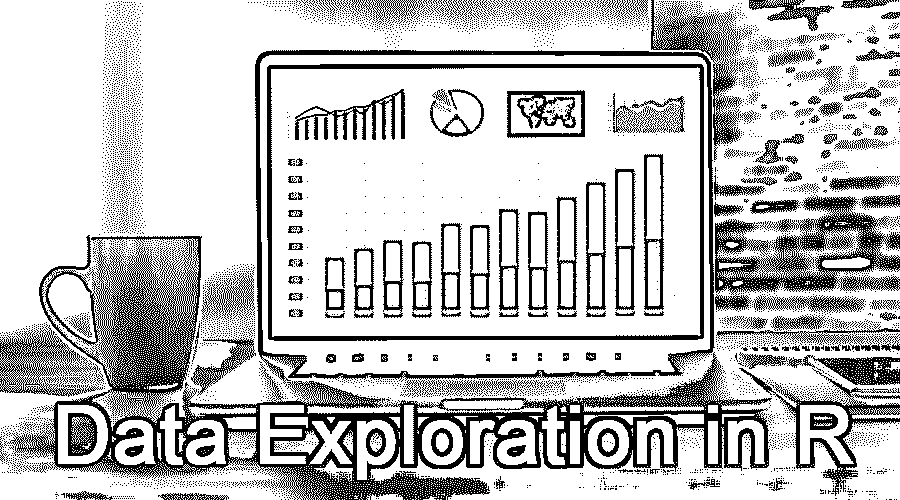
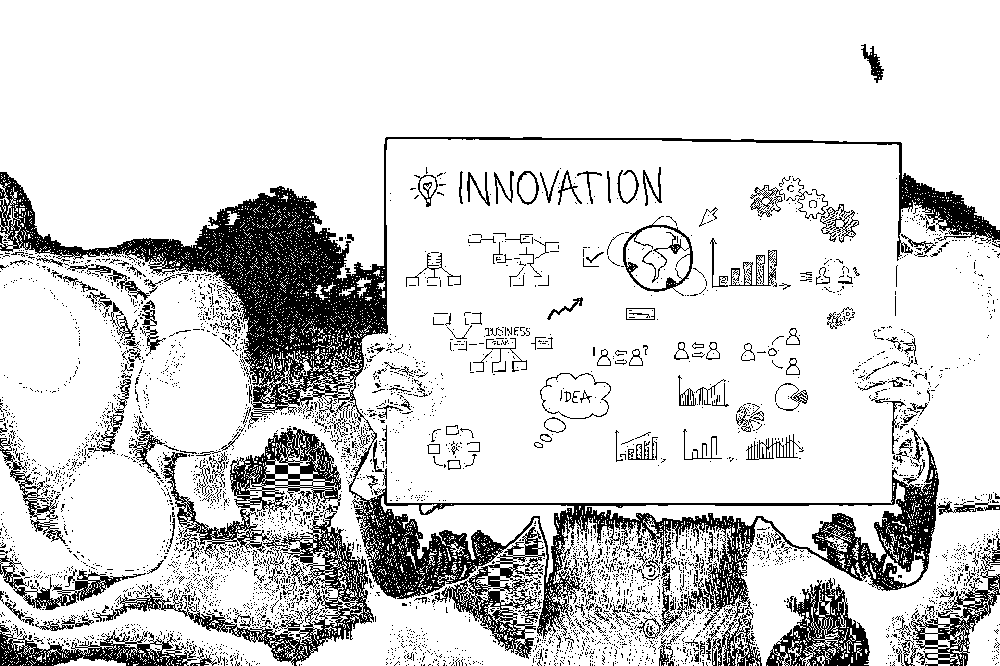
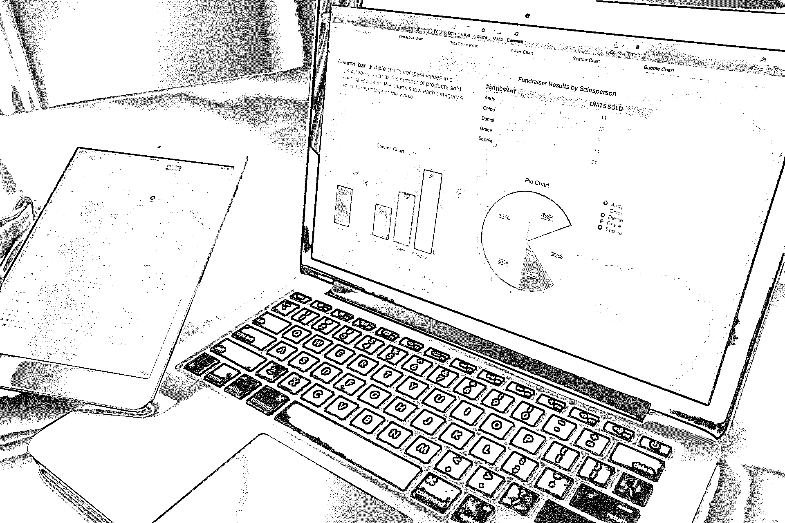

# R 中的数据探索

> 原文：<https://www.educba.com/data-exploration-in-r/>

## 如何在 R 中创建数据浏览

R 中的数据探索是公司和品牌如何洞察其原始数据和发现的重要部分。R 中数据探索的一个重要组成部分是[数据可视化](https://www.educba.com/data-visualization-types/)，这是一种以图形或图片格式呈现数据的方法。这种方法使决策者能够以更容易的方式掌握和理解分析，因为它是以图形方式呈现的。此外，这使得个人理解困难的概念和识别新的模式变得简单。许多品牌正在采用交互式可视化，随着技术的使用，可视化的概念更进了一步。通过使用演练和图表，交互式可视化有助于品牌以比以前更加复杂和个性化的方式理解数据和见解。

### 如何进行数据探索和可视化？

The concept of using pictures in order to understand pictures has been in use for quite some period of time. Since the 17th-century maps and graphs were used by explorers and inventors to find new lands and countries. Later the invention of [pie charts](https://www.educba.com/pie-chart-in-ms-excel/) in the early 1800s also helped to expand the area of data visualization as well. Many decades later, Charles Minard mapped Napoleon’s invasion of Russia, which was another step in data visualization. The map depicted the size of the army as well the path that Napoleon retreat from Moscow. By tying the same information to time and temperature, he provided a more detailed and better understanding of this historic event.

<small>Hadoop、数据科学、统计学&其他</small>

然而，所有这些发展与随着技术的发展而出现的进步相比都不算什么。随着技术的发展，数据可视化得到了突飞猛进的发展。计算机和智能手机的进步和发展一方面使品牌能够以快速和真实的方式处理大量数据，另一方面也能更快地获得洞察力。随着技术的进步，数据可视化正以如此快的速度发展，以至于它以一种剧烈的方式改变了世界各地的品牌和公司的面貌。

### 为什么品牌的未来在于数据可视化？

大数据每天都在增长，并影响着全球几乎每个行业和经济体。它为品牌创造了几乎无限的机会，以全面和成功的方式扩大和发展其网络。因此，在大数据中发现价值是当前时代任何品牌都可以关注的最重要投资之一。以零售行业为例，该行业可以通过大数据领域正在开发的各种应用程序走很长的路。

例如，关于大数据如何改善客户关系的见解可以帮助品牌更好地发掘以前不存在的新机会。同样，其他行业也可以通过使用大数据在改善客户和客户体验方面创造切实的利益，这最终将有助于推动企业的增长和发展。

大家都知道视觉传达是最简单最容易的沟通方式之一。根据研究，这是因为人脑处理视觉效果的速度比文本快 6 万倍，这使其成为品牌向顾客、客户和利益相关者传达其故事的最佳方式之一。这就是为什么[图表和图形](https://www.educba.com/graph-chart-formats/)是品牌能够理解重要见解的简单方式，这些见解在其他方面可能比阅读报告和电子表格更复杂、更容易。因此，数据可视化是一种快速简单的方式，复杂的概念可以被公司周围的人理解。

**此外，数据可视化可以通过以下方式帮助品牌:**

1.数据可视化可以帮助品牌专注于需要特别关注或改进的领域

2.数据可视化可以帮助品牌更好地理解客户行为，从而确保更好的品牌忠诚度和授权

3.数据可视化可以帮助品牌以一种亲密的方式理解市场和品牌功能

4.数据可视化是理解和预测未来市场趋势的一种很好的方式，从而帮助品牌以更好的方式适应这些变化。

如今，数据可视化和探索正在帮助公司超越界限，探索新的机遇，无论其行业和规模如何。以下是数据可视化可以帮助公司的一些方式:

*   **R 中的数据探索可以帮助公司以快速敏捷的方式理解数据:**图形数据可以让品牌以简单而有策略的方式理解大量数据。这有助于公司获得洞察力，并就各种主题得出结论，从而做出能够从内部和外部增强自身能力的战略决策。由于图形数据更容易理解，品牌甚至可以在问题出现之前就解决问题。
*   **R 中的数据探索帮助公司识别大量数据之间的模式和关系:**大量数据以图形形式呈现会更有意义，也更容易理解。当企业了解这些数据之间的联系时，他们可以做出更好的选择，并采取有助于他们快速实现短期和长期目标的策略。
*   **R 中的数据探索可以帮助品牌适应不断变化的时代，甚至以更好的方式预测未来:**经济和各个领域的公司都极具竞争力。为了取得成功，品牌必须了解市场的动态，并以成功的方式适应数据可视化趋势。事实上，当品牌能够成功预测市场趋势时，它们的成功几率会自动变得更高。简而言之，数据可视化是品牌预测市场趋势并因此获得竞争优势的最佳方式之一。通过解决影响产品质量或客户体验的问题，品牌可以在问题成为公司成长和发展的主要障碍之前阻止问题。
*   **数据可视化可以帮助公司以有效的方式传达他们的品牌故事:**如前所述，视觉传达不仅是与客户分享故事的有效媒介，也是与客户群分享故事的有效媒介。当品牌向更广泛的受众传达他们的信息和故事时，他们可以在公司内外创造有效的参与和授权。

有了这么多数据可视化的好处和优势，品牌建立一个预测模型来帮助他们理解数据是很重要的。一个好的预测模型不依赖于机器学习或编程语言，但必须能够以全面的方式在 R 中执行数据探索。重要的是，数据科学家在理解创建算法的过程之前，要学会如何全面地探索数据。数据探索示例有一个最重要的功能是在[预测建模](https://www.educba.com/predictive-analysis-vs-forecasting/)的帮助下执行的，这就是为什么它们对任何公司的增长和发展都至关重要。

R 中的数据探索帮助公司获得更深入和更好的见解，从而帮助公司创建更好的模型。考虑到 [R 编程](https://www.educba.com/r-programming-course-online/)的流行及其在[数据科学](https://www.educba.com/data-science-and-its-growing-importance/)中的广泛使用，有些步骤可以帮助在 R 中创建数据探索。虽然这些是通用步骤，但也可以在创建代码后定制代码。以下是在 r 中创建数据浏览的 11 个主要步骤。

*   ### Step 1: The process of loading data files:

数据集可以各种格式输入，包括。XLS，TXT，CSV 和 JSON 等。在 R 中，从上述任何来源加载数据都很容易，这主要是由于简单的语法和预定义库的可用性。通过读取代码，用户可以以简单的方式加载文件。

*   ### Step 2: The process of converting variables to different data types:

R 中的类型转换是通过将一个字符串添加到一个数字向量中来实现的，然后这个数字向量将向量中的所有元素转换成字符。在这一点上，重要的是要记住，数据结构的转换是极其关键的过程，格式转换。

*   ### Step 3: Transposing data sets is the next example in data exploration:

有时，需要数据集从宽结构转置到窄得多的结构。有一个代码可供用户以有效的方式做到这一点。

*   ### The next step of data exploration in step 4:R is the sorting of data frames

数据的排序是通过使用顺序作为索引来完成的。该指数基于多个变量，这些变量本质上是上升或下降的。

*   ### Step 5: Creating charts or histograms is the next step of data exploration in R

R 上的数据可视化非常简单，有助于创建有效的图形。

*   ### Step 6: Generate frequency table

    with R.

理解跨类别分布的最基本和最有效的方法是使用频率表。

*   ### Sample data set

    in step 7:R

为了在 r 中生成样本数据集，需要一些随机索引。这将有助于在 r 中创建样本数据集。

*   ### Step 8: Delete the duplicate value

    of the variable

一个非常简单的过程，很容易删除 r。

*   ### Step 9: Find the average and sum of class level counts in R:

这是通过应用 R 技术中数据探索定义中出现的函数来完成的。

*   ### Step 10: Identify and deal with missing values and abnormal values

缺失值可以用其他数字的平均值输入，这也允许创建更好的值。

*   ### Step 11: Merging and connecting data sets is the last step of data exploration in R

连接两个数据框是最终的功能，它们是通过组合两个公共变量的数据框来完成的。此外，追加数据集是另一个经常使用的功能。为了以垂直方式连接两个数据帧，使用了 bind 函数。因此，虽然两个数据帧必须具有相同的变量，但不具有相同的顺序。

因此，数据探索方法是一种新兴的技术趋势，但它需要一定程度的智慧和理解，才能在公司和品牌中实施。重要的是，品牌一方面要牢牢把握数据，另一方面要理解目标、需求和受众。准备数据可视化技术需要品牌了解一些事情，以便他们能够以更好的方式实施数据探索方法。以下是品牌在最终开始使用数据探索方法之前必须尝试实现的一些事情:

1.  了解品牌试图可视化的数据，包括相关数据的独特性和规模
2.  确定观想的媒介和你想向世界其他人展示的信息种类
3.  尝试以更好的方式理解你的受众，这样品牌可以更好地利用视觉信息
4.  学习如何以一种简单而有效的方式与你的观众沟通

一旦品牌理解并回答了这些问题，他们就能以比以前更好、更复杂的方式探索数据。数据可视化大数据本身带来了新的数据可视化挑战和机遇，同时，需要以简单的方式应对这些挑战。总之，公司有许多方法可以实现更快的数据探索，这一过程始于做出更好、更明智的决策。数据探索方法如此重要是有原因的。这是一个不可思议的工具，不仅可以改善组织内部的联系，还可以改善组织外部的联系。与此同时，品牌经理了解数据探索定义的战略重要性，并认识到这些见解是以有利可图和有帮助的方式交付的，这一点很重要。否则，品牌很容易迷失在大数据的世界中，而无法获得重要的洞察力或价值。

### 推荐课程:

这里有一些课程可以帮助您更详细地了解 R 中的数据探索、数据探索和可视化、
数据探索定义、数据探索示例以及数据探索方法，因此只需浏览下面给出的链接。

