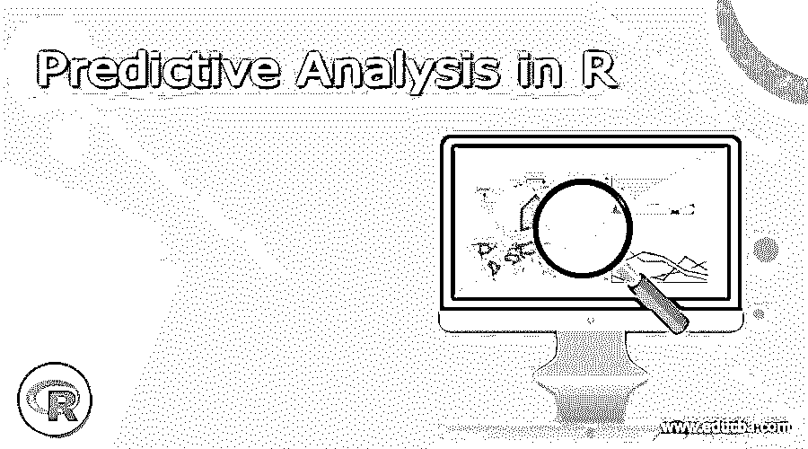
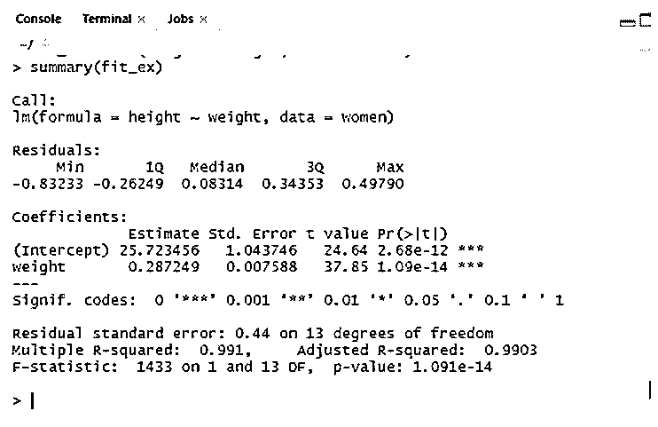
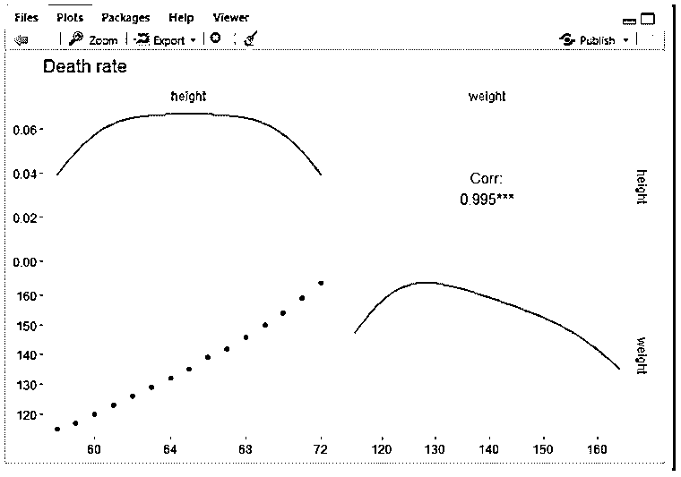

# R 中的预测分析

> 原文：<https://www.educba.com/predictive-analysis-in-r/>

## R 中预测分析的定义

预测分析被定义为通过收集数据、执行统计和部署过程来预测未知未来事件的数据挖掘领域。r 是一种统计编程语言，可以很好地帮助处理数据。预测分析适用于任何类型的信息，无论是过去的还是未来的。它采用新的数据来重新预测值，因此提高了预测的准确性，并有助于解决业务问题。

**语法:**

<small>Hadoop、数据科学、统计学&其他</small>

R 中的一般语法是

`forecast = predict(model,value)`

### 如何在 R 中进行预测分析？

这里我们将逐步讨论预测分析的工作过程。更具体地说，我们介绍了数据科学背景下的线性和逻辑回归的概念。本文的目的是在 R 工作环境中使用数据科学，因为它已经编写了很好的包，并提供了具体的结果。线性回归是预测建模最常用的算法。

**实时示例:**

随着印度 COVID 病例数量的增加，预测模型有助于预测每周/每天的病例数量，并有助于发现病毒何时上升和下降，以及其他相关信息。

在本节中，我们将使用一个女性数据集，根据基于观察值变量数量的指标预测女性的体重，并使用 Rstudio 进行实验。对于第一个示例，数据存储在单独的 CSV 文件中。

预测分析分两个阶段执行:

1.  建立模型
2.  实时预测

在下面的例子中使用了下面的包和库。

*   **数据集:**用于训练数据。r 由各种各样的数据集组成。在那里，它维护着一个机器学习数据集的存储库，以建立一个预测模型。下一步是为收集准备数据并绘制这些值。
*   ggplot2: 这是一个用于为我们的应用程序构建绘图的包。
*   **GGally:** 用于创建数据可视化的绘图矩阵。

**步骤 1:** 为女性创建一个数据集，它有两个变量。该指标用于未来事件，以研究女性的详细信息。在这里，测量女性的体重要困难得多。

接下来，为了进行探索性分析，我们将使用 GGally 包来查看变量与响应变量之间的相互关系。密切监控相关系数，如果它越接近 1，变量之间的关系越强。

**步骤 2:使用 lm()函数建立线性回归**，该函数适合所有可能的 15 个观察值。它应该满足最小二乘法。计算距离以找到残差。该等式可以计算为

**女性体重≈截距+斜率(女性身高)+误差**

到目前为止所做的模型输出给出了一个总结()。摘要详细介绍了系数、变量和其他级别的数据。

### R 中的预测分析示例

使用 Rstudio 实现了数据妇女。

#### 示例#1

`library(GGally)
data(women)
head(women)
height weight
1     58    115
2     59    117
3     60    120
4     61    123
5     62    126
6     63    129
> ggpairs(data=women, columns=1:2, title="Death rate")
fit_ex <- lm(height ~ weight, data = women)
ggplot(data=women, aes(fit_ex$residuals)) +
geom_histogram(binwidth = 1, color = "green", fill = "yellow") +
theme(panel.background = element_rect(fill = "red"),
axis.line.x=element_line(),
axis.line.y=element_line()) +
ggtitle("Histogram for women height")
> ggplot(data = women, aes(x = height, y = weight)) +
geom_point() +
stat_smooth(method = "lm", col = "blue") +
theme(panel.background = element_rect(fill = "grey"),
axis.line.x=element_line(),
axis.line.y=element_line()) +
ggtitle("Linear Model fitted to above data")
>predict(fit_ex, data.frame(weight = 70.2))
1
45.88835`

**输出:**

这里的输出显示了系数和残差值。我们示例中的截距值不是负值。它显示总体上正值意味着预测随着真实值的增加而增加。这是我们预期的女性身高。在下图中，我们可以看到，高度每增加一英寸，重量就会增加 0.2。

**输出:**

下面显示了使用 ggplot2 获得的一些图

直方图将身高和体重与残差进行比较。它显示了女性的平均身高。

**T2】**

 **在这里，我们将看一看适合体重和身高数据的模型。这可以通过使用 ggplot 函数绘制给定数据的散点图来实现。下面是 RStudio 中使用函数生成的曲线图:

**T2】**

 **最后，为了做出预测，我们可以使用 predict()模型拟合函数。这里，我们的预测重量值是 50。但是代码的结果是 45 公斤，接近 50 公斤。

#### 实施例 2

**代号:**
`x <- c(680, 8713, 18166, 64287, 71600,
98521, 65324, 152114, 115843,
531267, 896851, 208725, 3072113)
> library(lubridate)
Attaching package: ‘lubridate’
The following object is masked from ‘package:base’:
date
> library(forecast)
Registered S3 method overwritten by 'quantmod':
method            from
as.zoo.data.frame zoo
This is forecast 8.14
Stackoverflow is a great place to get help on R issues:
http://stackoverflow.com/tags/forecasting+r.
Warning message:
package ‘forecast’ was built under R version 3.6.3
> cts <- ts(x, start = decimal_date(ymd("2021-02-21")),
+           frequency = 365.25 / 6)
> fit <- auto.arima(cts)
> forecast(fit, 4)
Point Forecast     Lo 80   Hi 80     Lo 95   Hi 95
2021.353        3072113 1962765.8 4181460 1375512.9 4768713
2021.370        3072113 1503259.2 4640967  672758.1 5471468
2021.386        3072113 1150667.3 4993559  133515.4 6010711
2021.403        3072113  853418.6 5290807 -321087.2 6465313
> plot(forecast(fit, 5), xlab ="Weekly purchase of medicine",
+      ylab ="Total income",
+      main ="purchase vs Income", col.main ="blue")`

 `**解释:**在上面的 R 代码中，我们获取了历史数据，为日期格式创建了一个时间序列，并创建了一个图表来显示 2022 年的采购数据报告，预测结果如下:

**输出:**

### 结论

正如我们在 R 中通过一个例子看到的预测分析实现。预测分析用于金融服务、营销和电信等应用中。最后，本文向您展示了如何从 R 库生成数据集，并使用线性回归和一些随机值来分析未来的预测。这种模式通过海量数据降低了风险，增加了组织的销售收入。

### 推荐文章

这是一个 R 中预测分析的指南，这里我们还讨论了 R？并附有示例。您也可以看看以下文章，了解更多信息–

1.  [预测分析与预测](https://www.educba.com/predictive-analysis-vs-forecasting/)
2.  [预测分析工具](https://www.educba.com/predictive-analytics-tools/)
3.  [带 R 的统计分析](https://www.educba.com/statistical-analysis-with-r/)
4.  [李克特量表数据分析](https://www.educba.com/likert-scale-data-analysis/)

`****