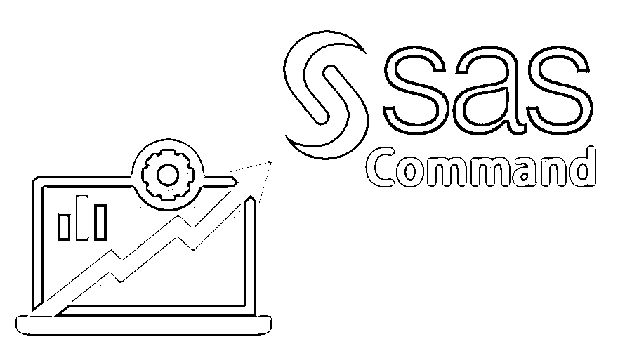

# SAS 命令

> 原文：<https://www.educba.com/sas-command/>

## SAS 命令简介

SAS 全表是统计分析系统。它是由 SAS 研究所在 1970 年提供的。它是用于进行统计分析、绘制图表和展示数据的软件。在这种情况下，有两个类别来呈现和分析数据，即数据步骤和过程步骤。DATA step 主要用于提供数据管理，如读取数据、数据转换以及创建或删除变量。用于执行各种数据分析的过程步骤。有各种命令可用于实现数据的显示和分析。

### 基本 SAS 命令

**1。Proc Print:** 用于在输出窗口查看 SAS 数据文件。

<small>Hadoop、数据科学、统计学&其他</small>

**举例:**

`proc print data= Grades;
Run;`

**2。过程内容**:用于检查输出窗口中 SAS 命令数据文件的内容

**举例:**

`proc contents data=Grades;
Run;`

**3。Proc 的意思:**用来看数据的基本统计。它提供数值或变量的平均值、最大值和最小值。

**举例:**

`proc means data= Grades;
Run;`

**4。Proc Freq** :用于分析创建的变量和表格的数据和频率

**举例:**

`proc freq data=Grades;
Run;`

**举例**:

`proc freq data=Grades;
Tables a*b;
Run;`

**5。Proc sort** :用于对 SAS 数据文件进行排序。

**举例**:

`proc sort data=Gardes; Out= name by name;
Run;`

**6。Proc reg** :用于 SAS 回归分析的通用程序之一。

**举例:**

`proc reg data= Grades;
Run;`

**7。Proc gplot** :用于绘制轴上的两个或多个值。

**举例**:

`proc gplot data=Grades;
Plot a*b;
a = vertical axis,
b = horizontal axis;
Run;`

**8。PROC transpose** :用于将数据集中的行转换为列。

**举例:**

`proc transpose data= Grades out= Field;
By name; var result; id col;
Run;`

**9。Proc Gchart:** 用于创建饼图直方图。

**举例:**

`proc Gchart data=grades;
Vbar age;
Run;`

10。Proc report: 用于从数据集创建报告。

**举例:**

`proc report data=Grades;
Column A;
Define A / display;
Run;`

### 中间 SAS 命令

**11。Libname** :用于创建 SAS 库。

**举例**:

`Libname NewLib 'C:\Grades';`

**12。文件名:**用于指定外部数据文件。

**举例:**

`Filename AName 'C:\Grades';`

13。Infile :用于读取外部数据文件的语句。

**举例:**

`Filename AName 'C:\Grades';
DATA SAS;
INPUT A B;
Infile AName;
Run;`

**14。If-Then:** 是用来执行不同函数的语句。

**举例**:

`DATA AB;
IF A>B then message='A is greater';
Else message='B is greater';
Run;`

15。Keep :用于保存数据集中需要的变量的语句。

**举例**:

`Data New;
SET version;
Keep name year price;
Run;`

16。标签:改变变量标签的函数。

**举例**:

`Data ABC;
Label text “Hello, world”;
Run;`

**17。长度**:用于改变变量的长度。

**举例**:

`Data ABC;
Length text $10.;
Run;`

18。格式:用于改变变量的格式。

**举例:**

`Data ABC;
Format date yymmdd10.;
Run;`

**19。输入**:用于将字符值转换成数值。

**举例:**

`Data ABC;
A = " 10 ";
B= input (a, best.);
Run;`

20。Log :用于将数值转换成对数。

**举例:**

`Data ABC;
A = 10;
B = log(a);
Run;`

### 高级 SAS 命令

**21。平均值、最小值和最大值**:用于计算一组数值的平均值、最小值和最大值。

**举例:**

`Data Mathdata;
A= 10;
B=20;
C= mean (a,b);
D= Min(a,b);
E= Max(a,b);
Run;`

**22。重命名**:该命令用于重命名变量。

**举例**:

`Data mathdata;
A= 20;
Rename a= b;
Run;`

**23。平方根/平方**:用于计算数值的平方和平方根。

**举例**:

`Data mathdata;
A= 4;
Square= a**2;
Sqroot = a**(1/2);
Run;`

**24。数学函数:**执行基本的数学函数。

**举例:**

`Data mathdata;
Set Math;
Price = sum (of P1, P2);
Diff = D1 - D2;
M = M1 * M2;
Div= Div1 / Div2;
Run;`

**25。Substr** :用于从文本值中获取部分文本。

**举例**:

`Data Mathdata;
Text = "Hello World";
Text1= substr(Text, 6, 2);
Run;`

**26。输入和数据行语句:**用于创建指定内容的数据集。

**举例:**

`DATA ABC;
Input A B C;
DATALINES;
1 2 3
4 6 9
;
Run;`

**27。合并**:用于将多个数据集合并为一个。

**举例**:

`Data ABC;
Merge name John;
By ID;`

### 使用命令的提示和技巧

*   编程前要思考，检查所有需要覆盖的标准。
*   保持简单。
*   通过放置您需要的数据使数据集更容易理解，有助于节省磁盘空间。
*   使用函数进行数据转换。
*   避免无穷大意味着除以零。
*   当您不需要创建数据集时，请使用 Null。
*   将常量值赋给 retain 语句中的变量。
*   使用 NoEquals 选项排序，这有助于节省时间和内存。

### 结论

每个人都有自己达到最终结果的方式，这些方式对不同的人来说可以是相同的，也可以是不同的。有许多方法可以找到一个结果，而在使用命令软件时，人们可能会以不同的方式获得许多方法来实现相同的结果。据观察，您了解的越多，浏览的命令文档越多，从长远来看，您获得的结果和帮助就越多。

上述 SAS 命令主要用于 SAS 软件编程。这些内容主要围绕数据和过程展开。这是一个容易使用的工具或软件，简单的书写意味着用简单的英语书写命令，就像你已经看到的上面的命令一样。它易于使用、学习和书写。

### 推荐文章

这是 SAS 命令的指南。在这里，我们已经讨论了基本以及高级和一些即时 SAS 命令。您也可以阅读以下文章，了解更多信息——

1.  [Tableau 命令的使用](https://www.educba.com/tableau-commands/)
2.  [如何使用 HBase 命令](https://www.educba.com/hbase-commands/)
3.  [MongoDB 命令的使用](https://www.educba.com/mongodb-commands/)
4.  [清管器指令的重要性](https://www.educba.com/pig-commands/)

