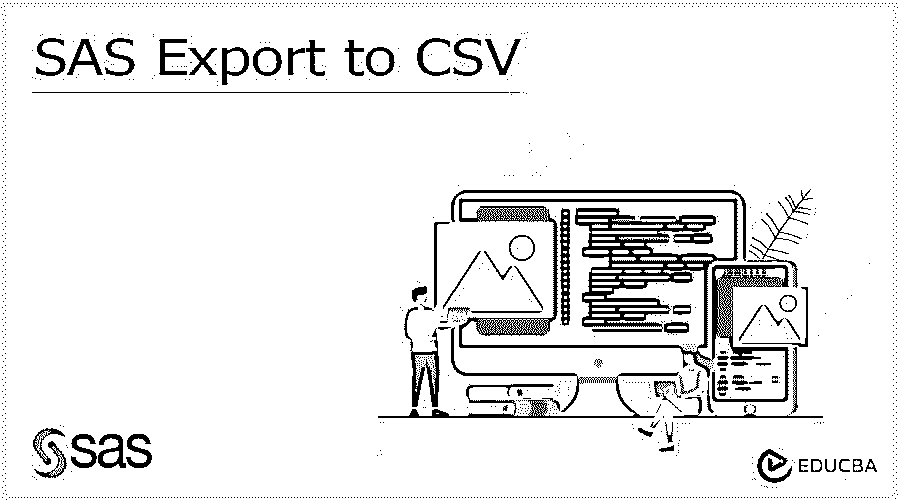
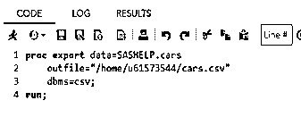
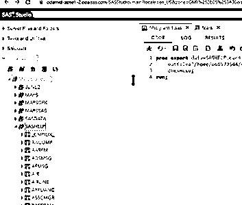
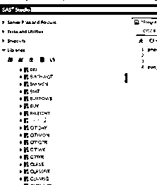
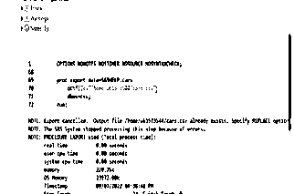
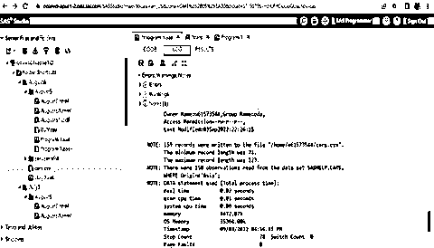
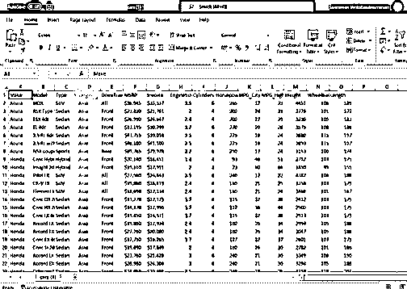
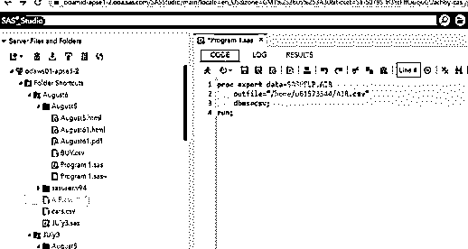
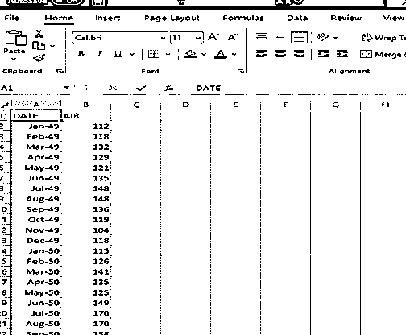

# SAS 导出到 CSV

> 原文：<https://www.educba.com/sas-export-to-csv/>




## SAS 导出到 CSV 的定义

SAS 导出到 CSV 是使用程序导出对 CSV 文件执行 SAS 数据操作的选项和功能，它是在 SAS 数据集中创建 CSV 文件的位置指定的。Proc Export 有一个选项，它将通过使用分隔符操作数和在输出控制台上打印相同的列变量(带有可移动的头)来更改数据。

### 关键要点

*   使用 proc export 定义指定数据集上的 SAS 导出操作。
*   执行此操作至少需要三组参数。
*   DATA =指定数据集的选项，OUTFILE =指定输出文件位置的选项。
*   而对于这里的 DBMS=option，我使用了 DBMS=csv 或 excel，无论我们需要什么格式。
*   替换、子串等。如果需要，在此操作中使用了一些附加功能。

### SAS 导出到 CSV 简介

SAS 数据集通过一个或两个 SAS 级别名称识别输入，包括库和其他变量名。它指定了导出数据库程序的每个级别，并根据特定的工作库进行分配。如果数据指出目标成员和数据量有限制的 SAS 数据集格式，我们可以触发对 SAS 数据集的导出过程。如果超出数据，目标文件位置会发生变化，并导出可能无法以正确结果处理数据的过程。对于其他类型的数据转换，每次尝试要么失败，要么成功。它包含一个带默认系统选项的单引号，比如 VALIDMENAME=EXTEND，或者根据 [SAS 变量](https://www.educba.com/sass-variables/)及其成员指定不同的规则。

<small>Hadoop、数据科学、统计学&其他</small>

### 如何将 SAS 导出为 CSV 文件？

主要是我们可以使用 export 过程将数据从 SAS 导出到 CSV 文件，并在 Excel 文件中声明以查找修改并在 SAS 数据集上使用分隔符行。在我们使用 PROC EXPORT 之后，SAS 代码被检查并用于替代部分。写入 CSV 文件数据全称为逗号分隔的文件行。修改数据大纲以在数据库管理系统选项中指定 CSV 文件，并省略分隔符行。

虽然我们在 infile 上使用了类似 delimiter=的 inline 语句，但它提到了数据文件上的独立变量，这些变量使用特定的点来读取文件。同时，我们声明了 delimiter=1，这样导出过程就很灵活，可以用来导出多种格式的数据，包括 Excel(.xlsx)、文本(。txt)和逗号分隔值格式[。csv]格式，用于使用一组不同的数据分隔符导出数据，而不使用头文件、其他导出变量标签而不是变量名称，这些都可以用数据格式指定。

BAS SAS 程序，包括使用 proc import 语句的 SAS 程序指南，将有助于读取数据并创建临时数据集，该数据集有助于将 mydata 用于 csv 文件，从而允许在位置中导出。它还有助于更改和替换 SAS proc 导入和导出中的 csv 文件，以便在外部文件中提供足够的数据以及特征数据的特定扩展名。

### 将 sa 导出到 CSV 文件的步骤

*   导航到以下 URL 并登录到应用程序，

[https://odmid-apse 1-2 . ODA . SAS . com/sasstudio/main？locale = en _ us&zone = GMT % 252 b 05% 253 至 30 &票= ST-50795-H3 及 ycfifciucjuguachby 个案](https://welcome.oda.sas.com/login)

*   粘贴以下代码，将 SAS 数据集导出到 CSV 文件。

**代码:**

```
proc export data=SASHELP.cars
    outfile="https://cdn.educba.com/home/u61573544/cars.csv"
    dbms=csv;
run;
```




*   这里我使用 proc export default 关键字来执行 SAS 数据导出操作。那么 SASHELP 就是存储每组操作中数据的默认库。







*   在执行 SAS 操作之后，结果被转换成数据集到 CSV 文件。




*   这里最重要的是在库中转换和存储数据的重要路径。这里，输出文件存储在同一个主目录中，在接口的 SAS 代码中创建。

### 如何替换导出 SAS 为 CSV 文件？

通常，REPLACE 会在可以用 Replace 关键字指定的现有文件中执行覆盖操作，并导出不会覆盖当前文件集的过程。如果我们无法确定数据集上的 Replace 关键字，则导出过程不会运行。通过使用 proc export，数据与 DBMS 和 dlm 选项一起用于写入数据行以导出文件。

**代码:**

```
proc export data=SASHELP.cars(where=(Origin="Asia"))
    outfile="https://cdn.educba.com/home/u61573544/cars.csv"
    dbms=csv
    replace;
run; 
```

这里，我可以在 Replace 关键字中使用相同的示例来获取指定 SAS 库上 Origin=" Asia "处的数据。







### SAS 导出到 CSV 数据语句

此程序主要将 SAS 数据集导出到带有分隔符和其他操作数的 CSV 文件。对于使用 proc export 语句的工作簿，导出的数据应与 SAS 和 Excel 表中的特定数据集相匹配。在从过程中导出文件和 excel 视图时，我们可以导航到系统上的 PC 位置来恢复数据。

**举例:**

```
proc export data=SASHELP.AIR
    outfile="https://cdn.educba.com/home/u61573544/AIR.csv"
    dbms=csv;
run;
```

**样本输出:**







1.  在上面的例子中，我们可以首先生成数据集；在这种情况下，我可以使用已经为 SAS 制作的库。
2.  到目前为止，我一直使用 AIR 数据集来执行导出操作。
3.  输出文件存储在代码中存在的同一目录中，然后转换为 dbms=csv 文件，以便访问导出到 csv 文件的数据库。

### 常见问题解答

下面提到了其他常见问题:

#### Q1。定义 SAS 导出。

**答:**通过使用 proc export define 执行，将数据从一种格式转换或交换为另一种格式。

#### Q2。如何执行 SAS 导出到 CSV？

**答:**我们可以使用以下代码执行 SAS 导出到 CSV:

定义过程导出

创建数据集

DBMS= CSV for 将数据集转换为 CSV 格式。

#### Q3。如何将数据写入 CSV？

**答:**用 dbms=csv 这样的指定选项修改 outfile 会省略分隔符行。

### 结论

在情景应用程序中，统计数据用于现实生活场景的各个领域，需要必要的数据格式和软件来显示其需求。因此数据转换更重要，以满足逗号分隔符(CSV)格式是在任何机器上查看数据集的公共格式。

### 推荐文章

这是 SAS 导出到 CSV 的指南。在这里，我们讨论了介绍和如何取代出口 SAS 到 CSV 文件，以及例子。您也可以看看以下文章，了解更多信息–

1.  [CSV 文件转换成 Excel](https://www.educba.com/csv-files-into-excel/)
2.  [SAS 滞后功能](https://www.educba.com/sas-lag-function/)
3.  [PySpark 读取 CSV](https://www.educba.com/pyspark-read-csv/)
4.  [SAS 三角形计算器](https://www.educba.com/sas-triangle-calculator/)


