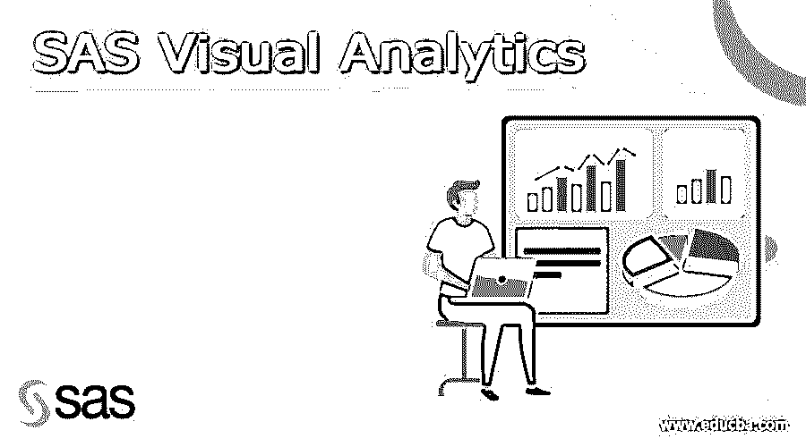
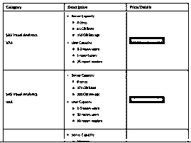
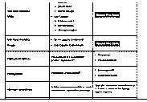

# SAS 可视化分析

> 原文：<https://www.educba.com/sas-visual-analytics/>

## SAS 可视化分析简介

SAS visual analytics 是一种工具，它有助于为所有用户的受管发现和探索提供现代化的集成环境，其中包括高级分析技能等技能，无论有无，用户都可以对其进行检查，以便对问题进行分类并了解数据关系的设计模式，从而创建和共享数据报告。

### 什么是 SAS 视觉分析？

SAS 可视化分析主要为由用户维护的受控发现和其他探索提供现代化的集成环境。它包括所有那些没有高级分析技能的关系，可以通过数据关系和其他趋势来检查和理解设计模式。主要是很容易为所有可以监控用户和业务性能的仪表板创建和共享数据报告。主要是易于使用数据分析和可视化，每个人都可以从用户数据中获得洞察力，以更好地传输数据来解决复杂的业务问题。它用于用户的视觉和技能水平，以可视化用户探索数据，并使用自动数据分析，这创建了数据可视化，同时数据挖掘到强大的存储技术。

<small>Hadoop、数据科学、统计学&其他</small>

### 如何使用 SAS 可视化分析？

分析功能更加定制化，并且更易于使用来快速访问可能的结果，以估计未知参数，从而支持更好的业务分析。业务用户从他们的需求中获得用户响应，他们专门处理对深度分析的持续请求，it 专家处理对所有分析的持续请求。它使业务分析师能够快速评估估计的可能结果，可能包括支持决策的未知参数和可能的结果功能。

1.  **自动预测:**

即使我们注意到用户几乎是预测可靠性的新手，它也是适用数据中最主要的适用预测方法。用户可以使用 SAS 可视化数据构建器以一种非常简单的方式为更多的探索和数据挖掘准备数据。通过使用数据构建器，它们可以被概括为具有增强的数据预测能力的连接强有力的数据。

2.  **场景分析:**

确定最重要的变量，主要是配置如何执行用户更改，它会影响预测。它主要以自助方式执行自动分析和可钻取的层次结构，而不需要在预定义的用户定义的路径中执行一些有害的场景和其他活动。

3.  **目标寻找:**

确定实现潜在因素的用户目标，这些潜在因素需要更多功能和其他技能，这些功能和技能取决于项目需求和实施团队，以实现用户依赖关系中的目标预测。为条形图和热图等图表添加可视化单元格，以实现用户表来执行用户操作和用户。

4.  **网络图:**

它只显示复杂的数据，说明如何将数据与表格单元格相互连接，以可视化条形图。它重用和共享数据修改，包括饼图和折线图上的网络图和相关矩阵。预测和协调平行图、带有决策树的圆环图以及其他视图。

5.  **路径分析:**

它将数据事件的唯一序列之间的数据关系和路径分析可视化，将从一个事件到另一个数据事件的数据流显示为一系列路径。

6.  **文本分析:**

它将来自社交账户分析的数据情感与 youtube、Twitter、脸书和谷歌分析数据上的相关数据应用于客户评论。它提供了对社交媒体上除数据之外正在讨论的内容的快速洞察。SAS visual analytics 将为更多显示的数据提供数据内容上的简单类型的单词，并对文本分析和安全数据单词进行分类。SAS 可视化分析更加精简，使用数据分析工具来执行用户系统，它必须包含并行数据中的业务用户，以便加载到为数据库关系(如许多关系和其他 Hadoop 数据源)提供的环境的足够内存位置中。它可以被称为对每种类型的负载中的可用数据源的数据压缩，这些数据源在商业用户中可用的大量数据存储器下可用。SAS 可视化分析在 SAS 分布式模式下，分布式节点上的大规模计算机集群和计算能力将被更多地消耗。

### SAS 可视化分析定价和功能

SAS 可视化分析是其自己的旗舰产品，为 interactive reporting 数据和其他仪表板提供可视化分析的数据准备。技术和非技术用户可以更好、更轻松地分析数据治理，以创建、共享和执行数据工作流的 BI 和分析，从而与 exploration 中的数据和用户报告进行交互。它具有 SAS 可视化分析所需的部署灵活性，既可以在使用大规模计算机集群的分布式模型的单台服务器上运行。

### 特征

1.  主要是使用创建数据模型比较容易，创建的数据模型更加稳定，数据的准确性和其他数据验证的技术。
2.  与用户数据交互，为可视化上的数据服务分析做准备。将数据集与以易于解释的格式呈现的一组不同的关系统一起来。
3.  发现指定设计模式的数据关系。
4.  用直观的图形将显示的数据可视化。
5.  收集基于数据的业务需求洞察和数据识别模式。
6.  对自动化特征执行引导式增强分析
7.  为业务增长做出更好的决策。
8.  遵循历史信息的数据驱动的业务决策方法。
9.  在数据仪表板上进行协作，并与所有内部客户和其他关键群体共享。
10.  准确、更安全地分发 pdf 共享报告，以限制报告的完整性。

**价格:**

1.  对于许可和订阅成本，价格各不相同，并根据用户容量而定，其中包括许可和托管基础架构成本。
2.  维护成本与前期现场成本和为持续支持和维护支付的支持成本是准确的。
3.  对于具有可配置需求的附加功能需求和具有所需跟踪的数据元素上的其他仪表板，更需要定制成本。

4.  以上两个 SAS 视觉分析 VA4 和 SAS 视觉分析 VA8 是服务器的两个类别。

5.具有用于执行的附加和其他部署选项以及其他可用选项。数据购买需要定价模型和其他最低承诺。

### 结论

能够连接所有第三方，并与他们的数据相关的东西合并，从一个系统加入到另一个系统。以更加一致和可靠的方式分析数据结构和其他相关信息，以便 SAS 商业智能强大系统运行具有可扩展功能的技术代码。

### 推荐文章

这是一个 SAS 可视化分析指南。在这里，我们讨论定义，什么是 SAS 视觉分析，以及如何使用 SAS 视觉分析，分别。您也可以看看以下文章，了解更多信息–

1.  [Azure 日志分析](https://www.educba.com/azure-log-analytics/)
2.  [数据集可视化](https://www.educba.com/dataset-visualization/)
3.  [视觉范式](https://www.educba.com/visual-paradigm/)
4.  [视觉测试工具](https://www.educba.com/visual-testing-tools/)

