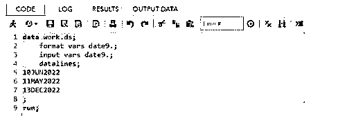
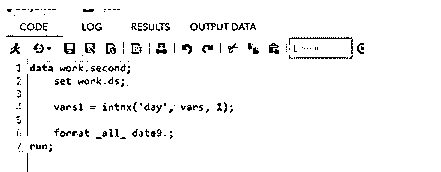
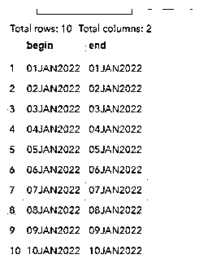
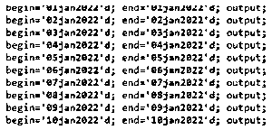

# SAS INTNX

> 原文：<https://www.educba.com/sas-intnx/>


## SAS INTNX 简介

SAS INTNX 是可用于执行 SAS 日期和时间函数的函数之一，该函数将通过添加指定数量的数据增量来返回 SAS 日期值，以下一层数据开始初始日期，这是它表示下一个间隔的方式，该间隔称为 INTCK，代表计算数据算法的间隔检查。

### 什么是 SAS INTNX？

SAS INTNX()是一个函数，它需要 Interval、start_date 等参数，以及为指定的日期值添加的间隔数。INTCK 和 INTNX 是返回多个时间间隔和日期单位的函数类型。INTNX 函数根据单位和特定日期返回 SAS 日期，以计算未来场景中的操作。

<small>Hadoop、数据科学、统计学&其他</small>

它支持许多选项来修改默认行为，并使用带有正数间隔数的连续选项作为整数值。除了这三种类型的参数是必需的之外，第四种类型的参数是可选的，间隔单位是从日期开始的度量单位，对于之前的日期，递增的日期间隔数将被接受为正数、负数和零。

### SAS INTNX 函数

SAS 有许多默认功能，这些功能有助于执行 SAS 操作，并增加了一个附加功能。intnx()中有一个 SAS 函数，用于在三组参数上以指定间隔数增加 SAS 日期，第四个参数是使用 SAS 文档的可选参数。将数据步长函数的值相乘并移位以返回 SAS 日期值，主要是为要省略的日期时间和子参数值提供信息。

以下代码是在 SAS 中执行日期间隔的基本语法。

**语法:**

```
INTNX(interval, startdate-from, incremental,[alignment])
```

Interval 是用于测量单位和时间间隔(如日、周、月和间隔季度年)的参数之一。startdate -from 是 SAS 日期值，它将随着增量选项的间隔数而增加，可以是零、正数和负数选项。然后，我们将文章数据分成不同的部分，这些部分侧重于 INTNX 函数，用于其他函数，如具有日、月、周、年间隔的日期，以及与增量操作一致的时间间隔。

### 创建 SAS INTNX()的步骤

下面给出了创建 SAS INTNX()的步骤:

1.登录后导航到以下 URL。

2.[https://odamid-apse1-2.oda.sas.com/SASStudio/main?locale = en _ GB&zone = GMT % 252 b05 % 253 a30&ticket = ST-129660-yznlhwfn 21 cshe 6 gesws-cas](https://odamid-apse1-2.oda.sas.com/SASStudio/main?locale=en_GB&zone=GMT%252B05%253A30&ticket=ST-129660-yZNLHWFn21cShE6gEsWs-cas)

3.创建如下所示的基本数据集。

4.data work.ds

5.格式化变量日期 9。;

6.输入变量日期 9。;

7.数据线；

8.2022 年 6 月 10 日

9.2022 年 5 月 11 日

10.13DEC2022

11\. ;

12.跑步；




13.然后，我们需要执行 intnx()函数来过滤带有时间间隔的数据，如日期、月份和其他参数。

14.数据工作第二；

15.设置 work.ds

16.

17\. vars1 = intnx(日，其值为 1)；

18.

19.格式 _ 全部 _ 日期 9。;

20.跑步；




我们可以利用 SAS 数据集中的 intnx 区间参数来执行数据测量。可用的间隔是用引号括起来的日、周、月和年，如日期和整数。乘数和移位指数可用于构建名称和规格的基本区间。

### SAS INTNX 语法

SAS intnx 函数用于以多个间隔递增日期，它是一个可以用大写和小写字符显示的间隔名称。它在区间中有一组可能的值，这些值拆分了类别、区间、起点和轮班周期，包括日、月、年等。天数间隔将从三天开始，从周日和每周开始，周六作为一周的第一天。它支持一周六天，周日为周末，但是五天时间间隔的起始日期返回一个默认值，在 intnx 函数上触发该值后，不需要输入任何内容。

通过使用 interval，日期的结束主要以一周的最后一天返回，包括月份和年份。则日期间隔的中间是一周的中间一天，并且如果也在该间隔内的同一天的日期主要使用当前活动的同一天、同一个月和同一年返回，则还包括同一个月和同一年。如果满足最后一个语句，其中包括控制到期日的参数，并且已经导出了该参数，那么我们需要提供一些建议，说明如何将其应用于与开始日期相关的有用日期，包括 TODAY()函数，用于提供当前日期，即参数的开始日期。

### SAS INTNX 示例

下面是提到的例子:

**代码:**

```
options vars1=(months=example1);
data example1;
  format begin end date9.;
  begin='01jan2022'd; end='01jan2022'd; output;
  begin='02jan2022'd; end='02jan2022'd; output;
  begin='03jan2022'd; end='03jan2022'd; output;
  begin='04jan2022'd; end='04jan2022'd; output;
  begin='05jan2022'd; end='05jan2022'd; output;
  begin='06jan2022'd; end='06jan2022'd; output;
  begin='07jan2022'd; end='07jan2022'd; output;
  begin='08jan2022'd; end='08jan2022'd; output;
  begin='09jan2022'd; end='09jan2022'd; output;
  begin='10jan2022'd; end='10jan2022'd; output;
run;
data example2;
  format a date9\. b date9.;
  a='01jan2022'd;
  do inp=0 to 9;
    b=intnx('months', a, inp);
 put b;
 end;
run;
```

**输出:**




1.在上面的例子中，我们计算了当前场景的年、月、日，并使用了开始和结束日期为 9 的格式。


2\. Based on the above format, we can declare the inputs in the begin and end variables.




3.上面的屏幕截图显示了使用日期格式的每个变量的输入数据集。

4.所有序列的输入数据将采用日期/月份/年份格式。

5.然后，我们可以使用 do a 循环通过多次迭代来迭代这些值。


6.使用带有 months、variable1 和 loop variable 等参数的 intnx()函数，执行运算并将其存储在一个单独的变量中。


7.最后，输出将显示在屏幕上。

### 结论

SAS 有许多默认函数、关键字和变量，可以根据用户需求和依赖关系更复杂地执行数据分析。intx()函数主要在日期操作上执行，这有助于增加日期、时间、日期时间、月和年的间隔。

### 推荐文章

这是 SAS INTNX 的指南。在这里我们讨论一下简介、SAS INTNX 的功能、步骤、语法和例子。您也可以看看以下文章，了解更多信息–

1.  [SAS 视觉分析](https://www.educba.com/sas-visual-analytics/)
2.  [数据架构师](https://www.educba.com/data-architects/)
3.  [SASS if()](https://www.educba.com/sass-if/)
4.  [SAS 加入](https://www.educba.com/sas-join/)


