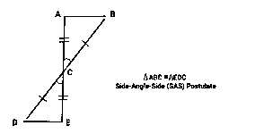
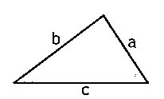
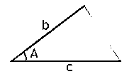
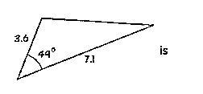
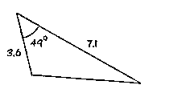

# SAS 一致性

> 原文：<https://www.educba.com/sas-congruence/>

## SAS 一致性介绍

SAS 同余是规则之一，它可以用于角的两边，它与一组三角形的两边相等，它与另一组三角形包含，那么它是全等的，它只在两边形成，可以是数学函数，这里边-角-边表示 SAS。

### 什么是 SAS 同余？

SAS 是包含全等角的边-角-边三角形，是记忆角的方法。它必须通过全等和一对边来包含，这有助于它们全等三角形。三角形没有办法全等，三角形的三个顶点都固定在两边之间，这是三角形定义的。

<small>Hadoop、数据科学、统计学&其他</small>

三角形的两条边被包括以定义对应于同余部分的三角形，并且满足整个三角形以满足成角度的边。参考数据集主要与另一个参考进行比较和匹配，从一个数据集到另一个数据集的一对一映射值。该数据集几乎是两个参考数据集的同构值。

### 如何求 SAS 同余？

SAS 有许多数据集，根据概念域，在两个不同的数据集值上可能有 n 个以上的值。这两个参考数据集与交集外部的异常值密切同构，从而为两个数据集的基数提出阈值百分比和大小。我们主要可以调用和引用全等的数据集到几乎等价的集合来协调差异，这取决于一些定性的符号和归因于计数过程的错误定义。

通过使用两个三角形的边和角来计算三角形的 USPS 和其他测量值。主要标准是三角形的大小和形状，它们被称为全等三角形并被旋转，反映彼此的位置或外观，可以被认为是彼此更一致的实验，它满足比较三角形的不同条件或规则。SSS、SAS、AAS、ASA 和 RHS 是三角形边标准的配置和属性，包括 EDC 图像的三角形公设。

上面的图像显示了两个三角形，它们称之为变量 A、B、C、D 和 E。C 是两个不同三角形的中心点，表示为侧角和侧边。

我们需要知道识别 SAS 一致性的以下步骤:

1.首先，我们需要确切地确认三角形有三条边。

2.然后确保所有三个边都以直角连接。

3.一般三条边和所有三个角都出六条边，就够求两个三角形了。

4.在上面的三角形中，我们可以指定所有边值的度数和角度，如 3.6、49 度和 7.1 等。

5.相当于下面的全等三角形。

6.显示两条边并且也通过三角形的一个角包含的三角形等于具有相应边的另一个三角形。构成全等三角形。

### 如何使用 SAS 同余？

首先，我们需要在两组三角形上设置 SAS 同余规则，这两组三角形可以主要包括与一个三角形等边相关的每组角度。一个三角形等于两组边，并且包含在另一组三角形中。我们可以证明边-角-边准则为刚性变换同余定义了两条边并包含了一条三角形边，它填充了语句和其他合理的三角形。当且仅当刚性变换将一个图形映射到另一个图形时，等价于相同长度的线段一致性和刚性变换可以在一致性图形的点处保持相同的距离。AB 和 CD 是具有相同长度的两个同余，可以映射到其他定义。计算同余距离，并保存到其他相等的函数，如 AB=CD，则它属于 AB。

箭头符号用于三角形整形的每个顶点，并在全等三角形转换到上述 SAS 三角形时观察到它。每个矢量形状都要在点级别执行刚性转换，转换为显示全等三角形的 SAS 标准。然后，SAS 将在刚性变换中工作，它的一部分角边将被拟合在一对角上，这对角与另外两个三角形上的角边不相同。同样，SAS 是第一个三角形面积拟合，而第二个三角形，称为 SSA，没有足够的信息来知道全等的三角形。

同样，如果我们有两组三角形，如 ABC 和 DEF 点，绘制如下:

它有几对边，它们组合了两个三角形 AB 和 DE 上相等的长度，因为省略了 C 和 F，所以两个三角形都相等；因此 AB 和 DE 被命名为全等。

AB 和 DE 条被升级，它测量三个点作为:

*   通过比较边长，三角形的上边和下边是一致的。
*   若 AC 和 DF 全等，则两边与 AC 和 DE 相同。
*   接下来，我们需要确定角度，比如< A 和< D 是证明语句中标记为相等的两个角度。

### SAS 同余规则

它遵循适用于侧面-角度-侧面 SAS 的一些规则:

*   它应该遵循边和角上的两组三角形。
*   边和角必须包含在一个边之间并对应于另外两个边。
*   如果三角形全等，那么我们使用像 ABC 和 DEF 这样的 delta 符号来度量三角形的全等。
*   一旦变量中有了 delta 和 bar 符号，我们就可以添加的值，以在给定的边上执行数学运算。
*   SAS 执行全等三角形语句操作有一些特定的原因。

### 结论

SAS 有许多特性和功能来执行统计数据操作，就像 SAS contactual 一样。SAS 公设是在用户数据中执行几何运算的某种三角形函数。SAS 全等三角形集是计算所有三个连续边的角度值。

### 推荐文章

这是一个 SAS 同余的指南。这里我们讨论一下入门，以及如何求 SAS 同余？分别使用和规则。您也可以看看以下文章，了解更多信息–

1.  [SAS 视觉分析](https://www.educba.com/sas-visual-analytics/)
2.  [SASS if()](https://www.educba.com/sass-if/)
3.  [SAS 加入](https://www.educba.com/sas-join/)
4.  [SAS 长度](https://www.educba.com/sas-length/)

