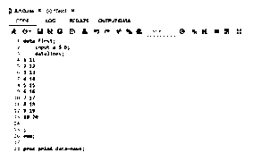
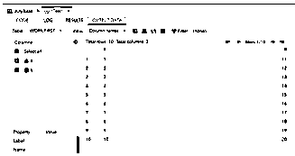
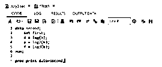
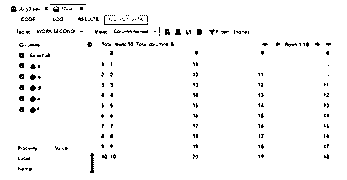
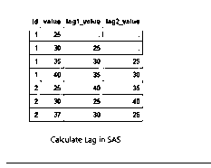
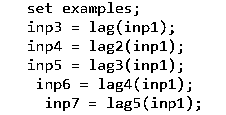

# SAS 滞后功能

> 原文：<https://www.educba.com/sas-lag-function/>


## SAS 滞后功能介绍

SAS 滞后函数是一种函数类型，可用于比较当前值和现有值(已经存在)以及前任值的新值，以计算订单的滞后时间。第二阶是使用 LAG2 函数。同样，三阶将计算 LAG3 函数。一阶滞后将与其他元素一起使用分组变量。

### SAS 延迟功能概述

当滞后函数以多种方式用于计算时间序列数据中的 SAS 提前量时。对于一个或多个被测变量的滞后和超前，通常要求更多。时间序列或纵向数据考虑了数据挑战性的更多影响，以及数据操作处理任务，这些任务对于多个周期或行和列来说容易产生影响。一阶滞后将被视为数据观测值，表示为最后一个值，称为 lag1_value。在第二个顺序中，将数据观察值表示为 lag2_value，lag 函数有助于返回字符变量的值，该值尚未分配给参数中使用的长度。

<small>Hadoop、数据科学、统计学&其他</small>

### 如何使用 SAS lag 功能？

LAG1、LAG2 等滞后函数。帮助从数据队列 LAG1 返回值的 LAGn 被检索并从 LAG 中导出，并且 LAGn 函数将值存储在队列中。对于每一次出现，程序的 LAGn 函数生成自己的队列值，而 n 表示缺失值队列的长度，并为删除和返回进行初始化。因此，第一次出现的缺失值和剩余的 LAGn 函数执行参数开始被调用并出现在 SAS 函数中。因此，存储底部队列的值有助于从顶部队列返回值，并且该功能被有条件地存储和返回。LAGn 的参数主要是作为数组名调用的，并形成在单独的队列中，用于维护数组内存中的变量。如果该函数被编译，SAS 将在每个数据队列中分配内存，用于保存数据字节为 8，100 或 800 字节需要 8 次内存。LAG 函数的内存限制基于分配给具有不同操作系统环境的 sa 的内存。我们访问了 LAG 函数的后续行和列，以比较当前行值和先前行值或现有行值。

下面的自变量像 scalar_expressions 一样，offset 和 default 值为强制参数，用精设定的自变量执行，并在 offset 中声明整数个数与行数。大多数情况下，偏移量是可选参数，其值为 1。类似地，默认值由前 3 个连续行的偏移量定义，并且不能在滞后函数之后。Partition by 是另一种 lag 函数语法，它有助于为大量数据集创建逻辑驱动器边界数据，并且几乎需要为较小的数据集进行计算。分区季度数据的计算取决于用户和组织的要求，如偏移分区也是可选参数。

### 创建 SAS lag 函数的步骤

1.  导航到下面的 URL，
2.  [https://odmid-apse 1-2 . ODA . SAS . com/sasstudio/main？locale = en _ GB&zone = GMT % 252 b 05% 253 至 30 &票= ST-441-xioodlbokxgq1gvz-cas](https://odamid-apse1-2.oda.sas.com/SASStudio/main?locale=en_GB&zone=GMT%252B05%253A30&ticket=ST-44711-XiooFbDlbokXgGqQ1gVZ-cas)


3.粘贴以下代码以创建示例数据集。

```
data first;

input a $ b;

datalines;

1 11

2 12

3 13

4 14

5 15

6 16

7 17

8 18

9 19

10 20

.

;

run

.

proc print data=news;
```







```
data second;

set first;

d = lag(b);

e = lag2(b);

f = lag3(b);

run;

proc print data=second;
```







1.  我们可以使用 lag()、lag2()、lag3()，..函数，用于比较当前值和后面跟随的或替换的另一个值。

### SAS 滞后功能数据

lag 函数用于检索丢失数据的变量的数据和滞后值。这是一种用于执行数据计算的技术，该技术使用函数执行的第 n 个先前值的 LAGn 函数来跨越观测值。假设 LAGn 函数返回分配新变量的前置条件语句中现有值的值。没有 lag 函数用于计算 LEAD，SAS 函数用于排序 order count 变量中的行数，即表记录的顺序。函数 Lag 在数据队列中用于返回参数，并返回用于计算缺失值的值。

另一种错过数据的方法是完成数据步骤中可用的滞后功能的任务。LAG 也是执行数据观察和操作的变量名。使用 do 和其他循环函数，其中使用了加法、减法和其他默认函数。




使用参考日期和时间函数计算数据观察值非常有用，他们使用 PROC EXPAND 存储过程来执行一组查询。

**举例:**

数据示例；

```
input inp1 $ inp2;

datalines;

100 siva

101 raman

102 sivaraman

103 jack

104 ceasr

;

run;

proc print data=examp1;

data examp2;

set examples;

inp3 = lag(inp1);

inp4 = lag2(inp1);

inp5 = lag3(inp1);

inp6 = lag4(inp1);

inp7 = lag5(inp1);

run;

proc print data=examp2;

proc print data=examp2;
```

**取样口:**


1.  上面的例子首先我们需要创建和设置数据集。
2.  然后，使用数据行，我们可以为输入分配两列。
3.  我们需要在 lag 函数上设置数据集示例。




4.我们可以执行 lag()函数 n 次。

### 结论

lag()函数主要用于比较 n 个类型 lag 函数的前几个函数的当前值。滞后函数的数据队列，它是数据结构模数函数的直接序列和结果，用于回送上的每个数据观察值，按组处理。

### 推荐文章

这是一个 SAS 滞后功能的指南。在这里，我们讨论了介绍，概述，如何使用 SAS 滞后功能，代码实现的例子。您也可以浏览我们推荐的其他文章，了解更多信息——

1.  [SAS 加入](https://www.educba.com/sas-join/)
2.  [SAS 长度](https://www.educba.com/sas-length/)
3.  [SASS if()](https://www.educba.com/sass-if/)
4.  [SAS 视觉分析](https://www.educba.com/sas-visual-analytics/)


