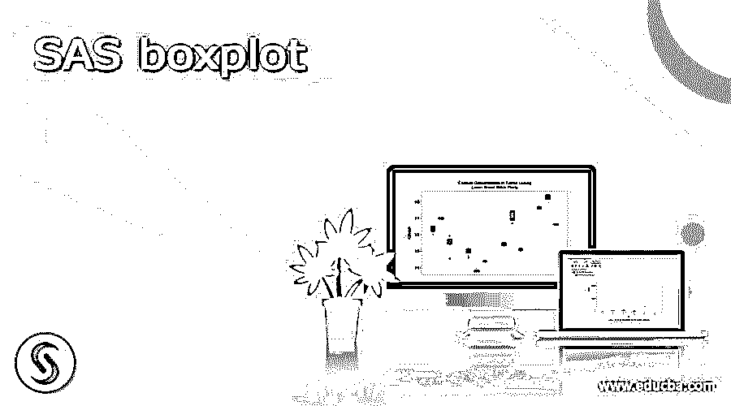
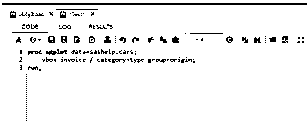
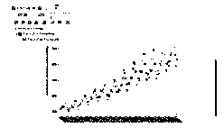
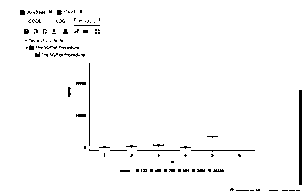
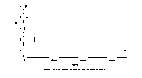

# SAS boxplot

> 原文：<https://www.educba.com/sas-boxplot/>

## SAS 箱线图介绍

SAS 箱线图是一个类似图形用户界面的图形用户表示，表示 SAS 数据数值集中的数据组，它计算平均值、四分位数、最小值和最大值数据观察值，以遵循类似十字并排框的程序。它需要胡须图的测量来控制样式盒图、轴值、标签和其他附加变量。

### 关键要点

需要记住的一些要点与箱线图有关，

<small>Hadoop、数据科学、统计学&其他</small>

*   盒子的顶部和底部通常是主要的，并且几乎被确定为第一和第三个四分位数。
*   SAS 简单方框图，始终创建过程 SGPANEL 和过程 SGPLOT
*   则盒须图被称为盒图。
*   最小值、第一个四分位数、中间值、第三个四分位数和最大值是 SAS 箱线图的五个不同总和和状态。
*   当我们创建盒状图的第一个和第三个四分位数时，垂直线将到达中间位置的盒子。

### 什么是 SAS 箱线图？

表示 GUI 的 SAS 的箱线图，它遵循一组数字数据的数据组，这些数据组从上下四分位数之外的须状框延伸垂直线。那么盒子的底部和顶部总是表示为盒子内部的第一个和第三个四分位数，这总是用于第二个四分位数的中间值。SAS 简单箱线图主要是使用数据集上名为 PROC SGPLOT 和 PROC SGPANEL 箱线图的过程创建的。我们为更多的后续实体创建了数据集，并在简单和垂直箱线图面板中创建了变量分类组。水平箱线图面板还计算了每个分隔线部分的行数和列数，以及完成的多组组面板的图形。

### 如何创建 SAS 箱线图？

这是显示变量数据分布的标准化方法，通常使用不同的统计数据，如最小值、第一个四分位数、中值、第三个四分位数和最大值。除了这些统计数据之外，箱线图还使用具有默认平均值、箱线图须和其他异常值的 SAS。在 SAS 中创建箱线图，遵循标准的 SGPLOT 过程，使用 DATA=-option 和 VBOX 语句等参数，使 SAS 的变量规范比存储过程有更多的选项。With CATEGORY=-option 指定不同类别的变量，并调用 VBOX 语句作为类别、组和标签。

### 创建 SAS 箱线图的步骤:

1.  登录后导航到以下 URL，
2.  [https://odmid-apse 1-2 . ODA . SAS . com/sasstudio/main？locale = en _ GB&zone = GMT % 252 b 05% 253 至 30 &票= ST-100523-qeschl 3 Yidu 06 spgrfa-cas](https://odamid-apse1-2.oda.sas.com/SASStudio/main?locale=en_GB&zone=GMT%252B05%253A30&ticket=ST-100523-qeSyCHl3YIDU06sPgrfa-cas)
3.  我创建了一些具有垂直盒状 vbox 格式的示例盒图代码，
4.  proc sgplot data = sash elp . cars；
5.  vbox 发票/类别=类型组=来源；
6.  跑步；

7.名为 proc sgplot 的过程是访问名为 sashelp.cars 的 SAS 数据集的默认存储过程。我们也可以使用其他数据集，如下所示:

8.proc sgplot data=sashelp.air：

9.vbox AIR/category = DATE group = AIR；

10.跑步；

11.我可以得到下面的图表作为输出结果，

12.这样，我们可以将 SAS 数据集与箱线图的不同区域一起用于下、上、下和上四分位数。

### SAS 箱线图多面板

SAS 箱线图将与多个箱线图的数据组一起使用，并跨越各种区域，如存储过程，如 SGPLOT 过程，以访问水平简单和垂直的 box 语句，这有助于表示 VBOX 语句以及使用正斜杠、CATEGORY =-选项和 GROUP =-选项的关键字，以创建每个组的箱线图。我们可以在 SAS 数据外观中为 X 轴、Y 轴和 LABEL=-option 引号定制箱线图。与许多箱线图一样，数据集可以访问出现在同一个图上的输入变量，尽管它们可以在不同的尺度上使用。它有不同的类型，如注释、数据、趣味、绘图，这些是程序语句的一些不同的主要语句。

我们还可以使用 do 和其他循环来创建和设置多个面板。

上面的屏幕截图显示了与自然概念相关的 SAS 嵌套循环的示例流程。像 x 轴像钙，y 轴是植物。

### 例子

数据第一；

输入 id $ name

数据线；

1 123

2 456

3 789

4 101

5 3456

6 34534

;

跑步；

proc sgplot data = work.first

vbox name/category = id group = name；

跑步；

**样本输出:**

**Hbox code:**

proc sgplot data = work.first

hbox name/category = id group = name；

跑步；

在上面的例子中，我们在不同的区域使用了 Hbox 和 Vbox 箱线图。

根据需要，它可以改变并调用用户端所需的输入，并产生相同的输出图形。

### 常见问题

它有一些常见问题解答，有助于理解包含复杂信息的 SAS 箱线图。

1.  有多少种 SAS 数据正在使用箱线图？

**答案:**

简单箱线图、水平箱线图、垂直箱线图、箱线图和须线图这些是箱线图 SAS 数据的一些类型。

2.  如何在 SAS 中运行箱线图？

**答案:**

它将使用 PROC SGPLOT 和 PROC SGPANEL boxplots 创建相同的数据集，然后使用后续数据集。

3.  SAS 盒图的五个不同部分是什么？

**答案:**

1.  最低限度，
2.  第一个四分位数，
3.  中位数，
4.  第三个四分位数，
5.  最高的
6.  举例说明 SAS 箱线图的类型。

**答案:**

**简单箱线图:**

从主要代表类别和其他变量的数据集中选择变量是一个箱线图。

**垂直面板:**

第三个变量有助于将图表分成多组面板。

**水平面板:**

它类似于垂直方框图，但它用于分成多组行。

5.  SAS 盒图中的范围或极限是什么？

**答案:**

SAS 盒图的极限是使用最大和最小数据集值计算的。

### 结论

SAS 箱线图是单组和多组数据观察的特征和最重要的特征。它具有一组程序和关键字，用于在带有表示组的数值数据集上启用带有多种默认和统计方法的样式框绘图。

### 推荐文章

这是 SAS 箱线图的指南。这里我们讨论定义，什么是 SAS 箱线图，如何创建 SAS 箱线图，创建 SAS 箱线图的步骤，关键要点。您也可以看看以下文章，了解更多信息–

1.  [SAS INTNX](https://www.educba.com/sas-intnx/)
2.  [SAS 同余](https://www.educba.com/sas-congruence/)
3.  [SAS 滞后功能](https://www.educba.com/sas-lag-function/)
4.  [SAS 长度](https://www.educba.com/sas-length/)

