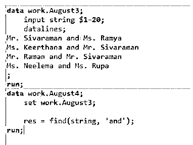

# SAS 查找

> 原文：<https://www.educba.com/sas-find/>


## SAS 查找简介

SAS Find 是在所需的用户输入上查找输入字符的功能。它将接受所有特殊字符，包括运算符和符号。此外，长度用于计算查找指定子字符串的匹配项的搜索中的总字符数，并返回字符串的相同位置。参数将是单变量字符和多字节字符，用于处理 SAS 中的数据。

SAS find 是一个函数，可用于搜索字符串字符，在指定的子字符串中查找数据出现的位置，返回字符串的字符位置，在第一次出现的字符串中未找到子字符串，并返回整数值为 0。可选参数用指定的修饰符修改到一个或多个数据集中的位置。

<small>Hadoop、数据科学、统计学&其他</small>

### 关键要点

*   这是设计的 SAS 数据的功能，并为 I18N 标准所接受。
*   计算第一次出现的字符串字符，并用多 varchar 字节指定。
*   以便处理多字节数据中的查找功能。
*   指定字符、变量、常数、表达式和其他关键字。
*   计算子串字符，并添加修饰符作为可选参数。

### 如何使用 SAS Find？

在 SAS 中，查找功能有助于查找输入字符串中指定子字符串的第一个位置和出现的位置。它将返回在字符串、子串、修饰符或字符串的起始位置上找不到的子串位置，在值的起始位置上有可选参数。它有助于开始每个字符的新搜索位置，并且同样将位于从右侧开始的每个方向。假设起始位置的字符串长度大于 find position 方法返回值为 0 中的整数。

但是字符串的较小位置将用于搜索字符串中的起始位置，并且类似于搜索字符串左侧的方向，并且它将与大于字符串长度的字符串的其它位置进行比较，并且开始字符串中尚未完成的字符串。它等于返回 0 作为整数格式，并比较 Find 函数在每个字符串上的每个搜索字符，而 FINDC 函数用于搜索每个字符串的单个字符。字符串的查找函数是在每个索引函数上计算的，用于搜索不使用修饰符或第一个字符串参数的字符串的子字符串。

### 创建服务协议查找的步骤

下面给出了创建服务协议查找的步骤:

1.导航到下面的链接。

2.[https://odmid-apse 1-2 . ODA . SAS . com/sasstudio/main？locale = en _ us&zone = GMT % 252 b 05% 253 至 30 &票= ST-112161-eyvjalkq 2j 1 ww 4 e 9q-cas](https://odamid-apse1-2.oda.sas.com/SASStudio/main?locale=en_US&zone=GMT%252B05%253A30&ticket=ST-112161-eYVJalOMlkQ2j1wW4e9q-cas)

3.将以下代码粘贴到创建数据集。

4.数据 8 月 1 日；

5.输入 1-20 美元；

6.数据线；

7.欢迎来到我的领域

8.过得愉快

9.你好你好吗

10.谢谢你的耐心

11\. ;

12.跑步；

13.proc 打印数据= 8 月 1 日；


14.然后我们可以使用 find()方法来搜索字符串的位置。

15.数据 8 月 2 日；

16.设定 8 月 1 日；

17.res = find(a，“如何”)；

18.跑步；


19.这里我们使用 find()方法来查找给定字符串的字符。

### SAS 查找功能

SAS Find 是在所需的用户输入上查找输入字符的功能。它将接受所有特殊字符，包括运算符和符号。此外，长度用于计算查找指定子字符串的匹配项的搜索中的总字符数，并返回字符串的确切位置。参数将是单变量字符和多字节字符，用于处理 SAS 中的数据。

SAS find 是一个函数，可用于搜索字符串字符，在指定的子字符串中查找数据出现的位置，返回字符串的字符位置，在第一次出现的字符串中未找到子字符串，并返回整数值为 0。可选参数用指定的修饰符修改到一个或多个数据集中的位置。

### 关键要点

*   这是设计的 SAS 数据的功能，并为 I18N 标准所接受。
*   计算第一次出现的字符串字符，并用多 varchar 字节指定。
*   以便处理多字节数据中的查找功能。
*   指定字符、变量、常数、表达式和其他关键字。
*   计算子串字符，并添加修饰符作为可选参数。

### 如何使用 SAS Find？

在 SAS 中，查找功能有助于查找输入字符串中指定子字符串的第一个位置和出现的位置。它将返回在字符串、子串、修饰符或字符串的起始位置上找不到的子串位置，在值的起始位置上有可选参数。它有助于开始每个字符的新搜索位置，并且同样将位于从右侧开始的每个方向。假设起始位置的字符串长度大于 find position 方法返回值为 0 中的整数。

但是字符串中较小的位置将用于开始搜索字符串中的位置，类似于搜索字符串左侧的方向，并且它将与字符串中大于字符串长度的其他位置进行比较，并开始字符串中尚未完成的字符串。它等于将 0 作为整数格式返回，并在每个字符串的每个搜索字符中比较 Find 函数，而 FINDC 函数用于搜索每个字符串的各个字符。对于不使用修饰符或第一个字符串参数的字符串子字符串，每个索引函数都会计算字符串的 find 函数。

**代码:**

```
find(variable,”string”,”i”)
```

**输出:**


上面用变量名、字符串和 I 编写了 find()方法的代码。这里，I 表示参数，它有助于告诉 SAS 忽略指定输入字符串的大小写，后面跟有参数“string”和 sunstring。指定字符串字符的索引打印在输出控制台上。

### 情景应用程序查找子串

我们知道 SAS find 有助于查找字符串的字符以及它们出现的位置，比如子字符串。find 函数还检查给定的输入字符串是包含指定的字符还是包含单个字符的输入字符组合。它将操作输入字符串的位置，并检查输入字符串是否为子字符串等条件。最后，它将以整数格式将 SAS 输入值作为 0 返回。




上面的截图有助于找到上述输入字符串的子字符串，这里我使用了“and”。

Word for 查找输入的位置，计算每个字符并显示变量中的值。


### SAS 查找示例

下面是提到的例子:

**代码:**

```
data August5;
  input inps $1-10;
  datalines;
August is the current month
September is the next month
July is the previous month
October is the next two month
November and December is the next third and fourth month
;
run;
proc print data=August5;
data August6;
  set August5;
  res1 = find(inps, "is","i");
run;
```

**输出:**


1.以上是计算和查找上述输入字符串的字符串出现的基本示例。

2.在这里，我们首先声明了第一个数据集。


3.然后，在创建数据集之后，我们需要找到输入字符串的字符串字符。


这里我们提到的字符“是”和“我”有助于忽略情况。

最后，我们得到如下输出结果:


对输入的每次出现进行计算，并将其打印在变量输出上。

### 常见问题

下面是提到的常见问题:

#### Q1。什么是 SAS find()？

**答案:**

SAS find()是函数，它有助于识别给定输入的字符串出现。

#### Q2。提及 SAS find()的语法。

**答案:**

```
Find(variable, “string”, optional arguments or modifiers)
```

这里使用可选参数或修饰语，如“I，t，…”。

#### Q3。在 find()中定义 SAS 子串。

**答案:**

子字符串类似于用字符串字符指定的字符常量、变量和表达式。

#### Q4。如何在 SAS 中找到具体的字符串？

**答案:**

使用 find()函数查找具有所需数据集和语法的字符串的位置。

#### Q5。如何找到 SAS 中的角色？

**答案:**

在索引函数的帮助下，识别字符串字符，包括特殊字符、字母、运算符等。

### 结论

SAS find()是 SAS 中预定义的函数之一，它有助于搜索字符串字符、字母等。为了以各种方式找到字符串在每次出现时的位置，还包括 index 函数来计算数据集中每个字符串的字符。

### 推荐文章

这是一个 SAS 查找指南。在这里，我们分别讨论创建 SAS find、example 和 FAQ 的简介、使用方法和步骤。您也可以看看以下文章，了解更多信息–

1.  [SAS 箱线图](https://www.educba.com/sas-boxplot/)
2.  [SAS INTNX](https://www.educba.com/sas-intnx/)
3.  [SAS 滞后功能](https://www.educba.com/sas-lag-function/)
4.  [SAS 同余](https://www.educba.com/sas-congruence/)


