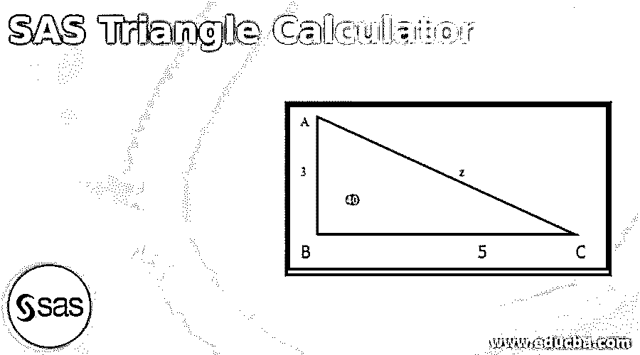
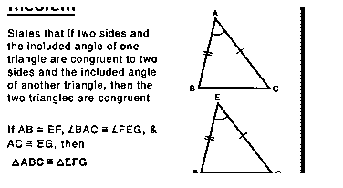
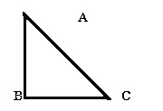
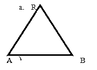
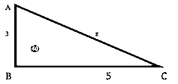

# SAS 三角形计算器

> 原文：<https://www.educba.com/sas-triangle-calculator/>

## SAS 三角形计算器简介

SAS 三角形计算器帮助执行指定角度的两边的数学运算。遵循余弦、正弦等定理来确定第三边，因此我们可以将 SAS 称为边-角-边三角形，以获得可能的组合。像 SSA 这样的三角形边，两边之间有一个夹角，在这种情况下会有多个解。

### 关键要点

*   如果两个三角形的形状和大小都相同，我们就说这两个三角形全等。
*   我们可以用运算符~和=来表示同余三角形。
*   那么这两条边和角应该是从三角形的一边形成的顶点，等于另外两条相应的边。
*   在另一个三角形的顶点边形成的角，形成 SAS 全等标准。
*   它可以遵循余弦定理和正弦定理。

### 什么是 SAS 三角形计算器？

三角形计算器是 SAS 的功能之一，最广泛使用的是通过两条边的长度和它们之间的角度来求解三角形。余弦的初等定律可以确定另一边，像第三边一样，用海伦公式等三角函数计算三角形面积，不同性质的边。SAS 是一个定理，它有助于找到与两条边最相关的三角形的面积，并且它对等边有效，两条边之间的角度更相等。

<small>Hadoop、数据科学、统计学&其他</small>

### SAS 三角怎么用？

SAS 三角形的面积在总空间的帮助下进行了计算，总空间将其包围在 2 维平面上，并且它回忆起 SAS 三角形及其两条边。只要包含第三条边，SAS 三角形区域之间的角度就会占据计算空间。此外，我们可以称三角形平面和面积的形状为正方形。

倾斜类型的三角形没有直角来测量与倾斜三角形相关的角边和其他区域部分。一般来说，两个角，两条腿，一边，一个角有很多不同的组合来解决斜三角形。SAS 三角形计算器帮助解决全等的 SAS 三角形的两个相邻的边和他们之间的角度的组合。所以，这两个相邻边的组合连同它们之间的夹角对于以形状和三角形尺度来定义同一时间来说。

要满足有两条边的 SAS 三角形条件，请将提供有两条边的线段和角的角括起来。我们还可以构建三角形，该三角形应使用角度方式和线段复制来构建。SAS 公式被调用并用作属性三角形以及两条边。SAS 公式根据所需的输入进行计算。使用余弦定律，像正弦定律一样计算缺失的三角形边，以对未知类型执行两个较小的角度。角和遵循三角形法则，找出两条边所对应的最后一个角，包括两条边之外全等的一个三角形。然后，它被称为具有相同大小和形状的全等，对应的边和角度在所有区域都应该相等。

我们可以创建一个有两条边的 SAS 三角形，包括全等边上提到的角。根据正弦和余弦定理，三角形的边应该是全等的。

### SAS 三角形计算器怎么解？

要解决 SAS 三角形，我们可以使用一些三角规则，通过不同的定理来实现，如正弦规则和余弦规则。

我们可以找到正弦和余弦的规则，它表明对应的边是相等的角，三角形公式将在数据迭代中定义和求解。

sin(α)a​=sin(β)b​=sin(γ)c​

上述公式是基本的三角形规则，可用于执行余弦规则，该规则规定三角形的三条边用于定义角的每一边。

a= c2+b2−2⋅c⋅b⋅cos(α)b=a2+c2−2⋅a⋅c⋅cos(β)c​=a2+b2−2⋅a⋅b⋅cos(γ)

在这里，我们可以执行 SAS 三角形操作，以假设 a、b 和 c 边。

我们用于执行公式的角度如下所示:

Area=ab sinC/2

三角形边的面积是用正弦函数计算的，而变量 a 和 b 是三角形两边的长度。c 是包含的角，倾向于已知边。

### 求解 SAS 三角形计算器的步骤

下面给出了求解 SAS 三角形计算器的步骤:

1.三角形对有相应的边是全等的。

2.甲、乙、丙

3.它应该包括像(a，c)这样的三角形的两边，其中 B 表示为< B，即)角 B。

4.我们可以使用如下公式:

5.b = a2+–

6.它可以用来计算边的面积和角度。

7.然后，我们可以使用下面的公式找出角度:

8.A= a

9.上面的公式有助于找出角度 A 的值。

10.这样我们就可以计算出角度 C=

Above triangle is the basic diagram to calculate angle of the sides.

我们可以计算周长 P= a + b + c，这是三角形的最终输出结果。

### SAS 三角形计算器规则

主要是我们可以计算出 SAS 三角形的两个边和 1 个角。

这里示例边 1=2 厘米，边 2= 3 厘米，角度=25 度。

1.首先我们需要计算三角形缺失的一边。

RES = sqrt(2 平方+3 平方–2 * 2 * 3 * cos(25 度))=1.10

2.求出边的面积后，我们可以用正弦定律等定理来求其他的边角。

= arcsin(sin(γ) × (b/res))

3.然后，我们可以执行最后一组被调用的过程，以完成表示角度最后一边的三角形计算。

α = 180° – ß – γ

这里，α、和 res 是用于执行 SAS 三角形计算的变量声明。

### SAS 三角形计算器示例

让我们以下面的例子来解决 SAS 三角形使用余弦定律。

Here AB=3, BC=5 and <ABC=40 degree

我们可以从 AC=？利用余弦定理定律。

**公式:**

b2 = a2 + c2 − 2ac cosB

= z2 =平方+3 平方-2*3*5 余弦 40 度
= 25+9-20.008
z =平方根(13.99)
z=3.74

现在我们可以应用正弦定理来计算角度 c。

Sin C/2 = sinb/z
= Sin 40/3.74
= 2 * 0.74/374
= 0.398
<C = Sin pow(-1)0.398 = 25.37 度

三角形是 180 度。

<A+40+25.37 = 180
<A = 180-65.37
A = 2

**输出:**

角度

上面的例子是用两个定律求三角形边的基本三角形。

### 常见问题解答

下面是提到的常见问题:

#### Q1。什么是 SAS 三角形计算器？

**答案:**

借助于正弦和余弦定理进行三角形边的运算是一种边角边。

#### Q2。什么是 SAS 三角形全等？

**答案:**

即使所有的边和边都相等，也要用同余图形来查询三角形的边。

#### Q3。提到 SAS 三角形的公式？

**答案:**

Area =:1/2×BC×sin(A)
Area =:1/2×AC×sin(B)
Area =:1/2×ab×sin(C)

### 结论

在 SAS 三角形中，两对应该是相等的，并且它是由全等的边(由边-角-边表示)构成的，然后所涉及的两个角边的对被表示为全等的。通过执行定理条件，三角形的对边是指角的一边。

### 推荐文章

这是一个 SAS 三角形计算器的指南。这里我们讨论一下入门，如何使用 SAS 三角形？求解 SAS 三角形计算器的步骤及实例。您也可以看看以下文章，了解更多信息–

1.  [SASS if() |示例](https://www.educba.com/sass-if/)
2.  [什么是 SAS 网格？](https://www.educba.com/sas-grid/)
3.  [创建 SAS 检查功能](https://www.educba.com/sas-intck/)
4.  [SAS 延迟功能指南](https://www.educba.com/sas-lag-function/)

