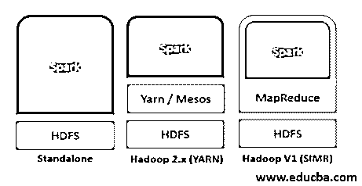
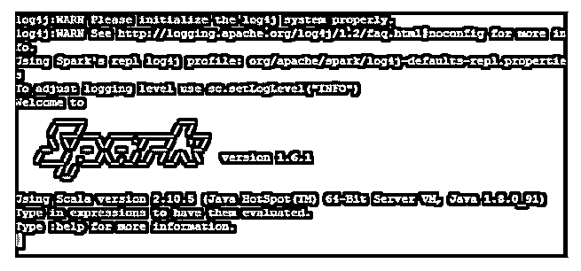
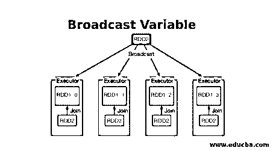

# 火花命令

> 原文：<https://www.educba.com/spark-commands/>

## Spark 命令简介

Apache Spark 是一个构建在 Hadoop 之上的框架，用于快速计算。它在基于集群的场景中扩展了 MapReduce 的概念，以高效地运行任务。Spark 命令是用 Scala 写的。

Spark 可以通过以下方式利用 Hadoop(见下文):

<small>Hadoop、数据科学、统计学&其他</small>

1.  **独立:** Spark 直接部署在 Hadoop 之上。Spark 作业在 Hadoop 和 Spark 上并行运行。
2.  **Hadoop YARN:** Spark 在 YARN 上运行，无需任何预装。
3.  **MapReduce 中的 Spark(SIMR):**MapReduce 中的 Spark 用于启动 Spark 作业，以及独立部署。有了 SIMR，用户可以启动 Spark 并使用其 shell，而无需任何管理权限。

### 火花的成分

Spark 由以下部分组成:

1.  阿帕奇火花核心
2.  Spark SQL
3.  [火花流](https://www.educba.com/spark-streaming/)
4.  MLib
5.  GraphX

[弹性分布式数据集(RDD)](https://www.educba.com/rdd-in-spark/) 被认为是 Spark 命令的基本数据结构。RDD 本质上是不可变的和只读的。spark 命令中的所有计算都是通过 RDD 的变换和动作来完成的。

[谷歌图片](https://www.google.co.in/search?rlz=1C1GCEU_enIN820IN820&biw=1280&bih=579&tbm=isch&sa=1&ei=nhoJXOTxCdKSa83jlrAM&q=data+to+RDD+in+spark&oq=data+to+RDD+in+spark&gs_l=img.3...26201.27161..27391...0.0..0.452.2192.4-5......1....1..gws-wiz-img.z8Z5nkHSj2E#imgrc=_mR8I3Yg3aYowM:)

Spark shell 为用户提供了与其功能交互的媒介。他们有许多不同的命令，可以用来处理交互式外壳上的数据。

### 基本火花命令

让我们看看下面给出的一些基本命令:

**1。启动火花外壳**

**2。从本地系统读取文件:**

这里“sc”是 spark 上下文。考虑到“data.txt”在主目录中，它是这样读的，否则需要指定完整的路径。

**3。通过并行化创建 RDD**

NewData 现在是 RDD。

**4。在 RDD 清点物品**

**5。收集**

这个函数返回所有 RDD 的内容给驱动程序。这有助于在编写程序的各个步骤中进行调试。

**6。阅读 RDD 的前 3 条**

7 .**。将输出/处理的数据保存到文本文件**

这里“输出”文件夹是当前路径。

### 中间火花命令

让我们看看下面给出的一些中间命令:

**1。RDD 上的过滤器**

让我们为包含“是”的项目创建新的 RDD。

需要在现有的 RDD 上调用转换过滤器来过滤单词“yes”，这将使用新的项目列表创建新的 RDD。

**2。连锁操作**

这里过滤变换和反作用一起起作用。这叫连锁经营。

**3。读 RDD 的第一条**

**4。计算 RDD 分区数**

众所周知，RDD 是由多个分区组成的，因此需要计算分区的数量。因为它有助于在使用 Spark 命令时进行调优和故障排除。

默认情况下，最小 pf 分区数是 2。

**5。加入**

该函数基于公共键连接两个表(table 元素是成对的)。在成对 RDD 中，第一个元素是键，第二个元素是值。

**6。缓存文件**

缓存是一种优化技术。缓存 RDD 意味着，RDD 将驻留在内存中，所有未来的计算都将在内存中的 RDD 上完成。它节省了磁盘读取时间，提高了性能。简而言之，它减少了访问数据的时间。

但是，如果运行上述函数，数据将不会被缓存。这可以通过访问网页来证明:

[http://localhost:4040/存储](http://localhost:4040/storage)

动作完成后，RDD 将被缓存。例如:

另一个类似于 cache()的函数是 persist()。Persist 让用户可以灵活地给出参数，这有助于将数据缓存在内存、磁盘或堆外内存中。不带任何参数的 Persist 与 cache()的作用相同。

### 高级火花命令

让我们看看下面给出的一些高级命令:

**1。广播变量**

Broadcast 变量帮助程序员读取集群中每台机器上缓存的唯一变量，而不是将该变量的副本与任务一起发送。这有助于降低通信成本。

简而言之，广播变量有三个主要特征:

1.  不变的
2.  适合内存
3.  分布在群集上

**2。累加器**

累加器是添加到相关操作中的变量。累加器有许多用途，如计数器、求和器等。

代码中累加器的名称也可以在 Spark UI 中看到。

**3。地图**

地图功能有助于迭代 RDD 的每一行。地图中使用的函数适用于 RDD 的每个元素。

例如，在 RDD {1，2，3，4，6}如果我们应用“rdd.map(x=>x+2)”我们将得到结果为(3，4，5，6，8)。

**4。平面图**

Flatmap 的工作方式类似于 map，但是 map 只返回一个元素，而 flatmap 可以返回元素列表。因此，将句子拆分成单词需要平面图。

**5。合并**

该功能有助于避免数据的混乱。这适用于现有的分区，因此较少的数据被打乱。这样，我们可以限制集群中节点的使用。

### 使用 Spark 命令的提示和技巧

以下是 Spark 命令的不同提示和技巧:

1.  Spark 初学者可以使用 Spark-shell。因为它们是基于 Scala 构建的，所以使用 scala spark shell 肯定很棒。然而，python spark shell 也是可用的，所以即使这样，精通 python 的人也可以使用它。
2.  Spark shell 有很多选项来管理集群的资源。下面的命令可以帮助你:

3.  在 Spark 中，处理长数据集是常见的事情。但是，当不良输入被采用时，事情就会出错。使用 Spark 的 filter [函数删除坏行总是一个好主意。好的输入集将是一个很好的开始。](https://www.educba.com/spark-functions/)
4.  Spark 为您的数据自行选择好的分区。但是在开始工作之前留意一下分区总是一个好习惯。尝试不同的分区将有助于您提高工作的并行性。

### 结论

Spark command 是一款革命性的多功能大数据引擎，可用于批处理、实时处理、缓存数据等。Spark 有一套丰富的[机器学习库](https://www.educba.com/machine-learning-libraries/)，可以让数据科学家和分析组织构建强大、交互式和快速的应用程序。

### 推荐文章

这是 Spark 命令的指南。这里我们讨论了概念、基本、中级和高级 Spark 命令以及有效使用的技巧和诀窍。您也可以阅读以下文章，了解更多信息——

1.  [Spark SQL 中的连接类型(示例)](https://www.educba.com/join-in-spark-sql/)
2.  [Spark 组件|概述和前 6 大组件](https://www.educba.com/spark-components/)
3.  [火花工具](https://www.educba.com/spark-tools/)
4.  [火花版本](https://www.educba.com/spark-versions/)

