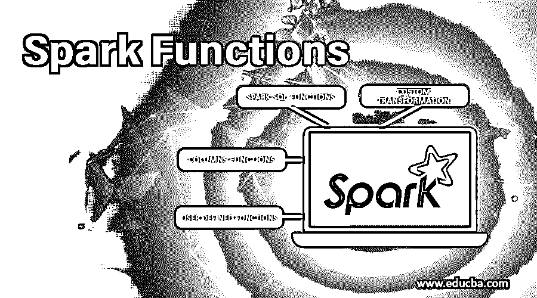
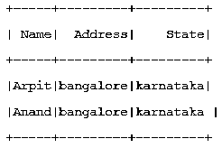
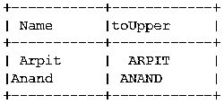

# 火花函数

> 原文：<https://www.educba.com/spark-functions/>

## 火花功能介绍

Spark 函数是对数据集的操作，主要与分析计算相关。Spark framework 因其内存处理能力而以用更少的时间处理巨大的数据集而闻名。有几个函数与 Spark 相关联，用于数据处理，如自定义转换、spark SQL 函数、列函数、用户定义函数(称为 UDF)。Spark 将数据集定义为数据帧。它有助于添加、写入、修改和删除数据帧的列。它通过多种语言(如 R、Python、Java 和 Scala)支持内置语法。Spark 函数正在发展新的功能。

### 火花功能列表

现在让我们看看 spark 中使用的一些 Spark 函数。

<small>Hadoop、数据科学、统计学&其他</small>

#### 1.自定义转换

每当我们添加列、删除列、添加行或从数据框中删除时，我们都可以使用 Spark 的这个自定义转换功能。

这种方法的一般方法签名是:-

`def customTransformName(arg1: String)(df: DataFrame): DataFrame = {
// code that returns a DataFrame
}`

假设我们正在处理一个数据框，并使用 with column 函数向其中添加一列。

借助 spark 中的自定义转换，同样的事情也可以实现。我们可以重构代码，消除另一个使代码结构良好的因变量。

让我们看一个定制转换的例子

假设我们有一个数据框架:-

`Val df = List((“Arpit”),(“Anand”)).toDF(“Name”)`

现在我们想在 DF 上添加两列，分别是地址和状态:-

`Val df2 = df.withcolumn(“Address”,lit(“Bangalore”))
Val df3 = df2.withcolumn(“State”,lit(“karnataka”))
Df3.show()`

这将显示添加了地址和状态新列的数据帧。

使用自定义转换也可以达到同样的效果，因为我们可以对数据帧使用转换方法来相应地转换数据帧。

让我们看看它是如何工作的

`def Address()(df: DataFrame): DataFrame = {
df.withColumn(
"Address",
*lit*("Bangalore")
)
}`

`def State()(df: DataFrame): DataFrame = {
df.withColumn(
"State",
*lit*("karnataka")
)
}`

使用上面使用的数据帧和使用。转换函数将是这样的:-

`transform(Address())
.tansform(State()).show()`

它将具有与上面相同的数据框结果，因此在这里我们可以看到如何使用变换方法。

#### 2.SPARK SQL 函数

Spark 具有 Spark SQL 的属性，它有许多内置的函数来帮助 SQL 操作。

一些 Spark SQL 函数是:-

Count，avg，collect_list，first，mean，max，方差，sum。

假设我们想计算 DF 中元素的数量。

一个简单的。count()函数将计算数据帧中的行数。

df3.count()

2 //它将输出为 2，计算数据帧中的行数。

只有这样，我们才能在整个代码中使用大量的 SQL 函数。

这些函数用于数据框的列，产生为设计的结果类型。

#### 3.列函数

它返回列对象。它可以用作 spark SQL 函数，包含需要实现的列。

这里，我们将一个列值作为输入参数传递，对该函数执行一组操作，并将结果返回到数据帧中。

#### 4.用户定义的函数

spark 中还使用了几个用户定义的函数，用户可以创建自己的函数集，并在需要时在代码中使用它。

它们类似于列函数，但是它们[在 Spark API 上使用 Scala](https://www.educba.com/what-is-scala/) 。

现在让我们创建一个 UDF，看看它如何帮助 spark 应用程序:-

`def toUpperFunction(str: String): Option[String] = {
val s = Option(str).getOrElse(return None)
Some(s.toUpperCase())
}
val toUpper = udf[Option[String], String](toUpperFunction)`

这里我们做了一个 UDF，它将单词转换成大写字母，所以无论我们传递什么列值，它都会将其转换成大写字母。

因此，这是一个我们在自己定义的函数，并在 spark 应用程序的数据帧中使用它。

所以我们之前的数据框架

`Val df = List((“Arpit”),(“Anand”)).toDF(“Name”)`

当将我们的函数传递给列名时，我们将得到一个新的数据框作为更改后的数据框。

`df.withcolumn(“toUpper”,toUpper(col(“Name”))).show()`

因此，在这里我们可以看到，这些功能集可以由用户明确定义，并可以传递所需的结果。

### 结论

因此，通过上面这篇文章，我们可以看到，我们有大量的 spark 函数可以在 spark 应用程序中反复使用。

### 推荐文章

这是一个火花函数的指南。这里我们讨论 spark 中使用的一些 Spark 函数，以及例子和工作方式。您也可以看看以下文章，了解更多信息–

1.  [火花数据集](https://www.educba.com/spark-dataset/)
2.  [加入 Spark SQL](https://www.educba.com/join-in-spark-sql/)
3.  [火花阶段](https://www.educba.com/spark-stages/)
4.  [Spark 的 5 大工具及其解释](https://www.educba.com/spark-tools/)
5.  [星火广播|如何工作？](https://www.educba.com/spark-broadcast/)

