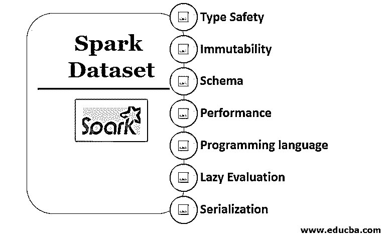
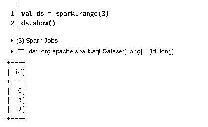
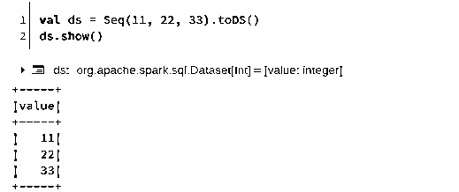
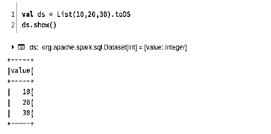
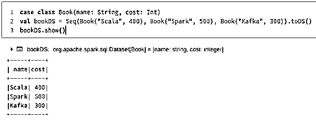
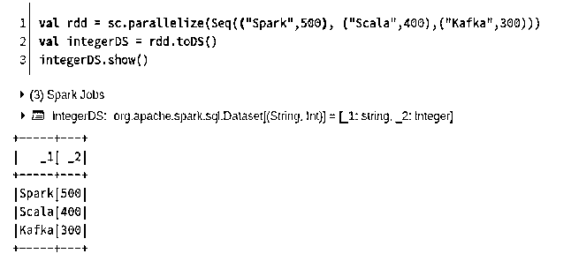
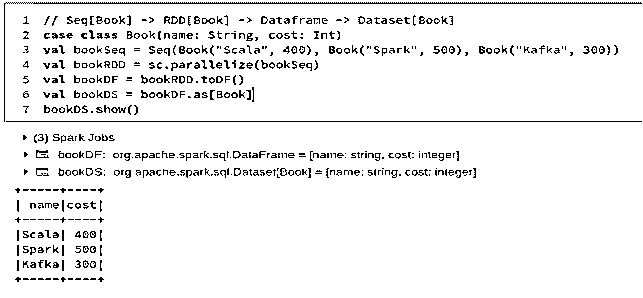
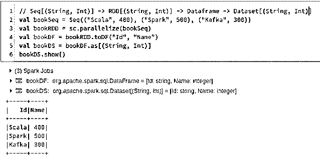
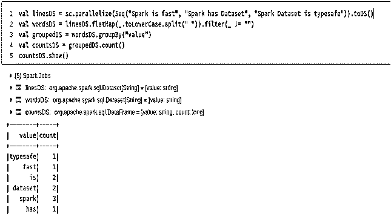
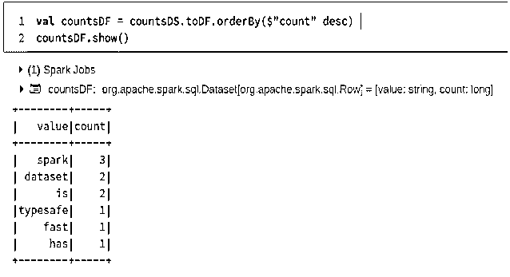

# 火花数据集

> 原文：<https://www.educba.com/spark-dataset/>

## Spark 数据集简介

Spark 数据集是 SparkSQL 的基本数据结构之一。它有助于存储火花数据处理的中间数据。具有行类型的 Spark 数据集非常类似于在弹性分布式数据集(RDD)上以表格形式工作的数据框。Spark 中的数据集以其特定的特性而闻名，如类型安全、不变性、模式、性能优化、惰性评估、序列化和垃圾收集。数据集通过 Scala 和 Java 编程 API 得到支持。Spark 的数据集支持编译时安全和优化，这使它成为在 spark 框架中实现的首选。

### 为什么我们需要 Spark 数据集？

为了清楚地理解数据集，我们必须从火花和进化的历史开始。

<small>Hadoop、数据科学、统计学&其他</small>

RDD 是星火的核心。受 SQL 的启发，为了让事情变得更简单，Dataframe 是在 RDD 之上[创建的。Dataframe 相当于关系数据库中的表或 Python 中的 DataFrame。](https://www.educba.com/what-is-rdd/)

RDD 提供编译时类型安全，但是在 RDD 中没有自动优化。

Dataframe 提供了自动优化，但它缺乏编译时类型安全性。

数据集作为数据帧的扩展添加。数据集结合了 RDD 特性(即编译时类型安全)和数据框架(即 Spark SQL 自动优化)。

**【RDD(火花 1.0)】->【数据帧(火花 1.3)】->【数据集(火花 1.6)】**

因为数据集具有编译时安全性，所以它只在编译语言(Java & Scala)中受支持，而在解释语言(R & Python)中不受支持。[但是 Spark Dataframe](https://www.educba.com/spark-dataframe/) API 在 Spark 支持的所有四种语言(Java、Scala、Python & R)中都有。

| Spark 支持的语言。 | 数据帧 API | 数据集 API |
| 编译语言(Java 和 Scala) | 是 | 是 |
| 解释语言(R & Python) | 是 | 不 |

### 如何创建 Spark 数据集？

基于用例创建数据集有多种方式。

#### 1.首先创建 SparkSession

sparkSession 是 Spark 应用程序的单一入口点，它允许与底层 Spark 功能进行交互，并使用数据帧和数据集 API 对 Spark 进行编程。

`val spark = SparkSession
.builder()
.appName("SparkDatasetExample")
.enableHiveSupport()
.getOrCreate()`

*   使用范围、顺序、列表等基本数据结构创建数据集。:

**使用范围**

**使用顺序**

**使用列表**

*   方法，使用事例类序列创建数据集。toDS()方法:

*   使用从 RDD 创建数据集。托德():

*   要使用 Case 类从 Dataframe 创建数据集:

*   要使用元组从数据帧创建数据集:

#### 2.Spark 数据集上的操作

**1。字数示例**

**2。将火花数据集转换为数据帧**

我们还可以将 Spark 数据集转换为 Dataframe，并利用 Dataframe APIs，如下所示:

### Spark 数据集的特征

下面是提到的不同特性:

**1。类型安全:** Dataset 提供编译时类型安全。这意味着应用程序的语法和分析错误将在运行前的编译时被检查。

**2。不变性:**数据集也像 RDD 和 Dataframe 一样是不可变的。这意味着我们不能改变创建的数据集。每次创建新数据集时，如果对数据集应用了任何转换。

**3。Schema:** Dataset 是一个内存中的表格结构，包含行和命名列。

**4。性能和优化:**与 Dataframe 一样，数据集也使用 Catalyst 优化来生成优化的逻辑和物理查询计划。**T3】**

**5。编程语言:**dataset API 只存在于 Java 和 Scala 这两种编译语言中，而不存在于 Python 这种解释型语言中。

**6。惰性求值:**像 RDD 和 Dataframe 一样，数据集也执行惰性求值。这意味着只有当动作被执行时，计算才会发生。Spark 只在转型阶段制定计划。

**7。序列化和垃圾收集:spark** 数据集不使用标准序列化器(Kryo 或 Java 序列化)。相反，它使用钨的快速内存编码器，了解数据的内部结构，可以有效地将对象转换为内部二进制存储。它使用钨编码器进行堆外数据序列化，因此不需要垃圾收集。

### 结论

数据集是 RDD 和数据框架的最佳选择。RDD 提供了编译时类型安全，但是没有自动优化。Dataframe 提供了自动优化，但它缺乏编译时类型安全性。数据集提供编译时类型安全和自动优化。因此，数据集是使用 Java 或 Scala 的 Spark 开发人员的最佳选择。

### 推荐文章

这是 Spark 数据集的指南。在这里，我们将讨论如何以多种方式通过示例和功能创建 Spark 数据集。您也可以看看以下文章，了解更多信息–

1.  [火花外壳命令](https://www.educba.com/spark-shell-commands/)
2.  [星火生涯](https://www.educba.com/career-in-spark/)
3.  [火花流](https://www.educba.com/spark-streaming/)
4.  [Spark SQL 数据帧](https://www.educba.com/spark-sql-dataframe/)

