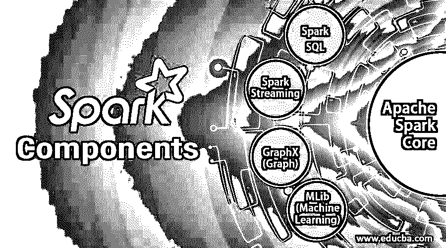

# 火花部件

> 原文：<https://www.educba.com/spark-components/>

## 火花部件概述

Spark 组件是 spark framework 以更快的方式为大数据处理提供的功能。Spark 以处理分析解决方案的大量数据而闻名。基本上有 6 个组件与 Spark 生态系统相关联，如 Spark Core、Spark SQL、Spark Streaming、Spark MLlib、Spark GraphX 和 SparkR。Spark 是大数据处理行业广泛使用的技术。就性能而言，这是一项可靠而高效的技术。Spark 组件与磁盘或集群级存储功能一起进行内存计算，帮助 sparks 优化数据处理。

### Spark 的顶级组件

目前，我们在 Spark 生态系统中有 6 个组件，分别是 Spark Core、Spark SQL、Spark Streaming、Spark MLlib、Spark GraphX 和 SparkR。让我们看看这些组件的作用。

<small>Hadoop、数据科学、统计学&其他</small>

#### 1.火花核心

火花核心，顾名思义，就是火花过程的核心单元。它负责任务调度、故障恢复、内存管理和输入输出操作等。可以把它想象成计算机的 CPU。它支持 Java、Scala、Python 和 R 等编程语言，并为相应的语言提供了 API，使用这些 API 可以构建 ETL 作业或进行分析。Spark 的所有其他组件都有自己的 API，构建在 Spark Core 之上。由于其并行处理能力和内存计算，Spark 可以处理任何类型的工作负载。

Spark Core 带有一种特殊的数据结构，称为 RDD ( [弹性分布式数据集](https://www.educba.com/what-is-rdd/))，它将数据分布在集群中的所有节点上。rdd 工作在一个懒惰的评估范例中，计算被记忆，只有在必要的时候才被执行。这有助于通过只计算必要的对象来优化过程。

#### 2.Spark SQL

如果您使用过数据库，您就会理解 SQL 的重要性。如果同样的 SQL 代码即使在更大的数据集上也能运行 N 倍的速度，那岂不是非常令人难以置信？Spark SQL 帮助您使用 SQL 操作 Spark 上的数据。它支持 [JDBC 和 ODBC](https://www.educba.com/jdbc-vs-odbc/) 连接，在 Java 对象和现有数据库、数据仓库和商业智能工具之间建立联系。Spark 包含了一种叫做 Dataframes 的东西，它是以行和列的形式收集的结构化数据。

Spark 允许您使用 SQL 处理这些数据。数据帧相当于关系表，它们可以从任何外部数据库、结构化文件或现有的 rdd 中构建。数据帧具有 RDD 的所有特征，例如不可变、弹性、内存中，但具有结构化和易于使用的额外特征。Dataframe API 也可以在 Scala、Python、R 和 Java 中使用。

#### 3.火花流

数据流是一种处理连续实时数据流的技术。它需要一个为分析提供低延迟的框架。Spark Streaming 提供了这一点，并且还提供了一个用于实时处理数据的高吞吐量、容错和可伸缩的 API。它是在离散化流(d Stream)上抽象的，离散化流表示被分成小批的数据流。DStream 基于 RDD 构建，因此使[Spark stream](https://www.educba.com/spark-streaming/)与其他 Spark 组件无缝协作。一些最著名的 [Spark](https://www.educba.com/spark-functions/) 用户。

流媒体是网飞、Pinterest 和优步。Spark Streaming 可以与 Apache Kafka 集成，后者是输入流的解耦和缓冲平台。Kafka 是使用 Spark Streaming 中的算法处理的实时流的中心枢纽。

#### 4.火花 MLLib

Spark 的主要吸引力在于大规模扩展计算，这一特性是任何机器学习项目最重要的要求。Spark MLLib 是 Spark 的机器学习组件，包含[机器学习算法](https://www.educba.com/machine-learning-algorithms/)，如分类、回归、聚类和协同过滤。它还为特征提取、维数减少、变换等提供了场所。

您还可以保存您的模型，并在更大的数据集上运行它们，而不必担心规模问题。它还包含线性代数、统计和数据处理的实用程序。由于 Spark 的内存处理、容错、可伸缩性和编程的简易性，在这个库的帮助下，您可以轻松地运行迭代 ML 算法。

#### 5.GraphX

图形分析基本上是确定图形中对象之间的关系，例如两点之间的最短距离。这有助于路线优化。Spark GraphX API 有助于图形和图形并行计算。它简化了图形分析，使其更快、更可靠。图形分析的一个主要和众所周知的应用是谷歌地图。

它找出两个位置之间的距离，并给出最佳路线建议。另一个例子可以是脸书朋友的建议。GraphX 可以处理图形和计算。Spark 提供了一系列图形算法，如页面排名、连通分量、标签传播、SVD++、强连通分量和三角形计数。

#### 6.火花

r 是使用最广泛的统计语言，包括 10，000 多个用于不同目的的软件包。它使用了数据框架 API，这使得使用起来很方便，也为数据科学家彻底分析他们的数据提供了强大的可视化功能。但是，R 不支持并行处理，并且受限于单台机器中可用的内存量。这就是斯帕克的用武之地。

Spark 开发了一个名为 SparkR 的包，它解决了 R 的可扩展性问题。它基于分布式数据框架，并提供了与 R 相同的语法。Spark 的分布式处理引擎和 R 无与伦比的交互性、包、可视化结合在一起，为数据科学家提供了他们所需的分析。

### 结论

因为 Spark 是一个通用框架，所以它有着广泛的应用。Spark 因其性能和可靠性而被广泛用于大多数大数据应用中。Spark 的所有这些组件都随着其每个新版本中的新功能而更新，并使我们的生活更加轻松。

### 推荐文章

这是一份关于 Spark 组件的指南。在这里，我们讨论了 spark 的基本概念和前 6 个组件，并给出了详细的解释。您也可以阅读以下文章，了解更多信息——

1.  [五大重要蜂箱替代品](https://www.educba.com/hive-alternatives/)
2.  [快速浏览 17 款不同的 Spark 版本](https://www.educba.com/spark-versions/)
3.  [Spark 工具完整指南](https://www.educba.com/spark-tools/)
4.  [Apache Spark 架构](https://www.educba.com/apache-spark-architecture/)
5.  [火花数据帧](https://www.educba.com/spark-dataframe/)

