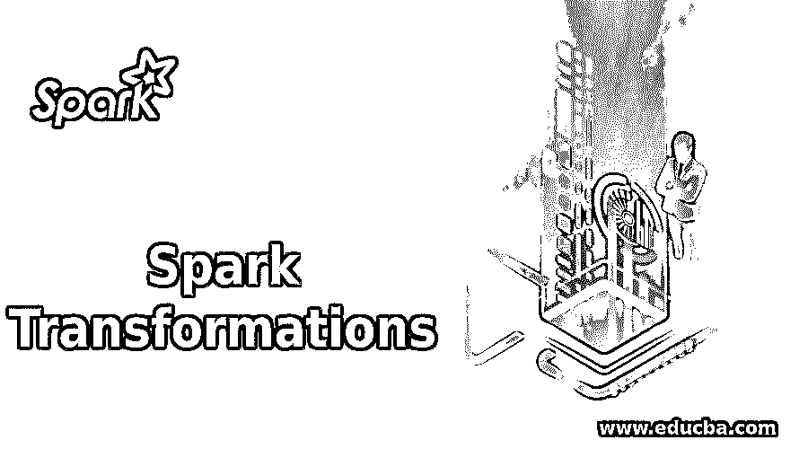

# 火花变换

> 原文：<https://www.educba.com/spark-transformations/>

## 火花变换简介

变换是通过修改现有 RDD 返回新 RDD 的函数。输入 RDD 不被修改，因为 rdd 是不可变的。Spark 以一种懒惰的方式执行所有的转换——结果不会马上计算出来。只有在 RDD 上执行某个操作时，才会进行变换计算。

### Spark 中的转换类型

它们大致分为两种类型:

<small>Hadoop、数据科学、统计学&其他</small>

*   **窄转换**:计算一个分区中的记录所需的所有数据都驻留在父 RDD 的一个分区中。在以下方法中会出现这种情况:

map()、flatMap()、filter()、sample()、union()等。

*   **宽转换**:计算一个分区中的记录所需的所有数据都驻留在父 rdd 的多个分区中。在以下方法中会出现这种情况:

distinct()、groupByKey()、reduceByKey()、join()、repartition()等。

### 火花变换的例子

这里我们讨论下面提到的例子。

#### 1.狭义变换

*   map():该函数将一个函数作为参数，并将该函数应用于 RDD 的每个元素。

**代码:**

`val conf = new SparkConf().setMaster("local").setAppName("testApp")
val sc= SparkContext.getOrCreate(conf)
sc.setLogLevel("ERROR")
val rdd = sc.parallelize(Array(10,15,50,100))
println("Base RDD is:")
rdd.foreach(x =>print(x+" "))
println()
val rddNew = rdd.map(x => x+10)
println("RDD after applying MAP method:")
rddNew.foreach(x =>print(x+" "))`

**输出:**

**

** 

在上面的映射方法中，我们将每个元素加 10，这反映在输出中。

*   FlatMap():它类似于 Map，但是它可以生成对应于一个输入项的多个输出项。因此，该函数必须返回一个序列，而不是单个项目。

**代码:**

`val conf= new SparkConf().setAppName("test").setMaster("local")
val sc = new SparkContext(conf)
sc.setLogLevel("WARN")
val rdd= sc.parallelize(Array("1:2:3","4:5:6"))
val rddNew = rdd.flatMap(x =>x.split(":"))
rddNew.foreach(x =>print(x+" "))`

**输出:**

作为参数传递的这个函数用“:”分割每个输入，并返回一个数组，FlatMap 方法展平该数组。

*   **filter():** 它将一个函数作为参数，并返回该函数返回 true 的 RDD 的所有元素。

**代码:**

`val conf = new SparkConf().setMaster("local").setAppName("testApp")
val sc= SparkContext.getOrCreate(conf)
sc.setLogLevel("ERROR")
val rdd = sc.parallelize(Array("com.whatsapp.prod","com.facebook.prod","com.instagram.prod","com.whatsapp.test"))
println("Base RDD is:")
rdd.foreach(x =>print(x+" "))
println()
val rddNew = rdd.filter (x => !x.contains("test"))
println("RDD after applying MAP method:")
rddNew.foreach(x =>print(x+" "))`

**输出:**

在上面的代码中，我们采用了没有单词“test”的字符串。

*   **sample():** 它使用一个给定的随机数生成器种子(这是可选的)返回数据的一部分，有或没有替换。

**代码:**

`val conf = new SparkConf().setAppName("test").setMaster("local")
val sc = new SparkContext(conf)
sc.setLogLevel("WARN")
val rdd = sc.parallelize(Array(1,2,3,4,5,6,7,10,11,12,15,20,50))
val rddNew = rdd.sample(false,.5)
rddNew.foreach(x =>print(x+" "))`

**输出:**

在上面的代码中，我们得到的是没有替换的随机样本。

*   **union():** 它返回作为参数传递的源 RDD 和 RDD 的并集。

**代码:**

`val conf= new SparkConf().setAppName("test").setMaster("local")
val sc = new SparkContext(conf)
sc.setLogLevel("WARN")
val rdd= sc.parallelize(Array(1,2,3,4,5))
val rdd2 = sc.parallelize(Array(-1,-2,-3,-4,-5))
val rddUnion = rdd.union(rdd2)
rddUnion.foreach(x=>print(x+" "))`

**输出:**

合成的 RDD and 阴离子包含 rdd 和 rdd2 的所有元素。

#### 2.广泛的变革

*   **distinct():** 这个方法返回 RDD 的不同元素。

**代码:**

`val conf = new SparkConf().setMaster("local").setAppName("testApp")
val sc= SparkContext.getOrCreate(conf)
sc.setLogLevel("ERROR")
val rdd = sc.parallelize(Array(1,1,3,4,5,5,5))
println("Base RDD is:")
rdd.foreach(x =>print(x+" "))
println()
val rddNew = rdd.distinct()
println("RDD after applying MAP method:")
rddNew.foreach(x =>print(x+" "))`

**输出:**

我们在输出中得到不同的元素 4，1，3，5。

*   **groupByKey():** 该函数适用于成对 rdd。成对 RDD 的每个元素都是一个元组，其中第一个元素是键，第二个元素是值。这个函数将对应于一个键的所有值组合在一起。

**代码:**

`val conf= new SparkConf().setAppName("test").setMaster("local")
val sc = new SparkContext(conf)
sc.setLogLevel("WARN")
val rdd= sc.parallelize(Array(("a",1),("b",2),("a",3),("b",10),("a",100)))
val rddNew = rdd.groupByKey()
rddNew.foreach(x =>print(x+" "))`

**输出:**

正如所料，键“a”和“b”的所有值都被分组在一起。

*   **reduceByKey():** 这个操作也适用于成对 rdd。它根据提供的 reduce 方法聚合每个键的值，reduce 方法的类型必须是(v，v) = > v

**代码:**

`val conf= new SparkConf().setAppName("test").setMaster("local")
val sc = new SparkContext(conf)
sc.setLogLevel("WARN")
val rdd= sc.parallelize(Array(("a",1),("b",2),("a",3),("b",10),("a",100),("c",50)))
val rddNew = rdd.reduceByKey((x,y)=>x+y )
rddNew.foreach(x =>print(x+" "))`

**输出:**

在上面的例子中，我们对一个键的所有值求和。

*   **join():**join 操作适用于成对 rdd。join 方法根据键组合两个数据集。

**代码:**

`val conf = new SparkConf().setMaster("local").setAppName("testApp")
val sc= SparkContext.getOrCreate(conf)
sc.setLogLevel("ERROR")
val rdd1 = sc.parallelize(Array(("key1",10),("key2",15),("key3",100)))
val rdd2 = sc.parallelize(Array(("key2",11),("key2",20),("key1",75)))
val rddJoined = rdd1.join(rdd2)
println("RDD after join:")
rddJoined.foreach(x =>print(x+" "))`

**输出:**

*   **repartition():** 它将 RDD 中的数据随机地重新排列成按参数传递的多个分区。它可以增加和减少分区。

**代码:**

`val conf= new SparkConf().setAppName("test").setMaster("local")
val sc = new SparkContext(conf)
sc.setLogLevel("WARN")
val rdd= sc.parallelize(Array(1,2,3,4,5,10,15,18,243,50),10)
println("Partitions before: "+rdd.getNumPartitions)
val rddNew= rdd.repartition(15)
println("Partitions after: "+rddNew.getNumPartitions)`

**输出:**

在上面的例子中，我们将分区从 10 个增加到 15 个。

### 推荐文章

这是一个引导火花转换的指南。这里我们讨论火花转换的例子以及两种类型。您也可以看看以下文章，了解更多信息–

1.  [火花版本](https://www.educba.com/spark-versions/)
2.  [火花功能](https://www.educba.com/spark-functions/)
3.  [Apache Spark 架构](https://www.educba.com/apache-spark-architecture/)
4.  [阿帕奇水槽](https://www.educba.com/apache-flume/)

